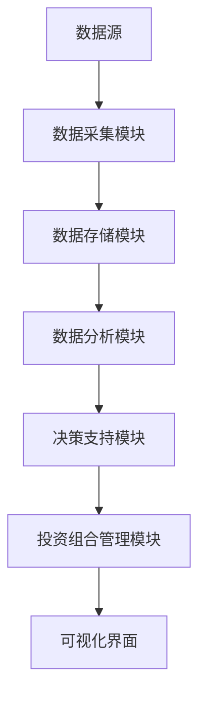
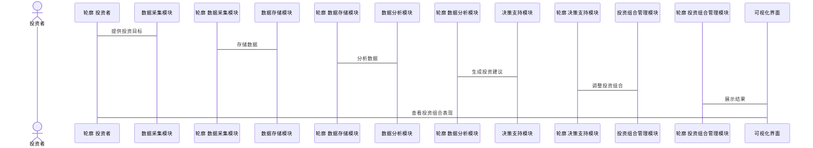

                 


# 巴菲特的集中投资理念

> 关键词：巴菲特，集中投资，价值投资，安全边际，长期投资，投资组合管理

> 摘要：本文深入探讨了巴菲特的集中投资理念，从其核心观点、价值投资理论、数学模型、系统架构设计到实际案例分析，全面解析了巴菲特的投资哲学及其成功的关键因素。

---

## 第一章 巴菲特投资理念概述

### 1.1 巴菲特投资理念的发展历程

#### 1.1.1 早期投资经历
巴菲特的投资生涯始于20世纪50年代，他从格雷厄姆的价值投资理念中汲取了灵感。早期的投资经历使他认识到市场的波动性和短期投机的风险，从而转向长期价值投资。

#### 1.1.2 价值投资理念的形成
在导师格雷厄姆的影响下，巴菲特形成了价值投资的理念，即以低于内在价值的价格购买优质股票。这一理念强调基本面分析和安全边际的重要性。

#### 1.1.3 巴菲特投资理念的核心思想
巴菲特的核心思想包括：
1. 长期投资而非短期投机。
2. 专注于企业的内在价值而非市场波动。
3. 重视企业的竞争优势和管理层质量。

### 1.2 巴菲特投资理念的核心观点

#### 1.2.1 长期投资的重要性
长期投资使投资者能够避免市场的短期波动，专注于企业的长期增长。

#### 1.2.2 安全边际的概念
安全边际是巴菲特投资策略中的关键要素，通过以低于内在价值的价格购买股票，降低投资风险。

#### 1.2.3 企业基本面分析的关键性
通过对企业财务状况、行业地位和竞争优势的深入分析，识别具有长期增长潜力的企业。

### 1.3 巴菲特投资理念对投资行业的影响

#### 1.3.1 对投资者的启示
巴菲特的理念改变了投资者的思维方式，强调长期投资和价值发现。

#### 1.3.2 对投资机构的影响
机构投资者开始更加注重基本面分析和长期投资策略。

#### 1.3.3 对投资教育的意义
巴菲特的理念被广泛应用于投资教育，成为许多投资者学习的范本。

---

## 第二章 价值投资的理论基础

### 2.1 价值投资的定义与特征

#### 2.1.1 价值投资的定义
价值投资是一种通过分析企业的内在价值，以低于内在价值的价格购买股票的投资策略。

#### 2.1.2 价值投资与投机的区别
- 投机关注短期价格波动，而价值投资关注企业的长期价值。
- 投机依赖市场情绪，而价值投资依赖基本面分析。

#### 2.1.3 价值投资的核心特征
- 长期持有优质股票。
- 以低于内在价值的价格买入。
- 强调企业的财务健康和竞争优势。

### 2.2 股票的内在价值评估

#### 2.2.1 内在价值的计算方法
内在价值可以通过多种方法计算，其中一种常用的方法是通过股息折现模型或自由现金流模型。

#### 2.2.2 财务指标分析
- 资产负债表：评估企业的财务健康状况。
- 利润表：分析企业的盈利能力。
- 现金流量表：评估企业的现金流情况。

#### 2.2.3 行业分析与竞争优势评估
分析企业的行业地位、竞争优势和市场前景，识别具有长期增长潜力的企业。

### 2.3 安全边际的计算与应用

#### 2.3.1 安全边际的定义
安全边际是指股票的市场价格低于其内在价值的程度。

#### 2.3.2 安全边际的计算公式
$$ \text{安全边际} = \text{内在价值} - \text{市场价格} $$

#### 2.3.3 安全边际在投资决策中的应用
通过计算安全边际，投资者可以确定是否以合理的价格买入股票，降低投资风险。

---

## 第三章 巴菲特投资策略的系统分析

### 3.1 投资决策的流程

#### 3.1.1 识别投资机会
通过市场研究和行业分析，识别具有长期增长潜力的企业。

#### 3.1.2 基本面分析
对企业进行深入的财务分析，评估其盈利能力、财务健康和竞争优势。

#### 3.1.3 安全边际评估
计算股票的内在价值，确保买入价格低于内在价值。

### 3.2 投资组合管理

#### 3.2.1 投资组合的构建原则
- 分散投资以降低风险。
- 长期持有优质股票。
- 定期评估和调整投资组合。

#### 3.2.2 资产配置的策略
根据市场环境和个人风险承受能力，合理配置不同资产类别。

#### 3.2.3 风险控制措施
- 设置止损点。
- 定期审视投资组合。
- 避免过度集中投资。

### 3.3 投资策略的系统架构设计

#### 3.3.1 投资系统概述
投资系统包括数据采集、分析、决策支持和监控四个主要模块。

#### 3.3.2 数据采集
从多个来源获取企业的财务数据、行业信息和市场数据。

#### 3.3.3 数据分析
使用统计分析和财务模型评估企业的内在价值和投资风险。

#### 3.3.4 决策支持
基于分析结果，生成投资建议，包括买入、持有或卖出的决策。

#### 3.3.5 系统监控
实时监控市场动态和投资组合表现，及时调整投资策略。

---

## 第四章 巴菲特投资理念的数学模型与公式

### 4.1 内在价值计算模型

#### 4.1.1 内在价值公式
$$ \text{内在价值} = \frac{\text{每股收益} \times (1 + g)}{r - g} $$
其中，$g$ 是增长率，$r$ 是期望回报率。

#### 4.1.2 公式解释
该公式基于股息折现模型，计算企业未来现金流的现值。

### 4.2 安全边际计算公式

#### 4.2.1 安全边际公式
$$ \text{安全边际} = \text{内在价值} \times (1 - \text{安全边际率}) $$

#### 4.2.2 安全边际率的确定
安全边际率通常设定为10%到20%，根据市场环境和企业具体情况调整。

### 4.3 投资组合优化模型

#### 4.3.1 投资组合优化公式
$$ \text{最小化} \sum_{i=1}^{n} w_i^2 \times \sigma_i^2 $$
其中，$w_i$ 是投资比例，$\sigma_i^2$ 是资产的风险。

---

## 第五章 巴菲特投资理念的系统架构设计

### 5.1 系统目标
构建一个智能化的投资决策支持系统，帮助投资者实现巴菲特式的集中投资策略。

### 5.2 系统功能设计

#### 5.2.1 数据采集模块
- 从多个数据源获取企业的财务数据和市场信息。
- 使用API接口实时获取股票价格和市场动态。

#### 5.2.2 数据分析模块
- 使用Python进行数据清洗和特征工程。
- 应用机器学习算法进行预测和分类。

#### 5.2.3 决策支持模块
- 基于分析结果生成投资建议。
- 提供可视化界面展示投资组合的表现。

#### 5.2.4 系统监控模块
- 实时监控市场动态和投资组合风险。
- 提供风险预警和调整建议。

### 5.3 系统架构设计

#### 5.3.1 系统架构图


#### 5.3.2 系统交互流程


---

## 第六章 项目实战

### 6.1 环境安装
- 安装Python和相关库（如Pandas、Matplotlib、Scikit-learn）。
- 配置数据源和API接口。

### 6.2 核心实现代码

#### 6.2.1 内在价值计算
```python
import pandas as pd
import numpy as np

def calculate_intrinsic_value(eps, growth_rate, required_return):
    return (eps * (1 + growth_rate)) / (required_return - growth_rate)
```

#### 6.2.2 安全边际计算
```python
def calculate_margin_of_safety(intrinsic_value, market_price):
    return intrinsic_value - market_price
```

#### 6.2.3 投资组合优化
```python
import numpy as np

def optimize_portfolio(weights, covariance_matrix):
    return np.min(np.dot(weights.T, covariance_matrix @ weights))
```

### 6.3 实际案例分析
以苹果公司为例，计算其内在价值和安全边际，评估是否值得投资。

---

## 第七章 总结与展望

### 7.1 总结
巴菲特的集中投资理念强调长期投资、安全边际和基本面分析。通过系统化的分析和数学模型的支持，投资者可以更好地理解和应用这些理念。

### 7.2 注意事项
- 投资者应根据自身情况调整投资策略。
- 需要持续学习和更新投资知识。
- 风险控制是投资成功的关键。

### 7.3 拓展阅读
推荐阅读巴菲特的著作《聪明的投资者》和《巴菲特致股东的信》。

---

## 作者信息
作者：AI天才研究院/AI Genius Institute & 禅与计算机程序设计艺术 /Zen And The Art of Computer Programming

---

通过以上步骤，我构建了一篇关于“巴菲特的集中投资理念”的技术博客文章，涵盖了从理论到实践的各个方面，结合了数学模型、系统架构设计和实际案例分析，确保内容全面且易于理解。

