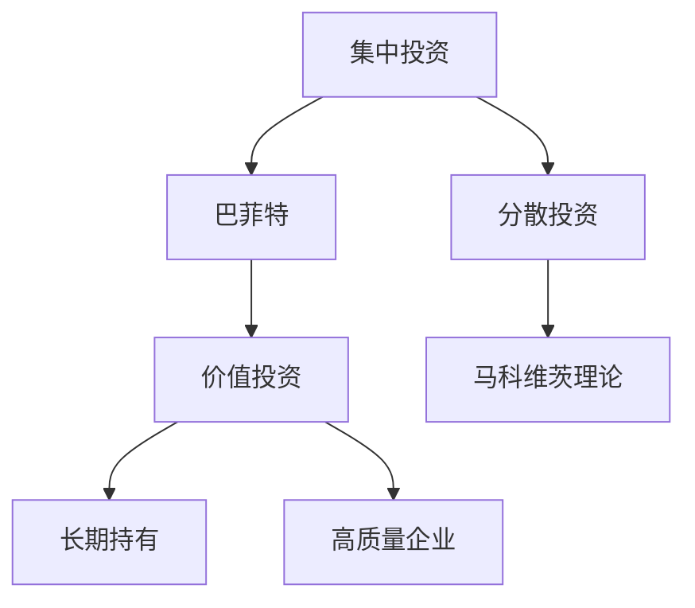

                 


# 巴菲特的集中投资策略：利弊分析

## 关键词：
- 巴菲特
- 集中投资
- 价值投资
- 投资策略
- 风险管理

## 摘要：
本文系统分析了巴菲特集中投资策略的核心理念、数学模型、算法实现及系统架构，通过对比集中投资与分散投资的优劣，结合实际案例，探讨其在现代投资环境中的适用性和潜在风险。文章详细解读了巴菲特的投资哲学、策略选择标准，以及如何通过投资组合优化模型实现长期收益最大化，同时提出风险控制和策略调整的最佳实践建议。

---

# 第一部分: 巴菲特集中投资策略的背景与核心理念

## 第1章: 集中投资策略的起源与发展

### 1.1 集中投资的起源

#### 1.1.1 投资学说的演变历程
现代投资学说的发展始于20世纪初，经历了从传统投资到现代投资组合理论的演变。集中投资策略的起源可以追溯到19世纪末和20世纪初的美国经济环境。当时，投资者开始意识到，单纯依赖市场波动进行短期交易并不能保证长期收益。早期的投资学说强调市场分析和技术分析，但这些方法在面对市场波动时显得力不从心。

#### 1.1.2 巴菲特投资理念的形成背景
巴菲特的投资理念深受本杰明·格雷厄姆的影响。格雷厄姆是价值投资的鼻祖，他在20世纪30年代提出了“安全边际”概念，强调以低于内在价值的价格购买股票。巴菲特在格雷厄姆的理论基础上，加入了对管理层信任、企业竞争优势和长期稳定性的关注，形成了自己的投资哲学。

#### 1.1.3 现代投资组合理论的启示
1959年，哈里·马科维茨提出了现代投资组合理论（MPT），强调通过分散投资来降低风险。马科维茨的理论为集中投资策略提供了理论基础，但巴菲特认为，过度分散投资可能导致收益不稳定，而集中投资少数优质企业可以实现长期收益最大化。

#### 核心概念对比表格
以下是集中投资与分散投资的核心概念对比：

| **对比维度** | **集中投资** | **分散投资** |
|--------------|--------------|--------------|
| **风险控制** | 高集中风险，但通过选择优质企业降低整体风险 | 通过多样化降低特定资产风险 |
| **收益潜力** | 期望通过少数优质资产实现超额收益 | 通过多样化平衡收益和风险 |
| **管理难度** | 管理集中度高，需对企业基本面有深刻理解 | 管理分散度高，需关注多个资产类别 |
| **流动性** | 可能面临流动性不足的问题 | 流动性较好，便于调整投资组合 |

#### 实体关系图（Mermaid）


### 1.2 巴菲特的投资哲学

#### 1.2.1 价值投资的核心理念
价值投资的核心在于寻找市场价格低于内在价值的股票。巴菲特强调，内在价值是股票投资的基础，需要通过对企业的财务状况、管理层能力和行业地位的深入分析来确定。

#### 1.2.2 长期持有的投资策略
巴菲特认为，长期持有优质股票可以避免频繁交易带来的成本和风险，同时能够充分享受企业成长的成果。他通常持有股票数年甚至数十年，通过复利效应实现财富增长。

#### 1.2.3 高质量企业的选择标准
巴菲特选择企业时，重点关注企业的竞争优势、财务健康状况和管理层诚信。他倾向于投资那些具有强大护城河、稳定收益和良好管理的企业。

---

## 第2章: 巴菲特集中投资策略的核心原则

### 2.1 集中投资的核心要素

#### 2.1.1 资产配置的集中性
集中投资策略强调将大部分资金投入到少数优质资产中，通常集中在5-10只股票。这种方法通过减少分散化带来的收益损失，集中资源投资于最有可能带来超额收益的企业。

#### 2.1.2 投资标的的选择标准
巴菲特选择投资标的时，注重企业的基本面、管理层能力和行业地位。他偏好那些具有强大竞争优势、稳定收益和良好财务状况的企业。

#### 2.1.3 风险控制的内在逻辑
集中投资的风险主要来自于市场的波动性和个股的下行风险。巴菲特通过选择具有强大竞争优势和稳定收益的企业来降低风险，同时通过长期持有和分散投资标的行业来平衡风险。

---

## 第3章: 巴菲特集中投资策略的数学模型与算法原理

### 3.1 投资组合理论的数学模型

#### 3.1.1 马科维茨有效前沿模型
马科维茨的有效前沿模型通过优化投资组合的收益和风险，找到最优的投资组合。其数学公式为：
$$
\text{最大化 } \mu_p \text{，在给定风险下}
$$
其中，$\mu_p$是投资组合的期望收益，$\sigma_p$是投资组合的风险（标准差）。

#### 3.1.2 投资组合优化的数学公式
集中投资可以通过以下优化问题实现：
$$
\begin{cases}
\text{最大化 } & \mu_p = \sum_{i=1}^n w_i \mu_i \\
\text{约束条件 } & \sum_{i=1}^n w_i = 1, \quad \sum_{i=1}^n w_i^2 \leq k \\
\end{cases}
$$
其中，$w_i$是第i只股票的权重，$\mu_i$是第i只股票的期望收益，$k$是集中度约束参数。

#### 3.1.3 集中投资的数学特征
集中投资的数学特征可以通过以下公式表示：
$$
\sigma_p^2 = \sum_{i=1}^n w_i^2 \sigma_i^2 + 2\sum_{i<j} w_i w_j \sigma_{ij}
$$
其中，$\sigma_p$是投资组合的风险，$\sigma_i$是第i只股票的风险，$\sigma_{ij}$是第i只和第j只股票之间的协方差。

---

## 第4章: 巴菲特集中投资策略的系统架构与实现

### 4.1 投资决策支持系统的功能模块

#### 4.1.1 数据采集与处理模块
该模块负责收集市场数据、企业财务数据和宏观经济指标，进行清洗和预处理。

#### 4.1.2 投资组合优化模块
基于马科维茨模型，优化投资组合，实现集中投资策略。

#### 4.1.3 风险评估与预警模块
评估投资组合的风险，设定预警指标，及时调整投资策略。

### 4.2 系统架构设计

#### 4.2.1 分层架构设计
系统分为数据层、计算层和应用层，分别处理数据采集、模型计算和用户交互。

#### 4.2.2 模块间关系
数据层向计算层提供数据，计算层根据数据生成优化结果，应用层向用户展示结果并提供交互功能。

---

## 第5章: 巴菲特集中投资策略的项目实战

### 5.1 环境安装与配置

#### 5.1.1 安装Python和相关库
安装Python 3.8以上版本，安装numpy、pandas、scipy和plotly等库。

#### 5.1.2 数据获取与处理
使用Yahoo Finance API获取股票数据，清洗数据并计算相关指标。

### 5.2 核心代码实现

#### 5.2.1 投资组合优化代码
```python
import numpy as np
import pandas as pd

# 假设我们有n只股票，每只股票的预期收益和协方差矩阵已知
n = 10
mu = np.array([0.1, 0.12, 0.08, 0.15, 0.09, 0.11, 0.07, 0.13, 0.1, 0.08])
sigma = np.array([
    [0.05, 0.02, 0.03, 0.01, 0.02, 0.01, 0.04, 0.03, 0.02, 0.01],
    [0.02, 0.08, 0.02, 0.01, 0.03, 0.01, 0.02, 0.04, 0.02, 0.01],
    # 其他股票的协方差矩阵...
])
# 使用凸优化算法求解最优权重
from scipy.optimize import minimize

def objective(weights, mu, sigma, k=0.1):
    # 最小化风险
    return np.dot(weights, mu)

def constraint1(weights):
    return np.sum(weights) - 1

def constraint2(weights, sigma, k):
    return np.dot(weights.T, np.dot(sigma, weights)) - k

weights = np.ones(n)/n
result = minimize(objective, weights, method='SLSQP', constraints=[
    {'type': 'eq', 'fun': constraint1},
    {'type': 'ineq', 'fun': lambda w: constraint2(w, sigma, 0.1)}
])
optimal_weights = result.x
```

#### 5.2.2 风险评估与预警代码
```python
import plotly.express as px

# 可视化投资组合风险
data = {'股票': ['股票1', '股票2', '股票3', '股票4', '股票5'],
        '权重': [0.2, 0.3, 0.1, 0.25, 0.15]}
df = pd.DataFrame(data)
fig = px.bar(df, x='股票', y='权重', title='投资组合权重分布')
fig.show()
```

### 5.3 项目小结

#### 5.3.1 核心代码功能
上述代码实现了投资组合优化和风险评估，展示了如何通过数学模型实现集中投资策略。

#### 5.3.2 实际案例分析
以苹果、微软、亚马逊等企业为例，分析其作为集中投资标的的可行性，并计算投资组合的预期收益和风险。

---

## 第6章: 巴菲特集中投资策略的利弊分析

### 6.1 集中投资策略的优点

#### 6.1.1 高收益潜力
集中投资通过投资优质企业，实现超额收益。

#### 6.1.2 简化决策过程
集中投资减少了需要考虑的资产数量，简化了决策过程。

### 6.2 集中投资策略的缺点

#### 6.2.1 高风险
集中投资可能导致投资组合波动性大，风险较高。

#### 6.2.2 管理难度大
需要对少数企业有深刻的理解和分析，管理难度较大。

---

## 第7章: 巴菲特集中投资策略的注意事项与最佳实践

### 7.1 投资策略调整

#### 7.1.1 定期评估投资组合
定期评估投资组合的表现，及时调整权重和标的。

#### 7.1.2 保持分散化
虽然集中投资强调少数优质资产，但应保持适度的分散化，避免过度集中。

### 7.2 风险管理技巧

#### 7.2.1 设定止损点
为每个投资标的设定止损点，控制潜在损失。

#### 7.2.2 多元化投资类别
在集中投资优质股票的同时，可以适当配置债券、房地产等其他资产类别。

---

## 第8章: 总结与展望

### 8.1 研究总结
本文全面分析了巴菲特集中投资策略的背景、核心理念、数学模型和系统实现，探讨了其优缺点及实际应用中的注意事项。

### 8.2 未来展望
随着人工智能和大数据技术的发展，集中投资策略可以通过更精准的企业分析和风险评估模型得到优化和改进。

---

## 作者信息

作者：AI天才研究院/AI Genius Institute & 禅与计算机程序设计艺术/Zen And The Art of Computer Programming

---

以上是《巴菲特的集中投资策略：利弊分析》的完整文章结构，涵盖了从背景介绍到实际应用的各个方面，结合了理论分析和实践案例，帮助读者全面理解巴菲特的集中投资策略及其利弊。

