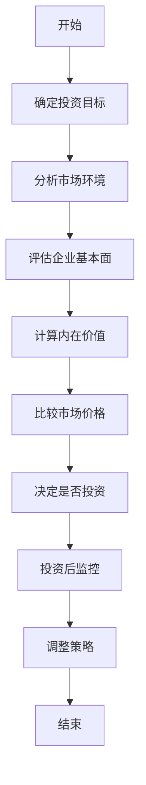

                 

# 巴菲特的风险定义：永久性资本损失的避免

## 关键词：巴菲特，投资风险，永久性资本损失，价值投资，风险管理，安全边际

## 摘要：  
巴菲特将“避免永久性资本损失”视为投资的核心原则之一。本文深入分析了巴菲特的风险定义，探讨了如何通过价值投资、安全边际等策略来识别和避免永久性资本损失。文章结合技术语言和实际案例，系统性地阐述了巴菲特的投资理念、数学模型以及风险管理系统，为投资者提供了深刻的理论支持和实践指导。

---

## 第一部分：巴菲特的风险定义基础

### 第1章：永久性资本损失的背景介绍

#### 1.1 投资风险的核心概念

##### 1.1.1 什么是永久性资本损失  
永久性资本损失是指投资者在投资过程中，由于企业基本面恶化、行业周期性变化或宏观经济冲击等原因，导致投资本金无法收回或无法实现预期收益的情况。与暂时性损失不同，永久性损失意味着投资价值的永久性下降，无法通过时间的推移恢复。

##### 1.1.2 投资风险的分类与特征  
投资风险可以分为以下几类：  
- **市场风险**：由于市场波动导致的资产价格下跌。  
- **流动性风险**：资产难以快速变现的风险。  
- **信用风险**：债券或贷款等信用工具的违约风险。  
- **操作风险**：投资决策中的失误或管理不当带来的风险。  

永久性资本损失通常与市场风险和信用风险密切相关，尤其是在经济衰退或行业衰退时更容易发生。

##### 1.1.3 永久性资本损失的定义与外延  
永久性资本损失的外延包括以下几点：  
1. 投资标的内在价值显著下降。  
2. 市场价格持续低于内在价值，且无明显回升趋势。  
3. 企业或行业出现结构性问题，导致长期盈利能力下降。  

---

#### 1.2 投资风险的背景与问题描述

##### 1.2.1 投资市场的基本风险  
投资市场的波动性和不确定性是永久性资本损失的主要来源。例如，2008年金融危机期间，许多投资者因未能识别系统性风险而遭受重大损失。

##### 1.2.2 永久性资本损失的形成机制  
永久性资本损失通常由以下因素引发：  
- 企业基本面恶化（如盈利能力下降、债务过高）。  
- 行业周期性下行（如能源行业的周期性波动）。  
- 宏观经济冲击（如经济衰退或政策变化）。  

##### 1.2.3 投资者如何避免永久性损失  
避免永久性资本损失的关键在于：  
1. 选择具有强大竞争优势的企业。  
2. 留意企业的财务健康状况。  
3. 保持长期投资视角，避免短期波动的干扰。  

---

### 第2章：巴菲特的风险定义与投资原则

#### 2.1 巴菲特投资体系的核心要素

##### 2.1.1 价值投资的哲学基础  
价值投资的核心在于寻找市场估值低于内在价值的企业。巴菲特强调，投资的本质是寻找具有持续竞争优势的企业，并以合理的价格买入。

##### 2.1.2 投资的三大核心原则  
1. **安全边际**：买入价格低于内在价值，以确保安全空间。  
2. **长期视角**：关注企业的长期盈利能力，而非短期市场波动。  
3. **竞争优势**：投资具有护城河的企业，以抵御行业竞争。  

##### 2.1.3 避免永久性损失的策略框架  
巴菲特的策略框架包括以下步骤：  
1. 确定企业的内在价值。  
2. 评估企业的财务健康状况。  
3. 确保买入价格低于内在价值。  
4. 长期持有优质资产。  

---

#### 2.2 巴菲特的风险管理方法

##### 2.2.1 风险的三重维度  
巴菲特认为，投资风险包括以下三个维度：  
1. **市场风险**：资产价格波动带来的风险。  
2. **企业风险**：企业基本面恶化带来的风险。  
3. **流动性风险**：资产难以变现带来的风险。  

##### 2.2.2 安全边际的概念与应用  
安全边际是指买入价格与内在价值之间的差距。巴菲特强调，安全边际能够为投资者提供“缓冲区”，以应对市场的不确定性和企业的潜在风险。

##### 2.2.3 长期投资视角下的风险控制  
长期视角有助于投资者忽略短期市场波动，专注于企业的长期盈利能力。例如，巴菲特在2008年金融危机期间增持了可口可乐和苹果股票，因为他认为这些企业的内在价值在长期会得到体现。

---

### 第3章：永久性资本损失的识别与防范

#### 3.1 永久性损失的识别标准

##### 3.1.1 企业基本面分析  
- 评估企业的盈利能力、资产负债表和现金流情况。  
- 关注企业的竞争优势和市场地位。  

##### 3.1.2 行业周期性的影响  
- 识别行业周期的上行和下行阶段。  
- 选择处于周期性行业上升阶段的企业。  

##### 3.1.3 宏观经济环境的评估  
- 关注宏观经济政策（如利率、税收政策）对企业的影响。  
- 评估全球经济环境对企业盈利能力的潜在影响。  

---

#### 3.2 风险防范的系统性方法

##### 3.2.1 投资组合的分散化策略  
分散化投资可以降低单一投资的风险。例如，通过投资多个行业和企业来分散投资风险。

##### 3.2.2 个股筛选的指标体系  
- 选择具有高ROE（净资产收益率）的企业。  
- 关注企业的毛利率和净利率。  

##### 3.2.3 定期复盘与调整机制  
定期复盘投资组合的表现，评估企业的基本面变化，并根据市场环境进行调整。

---

## 第二部分：巴菲特投资理念的数学模型与系统分析

### 第4章：巴菲特投资模型的数学解析

#### 4.1 价值投资的数学模型

##### 4.1.1 内在价值的计算公式  
$$ \text{内在价值} = \frac{\text{现金流}}{\text{折现率}} $$  
例如，假设某企业的未来现金流为1000万元，折现率为10%，则其内在价值为1000万元 / 0.10 = 10000万元。

##### 4.1.2 安全边际的数学表达  
$$ \text{安全边际} = \text{市场价格} \times (1 - \text{内在价值}) $$  
例如，某企业内在价值为10元，市场价格为8元，则安全边际为8元 × (1 - 10元) = 8元 × (-9元) = -72元（负数表示市场价格低于内在价值，具有安全边际）。

---

#### 4.2 投资组合的风险评估

##### 4.2.1 马科维茨有效投资组合理论  
马科维茨的有效投资组合理论认为，最优投资组合是使得风险最小化的同时实现收益最大化。夏普比率（Sharpe Ratio）是衡量投资组合风险调整后收益的重要指标：  
$$ \text{夏普比率} = \frac{\text{超额收益}}{\text{收益标准差}} $$  

---

### 第5章：投资决策的系统架构

#### 5.1 投资决策的流程图  

---

## 第三部分：巴菲特投资策略的实战应用

### 第6章：巴菲特投资策略的系统性实践

#### 6.1 投资策略的核心实现

##### 6.1.1 选择具有护城河的企业  
护城河是企业竞争优势的体现，例如可口可乐的品牌影响力和全球分销网络。  

##### 6.1.2 评估企业的财务健康状况  
关注企业的盈利能力、资产负债表和现金流情况。例如，苹果公司的高毛利率和强大的现金流能力是其吸引投资者的重要原因。  

##### 6.1.3 长期持有优质资产  
巴菲特倾向于长期持有优质资产，例如他对可口可乐和苹果的投资长达数十年，期间不断增持。  

---

## 第四部分：系统总结与投资展望

### 第7章：巴菲特投资理念的系统总结

#### 7.1 投资理念的核心总结  
巴菲特的成功在于他始终坚持价值投资原则，注重企业的内在价值和长期盈利能力。他通过安全边际和分散化投资来降低风险，避免永久性资本损失。

#### 7.2 未来的投资展望  
未来的投资环境将更加复杂，投资者需要更加注重企业的基本面和长期竞争优势。巴菲特的投资理念仍然具有重要的指导意义。

---

## 作者：AI天才研究院/AI Genius Institute & 禅与计算机程序设计艺术 /Zen And The Art of Computer Programming

---

**摘要**：  
本文系统性地分析了巴菲特的“永久性资本损失”风险定义，从背景介绍、核心概念、数学模型到系统架构，全面阐述了如何通过价值投资和风险管理来避免永久性资本损失。文章结合技术语言和实际案例，为投资者提供了深刻的理论支持和实践指导。

