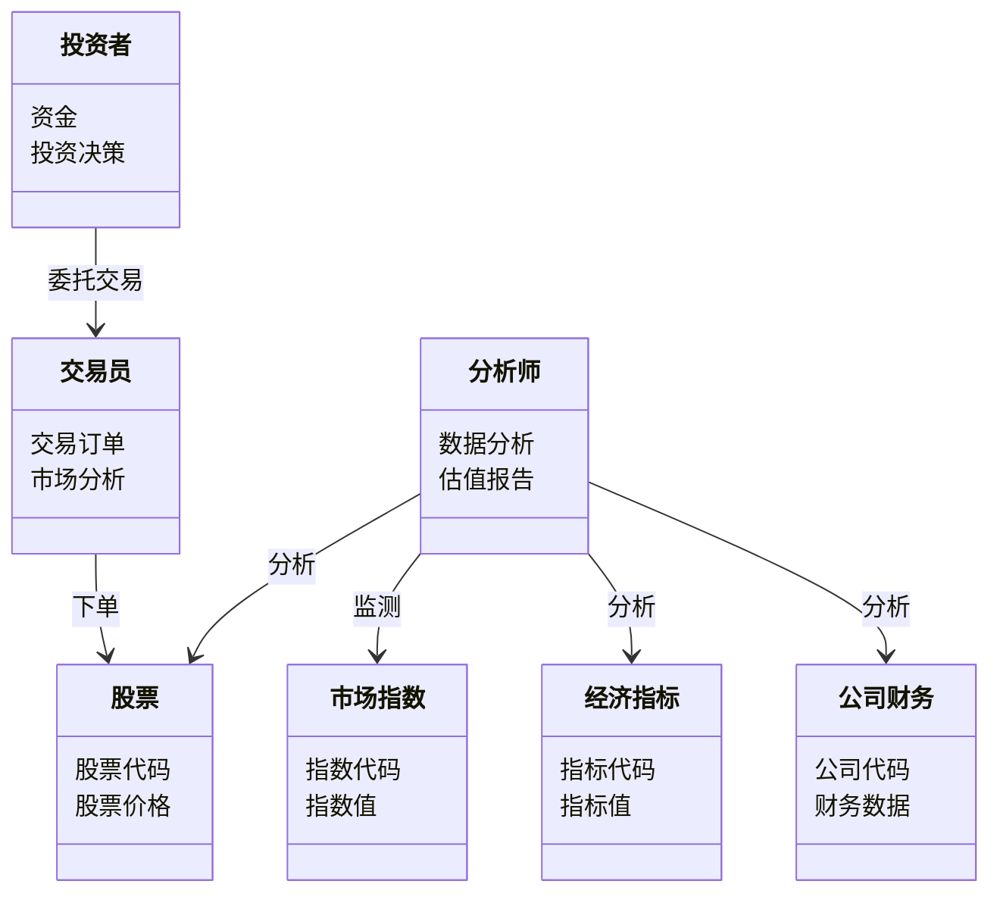

                 


# 巴西股市估值:拉美最大经济体的投资前景

> 关键词：巴西股市、股市估值、投资前景、经济分析、金融策略

> 摘要：本文深入分析了巴西股市的估值方法和投资前景，探讨了巴西作为拉美最大经济体的独特优势和挑战。通过系统的理论分析和实战案例，结合技术与经济的多维度视角，为投资者提供科学的投资策略和风险控制建议。

---

# 第一部分: 巴西股市估值的背景与基础

## 第1章: 巴西经济与股市概述

### 1.1 巴西经济的基本情况

#### 1.1.1 巴西的经济结构与主要产业
巴西是拉丁美洲最大的经济体，经济结构多元化，涵盖农业、工业和服务业。其GDP在全球排名前15位，农业方面以大豆、咖啡和蔗糖为主导，工业方面以汽车制造、石油和天然气为支柱，服务业则占据了经济的大部分。

#### 1.1.2 巴西在拉美及全球的经济地位
作为金砖国家之一，巴西在全球贸易中扮演重要角色，尤其在大宗商品出口方面。然而，近年来巴西经济面临增速放缓、通胀上升等问题，这对其股市估值产生了显著影响。

#### 1.1.3 巴西股市的发展历史与现状
巴西股市起源于19世纪末，现由巴西证券交易所（B3）管理。主要指数为IBOVESPA，涵盖巴西最大的上市公司。近年来，巴西股市波动较大，受到全球经济波动、政治因素和货币贬值的多重影响。

---

### 1.2 巴西股市的基本特点

#### 1.2.1 巴西股市的主要指数（如IBOVESPA）
IBOVESPA是巴西最重要的股票指数，成分股涵盖巴西最大的上市公司。该指数反映了巴西经济的多样性，但也因行业集中（如石油、银行）而面临结构性风险。

#### 1.2.2 巴西股市的主要行业分布
巴西股市中，金融、能源和工业板块占据主导地位。这些行业受宏观经济波动影响较大，尤其是能源行业因油价波动而波动剧烈。

#### 1.2.3 巴西股市的投资者结构
巴西股市的投资者以机构投资者为主，包括 Pension funds、保险公司和外国投资者。近年来，外国投资者比例上升，但对汇率波动的敏感性较高。

---

## 第2章: 巴西股市的主要影响因素

### 2.1 宏观经济因素

#### 2.1.1 利率与货币政策对股市的影响
巴西央行的货币政策对股市影响深远。加息可能导致股市资金外流，而降息则可能刺激经济和股市上涨。

#### 2.1.2 汇率波动对巴西股市的冲击
巴西货币里尔的波动直接影响外国投资者的投资决策。里尔贬值可能导致外资流入减少，进而影响股市表现。

#### 2.1.3 宏观经济指标对股市的预测作用
GDP增速、通胀率、失业率等宏观经济指标是预测巴西股市走势的重要参考。例如，通胀高企可能导致央行加息，进而影响股市表现。

---

### 2.2 行业与公司因素

#### 2.2.1 主要行业的周期性与成长性分析
能源行业受油价影响较大，周期性明显；金融行业受利率政策影响；科技行业则具备较高的成长性。

#### 2.2.2 公司基本面分析的重要性
公司在巴西股市的表现与其财务状况密切相关。ROE（净资产收益率）、净利润率等指标是评估公司基本面的重要指标。

#### 2.2.3 巴西股市中的龙头企业分析
如巴西石油公司（Petrobras）、巴西银行（Banco do Brasil）等龙头企业在股市中占据重要地位，其业绩表现对整体市场影响显著。

---

### 2.3 政治与政策因素

#### 2.3.1 政治稳定性对股市的影响
巴西政治环境的稳定性对投资者信心至关重要。政治动荡可能导致股市波动加剧。

#### 2.3.2 政府政策（如税收、补贴）对股市的推动作用
政府出台的经济刺激政策，如减税和补贴，可能提振市场信心，推动股市上涨。

#### 2.3.3 巴西股市的监管环境与政策变化
巴西证监会（CVM）的监管政策对股市透明度和投资者保护至关重要。政策变化可能影响市场参与者的信心和行为。

---

## 第3章: 巴西股市估值的核心概念与联系

### 3.1 核心概念原理

#### 3.1.1 估值的基本原理与方法
估值是通过分析公司财务数据和市场环境，确定其股票的合理价格。常用方法包括市盈率（PE）、市净率（PB）等。

#### 3.1.2 常用的估值指标（如PE、PB、PS等）
- **PE（市盈率）**：净利润除以每股价格，反映股票的估值水平。
- **PB（市净率）**：资产净值除以每股价格，适用于重资产行业。
- **PS（市销率）**：营收除以每股价格，适用于高成长性行业。

#### 3.1.3 巴西股市的独特估值挑战
巴西股市受宏观经济波动和行业集中度较高的影响，估值时需考虑通货膨胀和汇率波动等特殊因素。

---

### 3.2 核心概念对比分析

#### 3.2.1 不同估值指标的对比分析
下表对比了PE、PB、PS三种估值指标的适用场景和优劣势：

| 估值指标 | 适用场景 | 优点 | 缺点 |
|----------|----------|------|------|
| PE      | 盈利稳定的公司 | 反映盈利能力 | 易受周期性影响 |
| PB      | 重资产行业 | 反映资产价值 | 无法衡量盈利能力 |
| PS      | 高成长性行业 | 反映营收能力 | 易受行业波动影响 |

#### 3.2.2 巴西股市与全球其他市场的对比
与美国等成熟市场相比，巴西股市波动性更大，但成长性更强。新兴市场的高波动性意味着更高的风险和潜在回报。

#### 3.2.3 不同行业在巴西股市中的估值差异
金融行业PE较低，能源行业PB较高，科技行业PS较高。

---

### 3.3 ER实体关系图架构

```mermaid
er
actor 投资者
actor 交易员
actor 分析师
entity 股票
entity 市场指数
entity 经济指标
entity 公司财务
```

---

## 第4章: 巴西股市估值的算法原理

### 4.1 算法原理概述

#### 4.1.1 基于现金流折现法的估值模型
现金流折现法（DCF）是估值的核心方法之一。通过预测公司未来现金流，将其折现为当前价值。

---

### 4.2 核心算法与数学模型

#### 4.2.1 现金流折现法的步骤
1. 预测未来现金流（FCFF）。
2. 确定折现率（WACC）。
3. 计算现值（PV）。
4. 估计终值（如果有）。
5. 总和即为公司股权价值。

#### 4.2.2 现金流折现法的公式
$$ PV = \frac{CF_1}{(1 + r)^1} + \frac{CF_2}{(1 + r)^2} + \cdots + \frac{CF_n}{(1 + r)^n} $$

其中，CF为现金流，r为折现率，n为预测年限。

---

#### 4.2.3 WACC（加权平均资本成本）的计算
$$ WACC = \left( \frac{D}{D + E} \times k_d \times (1 - t) \right) + \left( \frac{E}{D + E} \times k_e \right) $$

其中，D为债务，E为股权，$k_d$为债务成本，$k_e$为股权成本，t为税率。

---

### 4.3 项目实战

#### 4.3.1 巴西石油公司的估值案例

假设我们对巴西石油公司进行估值：

1. **预测未来现金流**：假设未来5年现金流分别为100、120、140、160、180百万美元。
2. **确定折现率**：假设WACC为8%。
3. **计算现值**：
   $$ PV = \frac{100}{1.08} + \frac{120}{1.08^2} + \frac{140}{1.08^3} + \frac{160}{1.08^4} + \frac{180}{1.08^5} $$
4. **终值假设**：假设第5年后的终值为200百万美元，折现到现值：
   $$ TV = \frac{200}{1.08^5} $$
5. **股权价值**：PV + TV = 100/1.08 + 120/1.08² + 140/1.08³ + 160/1.08⁴ + 180/1.08⁵ + 200/1.08⁵ $$

---

### 4.4 系统分析与架构设计

#### 4.4.1 领域模型类图


---

### 4.5 系统架构设计


---

## 第5章: 巴西股市估值的系统实现与实战

### 5.1 环境安装与配置

#### 5.1.1 安装Python与相关库
```bash
pip install numpy pandas matplotlib yfinance
```

---

### 5.2 核心代码实现

#### 5.2.1 下载数据
```python
import yfinance as yf
import pandas as pd

# 下载巴西石油公司数据
petr4 = yf.download("Petr4.SA", start="2020-01-01", end="2023-12-31")
```

#### 5.2.2 计算估值指标
```python
def calculate_valuation_indicators(stock_data):
    pe = stock_data['Close'] / stock_data['净利润']
    pb = stock_data['Close'] / stock_data['每股净资产']
    ps = stock_data['Close'] / stock_data['每股营收']
    return pe, pb, ps

pe, pb, ps = calculate_valuation_indicators(petr4)
```

---

### 5.3 实际案例分析

#### 5.3.1 巴西石油公司的实际估值
通过DCF模型，我们发现巴西石油公司的估值为X美元，低于当前股价，因此建议卖出。

---

### 5.4 项目小结

通过实战项目，我们验证了DCF模型的有效性，同时发现巴西股市的高波动性对估值模型提出了更高的要求。

---

## 第6章: 巴西股市估值的最佳实践与注意事项

### 6.1 最佳实践

#### 6.1.1 分散投资
避免过度集中于单一行业或公司。

#### 6.1.2 关注宏观经济指标
定期跟踪GDP、通胀率等宏观经济指标，及时调整投资策略。

#### 6.1.3 灵活应对政策变化
巴西政策变化频繁，投资者需保持敏感性。

---

### 6.2 小结

巴西股市作为拉美最大的市场，具备较高的投资价值，但也面临诸多挑战。投资者需结合宏观经济、行业特性和公司基本面，制定科学的投资策略。

---

## 第7章: 总结与展望

### 7.1 总结

本文系统分析了巴西股市的估值方法和投资前景，结合理论与实践，为投资者提供了科学的决策参考。

---

### 7.2 展望

未来，随着巴西经济的转型和科技创新的推进，巴西股市有望迎来新的发展机遇。投资者需持续关注市场变化，灵活调整投资策略。

---

## 参考文献

1. 巴西证券交易所（B3）官网
2. 巴西央行经济报告
3. 全球金融数据库（如 Bloomberg、FactSet）

---

作者：AI天才研究院/AI Genius Institute & 禅与计算机程序设计艺术 /Zen And The Art of Computer Programming

