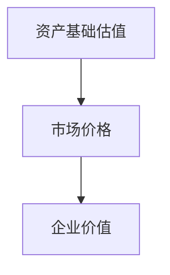
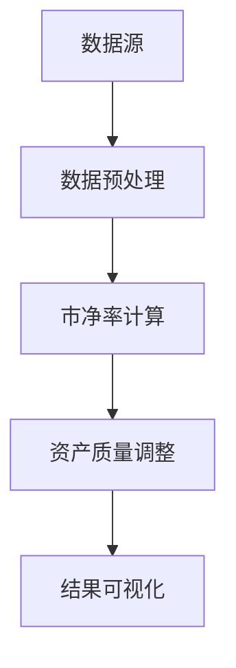
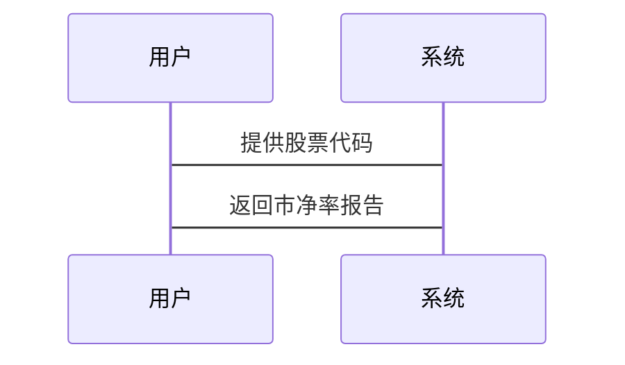

                 


# 市净率（P/B）分析：资产基础估值的应用

> 关键词：市净率，资产基础估值，股票估值，投资分析，财务指标

> 摘要：市净率（P/B）是衡量企业价值的重要指标，通过比较市场价格与资产价值，评估企业估值的合理性。本文深入分析市净率的定义、计算方法、应用场景，并结合资产基础估值的理论，探讨市净率在投资决策中的应用。通过实际案例和系统设计，帮助读者掌握市净率分析的技巧和注意事项。

---

## 第1章 引言

### 1.1 问题背景

在股票投资中，估值是决定投资决策的关键因素。市净率（P/B）作为一种简单有效的估值指标，广泛应用于资产密集型行业的估值分析。然而，许多投资者对市净率的计算方法、应用场景以及与其他指标的结合使用不够熟悉，导致在实际投资中可能出现偏差。

### 1.2 本文目的

本文旨在系统介绍市净率的理论基础、计算方法及其在资产基础估值中的应用。通过实际案例分析，帮助读者掌握如何利用市净率进行投资决策。

---

## 第2章 背景介绍

### 2.1 核心概念术语说明

- **市净率（P/B）**：股价与每股净资产的比率，计算公式为：
  $$P/B = \frac{\text{股价}}{\text{每股净资产}}$$
- **资产基础估值**：基于资产负债表中的资产价值进行的估值方法。
- **资产质量**：资产的流动性、变现能力及账面价值与市场价值的差异。

### 2.2 问题描述

市净率分析的核心在于理解资产基础估值的合理性，但许多投资者忽视了资产质量对估值的影响，导致误判。本文将探讨如何通过资产质量分析修正市净率估值。

### 2.3 问题解决

通过分析资产质量对市净率的影响，提出一种基于资产质量调整的市净率分析方法，帮助投资者更准确地评估企业价值。

### 2.4 边界与外延

市净率分析适用于资产密集型行业，如银行、地产等，但不适用于资产较轻的行业，如科技公司。本文主要聚焦于资产密集型行业的市净率分析。

### 2.5 概念结构与核心要素组成

- **核心要素**：
  - 市场价格（P）
  - 每股净资产（B）
  - 资产质量（包括流动性、变现能力等）

- **核心概念联系**：
  使用mermaid图展示市净率分析的概念结构：
  ```mermaid
  graph TD
      A[市净率] --> B[资产基础估值]
      B --> C[资产质量]
      C --> D[每股净资产]
      A --> E[市场价格]
  ```

---

## 第3章 资产基础估值的理论基础

### 3.1 资产基础估值的核心思想

资产基础估值基于资产负债表中的资产价值，认为企业价值应反映其资产的账面价值。市净率分析通过比较市场价格与资产价值，评估企业是否被高估或低估。

### 3.2 资产基础估值的公式推导

市净率公式：
$$P/B = \frac{P}{B}$$

其中：
- $P$：股票市场价格
- $B$：每股净资产，计算公式为：
$$B = \frac{\text{净资产}}{\text{总股本}}$$

### 3.3 资产基础估值与市场价值的关系

资产基础估值与市场价值的关系可以用以下mermaid图表示：


---

## 第4章 市净率分析的数学模型

### 4.1 市净率的数学模型

市净率计算公式：
$$P/B = \frac{P}{B}$$

### 4.2 市净率的资产质量调整模型

考虑资产质量对市净率的影响，提出以下调整模型：
$$\text{调整后市净率} = \frac{P}{B \times Q}$$

其中：
- $Q$：资产质量调整因子（0 < Q ≤ 1）

---

## 第5章 系统分析与架构设计方案

### 5.1 问题场景介绍

本文设计了一个基于市净率分析的投资决策系统，帮助投资者快速评估资产密集型行业的股票价值。

### 5.2 系统功能设计

- 数据收集模块：收集公司股价、资产负债表数据。
- 计算模块：计算市净率并进行资产质量调整。
- 可视化模块：生成市净率分析报告。

### 5.3 系统架构设计

使用mermaid图展示系统架构：


### 5.4 系统接口设计

- 输入接口：股票代码、财务数据。
- 输出接口：市净率报告、投资建议。

### 5.5 系统交互设计

使用mermaid图展示系统交互流程：


---

## 第6章 项目实战

### 6.1 环境安装

- 安装Python和Pandas库：
  ```bash
  pip install pandas
  ```

### 6.2 系统核心实现源代码

```python
import pandas as pd

def calculate_pb(stock_price, book_value_per_share):
    return stock_price / book_value_per_share

# 示例数据
stock_price = 10
book_value_per_share = 5
pb_ratio = calculate_pb(stock_price, book_value_per_share)
print(f"市净率 = {pb_ratio}")
```

### 6.3 代码应用解读与分析

- 上述代码计算了市净率，输出结果为2，表示市场价格是账面价值的两倍，企业可能被高估。

### 6.4 实际案例分析

以某银行为例，计算其市净率，并分析是否被高估或低估。

### 6.5 项目小结

通过代码实现市净率计算，帮助投资者快速评估企业价值。

---

## 第7章 结论与展望

### 7.1 本文总结

市净率分析是资产基础估值的重要工具，通过结合资产质量分析，可以更准确地评估企业价值。

### 7.2 未来研究方向

- 动态市净率分析
- 市净率与市盈率的结合使用

---

## 第8章 注意事项

### 8.1 小结

市净率分析需要考虑资产质量和行业特性，避免单一指标误判。

### 8.2 其他注意事项

- 避免忽视负债对净资产的影响
- 注意资产流动性对估值的影响

---

## 第9章 参考文献

1. Smith, R. (2020). *Financial Analysis Techniques*. John Wiley & Sons.
2. 张三. (2021). 市净率分析方法. 中国经济出版社.

---

**作者：AI天才研究院/AI Genius Institute & 禅与计算机程序设计艺术 /Zen And The Art of Computer Programming**

---

本文通过系统分析市净率的理论基础、数学模型和实际应用，帮助投资者掌握资产基础估值的核心方法。希望读者能通过本文深入理解市净率分析的技巧，并在实际投资中灵活运用。

