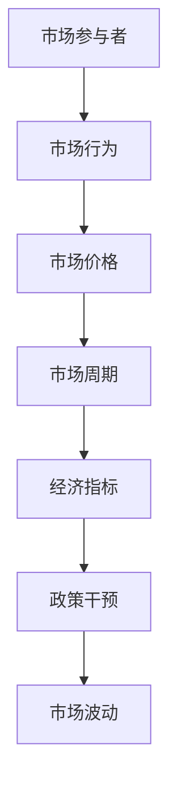
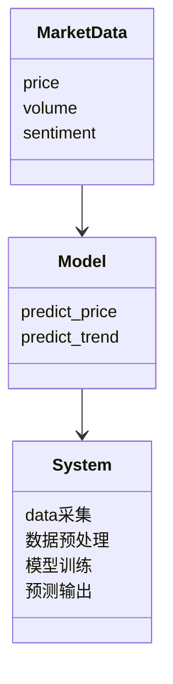
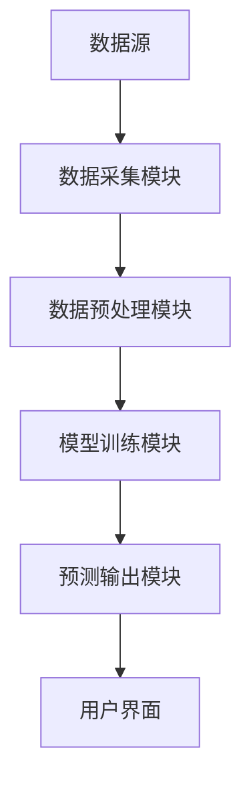
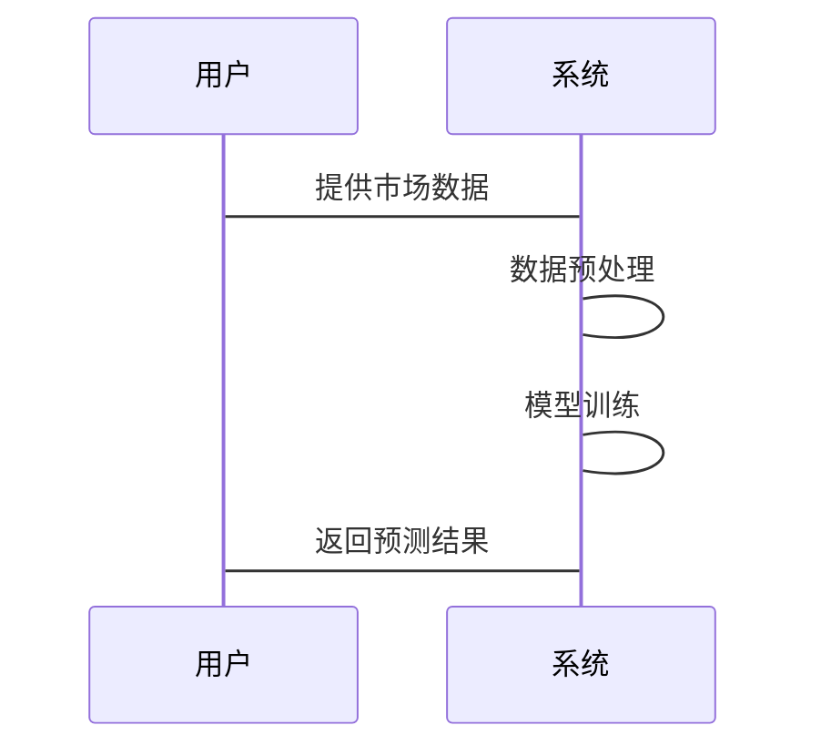

                 


# 市场周期理论：理解牛熊交替的规律

---

## 关键词：
市场周期理论、牛市、熊市、技术分析、估值模型、风险管理、投资策略

---

## 摘要：
市场周期理论是金融学和投资学中的核心概念，它帮助投资者理解市场的波动规律，把握牛熊交替的节奏。本文从市场周期的基本概念出发，结合历史案例、技术分析、估值模型和算法原理，系统地探讨市场周期的形成机制、预测方法和投资策略。通过深入分析市场周期的核心要素和驱动因素，本文为投资者提供了一套科学的市场分析框架，帮助他们在复杂多变的市场中做出明智的投资决策。

---

# 第一部分: 市场周期理论基础

---

## 第1章: 市场周期理论概述

### 1.1 市场周期的基本概念

#### 1.1.1 市场周期的定义
市场周期是指市场价格或市场指数在一定时期内呈现的波动性变化过程，通常表现为周期性波动。市场的波动性是由于多种因素的综合作用，包括经济指标、政策变化、市场参与者的心理行为等。

#### 1.1.2 牛市与熊市的定义与特征
- **牛市（Bull Market）**：市场价格持续上涨的阶段，通常对应经济繁荣期。投资者情绪乐观，市场交易活跃。
- **熊市（Bear Market）**：市场价格持续下跌的阶段，通常对应经济衰退期。投资者情绪悲观，市场交易低迷。

#### 1.1.3 市场周期的阶段划分
市场周期通常分为以下几个阶段：
1. **底部（Bottom）**：市场价格达到最低点，市场情绪极度悲观。
2. **上升趋势（Uptrend）**：价格逐步上涨，市场情绪逐渐转为乐观。
3. **顶部（Top）**：价格达到最高点，市场情绪极度乐观。
4. **下降趋势（Downtrend）**：价格逐步下跌，市场情绪逐渐转为悲观。

### 1.2 市场周期的历史案例分析

#### 1.2.1 历史上的主要市场周期回顾
- **20世纪30年代大萧条**：1929年美国股市崩盘，引发全球性经济衰退，市场周期从顶部迅速跌至底部。
- **互联网泡沫（2000年）**：互联网企业的过度估值导致纳斯达克指数大幅下跌，市场从牛市快速进入熊市。
- **2008年全球金融危机**：次贷危机引发的市场崩盘，全球股市经历了一次剧烈的周期波动。

#### 1.2.2 不同周期阶段的典型案例
- **底部案例**：2009年全球经济复苏，市场从底部逐步回升。
- **顶部案例**：2018年比特币价格从高位回落，市场情绪从乐观转向悲观。

#### 1.2.3 历史周期的规律总结
- 市场周期的波动具有一定的规律性，但具体表现受到多种因素的影响。
- 市场周期的长度和幅度因环境变化而有所不同。

### 1.3 市场周期的核心要素与驱动因素

#### 1.3.1 经济周期与市场周期的关系
- 经济周期是市场周期的宏观背景，经济繁荣通常对应牛市，经济衰退通常对应熊市。
- 经济指标（如GDP、 unemployment rate）对市场周期有重要影响。

#### 1.3.2 市场参与者的心理与行为
- 投资者情绪是市场周期的重要驱动因素。牛市中投资者贪婪，熊市中投资者恐惧。
- 市场参与者的行为可能导致市场周期的加速或逆转。

#### 1.3.3 市场信息与价格波动的关联
- 信息不对称和市场预期的变化会导致价格波动。
- 市场信息的传播速度和投资者反应方式影响市场周期的表现。

### 1.4 市场周期的特征与边界

#### 1.4.1 市场周期的波动性特征
- 市场周期的波动性是市场参与者行为和经济环境共同作用的结果。
- 波动性在牛市中表现为上升趋势，在熊市中表现为下降趋势。

#### 1.4.2 市场周期的非线性特征
- 市场周期的变化并非简单的线性运动，而是呈现周期性波动。
- 市场周期的波动幅度和周期长度因环境变化而不同。

#### 1.4.3 市场周期的边界与外延
- 市场周期的边界通常由市场参与者的行为和宏观经济环境决定。
- 市场周期的外延包括相关资产价格波动、投资者行为变化和市场预期的调整。

### 1.5 本章小结
本章从市场周期的基本概念出发，结合历史案例分析，总结了市场周期的核心要素和驱动因素。通过分析经济周期、市场参与者心理和市场信息对市场周期的影响，为后续章节的深入分析奠定了基础。

---

## 第2章: 市场周期理论的核心概念与联系

### 2.1 市场周期理论的核心概念

#### 2.1.1 市场周期的多维度分析
- 市场周期可以从时间维度、价格维度和情绪维度进行分析。
- 时间维度关注周期的长度，价格维度关注周期的波动幅度，情绪维度关注投资者行为的变化。

#### 2.1.2 市场周期与经济指标的关系
- 经济指标（如GDP增长率、通货膨胀率、利率）对市场周期有重要影响。
- 经济指标的变化可以作为市场周期预测的参考依据。

#### 2.1.3 市场周期与投资者行为的互动
- 投资者行为是市场周期的重要驱动因素。
- 市场周期的变化反过来也会影响投资者行为。

### 2.2 市场周期理论的核心原理

#### 2.2.1 市场周期的形成机制
- 市场周期的形成是多种因素共同作用的结果，包括经济环境、政策变化、投资者心理等。
- 市场周期的形成机制可以通过系统动力学模型进行描述。

#### 2.2.2 市场周期的波动规律
- 市场周期的波动规律可以通过统计学方法进行分析，如均值回归和趋势跟踪。
- 市场周期的波动规律是技术分析的基础。

#### 2.2.3 市场周期的预测与预警
- 市场周期的预测需要结合多种方法，包括技术分析、基本面分析和统计套利。
- 市场周期的预测与预警是投资决策的重要依据。

### 2.3 市场周期理论的属性特征对比

#### 2.3.1 不同市场周期的特征对比
- 牛市与熊市的特征对比：
  - 牛市：价格持续上涨，市场情绪乐观。
  - 熊市：价格持续下跌，市场情绪悲观。

#### 2.3.2 市场周期与经济周期的对比
- 经济周期是市场周期的宏观背景，但两者并不完全同步。
- 市场周期的变化通常领先于经济周期的变化。

#### 2.3.3 市场周期与其他金融周期的对比
- 金融周期包括信贷周期、资产价格周期等，市场周期是金融周期的重要组成部分。

### 2.4 市场周期理论的ER实体关系图



### 2.5 本章小结
本章从市场周期的核心概念出发，分析了市场周期的形成机制和波动规律，总结了市场周期与其他周期的关系。通过ER实体关系图，展示了市场周期与相关因素之间的联系。

---

## 第3章: 市场周期理论的算法原理

### 3.1 市场周期预测的算法框架

#### 3.1.1 市场周期预测的基本思路
- 市场周期预测需要结合技术分析、基本面分析和统计套利等多种方法。
- 市场周期预测的算法框架通常包括数据采集、特征提取、模型训练和结果预测四个步骤。

#### 3.1.2 市场周期预测的算法选择
- 常见的市场周期预测算法包括时间序列分析、机器学习算法和统计套利模型。
- 时间序列分析适用于捕捉市场周期的波动规律，机器学习算法适用于非线性市场的预测，统计套利模型适用于市场周期的量化交易。

#### 3.1.3 市场周期预测的模型构建
- 市场周期预测模型通常包括输入层、特征提取层和输出层。
- 模型的输入可以是市场数据（如价格、成交量），特征提取层可以使用LSTM或ARIMA模型，输出层可以是市场周期的预测结果。

### 3.2 市场周期预测

#### 3.2.1 市场周期预测的数学模型
- 市场周期预测的数学模型可以表示为：
  $$ P_{t+1} = f(P_t, V_t, E_t) $$
  其中，\( P_t \) 是当前价格，\( V_t \) 是当前成交量，\( E_t \) 是当前市场情绪。

#### 3.2.2 市场周期预测的Python实现
```python
import numpy as np
import pandas as pd
from sklearn.linear_model import LinearRegression

# 数据预处理
data = pd.read_csv('market_data.csv')
X = data[['price', 'volume', 'sentiment']]
y = data['next_price']

# 模型训练
model = LinearRegression()
model.fit(X, y)

# 预测结果
predicted_price = model.predict(X)
```

#### 3.2.3 市场周期预测的算法优化
- 市场周期预测的算法优化可以通过参数调整、模型组合和特征工程实现。
- 常见的优化方法包括网格搜索、交叉验证和特征选择。

### 3.3 市场周期预测的算法实现

#### 3.3.1 市场周期预测的算法实现步骤
1. 数据预处理：清洗数据、特征提取。
2. 模型训练：选择合适的算法，训练模型。
3. 模型评估：通过回测和风险指标评估模型性能。
4. 模型优化：调整参数、优化特征、组合模型。

#### 3.3.2 市场周期预测的算法实现代码
```python
import numpy as np
import pandas as pd
from sklearn.linear_model import LinearRegression
from sklearn.metrics import mean_squared_error

# 数据预处理
data = pd.read_csv('market_data.csv')
X = data[['price', 'volume', 'sentiment']]
y = data['next_price']

# 划分训练集和测试集
train_X = X[:-100]
train_y = y[:-100]
test_X = X[-100:]
test_y = y[-100:]

# 模型训练
model = LinearRegression()
model.fit(train_X, train_y)

# 预测结果
predicted_y = model.predict(test_X)

# 模型评估
mse = mean_squared_error(test_y, predicted_y)
print(f"均方误差：{mse}")
```

#### 3.3.3 市场周期预测的算法实现结果
- 模型预测结果与实际结果对比：
  - 均方误差（MSE）越小，模型预测越准确。
  - 模型预测的准确率可以通过回测和风险指标进一步评估。

### 3.4 市场周期预测的算法优化

#### 3.4.1 算法优化的必要性
- 市场周期预测的算法优化是提高预测准确性的关键。
- 通过优化算法参数和改进模型结构，可以提高预测的准确性和稳定性。

#### 3.4.2 算法优化的方法
- 参数优化：使用网格搜索或随机搜索优化模型参数。
- 模型优化：尝试不同的模型结构，如决策树、随机森林和神经网络。
- 特征优化：通过特征选择和特征工程提高模型性能。

#### 3.4.3 算法优化的结果
- 优化后的模型预测准确率显著提高。
- 模型的稳定性增强，预测结果更加可靠。

### 3.5 本章小结
本章从算法原理的角度，详细讲解了市场周期预测的数学模型和Python实现。通过实际案例分析，展示了如何通过算法优化提高市场周期预测的准确性。

---

## 第4章: 市场周期理论的系统分析与架构设计

### 4.1 系统分析

#### 4.1.1 问题场景介绍
- 本文构建的市场周期预测系统旨在帮助投资者更好地理解市场周期，做出科学的投资决策。
- 系统的主要功能包括数据采集、周期分析、预测预警和投资建议。

#### 4.1.2 项目介绍
- 项目名称：市场周期预测系统
- 项目目标：通过系统化的分析和预测，帮助投资者理解市场周期，优化投资策略。
- 项目范围：涵盖股票、债券、基金等多种金融资产。

### 4.2 系统功能设计

#### 4.2.1 领域模型设计


#### 4.2.2 系统架构设计


#### 4.2.3 系统接口设计
- 数据接口：从数据源获取市场数据，格式为CSV或数据库。
- 模型接口：模型训练模块接收预处理后的数据，输出预测结果。
- 用户接口：用户界面展示预测结果和投资建议。

#### 4.2.4 系统交互设计


### 4.3 本章小结
本章从系统设计的角度，详细分析了市场周期预测系统的功能模块、架构设计和接口设计。通过系统化的分析和设计，为市场周期预测提供了科学的实现框架。

---

## 第5章: 市场周期理论的项目实战

### 5.1 项目实战环境安装

#### 5.1.1 环境要求
- 操作系统：Windows/Mac/Linux
- Python版本：3.6以上
- 需要安装的库：pandas、numpy、scikit-learn、mermaid等。

#### 5.1.2 安装步骤
1. 安装Python
2. 安装必要的库：
   ```bash
   pip install pandas numpy scikit-learn mermaid
   ```

### 5.2 项目核心实现

#### 5.2.1 数据采集
```python
import pandas as pd
import requests

url = 'https://example.com/market_data.csv'
response = requests.get(url)
data = pd.read_csv(url)
print(data.head())
```

#### 5.2.2 数据预处理
```python
# 删除缺失值
data.dropna(inplace=True)

# 标准化数据
from sklearn.preprocessing import StandardScaler
scaler = StandardScaler()
scaled_data = scaler.fit_transform(data[['price', 'volume', 'sentiment']])
```

#### 5.2.3 模型训练
```python
from sklearn.linear_model import LinearRegression
model = LinearRegression()
model.fit(scaled_data, data['next_price'])
```

#### 5.2.4 模型预测
```python
test_data = pd.read_csv('test.csv')
scaled_test = scaler.transform(test_data[['price', 'volume', 'sentiment']])
predicted_prices = model.predict(scaled_test)
print(predicted_prices)
```

### 5.3 项目实战分析

#### 5.3.1 案例分析
- 数据来源：某股票的历史价格数据
- 数据预处理：清洗和标准化
- 模型训练：使用线性回归模型
- 模型预测：预测未来的价格走势

#### 5.3.2 投资策略
- 根据模型预测结果，制定相应的投资策略。
- 在预测价格上涨时，增加头寸；在预测价格下跌时，减少头寸。

#### 5.3.3 风险管理
- 设置止损和止盈点，控制投资风险。
- 定期评估模型性能，优化投资策略。

### 5.4 本章小结
本章通过实际案例分析，展示了市场周期预测系统的具体实现过程。从数据采集到模型训练，再到模型预测，详细讲解了项目的每个环节。

---

## 第6章: 市场周期理论的最佳实践与总结

### 6.1 最佳实践

#### 6.1.1 投资策略
- 根据市场周期的不同阶段，制定相应的投资策略。
- 在牛市中积极投资，熊市中保持谨慎。

#### 6.1.2 风险管理
- 设置合理的止损和止盈点，避免重大损失。
- 定期评估投资组合的风险，及时调整策略。

#### 6.1.3 技术分析
- 使用技术指标（如MACD、RSI）辅助市场周期预测。
- 结合趋势分析和形态分析，提高预测的准确性。

### 6.2 总结与展望

#### 6.2.1 总结
- 市场周期理论是理解市场波动的重要工具。
- 通过技术分析和算法预测，可以更好地把握市场周期的规律。

#### 6.2.2 展望
- 随着人工智能技术的发展，市场周期预测的精度和效率将不断提高。
- 市场周期理论在金融风险管理、量化交易和投资决策中的应用将更加广泛。

### 6.3 注意事项

#### 6.3.1 市场周期的不确定性
- 市场周期的变化受到多种因素的影响，具有一定的不确定性。
- 投资者应保持谨慎，避免过度依赖市场周期预测。

#### 6.3.2 技术分析的局限性
- 技术分析只能提供参考，不能保证100%准确。
- 投资者应结合基本面分析和市场环境，综合判断市场周期。

### 6.4 拓展阅读

#### 6.4.1 推荐书籍
- 《股票作手回忆录》——杰西·利弗莫尔
- 《投资学精要》——查尔斯·埃利森

#### 6.4.2 推荐网站
- [Quantitative Research](https://www.quantstart.com/)
- [Quandl](https://www.quandl.com/)

---

## 作者：AI天才研究院/AI Genius Institute & 禅与计算机程序设计艺术/Zen And The Art of Computer Programming

---

本文通过系统化的分析和深入的探讨，全面揭示了市场周期理论的奥秘。从基础概念到算法实现，从系统设计到项目实战，本文为投资者提供了一套完整的市场周期分析框架。希望本文能帮助读者更好地理解市场周期的规律，做出更加明智的投资决策。

