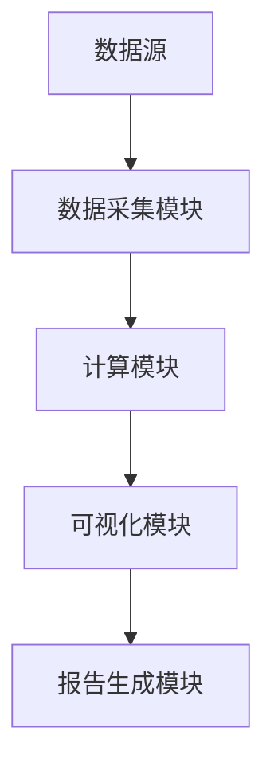
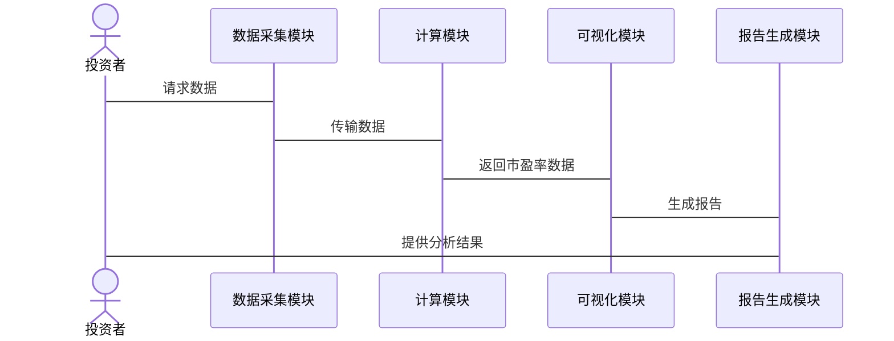

                 


# 市盈率（P/E）分析：最广泛使用的估值指标

> **关键词**：市盈率、P/E、股票估值、投资分析、金融指标、投资策略  
> **摘要**：市盈率（P/E）是评估股票价值的关键指标，本文深入探讨其定义、计算方法、应用场景及其局限性，帮助投资者更好地理解和应用这一指标。

---

## 第1章: 市盈率的基本概念与背景介绍

### 1.1 市盈率的定义与背景

#### 1.1.1 什么是市盈率
市盈率（Price-to-Earnings Ratio，简称P/E）是衡量股票估值的重要指标，计算公式为：
$$ \text{市盈率} = \frac{\text{股价}}{\text{每股收益（EPS）}} $$

市盈率反映了投资者为公司的每股收益愿意支付的价格。它帮助投资者评估股票是否被高估或低估。

#### 1.1.2 市盈率的起源与发展
市盈率的概念起源于20世纪初，随着现代金融理论的发展，其应用日益广泛。市盈率的计算方法经历了多次演变，但核心思想始终是将股价与企业盈利能力挂钩。

#### 1.1.3 市盈率在投资中的重要性
市盈率是投资者评估股票价值的重要工具，尤其在选股和投资决策中发挥着关键作用。

---

### 1.2 市盈率的核心概念

#### 1.2.1 市盈率的计算公式
$$ \text{市盈率} = \frac{\text{股价}}{\text{每股收益（EPS）}} $$

#### 1.2.2 市盈率的属性特征对比表
| 属性      | 特征                                   |
|------------|----------------------------------------|
| 计算基础   | 股价和每股收益                         |
| 应用场景   | 个股估值、行业比较、市场周期分析       |
| 优点       | 简单易懂，广泛应用                   |
| 缺点       | 受企业周期、行业特性影响较大           |

#### 1.2.3 市盈率与企业价值的关系
市盈率高的股票可能意味着市场对其未来收益有较高预期，但也可能表明股票被高估。市盈率低的股票可能被低估，但也可能意味着企业盈利能力差。

---

## 第2章: 市盈率的计算方法与应用场景

### 2.1 市盈率的计算方法

#### 2.1.1 绝对市盈率的计算
绝对市盈率是单个股票的市盈率，用于比较同一公司的不同时间段表现。

例如，某公司股价为50元，每股收益为5元，市盈率为10。

#### 2.1.2 相对市盈率的计算
相对市盈率用于比较不同公司之间的估值。

例如，公司A市盈率为15，公司B市盈率为20，公司B的相对市盈率更高，可能表明市场对其未来收益预期更高。

#### 2.1.3 市盈率的调整与修正
修正市盈率考虑了股息率等因素，公式如下：
$$ \text{修正市盈率} = \frac{\text{股价}}{\text{每股收益} \times (1 + \text{股息率})} $$

---

### 2.2 市盈率的应用场景

#### 2.2.1 个股估值
投资者可以通过市盈率判断个股是否被高估或低估。

#### 2.2.2 行业比较
市盈率可以帮助投资者分析行业内的估值差异。

#### 2.2.3 市场周期分析
市盈率可以反映市场的整体波动，例如在熊市中，市盈率可能普遍较低。

---

## 第3章: 市盈率与其他估值指标的对比

### 3.1 市盈率与市净率（P/B）的对比

#### 3.1.1 定义与计算公式
市净率 = 股价 / 每股净资产

#### 3.1.2 应用场景的差异
市盈率适用于盈利稳定的公司，市净率适用于资产密集型行业。

### 3.2 市盈率与股息率的对比

#### 3.2.1 定义与计算公式
股息率 = 每股股息 / 股价

#### 3.2.2 应用场景的差异
市盈率关注未来收益，股息率关注当前分红。

### 3.3 市盈率与EV/EBITDA的对比

#### 3.3.1 定义与计算公式
EV/EBITDA = 企业价值 / 息税折旧及摊销前利润

#### 3.3.2 应用场景的差异
市盈率适用于利润稳定的公司，EV/EBITDA适用于亏损公司。

---

## 第4章: 市盈率的局限性与解决方案

### 4.1 市盈率的局限性

#### 4.1.1 市盈率受企业周期性影响
企业盈利波动会影响市盈率的准确性。

#### 4.1.2 市盈率受行业特性影响
不同行业对市盈率的合理范围有不同的标准。

#### 4.1.3 市盈率受市场情绪影响
市场情绪波动会导致市盈率短期失真。

### 4.2 应对市盈率局限性的解决方案

#### 4.2.1 使用修正市盈率
考虑股息率和其他因素调整市盈率。

#### 4.2.2 结合其他估值指标
综合使用市净率、EV/EBITDA等指标进行分析。

#### 4.2.3 结合基本面分析
深入分析企业的财务状况和行业前景。

---

## 第5章: 市盈率的系统分析与架构设计

### 5.1 系统分析

#### 5.1.1 数据收集与处理
从股票数据库获取股价和每股收益数据。

#### 5.1.2 市盈率计算与可视化
使用工具生成市盈率图表。

#### 5.1.3 市盈率分析与报告生成
生成分析报告，提供投资建议。

### 5.2 系统架构设计

#### 5.2.1 系统功能模块划分
- 数据采集模块
- 计算模块
- 可视化模块
- 报告生成模块

#### 5.2.2 系统架构设计



#### 5.2.3 系统接口设计
- 数据接口：从数据库获取数据
- 计算接口：计算市盈率
- 可视化接口：生成图表

#### 5.2.4 系统交互设计



---

## 第6章: 市盈率的项目实战

### 6.1 项目环境安装

#### 6.1.1 安装Python
使用Anaconda安装Python环境。

#### 6.1.2 安装必要库
安装pandas、numpy、matplotlib等库。

### 6.2 系统核心实现源代码

```python
import pandas as pd
import numpy as np
import matplotlib.pyplot as plt

# 示例数据
data = {
    '公司': ['A', 'B', 'C'],
    '股价': [50, 30, 40],
    '每股收益': [5, 3, 4]
}

df = pd.DataFrame(data)

# 计算市盈率
df['市盈率'] = df['股价'] / df['每股收益']

# 可视化
plt.figure(figsize=(10,6))
plt.plot(df['公司'], df['市盈率'], 'o-', label='市盈率')
plt.xlabel('公司') 
plt.ylabel('市盈率') 
plt.title('市盈率分析') 
plt.legend()
plt.show()
```

### 6.3 代码应用解读与分析

#### 6.3.1 数据输入
创建包含公司名称、股价和每股收益的数据框。

#### 6.3.2 计算市盈率
使用公式计算市盈率并添加到数据框中。

#### 6.3.3 可视化
绘制市盈率图表，帮助直观分析。

### 6.4 实际案例分析

#### 6.4.1 数据来源与处理
从数据库获取实际股票数据，清洗数据。

#### 6.4.2 市盈率计算与分析
计算市盈率并进行行业比较。

#### 6.4.3 投资决策
基于市盈率分析，给出投资建议。

### 6.5 项目小结
市盈率分析是一个实用的工具，但需要结合其他指标和深入分析。

---

## 第7章: 最佳实践与注意事项

### 7.1 最佳实践

#### 7.1.1 定期更新数据
确保使用的数据是最新的。

#### 7.1.2 结合基本面分析
市盈率分析应与企业盈利能力和财务状况结合。

### 7.2 小结
市盈率是重要的估值指标，但需综合分析。

### 7.3 注意事项
- 市盈率高不一定意味着高风险。
- 不同行业对市盈率的合理范围不同。
- 市盈率分析需结合市场环境和企业基本面。

### 7.4 拓展阅读
建议阅读《投资学基础》和《股票估值指标详解》。

---

## 作者：AI天才研究院 & 禅与计算机程序设计艺术

---

这篇文章系统地介绍了市盈率的定义、计算方法、应用场景及其局限性，结合了理论分析和实际案例，帮助读者全面理解和应用这一重要的估值指标。

