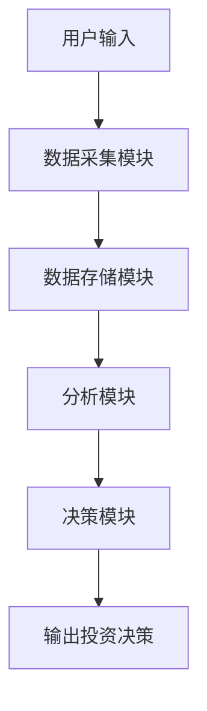
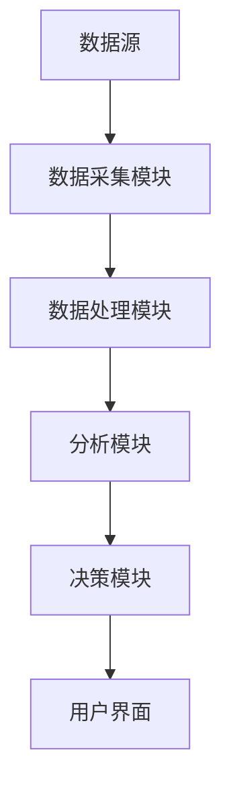
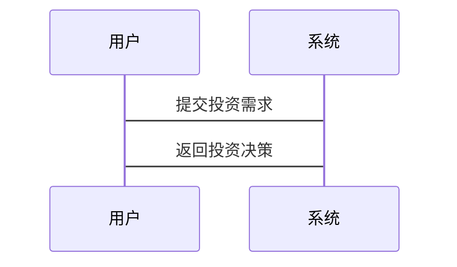

                 


# 布鲁斯·伯克维茨的集中型价值投资：深度研究的重要性

> 关键词：集中型投资，深度研究，价值投资，投资策略，算法原理

> 摘要：本文深入探讨了布鲁斯·伯克维茨的集中型价值投资理念，分析了深度研究在投资决策中的重要性。文章从集中型投资的定义、核心概念、算法原理、系统架构、项目实战以及最佳实践等多个维度展开，结合实际案例和数学模型，为读者提供全面而深入的分析。

---

## 第一部分: 集中型价值投资的背景与核心理念

### 第1章: 集中型价值投资的起源与意义

#### 1.1 价值投资的起源与发展

##### 1.1.1 价值投资的定义与核心理念
价值投资是一种以基本面分析为基础的投资策略，强调以低于内在价值的价格购买优质资产。其核心理念包括：
- **安全边际**：买入价格低于内在价值，以降低风险。
- **长期视角**：关注企业的长期盈利能力，而非短期市场波动。
- **逆向思维**：在市场恐慌时寻找被低估的机会。

##### 1.1.2 布鲁斯·伯克维茨的投资理念
布鲁斯·伯克维茨是价值投资的代表人物之一，他强调：
- **集中投资**：将资金集中在少数优质企业上，以最大化收益。
- **深度研究**：通过深入分析企业的财务状况、行业地位和竞争优势，选择具有长期增长潜力的企业。
- **长期持有**：避免频繁交易，降低交易成本，享受企业成长的复利效应。

##### 1.1.3 集中型投资的意义
集中型投资通过减少投资标的数量，提高对每一家企业的研究深度，从而更精准地捕捉投资机会。其优势包括：
- **聚焦优质资产**：减少分散投资带来的收益稀释。
- **降低决策复杂性**：集中关注少数企业，提高决策效率。
- **增强风险管理**：通过深度研究降低投资失误的概率。

#### 1.2 集中型投资的意义

##### 1.2.1 集中投资的优势与劣势
- **优势**：
  - 高收益潜力：通过集中投资优质资产，获得超越市场的回报。
  - 简化决策流程：减少需要关注的标的数量，提高决策效率。
- **劣势**：
  - 风险集中：投资过于集中在少数企业可能导致重大损失。
  - 市场波动风险：集中投资可能因市场波动承受更大的回撤。

##### 1.2.2 集中投资与分散投资的对比
| 对比维度          | 集中投资                | 分散投资                |
|-------------------|-------------------------|-------------------------|
| **风险**          | 高                    | 低                    |
| **收益潜力**      | 高                    | 中                    |
| **管理复杂性**    | 低                    | 高                    |
| **研究深度**      | 高                    | 低                    |

##### 1.2.3 深度研究的重要性
深度研究是集中型投资的核心，通过对企业基本面的全面分析，包括财务报表、行业地位、竞争优势等，投资者能够更准确地评估企业的内在价值。深度研究的重要性体现在：
- **降低投资风险**：通过全面分析发现潜在问题。
- **提高投资决策质量**：深度研究为企业估值提供坚实基础。
- **捕捉长期机会**：通过长期跟踪企业，发现其成长潜力。

---

### 第2章: 集中型价值投资的核心概念与联系

#### 2.1 集中型价值投资的定义与特点

##### 2.1.1 集中型投资的定义
集中型投资是指将大部分资金投资于少数优质资产，通过深度研究和长期持有，实现超额收益的投资策略。

##### 2.1.2 集中型投资的核心特点
- **高集中度**：投资组合中的标的数量较少，单个标的权重较高。
- **深度研究**：对每一家投资的企业进行深入分析，确保投资决策的准确性。
- **长期持有**：避免频繁交易，降低交易成本，同时享受企业成长的复利效应。

#### 2.2 深度研究的原理与方法

##### 2.2.1 深度研究的原理
深度研究基于基本面分析，通过对企业财务状况、行业地位、竞争优势等多维度的分析，评估企业的内在价值。其原理包括：
- **财务分析**：通过分析企业的收入、利润、现金流等指标，评估企业的盈利能力和财务健康状况。
- **行业分析**：研究企业在行业中的地位、竞争格局和未来发展趋势。
- **管理层分析**：评估企业管理层的素质、战略眼光和执行力。

##### 2.2.2 深度研究的方法与步骤
1. **初步筛选**：通过行业分析和财务指标筛选出潜在投资标的。
2. **深入分析**：对筛选出的企业进行详细财务分析、行业研究和管理层评估。
3. **估值模型**：使用DCF（Discounted Cash Flow）等模型评估企业的内在价值。
4. **投资决策**：基于估值和分析结果，决定是否投资。

#### 2.3 集中型投资与深度研究的关系

##### 2.3.1 集中投资依赖深度研究的原因
集中投资要求投资者对每一家投资的企业有深刻的理解，而深度研究正是实现这一目标的关键。

##### 2.3.2 深度研究如何支持集中投资决策
通过深度研究，投资者能够准确评估企业的内在价值，识别投资风险，并制定长期的投资策略。

##### 2.3.3 集中投资与深度研究的协同效应
集中投资与深度研究相辅相成，前者通过减少标的数量提高研究效率，后者通过深入分析确保投资决策的准确性。

---

### 第3章: 集中型价值投资的算法原理

#### 3.1 投资组合优化的数学模型

##### 3.1.1 均值-方差优化模型
均值-方差优化模型是投资组合优化的基础，旨在在给定风险水平下最大化收益，或在给定收益下最小化风险。

公式如下：
$$
\text{Minimize } \sigma^2 \text{ subject to } \mu \geq \text{目标收益}
$$
其中，$\sigma^2$ 表示投资组合的方差，$\mu$ 表示期望收益。

##### 3.1.2 马科维茨的有效前沿理论
马科维茨的有效前沿理论指出，存在一条曲线，使得在给定风险下，曲线上的投资组合具有最高的预期收益，或者在给定收益下，具有最低的风险。

有效前沿的数学表示为：
$$
\text{Minimize } \sigma^2 \text{ subject to } \mu = \text{目标收益}
$$

##### 3.1.3 集中型投资的数学表达
集中型投资可以通过调整投资组合的权重实现。假设投资组合中有 $n$ 个标的，集中型投资可以通过以下方式实现：
$$
w_i = \begin{cases}
1 & \text{如果 } i \text{ 是目标企业} \\
0 & \text{否则}
\end{cases}
$$

---

#### 3.2 集中型投资的算法实现

##### 3.2.1 投资组合优化算法的步骤
1. **数据收集**：收集目标企业的历史价格数据。
2. **计算收益和风险**：计算每只股票的预期收益和方差。
3. **优化模型**：使用均值-方差优化模型确定最优权重。
4. **投资组合调整**：根据优化结果调整投资组合。

##### 3.2.2 集中型投资的权重分配方法
集中型投资通过将大部分资金分配给少数企业实现。例如，假设投资组合中有5只股票，集中型投资可以将80%的资金分配给其中3只股票。

##### 3.2.3 风险调整后的收益优化
通过调整投资组合的权重，降低整体风险。例如，使用马科维茨模型优化后的投资组合在相同风险下收益更高。

#### 3.3 深度研究的算法应用

##### 3.3.1 数据挖掘与分析算法
- **聚类分析**：将相似的企业分为同一类别。
- **回归分析**：分析企业收益与市场指数的关系。

##### 3.3.2 文本挖掘与情感分析
通过分析企业财报、新闻等文本数据，提取情感倾向，辅助投资决策。

##### 3.3.3 机器学习在投资决策中的应用
- **支持向量机（SVM）**：用于分类企业财务状况。
- **随机森林**：用于预测企业违约风险。

---

### 第4章: 集中型价值投资的系统分析与架构设计

#### 4.1 投资决策系统的功能设计

##### 4.1.1 系统功能模块划分
- **数据采集模块**：收集企业财务数据、市场数据等。
- **分析模块**：包括财务分析、行业分析、估值模型等。
- **决策模块**：基于分析结果生成投资决策。

##### 4.1.2 系统功能流程图


#### 4.2 系统架构设计

##### 4.2.1 系统架构图


#### 4.3 系统接口设计

##### 4.3.1 API设计
- **数据接口**：提供REST API接口，供其他系统调用数据。
- **分析接口**：提供分析结果的查询接口。

#### 4.4 系统交互流程图

##### 4.4.1 交互流程


---

### 第5章: 项目实战

#### 5.1 环境安装

##### 5.1.1 Python环境安装
安装Python和必要的库：
```
pip install numpy pandas matplotlib
```

##### 5.1.2 数据库安装
安装MySQL或MongoDB，用于存储企业数据。

#### 5.2 核心代码实现

##### 5.2.1 数据采集代码
```python
import pandas as pd

def get_data(tickers):
    data = []
    for ticker in tickers:
        # 获取股票数据
        df = pd.read_csv(f'data/{ticker}.csv')
        data.append(df)
    return pd.concat(data)
```

##### 5.2.2 估值模型代码
```python
def calculate_intrinsic_value(ticker):
    df = pd.read_csv(f'data/{ticker}.csv')
    # 计算自由现金流
    free_cash_flow = df['Free Cash Flow'].iloc[-1]
    # 计算加权平均资本成本
    wacc = 8  # 假设WACC为8%
    # 计算DCF估值
    terminal_value = free_cash_flow / (wacc - growth_rate)
    intrinsic_value = terminal_value / (1 + wacc/100)
    return intrinsic_value
```

##### 5.2.3 投资组合优化代码
```python
import numpy as np

def optimize_portfolio(weights):
    # 计算投资组合的方差
    covariance_matrix = np.cov(weights)
    variance = np.trace(covariance_matrix)
    return variance
```

---

### 第6章: 最佳实践与总结

#### 6.1 投资策略与风险管理

##### 6.1.1 投资策略
- **集中投资**：将资金集中在少数优质企业。
- **长期持有**：避免频繁交易，降低交易成本。

##### 6.1.2 风险管理
- **止损策略**：设定止损点，避免重大损失。
- **分散风险**：通过行业分散和企业分散降低风险。

#### 6.2 长期投资的重要性

##### 6.2.1 长期投资的优势
- **复利效应**：长期持有能够享受复利效应。
- **企业成长**：长期持有能够分享企业成长的成果。

#### 6.3 持续学习与投资优化

##### 6.3.1 持续学习
- **阅读经典书籍**：如《巴菲特的智慧》、《价值投资》等。
- **关注行业动态**：及时了解行业趋势和企业动态。

##### 6.3.2 投资优化
- **定期评估**：定期评估投资组合的表现，调整投资策略。
- **技术进步**：利用新技术和新工具优化投资决策。

---

## 作者

作者：AI天才研究院/AI Genius Institute & 禅与计算机程序设计艺术 /Zen And The Art of Computer Programming

