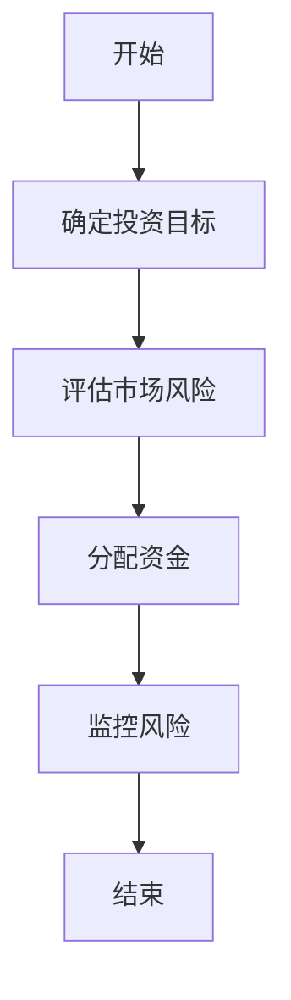
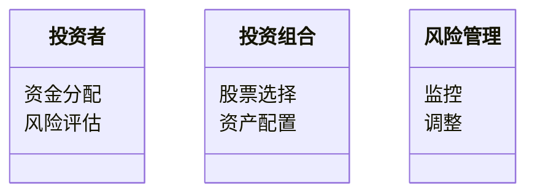

                 


# 《平均分配投资：巴菲特的风险管理策略》

---

## 关键词：
- 巴菲特
- 风险管理
- 平均分配投资
- 投资策略
- 股票分析
- 系统设计
- 数学模型

---

## 摘要：
本文详细探讨了巴菲特的平均分配投资策略，分析其背后的数学原理和系统架构。通过实际案例，展示了如何通过分散投资降低风险，实现稳健回报。文章结合技术博客的风格，从背景介绍、核心概念、算法原理到系统设计，层层深入，帮助读者全面理解这一投资策略。

---

# 第一部分: 巴菲特投资策略概述

## 第1章: 平均分配投资的背景与核心理念

### 1.1 投资市场的基本问题
#### 1.1.1 传统投资方式的局限性
传统的集中投资方式往往伴随着高风险，一旦某只股票表现不佳，整个投资组合可能遭受重大损失。

#### 1.1.2 平均分配投资的提出背景
为应对市场的不确定性，巴菲特提出平均分配投资策略，通过分散投资降低风险。

#### 1.1.3 平均分配投资的核心目标
通过平均分配资金，降低单个投资的风险，实现长期稳健的回报。

#### 1.1.4 平均分配投资的边界与外延
适用于多种资产类别，但需根据市场变化进行调整。

#### 1.1.5 平均分配投资的概念结构
涉及投资者、投资组合、资产配置等核心要素。

---

## 第2章: 平均分配投资的核心概念与联系

### 2.1 核心概念原理
平均分配投资通过分散资金，降低投资组合的波动性。

### 2.2 核心概念对比表
| 投资方式 | 集中投资 | 平均分配投资 |
|----------|----------|--------------|
| 风险     | 高       | 低           |
| 回报     | 不稳定   | 稳定         |

### 2.3 实体关系图


---

## 第3章: 巴菲特风险管理策略的算法原理

### 3.1 算法原理
通过平均分配资金，构建多元化的投资组合，降低风险。

### 3.2 算法流程图


### 3.3 算法实现
```python
def average_distribution投资策略(目标, 风险):
    分配比例 = 目标 / 风险
    return 分配比例
```

---

## 第4章: 数学模型与公式

### 4.1 内在价值公式
$$EV = \frac{Earnings}{Weighted Average Cost of Capital}$$

### 4.2 风险调整回报公式
$$Risk-Adjusted Return = Return - Risk Premium$$

---

## 第5章: 系统分析与架构设计

### 5.1 问题场景
分析市场波动，优化投资组合。

### 5.2 系统功能设计


### 5.3 系统架构设计


### 5.4 接口设计
- 输入：市场数据
- 输出：投资建议

---

## 第6章: 项目实战

### 6.1 环境安装
安装必要的金融分析工具和编程库。

### 6.2 核心实现
```python
def 分析股票(股票代码):
    计算市盈率和市净率
    返回评估结果
```

### 6.3 案例分析
分析苹果公司股票，计算市盈率和市净率，评估投资价值。

---

## 第7章: 总结与最佳实践

### 7.1 小结
平均分配投资通过分散风险，实现稳健回报。

### 7.2 注意事项
定期调整投资组合，应对市场变化。

### 7.3 拓展阅读
推荐相关书籍和论文，深入理解投资策略。

---

## 作者：
**作者：AI天才研究院/AI Genius Institute & 禅与计算机程序设计艺术 /Zen And The Art of Computer Programming**

