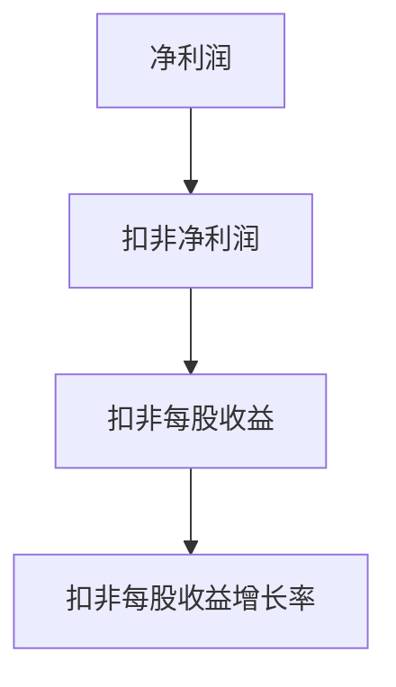

                 

# 10年扣非每股收益增长率的意义

## 关键词：
- 扣非每股收益
- 每股收益增长率
- 非经常性损益
- 投资决策
- 财务分析

## 摘要：
扣非每股收益增长率是衡量企业盈利能力的重要财务指标，通过扣除非经常性损益，能够更准确地反映企业的持续盈利能力。本文将详细探讨扣非每股收益增长率的定义、计算方法、意义及其在投资决策中的应用。通过分析其背后的核心概念、算法原理和系统架构，帮助读者深入理解这一指标的重要性。

---

# 第一部分: 扣非每股收益增长率的背景与意义

## 第1章: 扣非每股收益增长率的定义与背景

### 1.1 扣非每股收益的定义
#### 1.1.1 什么是扣非每股收益
扣非每股收益是指在计算每股收益时，扣除企业非经常性损益后的结果。其公式为：
$$
\text{扣非每股收益} = \frac{\text{净利润} - \text{非经常性损益}}{\text{总股本}}
$$

#### 1.1.2 扣非每股收益的计算公式
扣非每股收益的计算需要考虑以下几个步骤：
1. 计算净利润。
2. 扣除非经常性损益。
3. 将结果除以总股本。

#### 1.1.3 扣非每股收益与净利润的关系
净利润是企业整体盈利能力的体现，而扣非每股收益则更关注企业的核心业务盈利能力。两者的关系可以通过以下公式表示：
$$
\text{扣非每股收益} = \text{每股收益} - \frac{\text{非经常性损益}}{\text{总股本}}
$$

### 1.2 扣非每股收益增长率的意义
#### 1.2.1 为什么需要关注扣非每股收益增长率
扣非每股收益增长率能够帮助投资者更准确地评估企业的持续盈利能力，因为它排除了非经常性损益的干扰。

#### 1.2.2 扣非每股收益增长率在投资分析中的作用
扣非每股收益增长率是评估企业成长性和投资价值的重要指标。它能够帮助投资者识别企业的核心业务盈利能力。

#### 1.2.3 扣非每股收益增长率与企业价值的关系
扣非每股收益增长率越高，企业的核心业务盈利能力越强，企业价值也越高。

### 1.3 扣非每股收益增长率的计算方法
#### 1.3.1 扣非每股收益增长率的公式
扣非每股收益增长率的计算公式为：
$$
\text{扣非每股收益增长率} = \frac{\text{今年扣非每股收益} - \text{去年扣非每股收益}}{\text{去年扣非每股收益}} \times 100\%
$$

#### 1.3.2 扣非每股收益增长率的计算步骤
1. 计算今年和去年的扣非每股收益。
2. 计算两者的差值。
3. 将差值除以去年的扣非每股收益，并乘以100%得到增长率。

#### 1.3.3 扣非每股收益增长率与ROE的对比
ROE（净资产收益率）是衡量企业盈利能力的另一个重要指标，但与扣非每股收益增长率不同，ROE关注的是资产回报率。

### 1.4 扣非每股收益增长率的边界与外延
#### 1.4.1 扣非每股收益增长率的适用范围
扣非每股收益增长率适用于分析企业的核心业务盈利能力，尤其适合排除一次性收益或损失的影响。

#### 1.4.2 扣非每股收益增长率的局限性
扣非每股收益增长率并不能完全反映企业的财务状况，因为它只考虑了核心业务的盈利能力。

#### 1.4.3 扣非每股收益增长率与其他财务指标的关系
扣非每股收益增长率与ROE、净利润增长率等指标密切相关。

### 1.5 本章小结
本章详细介绍了扣非每股收益的定义、计算方法及其在投资分析中的意义。通过分析其与净利润的关系，帮助读者理解扣非每股收益增长率的重要性。

---

# 第二部分: 扣非每股收益增长率的核心概念与联系

## 第2章: 扣非每股收益增长率的核心原理

### 2.1 扣非每股收益增长率的公式推导
#### 2.1.1 净利润与非经常性损益的关系
净利润是企业整体盈利能力的体现，而非经常性损益是企业一次性或偶然性的收益或损失。

#### 2.1.2 扣非净利润的计算公式
$$
\text{扣非净利润} = \text{净利润} - \text{非经常性损益}
$$

#### 2.1.3 扣非每股收益增长率的数学模型
$$
\text{扣非每股收益增长率} = \frac{\text{今年扣非每股收益} - \text{去年扣非每股收益}}{\text{去年扣非每股收益}} \times 100\%
$$

### 2.2 扣非每股收益增长率的属性特征对比
#### 2.2.1 经常性损益与非经常性损益的对比
经常性损益是指企业正常经营活动中产生的损益，而非经常性损益是一次性或偶然性的损益。

#### 2.2.2 扣非每股收益与每股收益的对比
扣非每股收益更关注企业的核心业务盈利能力，而每股收益包括了非经常性损益的影响。

#### 2.2.3 扣非每股收益增长率与净利润增长率的对比
扣非每股收益增长率只考虑核心业务的盈利能力，而净利润增长率包括了非经常性损益的影响。

### 2.3 扣非每股收益增长率的ER实体关系图

### 2.4 本章小结
本章通过公式推导和属性对比，深入分析了扣非每股收益增长率的核心原理及其与相关财务指标的关系。

---

# 第三部

