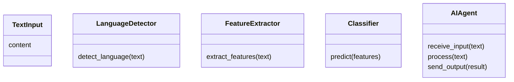
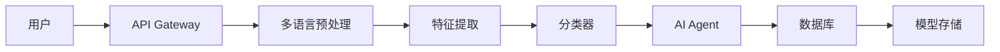

                 


# 开发AI Agent的多语言文本分类器

> 关键词：AI Agent，多语言文本分类器，自然语言处理，机器学习，深度学习

> 摘要：本文将详细探讨如何开发一个基于AI Agent的多语言文本分类器。通过分析问题背景、核心概念、算法原理、系统架构设计以及项目实战，本文旨在为开发者提供从理论到实践的全面指导，帮助他们构建一个高效、准确的多语言文本分类系统。

---

# 目录

1. [引言](#引言)
   1.1 问题背景
   1.2 问题描述
   1.3 解决方案

2. [核心概念与原理](#核心概念与原理)
   2.1 多语言文本分类的核心概念
   2.2 AI Agent的定义与作用
   2.3 系统架构的初步设计

3. [算法原理与数学模型](#算法原理与数学模型)
   3.1 分类算法的数学模型
   3.2 多语言模型的训练机制
   3.3 AI Agent的决策逻辑

4. [系统架构设计](#系统架构设计)
   4.1 问题场景介绍
   4.2 领域模型设计
   4.3 系统架构图

5. [项目实战](#项目实战)
   5.1 环境安装与配置
   5.2 代码实现
   5.3 案例分析

6. [最佳实践与注意事项](#最佳实践与注意事项)
   6.1 开发中的常见问题与解决方案
   6.2 性能优化建议
   6.3 部署与维护

7. [小结](#小结)
   7.1 主要内容回顾
   7.2 未来研究方向

---

# 引言

在当前人工智能快速发展的背景下，多语言文本分类器在实际应用中扮演着越来越重要的角色。然而，由于语言的多样性和复杂性，构建一个高效、准确的多语言文本分类系统仍然面临诸多挑战。本文将从AI Agent的角度出发，探讨如何解决这些问题，为开发者提供一个系统化的解决方案。

---

# 核心概念与原理

## 2.1 多语言文本分类的核心概念

多语言文本分类指的是对多种语言的文本进行分类的过程。与单语言分类相比，多语言分类需要处理不同语言之间的语义差异和语法结构，这使得问题更加复杂。以下是多语言文本分类的核心概念：

1. **跨语言理解**：在不同语言之间建立语义联系，实现统一的分类标准。
2. **语言无关性**：分类器应尽量减少对特定语言的依赖，以提高通用性。
3. **数据多样性**：多语言数据通常来自不同的语料库，需要考虑数据的平衡性和代表性。

## 2.2 AI Agent的定义与作用

AI Agent（智能体）是一种能够感知环境、自主决策并执行任务的实体。在多语言文本分类器中，AI Agent主要负责以下任务：

1. **输入处理**：接收多种语言的文本输入，并进行预处理。
2. **分类决策**：基于训练好的模型，对文本进行分类。
3. **结果反馈**：将分类结果返回给用户或与其他系统交互。

## 2.3 系统架构的初步设计

以下是多语言文本分类器的初步架构设计：


---

# 算法原理与数学模型

## 3.1 分类算法的数学模型

在多语言文本分类中，常用的分类算法包括线性分类器和非线性分类器。以下是线性分类器的数学模型：

$$y = w \cdot x + b$$

其中，$w$ 是权重向量，$x$ 是输入特征向量，$b$ 是偏置项。输出$y$经过sigmoid函数处理后得到概率值：

$$p = \sigma(y) = \frac{1}{1 + e^{-y}}$$

## 3.2 多语言模型的训练机制

多语言模型通常采用迁移学习的方法，利用一种语言的预训练模型来提升其他语言的分类效果。以下是训练过程的伪代码：

```python
def train_multilingual_model():
    for lang in languages:
        load_language_data(lang)
        fine_tune_model(lang)
    evaluate_all_languages()
```

## 3.3 AI Agent的决策逻辑

AI Agent在接收多语言输入后，需要根据上下文信息进行分类决策。以下是决策逻辑的示意图：


---

# 系统架构设计

## 4.1 问题场景介绍

在实际应用中，多语言文本分类器需要处理以下场景：

1. **多语言输入**：用户可能输入多种语言的文本，需要统一处理。
2. **实时反馈**：分类结果需要快速返回，以支持实时交互。
3. **模型更新**：分类器需要定期更新以适应语言的变化和新数据的引入。

## 4.2 领域模型设计

以下是领域模型的类图设计：



## 4.3 系统架构图

以下是系统的总体架构图：



---

# 项目实战

## 5.1 环境安装与配置

以下是项目所需的环境配置：

1. **安装依赖**：
   ```bash
   pip install numpy scikit-learn transformers
   ```

2. **配置语言模型**：
   ```bash
   from transformers import AutoTokenizer, AutoModelForSequenceClassification
   ```

## 5.2 代码实现

以下是核心代码实现：

```python
import numpy as np
from sklearn.linear_model import LogisticRegression
from transformers import AutoTokenizer, AutoModelForSequenceClassification

def preprocess(text):
    # 多语言预处理逻辑
    pass

def train_classifier(train_texts, train_labels):
    # 训练分类器
    pass

def classify(text):
    # 分类逻辑
    pass

def main():
    texts = ["Hello world", "Bonjour le monde", "Hola mundo"]
    labels = [0, 0, 1]
    train_classifier(texts, labels)
    for text in texts:
        print(classify(text))

if __name__ == "__main__":
    main()
```

## 5.3 案例分析

以下是实际案例分析：

1. **输入文本**：多种语言的文本。
2. **预处理**：去除停用词、分词处理。
3. **特征提取**：使用词袋模型或TF-IDF。
4. **分类**：使用训练好的模型进行分类。
5. **输出结果**：返回分类结果和概率。

---

# 最佳实践与注意事项

## 6.1 开发中的常见问题与解决方案

1. **数据不平衡**：采用过采样或欠采样技术。
2. **计算资源不足**：使用分布式训练或优化模型大小。
3. **模型过拟合**：采用交叉验证和正则化方法。

## 6.2 性能优化建议

1. **模型优化**：使用预训练模型进行微调。
2. **特征工程**：提取更有区分度的特征。
3. **并行计算**：利用多线程或多进程加速训练。

## 6.3 部署与维护

1. **容器化部署**：使用Docker进行服务部署。
2. **监控与日志**：实时监控服务状态和性能。
3. **持续更新**：定期更新模型和优化算法。

---

# 小结

本文详细探讨了开发AI Agent的多语言文本分类器的各个方面，从问题背景到系统架构设计，再到项目实战，为开发者提供了一个完整的解决方案。通过本文的指导，读者可以深入了解多语言文本分类的核心概念、算法原理和系统设计，并能够实际操作实现一个高效的分类器。

---

# 作者

作者：AI天才研究院/AI Genius Institute & 禅与计算机程序设计艺术 /Zen And The Art of Computer Programming

