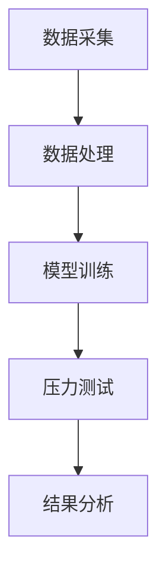
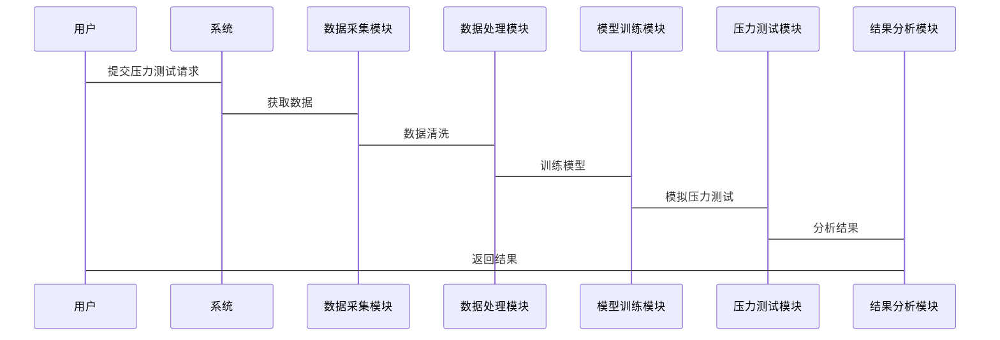

                 


# 开发智能化的供应链金融信用网络抗压能力分析模型

**关键词**：供应链金融，信用网络，抗压能力分析，智能化模型，系统架构设计，算法实现

**摘要**：供应链金融作为现代经济体系的重要组成部分，其信用网络的抗压能力直接影响着供应链的整体稳定性和运营效率。本文将从供应链金融的背景出发，深入探讨信用网络抗压能力分析模型的构建方法，结合智能化技术，提出一种基于深度学习的供应链金融信用网络抗压能力分析模型，并通过实际案例分析验证模型的有效性。文章详细阐述了模型的核心概念、算法原理、系统架构设计以及项目实战，为供应链金融领域的智能化发展提供了理论支持和实践指导。

---

# 第1章: 供应链金融与信用网络概述

## 1.1 供应链金融的定义与特点
### 1.1.1 供应链金融的定义
供应链金融是指通过整合供应链上下游企业之间的资金流、物流和信息流，为核心企业提供融资支持的一种金融模式。其特点包括**系统性**、**协同性**和**高效性**。

### 1.1.2 供应链金融的核心特点
- **系统性**：供应链金融不仅仅是单个企业的融资行为，而是整个供应链体系的协同运作。
- **协同性**：供应链金融需要供应链上下游企业之间的紧密合作，形成协同效应。
- **高效性**：通过技术手段（如区块链、人工智能）提高融资效率，降低交易成本。

### 1.1.3 供应链金融在现代经济中的作用
供应链金融能够有效缓解中小企业的融资难问题，优化供应链的资金流，提升供应链的整体竞争力。

## 1.2 信用网络的基本概念
### 1.2.1 信用网络的定义
信用网络是指由供应链中的企业、金融机构、消费者等多方参与者构成的信用关系网络，是供应链金融的重要组成部分。

### 1.2.2 信用网络的主要特征
- **复杂性**：信用网络涉及多方参与者，关系复杂。
- **动态性**：信用关系会随着市场环境和企业经营状况的变化而动态调整。
- **风险性**：信用网络中存在信用风险，需要通过模型进行评估和管理。

### 1.2.3 信用网络与供应链的关系
信用网络是供应链金融的核心基础设施，供应链金融的运行依赖于信用网络的稳定性和安全性。

## 1.3 供应链金融中的信用风险
### 1.3.1 信用风险的定义
信用风险是指由于供应链中的某一方无法履行其信用义务而导致的损失风险。

### 1.3.2 供应链金融中的信用风险来源
- **企业经营风险**：企业自身经营状况恶化，导致无法履行还款义务。
- **市场风险**：市场价格波动影响企业的偿债能力。
- **信息不对称**：供应链上下游企业之间信息不透明，导致信用风险难以评估。

### 1.3.3 信用风险对供应链的影响
信用风险可能导致供应链中断，影响供应链的整体稳定性和运营效率。

## 1.4 抗压能力分析模型的必要性
### 1.4.1 抗压能力分析模型的定义
抗压能力分析模型是一种用于评估供应链金融信用网络在面对外部压力时的稳定性和抗风险能力的模型。

### 1.4.2 抗压能力分析模型的目标
- **评估信用网络的稳定性**：通过模型分析信用网络在不同压力下的表现，评估其抗压能力。
- **优化信用网络结构**：根据模型分析结果，优化信用网络结构，降低信用风险。
- **支持决策制定**：为企业和金融机构提供数据支持，帮助其制定更科学的信用管理策略。

### 1.4.3 智能化供应链金融信用网络抗压能力分析模型的意义
智能化模型通过引入人工智能和大数据技术，能够更精准地评估信用网络的抗压能力，为供应链金融的智能化发展提供技术支持。

## 1.5 本章小结
本章从供应链金融和信用网络的基本概念出发，分析了供应链金融中的信用风险及其对供应链的影响，提出了抗压能力分析模型的必要性，并阐述了智能化模型的意义。

---

# 第2章: 供应链金融信用网络抗压能力分析模型的背景与问题

## 2.1 当前供应链金融面临的挑战
### 2.1.1 供应链金融中的信用风险问题
供应链金融中的信用风险主要来源于信息不对称、企业经营不稳定以及市场波动等因素。

### 2.1.2 数字化转型对供应链金融的影响
随着数字化技术的快速发展，供应链金融也在逐步向智能化方向转型，但技术的引入也带来了新的挑战。

### 2.1.3 智能化技术在供应链金融中的应用
人工智能、区块链、大数据等技术在供应链金融中的应用，提高了融资效率，但也需要解决技术与业务结合的问题。

## 2.2 信用网络抗压能力分析模型的提出
### 2.2.1 问题背景
供应链金融中的信用网络存在复杂性和动态性，传统的信用评估方法难以应对日益复杂的信用风险。

### 2.2.2 问题描述
信用网络中的信用风险可能导致供应链中断，影响企业的正常运营。如何通过模型评估和优化信用网络的抗压能力，成为当前供应链金融领域的重要课题。

### 2.2.3 问题解决思路
通过构建智能化的抗压能力分析模型，利用大数据和人工智能技术，实时评估信用网络的稳定性，优化信用网络结构，降低信用风险。

## 2.3 模型的边界与外延
### 2.3.1 模型的边界
模型的边界包括供应链金融中的核心企业、上下游企业和金融机构。

### 2.3.2 模型的外延
模型的外延包括信用网络中的信息流、资金流和物流，以及外部市场环境的变化。

### 2.3.3 模型与相关领域的联系
模型与供应链管理、信用评估、风险管理等领域密切相关。

## 2.4 模型的核心要素组成
### 2.4.1 数据来源
- 企业经营数据
- 市场数据
- 信用历史数据

### 2.4.2 数据处理
- 数据清洗
- 数据整合
- 数据分析

### 2.4.3 模型构建
- 智能化算法
- 信用网络结构分析
- 抗压能力评估

## 2.5 本章小结
本章分析了供应链金融面临的挑战，提出了抗压能力分析模型的必要性，并详细阐述了模型的边界、外延和核心要素组成。

---

# 第3章: 供应链金融信用网络抗压能力分析模型的核心概念与联系

## 3.1 核心概念原理
### 3.1.1 供应链金融的核心概念
供应链金融通过整合供应链上下游企业的资金流、物流和信息流，为核心企业提供融资支持。

### 3.1.2 信用网络的核心概念
信用网络是由供应链中的企业、金融机构和消费者构成的信用关系网络，是供应链金融的重要基础设施。

### 3.1.3 抗压能力分析模型的核心概念
抗压能力分析模型通过评估信用网络在不同压力下的表现，优化信用网络结构，降低信用风险。

## 3.2 核心概念的属性特征对比
### 3.2.1 供应链金融的属性特征
- 系统性
- 协同性
- 高效性

### 3.2.2 信用网络的属性特征
- 复杂性
- 动态性
- 风险性

### 3.2.3 抗压能力分析模型的属性特征
- 精准性
- 实时性
- 可扩展性

## 3.3 ER实体关系图架构

```mermaid
er
    actor 供应链金融参与者
    actor 信用网络参与者
    actor 抗压能力分析模型
    actor 供应链金融数据

    供应链金融参与者 --> 信用网络参与者
    信用网络参与者 --> 抗压能力分析模型
    抗压能力分析模型 --> 供应链金融数据
```

---

# 第4章: 供应链金融信用网络抗压能力分析模型的算法原理

## 4.1 模型的核心算法
### 4.1.1 智能化算法的选择
采用基于深度学习的图神经网络算法，用于分析信用网络的结构和关系。

### 4.1.2 算法流程
1. 数据预处理：清洗、整合和标注数据。
2. 模型训练：利用图神经网络对信用网络进行建模。
3. 抗压能力评估：通过模拟压力测试，评估信用网络的稳定性。

## 4.2 算法的数学模型

$$
\text{抗压能力} = f(\text{信用网络结构}, \text{外部压力})
$$

其中，函数 \( f \) 是基于图神经网络的模型，用于评估信用网络在不同压力下的抗压能力。

## 4.3 算法实现
### 4.3.1 数据预处理
```python
import pandas as pd
import numpy as np

# 数据清洗
data = pd.read_csv('supply_chain_data.csv')
data.dropna(inplace=True)
```

### 4.3.2 模型训练
```python
import tensorflow as tf
from tensorflow.keras import layers

# 图神经网络模型
class GNNModel(tf.keras.Model):
    def __init__(self):
        super(GNNModel, self).__init__()
        self.graph_layer = layers.GRU(64)
        self.dense_layer = layers.Dense(1, activation='sigmoid')

    def call(self, inputs):
        graph_embeddings = self.graph_layer(inputs)
        output = self.dense_layer(graph_embeddings)
        return output

model = GNNModel()
model.compile(optimizer='adam', loss='binary_crossentropy')
```

### 4.3.3 压力测试模拟
```python
# 模拟压力测试
def simulate_pressure(test_cases):
    results = []
    for case in test_cases:
        result = model.predict(case)
        results.append(result)
    return results

test_cases = [...]  # 压力测试用例
results = simulate_pressure(test_cases)
```

## 4.4 算法优化
### 4.4.1 模型优化策略
- 增加训练数据量
- 调整模型超参数
- 引入实时数据流

### 4.4.2 模型评估指标
- 准确率
- 召回率
- F1分数

## 4.5 本章小结
本章详细介绍了抗压能力分析模型的核心算法，包括算法原理、数学模型和实现代码，并通过压力测试模拟展示了模型的应用。

---

# 第5章: 供应链金融信用网络抗压能力分析模型的系统架构设计

## 5.1 系统功能设计
### 5.1.1 系统功能模块
- 数据采集模块
- 数据处理模块
- 模型训练模块
- 压力测试模块
- 结果分析模块

### 5.1.2 功能模块的交互流程


## 5.2 系统架构设计
### 5.2.1 系统架构图


### 5.2.2 系统接口设计
- 数据接口：数据采集模块与数据处理模块之间的接口。
- 模型接口：模型训练模块与压力测试模块之间的接口。
- 结果接口：结果分析模块与用户界面之间的接口。

## 5.3 系统交互设计
### 5.3.1 系统交互流程


## 5.4 本章小结
本章详细设计了抗压能力分析模型的系统架构，包括功能模块、接口设计和交互流程，为系统的实际应用提供了指导。

---

# 第6章: 供应链金融信用网络抗压能力分析模型的项目实战

## 6.1 环境安装与配置
### 6.1.1 环境要求
- Python 3.6+
- TensorFlow 2.0+
- Pandas 1.0+
- Mermaid图生成工具

### 6.1.2 安装依赖
```bash
pip install numpy pandas tensorflow mermaid
```

## 6.2 系统核心实现
### 6.2.1 数据预处理
```python
import pandas as pd
import numpy as np

data = pd.read_csv('supply_chain_data.csv')
data.dropna(inplace=True)
```

### 6.2.2 模型训练
```python
import tensorflow as tf
from tensorflow.keras import layers

class GNNModel(tf.keras.Model):
    def __init__(self):
        super(GNNModel, self).__init__()
        self.graph_layer = layers.GRU(64)
        self.dense_layer = layers.Dense(1, activation='sigmoid')

    def call(self, inputs):
        graph_embeddings = self.graph_layer(inputs)
        output = self.dense_layer(graph_embeddings)
        return output

model = GNNModel()
model.compile(optimizer='adam', loss='binary_crossentropy')
```

### 6.2.3 压力测试
```python
def simulate_pressure(test_cases):
    results = []
    for case in test_cases:
        result = model.predict(case)
        results.append(result)
    return results

test_cases = [...]  # 压力测试用例
results = simulate_pressure(test_cases)
```

## 6.3 代码应用解读与分析
### 6.3.1 数据预处理解读
数据预处理模块负责清洗和整合数据，确保模型输入数据的质量。

### 6.3.2 模型训练解读
图神经网络模型用于分析信用网络的结构和关系，预测信用网络的抗压能力。

### 6.3.3 压力测试解读
压力测试模块通过模拟不同的压力场景，评估信用网络的稳定性。

## 6.4 实际案例分析
### 6.4.1 案例背景
某供应链金融企业面临信用网络抗压能力不足的问题，希望通过模型优化信用网络结构。

### 6.4.2 数据分析
通过对历史数据的分析，发现某些节点的信用风险较高，需要重点优化。

### 6.4.3 模型应用
利用模型对信用网络进行压力测试，发现关键节点的脆弱性，并提出优化建议。

## 6.5 本章小结
本章通过实际案例展示了抗压能力分析模型的应用，验证了模型的有效性和实用性。

---

# 第7章: 供应链金融信用网络抗压能力分析模型的最佳实践

## 7.1 最佳实践 tips
### 7.1.1 数据质量管理
确保数据的准确性和完整性，是模型应用的前提。

### 7.1.2 模型优化建议
- 定期更新模型参数
- 引入实时数据流
- 加强模型的可解释性

### 7.1.3 系统维护建议
- 定期备份数据
- 监控系统运行状态
- 及时修复系统漏洞

## 7.2 小结
抗压能力分析模型的应用能够有效降低供应链金融中的信用风险，优化信用网络结构，提高供应链的整体抗压能力。

## 7.3 注意事项
- 模型的应用需要结合实际业务场景
- 数据隐私和安全问题需要重点关注
- 模型的优化需要持续投入和维护

## 7.4 拓展阅读
- 供应链金融领域的最新研究
- 图神经网络在信用评估中的应用
- 人工智能技术在金融领域的创新应用

---

# 作者：AI天才研究院/AI Genius Institute & 禅与计算机程序设计艺术 /Zen And The Art of Computer Programming

---

**摘要**：本文详细介绍了供应链金融信用网络抗压能力分析模型的开发过程，从模型的核心概念到算法实现，再到系统架构设计和项目实战，为供应链金融的智能化发展提供了理论支持和实践指导。

