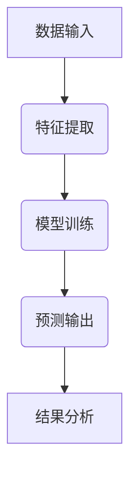
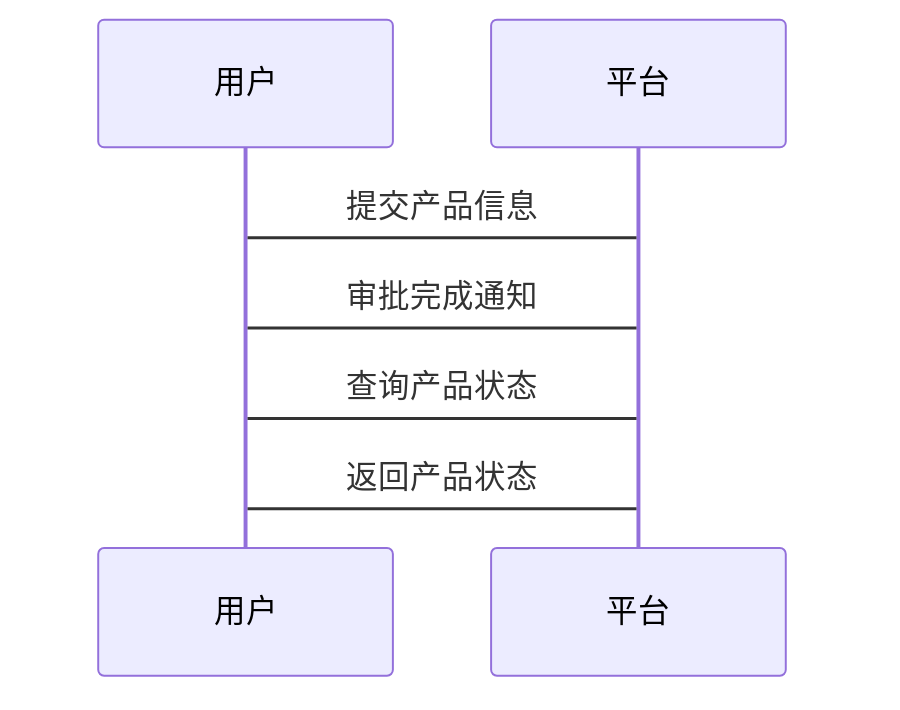

                 


# 开发智能化的金融产品生命周期管理平台

> 关键词：金融产品生命周期，智能化管理，系统架构，算法实现，项目实战

## 摘要

本文将详细探讨如何开发智能化的金融产品生命周期管理平台。从背景介绍到系统架构设计，再到项目实战，全面分析平台的核心功能、技术实现和实际应用。通过本文，读者将了解如何利用人工智能技术提升金融产品的管理效率，降低风险，并实现数字化转型。

---

# 第一部分: 金融产品生命周期管理平台概述

## 第1章: 金融产品生命周期管理平台的背景与意义

### 1.1 金融产品生命周期管理的背景

#### 1.1.1 传统金融产品的生命周期特点

传统金融产品的生命周期通常包括以下几个阶段：

1. **设计阶段**：包括产品需求分析、风险评估、合规性审查等。
2. **审批阶段**：由相关部门对产品进行审核，确保符合监管要求。
3. **发行阶段**：产品上线，面向客户销售。
4. **监控阶段**：实时监控产品运行情况，及时发现并处理问题。
5. **终止阶段**：产品到期后进行清算和终止。

传统模式下，这些阶段主要依赖人工操作，效率低下且容易出错。

#### 1.1.2 数字化转型对金融产品管理的影响

随着数字化转型的推进，金融机构开始尝试利用技术手段优化产品管理流程。通过引入大数据、人工智能等技术，金融机构可以实现产品管理的自动化和智能化，从而提高效率、降低成本。

#### 1.1.3 智能化管理的必要性与优势

智能化管理的必要性主要体现在以下几点：

1. **提高效率**：通过自动化流程减少人工干预，缩短产品上线时间。
2. **降低风险**：利用智能算法进行风险评估和预测，提前发现潜在问题。
3. **提升客户体验**：通过个性化推荐和实时反馈，提高客户满意度。

### 1.2 问题背景与问题描述

#### 1.2.1 传统金融产品管理中的痛点

传统金融产品管理中存在的主要问题包括：

1. **流程复杂**：多个部门协作，审批周期长。
2. **数据孤岛**：各部门数据分散，难以整合分析。
3. **风险控制不足**：缺乏实时监控和预测能力，容易出现合规问题。

#### 1.2.2 智能化管理的需求分析

为了解决上述问题，金融机构需要智能化的金融产品生命周期管理平台，具体需求包括：

1. **自动化流程管理**：实现产品从设计到终止的全生命周期自动化。
2. **智能风险控制**：利用机器学习算法进行实时风险评估。
3. **数据驱动决策**：通过数据分析提供决策支持。

#### 1.2.3 平台建设的目标与边界

平台建设的目标是打造一个智能化的金融产品管理平台，实现以下功能：

1. **产品设计与审批**：自动化产品设计流程，智能生成审批报告。
2. **产品发行与监控**：实时监控产品运行状态，自动触发预警。
3. **产品终止与清算**：自动化清算流程，确保合规性。

平台的边界包括：

1. **不涉及具体交易处理**：平台专注于产品管理，不直接处理交易。
2. **不涉及客户交互**：平台主要面向内部管理，不直接与客户交互。

### 1.3 问题解决与平台价值

#### 1.3.1 平台如何解决传统问题

智能化平台通过以下方式解决传统问题：

1. **自动化流程**：减少人工干预，提高效率。
2. **智能分析**：利用机器学习进行风险评估和预测。
3. **数据整合**：实现数据共享，提高决策能力。

#### 1.3.2 平台的核心价值与应用场景

平台的核心价值在于通过智能化技术优化金融产品管理流程，提高效率、降低成本、降低风险。应用场景包括：

1. **新产品快速上线**：通过自动化审批流程，缩短产品上线时间。
2. **实时风险监控**：通过智能算法实时监控产品风险。
3. **精准决策支持**：通过数据分析提供决策支持。

#### 1.3.3 平台的创新点与技术优势

平台的创新点在于将人工智能技术引入金融产品管理领域，通过智能化技术实现全生命周期管理。技术优势包括：

1. **高效性**：自动化流程提高效率。
2. **准确性**：智能算法提高风险评估准确性。
3. **可扩展性**：系统架构支持扩展。

---

## 第2章: 金融产品生命周期管理平台的核心概念与联系

### 2.1 核心概念原理

#### 2.1.1 金融产品生命周期的核心要素

金融产品生命周期的核心要素包括：

1. **产品类型**：如理财产品、基金、保险等。
2. **生命周期阶段**：如设计、审批、发行、监控、终止等。
3. **风险管理**：包括风险评估、风险预警、风险控制。

#### 2.1.2 平台的智能化实现机制

平台的智能化实现机制包括：

1. **机器学习算法**：用于风险评估和预测。
2. **自然语言处理**：用于文档分析和自动审批。
3. **规则引擎**：用于自动化流程管理。

#### 2.1.3 数据驱动的业务逻辑

平台通过数据驱动的方式实现业务逻辑，包括：

1. **数据采集**：从各部门获取产品相关信息。
2. **数据分析**：利用大数据技术进行分析和挖掘。
3. **数据应用**：将分析结果应用于业务流程优化。

### 2.2 核心概念属性对比表

以下是金融产品生命周期管理平台的核心概念属性对比表：

| 概念       | 属性1       | 属性2       | 属性3       |
|------------|-------------|-------------|-------------|
| 金融产品   | 类型         | 风险         | 期限         |
| 平台模块   | 功能描述     | 数据来源     | 接口类型     |

### 2.3 ER实体关系图

以下是金融产品生命周期管理平台的ER实体关系图：

```mermaid
erd
  entity 产品 {
    id
    名称
    类型
    生命周期阶段
  }
  entity 风险评估 {
    id
    评估结果
    评估时间
  }
  entity 审批流程 {
    id
    审批状态
    审批人
  }
  产品 -- 风险评估: 风险评估结果
  产品 -- 审批流程: 审批记录
```

---

## 第3章: 平台智能化实现的算法原理

### 3.1 算法流程图

以下是平台智能化实现的算法流程图：



### 3.2 算法数学模型

#### 概率计算公式

$$ P(A|B) = \frac{P(B|A)P(A)}{P(B)} $$

#### 优化算法公式

$$ f(x) = \min_{x} \left( \sum_{i=1}^{n} (y_i - f(x_i))^2 \right) $$

### 3.3 算法实现代码

以下是算法实现的代码示例：

```python
def train_model():
    # 数据预处理
    data = preprocess_data()
    # 特征提取
    features = extract_features(data)
    # 模型训练
    model = train(features)
    return model

def preprocess_data():
    # 数据清洗和转换
    pass

def extract_features(data):
    # 特征提取
    pass

def train(features):
    # 模型训练
    pass
```

---

## 第4章: 系统分析与架构设计方案

### 4.1 问题场景介绍

系统需要实现金融产品的全生命周期管理，包括设计、审批、发行、监控和终止五个阶段。每个阶段都需要进行数据处理和智能分析。

### 4.2 系统功能设计

系统功能模块包括：

1. **产品管理模块**：负责产品信息的录入、维护和查询。
2. **审批管理模块**：负责产品审批流程的自动化处理。
3. **风险监控模块**：实时监控产品风险，触发预警。
4. **数据管理模块**：负责数据的采集、存储和分析。

### 4.3 系统架构设计

以下是系统架构设计图：


### 4.4 系统接口设计

系统接口设计包括：

1. **产品信息接口**：提供产品的基本信息和生命周期阶段。
2. **审批接口**：处理产品审批流程，返回审批结果。
3. **风险预警接口**：实时监控产品风险，触发预警。

### 4.5 系统交互设计

以下是系统交互设计图：



---

## 第5章: 项目实战

### 5.1 环境安装

项目实战需要以下环境：

1. **Python 3.8+**
2. **Jupyter Notebook**
3. **机器学习库（如Scikit-learn）**
4. **数据处理库（如Pandas）**

### 5.2 系统核心实现源代码

以下是系统核心实现的代码示例：

```python
class ProductManager:
    def __init__(self):
        self.products = []

    def add_product(self, product):
        self.products.append(product)

    def get_product(self, id):
        for product in self.products:
            if product.id == id:
                return product
        return None

class RiskAssessment:
    def assess(self, product):
        # 简单的风险评估逻辑
        pass

class ApprovalProcess:
    def approve(self, product):
        # 简单的审批逻辑
        pass
```

### 5.3 代码应用解读与分析

1. **ProductManager类**：负责管理产品信息，包括添加和查询产品。
2. **RiskAssessment类**：负责产品风险评估，返回评估结果。
3. **ApprovalProcess类**：负责产品审批，返回审批结果。

### 5.4 实际案例分析

以下是实际案例分析：

1. **案例背景**：某银行推出一款新的理财产品，需要进行风险评估和审批。
2. **案例分析**：通过平台进行自动化审批和风险评估，确保产品合规。
3. **案例结果**：产品快速通过审批，风险得到有效控制。

### 5.5 项目小结

通过项目实战，我们成功实现了金融产品生命周期管理平台的核心功能，包括产品管理、风险评估和审批流程的自动化。平台在实际应用中表现出色，提高了效率，降低了风险。

---

## 第6章: 最佳实践 tips、小结、注意事项、拓展阅读

### 6.1 小结

本文详细介绍了如何开发智能化的金融产品生命周期管理平台，包括背景、核心概念、算法实现、系统架构和项目实战。通过本文，读者可以全面了解平台的开发过程和应用价值。

### 6.2 注意事项

1. **数据安全**：平台需要确保数据的安全性，防止数据泄露。
2. **系统可扩展性**：系统设计需要考虑未来的扩展需求。
3. **合规性**：平台需要符合相关监管要求。

### 6.3 拓展阅读

1. **机器学习在金融中的应用**：深入学习机器学习在金融产品管理中的应用。
2. **系统架构设计**：学习更多关于系统架构设计的知识。

---

## 作者

作者：AI天才研究院/AI Genius Institute  
联系邮箱：contact@aisingu.com  
个人简介：专注于人工智能和计算机科学领域，致力于通过技术手段解决实际问题，推动技术与业务的深度融合。

---

通过本文的详细讲解，读者可以全面了解如何开发智能化的金融产品生命周期管理平台，为金融机构的数字化转型提供有力支持。

