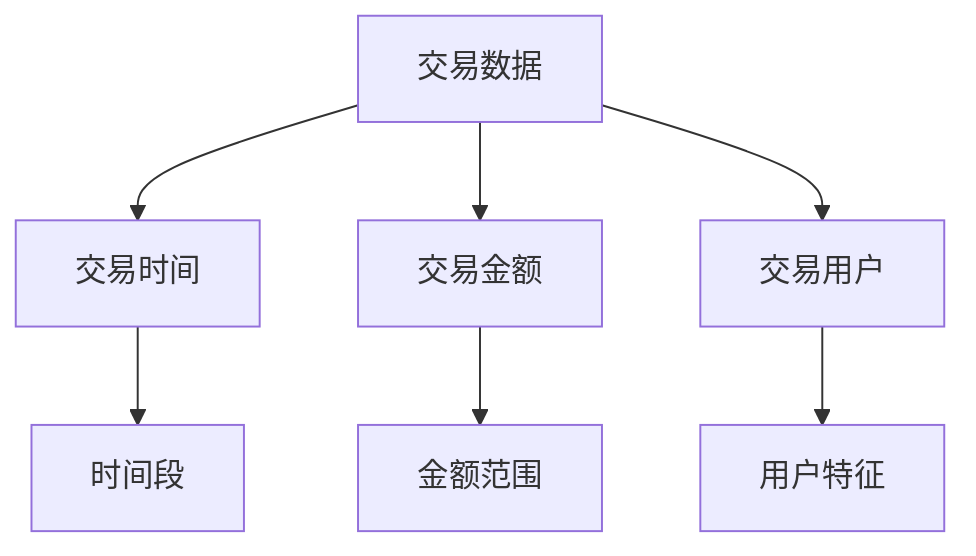
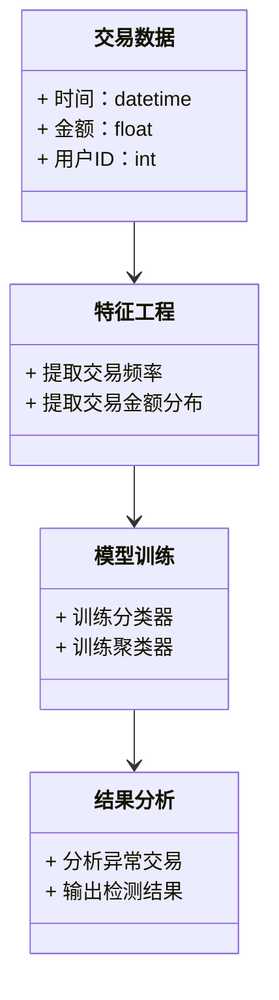
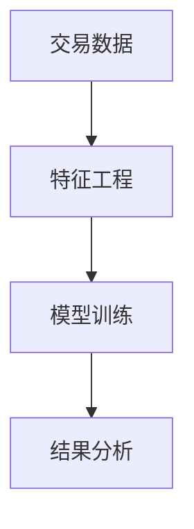

                 


# 开发智能化的金融市场异常交易检测模型

> 关键词：金融市场，异常交易，检测模型，机器学习，深度学习

> 摘要：本文详细探讨了开发智能化的金融市场异常交易检测模型的关键技术与实现方法。从金融市场的背景与挑战出发，分析了异常交易检测的重要性及其核心要素。随后，深入讲解了基于机器学习和深度学习的算法原理，并结合实际案例，详细阐述了系统的架构设计与实现。最后，通过项目实战与最佳实践，总结了开发智能化异常交易检测模型的经验与注意事项。

---

# 第一部分: 金融市场异常交易检测背景与概念

## 第1章: 异常交易检测模型的背景与问题

### 1.1 金融市场的现状与挑战

#### 1.1.1 金融市场的基本概念
金融市场是一个复杂的生态系统，参与者包括个人投资者、机构投资者、经纪商、交易所等。市场的核心功能是资金的融通和资产的定价，而这些功能的实现依赖于交易的正常进行。然而，金融市场也面临着许多挑战，其中异常交易是一个重要的问题。

#### 1.1.2 金融市场中的异常交易现象
异常交易指的是偏离正常市场行为的交易活动，可能表现为价格剧烈波动、交易量突增、订单异常集中等。异常交易可能由市场操纵、欺诈行为、技术故障等多种原因引起。

#### 1.1.3 异常交易对市场的影响
异常交易可能导致市场波动加剧、投资者信心下降、市场流动性不足等问题。例如，市场操纵可能扭曲资产价格，损害中小投资者的利益；欺诈行为可能导致交易数据失真，影响市场决策。

### 1.2 异常交易检测模型的定义与目标

#### 1.2.1 异常交易检测的定义
异常交易检测是指通过分析交易数据，识别出与正常交易模式不符的异常交易行为。其目标是及时发现并阻止异常交易，维护市场的公平与稳定。

#### 1.2.2 异常交易检测模型的目标
- 识别潜在的异常交易行为。
- 提供实时或近实时的检测结果。
- 支持监管机构或金融机构采取相应措施。

#### 1.2.3 异常交易检测的边界与外延
异常交易检测的边界在于如何定义“正常”与“异常”的交易行为。外延则包括从单个交易行为的检测到整体交易模式的分析。

### 1.3 异常交易检测的核心要素

#### 1.3.1 数据特征
- 交易时间间隔。
- 交易金额。
- 交易频率。
- 交易用户的特征（如身份、行为模式）。

#### 1.3.2 模型特征
- 检测算法的类型（如监督学习、无监督学习）。
- 模型的训练数据来源。
- 模型的可解释性。

#### 1.3.3 评价指标
- 真正正类率（True Positive Rate, TPR）。
- 真正负类率（True Negative Rate, TNR）。
- 准确率（Accuracy）。
- 召回率（Recall）。

### 1.4 本章小结
本章从金融市场的背景出发，介绍了异常交易的现象及其对市场的影响，定义了异常交易检测模型的目标与核心要素，为后续内容奠定了基础。

---

## 第2章: 异常交易检测的核心概念

### 2.1 异常交易检测的原理

#### 2.1.1 数据预处理
- 数据清洗：去除噪声数据。
- 数据标准化：将数据转换为统一的格式。

#### 2.1.2 特征提取
- 时间序列特征：如最大值、最小值、平均值。
- 用户行为特征：如交易频率、交易金额的分布。

#### 2.1.3 模型训练与评估
- 使用训练数据训练模型。
- 使用测试数据评估模型的性能。

### 2.2 异常交易检测的关键技术

#### 2.2.1 监督学习
- 使用已标注的数据进行训练，模型学习正常与异常交易的特征。

#### 2.2.2 无监督学习
- 无需标注数据，通过聚类等技术发现异常模式。

#### 2.2.3 强化学习
- 通过与环境的交互，学习最优的交易策略。

### 2.3 异常交易检测的对比分析

#### 2.3.1 传统统计方法与机器学习方法的对比
| 方法                | 优点                                | 缺点                                |
|---------------------|------------------------------------|------------------------------------|
| 传统统计方法        | 计算简单，易于解释                 | 对复杂模式的捕捉能力有限           |
| 机器学习方法        | 能够捕捉复杂模式                   | 计算复杂，模型解释性较差           |

#### 2.3.2 基于规则的方法与基于模型的方法的对比
| 方法                | 优点                                | 缺点                                |
|---------------------|------------------------------------|------------------------------------|
| 基于规则的方法      | 易于解释，规则明确                 | 需要手动设计规则，难以应对复杂情况 |
| 基于模型的方法      | 自动学习，适应性强                 | 模型复杂，难以解释                 |

#### 2.3.3 分类模型与聚类模型的对比
| 方法                | 优点                                | 缺点                                |
|---------------------|------------------------------------|------------------------------------|
| 分类模型            | 可以明确区分正常与异常             | 需要标注数据，难以处理无监督场景   |
| 聚类模型            | 无需标注数据，发现潜在异常         | 需要人工分析聚类结果               |

### 2.4 异常交易检测的ER实体关系图


### 2.5 本章小结
本章通过对比分析，介绍了异常交易检测的核心概念与技术，为后续的算法实现提供了理论基础。

---

## 第3章: 异常交易检测算法的原理与实现

### 3.1 监督学习算法

#### 3.1.1 分类模型
- 使用训练数据训练分类器，如随机森林、支持向量机（SVM）等。
- 代码示例：
  ```python
  from sklearn.ensemble import RandomForestClassifier
  model = RandomForestClassifier()
  model.fit(X_train, y_train)
  ```

#### 3.1.2 分类模型的数学推导
- 随机森林的分类原理基于决策树的投票机制。每个决策树对样本进行分类，最终结果由所有决策树的投票决定。

### 3.2 无监督学习算法

#### 3.2.1 聚类模型
- 使用聚类算法，如K-means、DBSCAN等，发现异常交易。
- 代码示例：
  ```python
  from sklearn.cluster import DBSCAN
  model = DBSCAN(eps=0.5, min_samples=5)
  model.fit(X)
  ```

#### 3.2.2 聚类模型的数学推导
- DBSCAN算法通过计算点之间的距离，将数据划分为不同的簇，识别出异常点。

### 3.3 强化学习算法

#### 3.3.1 强化学习模型
- 使用强化学习框架，如Q-Learning，训练模型学习最优交易策略。
- 代码示例：
  ```python
  import numpy as np
  q_table = np.zeros((n_states, n_actions))
  ```

#### 3.3.2 强化学习模型的数学推导
- Q-Learning通过更新Q值表，学习每个状态下最优的动作。

### 3.4 本章小结
本章详细介绍了监督学习、无监督学习和强化学习算法的原理与实现，为后续的系统设计提供了算法基础。

---

## 第4章: 系统分析与架构设计

### 4.1 系统功能设计

#### 4.1.1 数据采集模块
- 从交易系统中采集交易数据，如交易时间、金额、用户ID等。

#### 4.1.2 特征工程模块
- 对原始数据进行特征提取，如计算交易频率、金额分布等。

#### 4.1.3 模型训练模块
- 使用训练数据训练异常交易检测模型。

#### 4.1.4 结果分析模块
- 对模型的输出结果进行分析，识别异常交易。

### 4.2 系统架构设计

#### 4.2.1 类图


#### 4.2.2 架构图


### 4.3 本章小结
本章详细描述了系统的功能与架构设计，为后续的项目实现奠定了基础。

---

## 第5章: 项目实战与最佳实践

### 5.1 环境安装与配置

#### 5.1.1 安装Python与相关库
- 安装Python 3.8及以上版本。
- 安装scikit-learn、pandas、numpy等库。

#### 5.1.2 数据集准备
- 收集交易数据，包括交易时间、金额、用户ID等。

### 5.2 系统核心实现

#### 5.2.1 特征工程实现
- 使用pandas进行数据清洗与特征提取。

#### 5.2.2 模型训练实现
- 使用监督学习算法训练分类器。

#### 5.2.3 结果分析实现
- 对模型输出结果进行分析，识别异常交易。

### 5.3 代码示例

#### 5.3.1 数据预处理代码
```python
import pandas as pd
data = pd.read_csv('交易数据.csv')
data_cleaned = data.dropna()
```

#### 5.3.2 特征提取代码
```python
from sklearn.preprocessing import StandardScaler
scaler = StandardScaler()
X_scaled = scaler.fit_transform(X)
```

#### 5.3.3 模型训练代码
```python
from sklearn.ensemble import RandomForestClassifier
model = RandomForestClassifier()
model.fit(X_train, y_train)
```

#### 5.3.4 模型评估代码
```python
from sklearn.metrics import accuracy_score
y_pred = model.predict(X_test)
print('准确率:', accuracy_score(y_test, y_pred))
```

### 5.4 实际案例分析

#### 5.4.1 数据分析
- 对交易数据进行分析，发现异常交易模式。

#### 5.4.2 模型验证
- 使用实际数据验证模型的准确性。

### 5.5 项目小结
本章通过实际案例，详细讲解了异常交易检测系统的实现过程，总结了项目中的经验和教训。

---

## 第6章: 最佳实践与注意事项

### 6.1 最佳实践 tips

#### 6.1.1 数据预处理的重要性
- 数据清洗和特征工程是模型性能的关键。

#### 6.1.2 模型调参的技巧
- 使用网格搜索等方法优化模型参数。

#### 6.1.3 模型评估的注意事项
- 选择合适的评价指标，如准确率、召回率等。

### 6.2 注意事项

#### 6.2.1 数据隐私
- 注意保护用户数据的隐私。

#### 6.2.2 模型鲁棒性
- 确保模型在不同场景下的鲁棒性。

### 6.3 未来展望
- 研究更先进的算法，如深度学习和强化学习，提升模型性能。

### 6.4 本章小结
本章总结了开发异常交易检测模型的最佳实践与注意事项，为未来的研究提供了方向。

---

## 第7章: 总结

### 7.1 本文总结
本文详细探讨了开发智能化的金融市场异常交易检测模型的关键技术与实现方法，从背景与概念到算法原理，再到系统设计与项目实战，为读者提供了全面的指导。

### 7.2 未来展望
随着人工智能技术的不断发展，异常交易检测模型将更加智能化和高效，为金融市场提供更强大的支持。

---

## 作者信息

作者：AI天才研究院/AI Genius Institute & 禅与计算机程序设计艺术 /Zen And The Art of Computer Programming

---

本文通过系统化的分析与实践，深入探讨了金融市场异常交易检测模型的开发过程，为相关领域的研究与应用提供了宝贵的参考。

