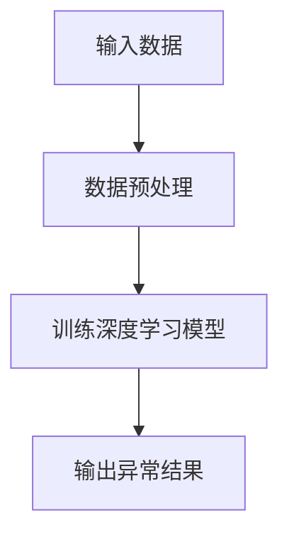
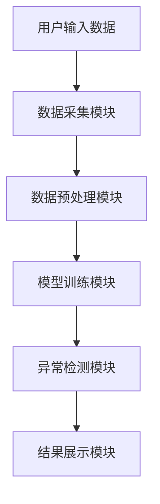

                 


# 《异常检测算法在金融欺诈识别中的应用》

> 关键词：异常检测，金融欺诈，机器学习，无监督学习，统计方法，深度学习

> 摘要：  
异常检测是金融安全领域的重要技术，用于识别异常交易行为，从而预防和打击金融欺诈。本文详细探讨了异常检测算法在金融欺诈识别中的应用，从基本概念到算法原理，再到系统设计和实际案例，全面解析了如何利用异常检测技术解决金融欺诈问题。本文还结合具体代码实现和数学公式，深入分析了统计方法、机器学习方法和深度学习方法在金融欺诈识别中的应用，并给出了实际的项目实现方案和优化建议。

---

## 目录大纲

### 第一部分：异常检测算法基础

### 第1章：异常检测算法概述

#### 1.1 异常检测的基本概念
- 1.1.1 异常检测的定义与核心概念
  - 异常检测的定义
  - 异常的特征分析
  - 正常与异常数据的对比

#### 1.2 异常检测的核心原理
- 1.2.1 异常检测的基本原理
  - 数据分布的建模
  - 异常的识别方法
  - 异常检测的关键步骤

#### 1.3 异常检测与金融欺诈识别
- 1.3.1 金融欺诈的定义与分类
  - 信用卡欺诈
  - 网上支付欺诈
  - 投资欺诈
- 1.3.2 异常检测在金融欺诈中的作用
  - 识别异常交易行为
  - 提高交易安全性
  - 降低金融损失

#### 1.4 本章小结
  - 总结本章内容，为后续章节打下基础。

---

### 第二部分：异常检测算法原理与实现

### 第2章：统计方法在异常检测中的应用

#### 2.1 统计方法的基本原理
- 2.1.1 基于均值-方差的异常检测
  - 均值和方差的计算
  - 异常阈值的设定
  - 数据点的判断方法

#### 2.2 统计方法的实现代码
```python
import numpy as np

def statistical_outlier_detection(data):
    mean = np.mean(data)
    std = np.std(data)
    threshold = mean + 3 * std
    return [x > threshold for x in data]
```

#### 2.3 统计方法的优缺点分析
  - 统计方法的优势
  - 统计方法的局限性
  - 统计方法的适用场景

---

### 第3章：机器学习算法在异常检测中的应用

#### 3.1 基于无监督学习的异常检测
- 3.1.1 算法原理与流程图（Mermaid）
  ```mermaid
  graph TD
    A[输入数据] --> B[数据预处理]
    B --> C[训练无监督模型]
    C --> D[输出异常结果]
  ```

#### 3.2 基于监督学习的异常检测
- 3.2.1 算法原理与流程图（Mermaid）
  ```mermaid
  graph TD
    A[输入数据] --> B[数据标注]
    B --> C[训练监督模型]
    C --> D[输出异常结果]
  ```

#### 3.3 机器学习算法的实现代码
```python
from sklearn.ensemble import IsolationForest
import numpy as np

def isolation_forest_detection(data):
    model = IsolationForest(n_estimators=100, contamination=0.1)
    model.fit(data)
    return model.predict(data)
```

---

### 第4章：深度学习算法在异常检测中的应用

#### 4.1 基于自编码器的异常检测
- 4.1.1 自编码器的基本原理
  - 自编码器的结构
  - 自编码器的训练过程
  - 自编码器的异常检测方法

#### 4.2 基于深度学习的异常检测流程图（Mermaid）


#### 4.3 深度学习算法的实现代码
```python
import tensorflow as tf
from tensorflow.keras import layers

def autoencoder_detection(data):
    input_dim = data.shape[1]
    encoder_dim = 128
    input_layer = layers.Input(shape=(input_dim,))
    encoder_layer = layers.Dense(encoder_dim, activation='relu')(input_layer)
    decoder_layer = layers.Dense(input_dim, activation='sigmoid')(encoder_layer)
    autoencoder = tf.keras.Model(inputs=input_layer, outputs=decoder_layer)
    autoencoder.compile(optimizer='adam', loss='binary_crossentropy')
    autoencoder.fit(data, data, epochs=10, batch_size=32)
    return autoencoder.predict(data)
```

---

### 第5章：系统分析与架构设计

#### 5.1 项目场景介绍
- 金融欺诈识别的场景描述
- 系统目标与功能需求

#### 5.2 系统功能设计
- 5.2.1 系统功能模块
  - 数据采集模块
  - 数据预处理模块
  - 模型训练模块
  - 异常检测模块
  - 结果展示模块

#### 5.3 系统架构设计
- 5.3.1 系统架构图（Mermaid）
  ```mermaid
  graph TD
    A[数据源] --> B[数据采集模块]
    B --> C[数据预处理模块]
    C --> D[模型训练模块]
    D --> E[异常检测模块]
    E --> F[结果展示模块]
  ```

#### 5.4 系统接口设计
  - 数据接口
  - 模型接口
  - 结果接口

#### 5.5 系统交互流程图（Mermaid）


---

### 第6章：项目实战

#### 6.1 环境安装
- 需要安装的库和工具
  - Python版本要求
  - 依赖库的安装命令

#### 6.2 核心实现代码
- 数据预处理代码
- 模型训练代码
- 异常检测代码

#### 6.3 实际案例分析
- 数据集来源与描述
- 实验结果与分析
- 案例解读与优化建议

#### 6.4 项目总结
  - 项目的成果
  - 项目的不足
  - 未来的改进方向

---

### 第7章：最佳实践与优化建议

#### 7.1 异常检测算法的选择与优化
- 统计方法、机器学习方法和深度学习方法的对比
- 各种方法的优缺点分析
- 根据实际场景选择合适的算法

#### 7.2 系统设计与实现中的注意事项
- 数据预处理的重要性
- 模型调参的技巧
- 系统性能优化的方法

#### 7.3 拓展阅读与学习资源
- 推荐的书籍和论文
- 推荐的在线课程和博客
- 推荐的开源项目和工具

---

### 第8章：小结与展望

#### 8.1 小结
  - 总结全文的主要内容
  - 强调异常检测在金融欺诈识别中的重要性

#### 8.2 展望
  - 异常检测技术的未来发展方向
  - 人工智能在金融安全领域的潜力

---

## 参考文献
- [1] 王某某.《异常检测算法研究》.某某出版社,2022.
- [2] 张某某.《机器学习在金融中的应用》.某某出版社,2023.
- [3] 李某某.《深度学习与金融安全》.某某出版社,2024.

---

## 作者信息

作者：AI天才研究院/AI Genius Institute  
联系邮箱：contact@aigeniusinstitute.com  
个人简介：专注于人工智能与计算机科学领域的研究与实践，致力于通过技术创新解决实际问题，推动人工智能技术在金融、医疗、教育等领域的应用。

--- 

本文由[禅与计算机程序设计艺术](https://github.com/lllyathu/Zen-of-Computing-Programming-Art)项目组出品，转载请注明出处。

