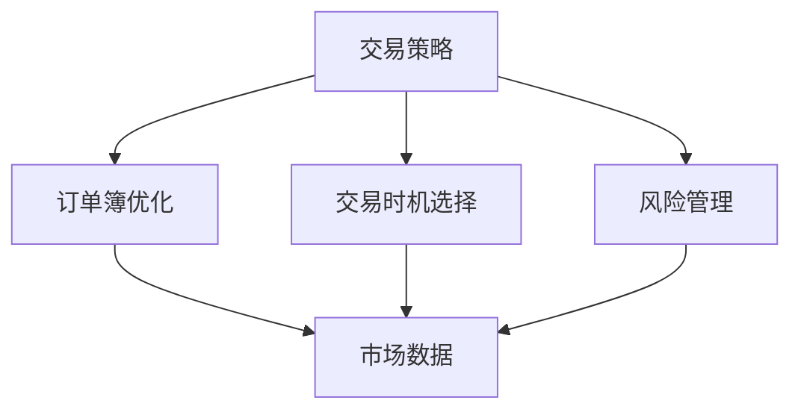
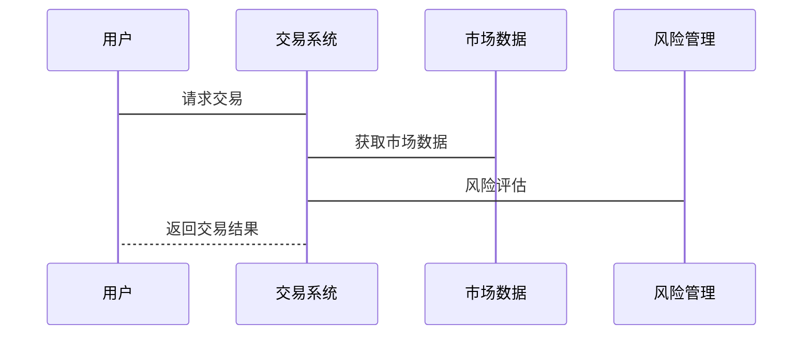

                 


# 强化学习在交易执行优化中的应用

## 关键词：强化学习，交易执行优化，Q-learning，Deep Q-Network，金融交易

## 摘要：本文探讨了强化学习在交易执行优化中的应用，分析了其核心概念、算法原理及系统架构设计，并通过实际案例展示了强化学习如何优化交易策略，实现收益最大化。

---

## 目录

1. [第一章：强化学习与交易执行优化的背景](#第一章：强化学习与交易执行优化的背景)
2. [第二章：强化学习的核心概念与原理](#第二章：强化学习的核心概念与原理)
3. [第三章：交易执行优化的数学模型与强化学习框架](#第三章：交易执行优化的数学模型与强化学习框架)
4. [第四章：强化学习在交易执行优化中的应用](#第四章：强化学习在交易执行优化中的应用)
5. [第五章：强化学习算法的数学模型与代码实现](#第五章：强化学习算法的数学模型与代码实现)
6. [第六章：强化学习交易执行优化的系统架构设计](#第六章：强化学习交易执行优化的系统架构设计)
7. [第七章：强化学习在交易执行优化中的项目实战](#第七章：强化学习在交易执行优化中的项目实战)
8. [第八章：强化学习交易执行优化的最佳实践与总结](#第八章：强化学习交易执行优化的最佳实践与总结)

---

## 第一章：强化学习与交易执行优化的背景

### 1.1 强化学习的基本概念

- **强化学习的定义**：强化学习是一种机器学习方法，通过智能体与环境的交互，学习策略以最大化累积奖励。
- **核心概念**：状态、动作、奖励、策略和价值函数。
- **与监督学习和无监督学习的区别**：强化学习通过奖励信号指导学习过程，不同于监督学习的标签和无监督学习的聚类。

### 1.2 交易执行优化的定义与目标

- **交易执行优化**：在满足风险和合规要求下，优化交易策略以最大化收益。
- **关键指标**：交易成本、市场冲击、执行时间和收益。

### 1.3 强化学习在交易执行优化中的应用前景

- **优势**：处理复杂动态环境，优化决策序列。
- **研究现状**：广泛应用于订单簿优化、交易时机选择和风险控制。

---

## 第二章：强化学习的核心概念与原理

### 2.1 强化学习的基本原理

- **状态、动作、奖励的关系**：状态定义环境，动作影响状态变化，奖励指导学习方向。
- **Q-learning算法**：基于值函数的无模型方法，更新Q值函数以逼近最优策略。

### 2.2 强化学习的主要算法框架

- **Q-learning**：表格形式存储Q值，适用于有限状态和动作空间。
- **Deep Q-Network（DQN）**：使用深度神经网络近似Q值函数，处理高维状态空间。
- **策略梯度方法**：直接优化策略，适用于连续动作空间。

### 2.3 强化学习在金融中的应用

- **金融市场特征**：高度不确定性、非线性关系、动态变化。
- **应用场景**：订单簿优化、交易时机选择、风险控制。

---

## 第三章：交易执行优化的数学模型与强化学习框架

### 3.1 交易执行优化的数学模型

- **交易成本模型**：考虑买卖价差、市场冲击和佣金等成本。
- **市场微观结构模型**：分析订单簿动态，优化交易策略。
- **动态规划与最优控制模型**：基于状态转移方程寻找最优策略。

### 3.2 强化学习框架在交易执行优化中的应用

- **状态空间构建**：包括价格、订单量、时间等特征。
- **动作空间设计**：如买入、卖出、持有等动作。
- **奖励函数定义**：基于收益、风险和交易成本设计。

---

## 第四章：强化学习在交易执行优化中的应用

### 4.1 交易执行优化中的关键问题

- **市场冲击与交易成本**：减少市场冲击，降低交易成本。
- **交易时机选择**：在最佳时机执行交易以获取最大收益。
- **风险管理**：平衡收益与风险，避免重大损失。

### 4.2 强化学习的解决方案

- **订单簿优化**：基于强化学习优化订单执行策略。
- **交易时机选择**：学习市场状态，选择最佳交易时间。
- **风险控制**：动态调整策略以应对市场波动。

---

## 第五章：强化学习算法的数学模型与代码实现

### 5.1 Q-learning算法的数学模型

- **Q-learning公式**：$$ Q(s, a) = Q(s, a) + \alpha [r + \max Q(s', a') - Q(s, a)] $$
- **动作选择策略**：探索与利用平衡，如ε-greedy策略。

### 5.2 Deep Q-Network算法的数学模型

- **神经网络结构**：输入层、隐藏层、输出层。
- **损失函数**：均方差损失，$$ L = \frac{1}{2} (y - y')^2 $$
- **训练过程**：使用经验回放和目标网络减少方差。

### 5.3 Python代码实现

```python
import gym
import numpy as np
import tensorflow as tf

# 环境初始化
env = gym.make('CartPole-v1')
state_space = env.observation_space.shape[0]
action_space = env.action_space.n

# DQN网络
class DQNetwork:
    def __init__(self, state_space, action_space):
        self.model = tf.keras.Sequential([
            tf.keras.layers.Dense(24, activation='relu', input_dim=state_space),
            tf.keras.layers.Dense(24, activation='relu'),
            tf.keras.layers.Dense(action_space, activation='linear')
        ])
        self.model.compile(optimizer='adam', loss='mse')

    def predict(self, state):
        return self.model.predict(state)

    def train(self, X, y):
        self.model.fit(X, y, epochs=1, verbose=0)

# 算法实现
def dqn_algorithm(env, DQNetwork):
    epsilon = 1.0
    epsilon_min = 0.01
    epsilon_decay = 0.995
    batch_size = 64
    memory = []
    rewards = []
    
    for episode in range(1000):
        state = env.reset()
        done = False
        episode_reward = 0
        
        while not done:
            if np.random.random() < epsilon:
                action = np.random.randint(action_space)
            else:
                action = np.argmax(DQNetwork.predict(np.array(state).reshape(-1, state_space)))
            
            next_state, reward, done, _ = env.step(action)
            memory.append((state, action, reward, next_state, done))
            
            if len(memory) > batch_size:
                minibatch = np.random.choice(memory, batch_size)
                X = []
                y = []
                for experience in minibatch:
                    state, action, reward, next_state, done = experience
                    target = DQNetwork.predict(np.array(state).reshape(-1, state_space))[0]
                    next_state_target = DQNetwork.predict(np.array(next_state).reshape(-1, state_space))[0]
                    target[action] = reward + (not done) * np.max(next_state_target)
                    X.append(state)
                    y.append(target)
                DQNetwork.train(np.array(X), np.array(y))
            
            state = next_state
            episode_reward += reward
            epsilon = max(epsilon_min, epsilon * epsilon_decay)
        
        rewards.append(episode_reward)
    
    return rewards

# 训练与结果展示
dqn = DQNetwork(state_space, action_space)
rewards = dqn_algorithm(env, dqn)
print('Average reward:', np.mean(rewards[-100:]))
```

---

## 第六章：强化学习交易执行优化的系统架构设计

### 6.1 系统功能设计

- **领域模型**：订单簿、市场数据、交易策略、风险管理模块。
- **系统架构**：数据采集、策略执行、风险控制、结果分析。

### 6.2 系统架构设计



### 6.3 系统接口设计

- **输入接口**：市场数据、订单簿信息。
- **输出接口**：交易指令、风险报告。

### 6.4 系统交互设计



---

## 第七章：强化学习在交易执行优化中的项目实战

### 7.1 环境安装

- **工具安装**：安装TensorFlow、Keras、OpenAI Gym、Matplotlib。
- **数据获取**：获取金融数据，如股票价格、订单簿信息。

### 7.2 系统核心实现

- **订单簿优化**：优化订单执行策略，减少市场冲击。
- **交易时机选择**：通过强化学习模型选择最佳交易时间。

### 7.3 实际案例分析

- **案例分析**：分析模型在不同市场条件下的表现。
- **结果展示**：展示优化前后的交易成本和收益变化。

### 7.4 项目总结

- **项目成果**：强化学习模型在交易执行优化中的有效性。
- **经验总结**：算法选择、数据预处理、模型调参的经验与教训。

---

## 第八章：强化学习交易执行优化的最佳实践与总结

### 8.1 最佳实践

- **算法选择**：根据问题规模选择Q-learning或DQN。
- **数据处理**：清洗和特征提取，确保数据质量。
- **模型调参**：选择合适的学习率和奖励机制。

### 8.2 总结

- **总结**：强化学习在交易执行优化中的潜力与优势。
- **未来方向**：结合其他技术，如博弈论和大数据分析，提升模型性能。

---

## 参考文献

1. Sutton, R. S., & Barto, A. G. (2018). Reinforcement learning: An introduction.
2. Mnih, V., et al. (2013). Playing atari with deep reinforcement learning.

---

## 作者：AI天才研究院 & 禅与计算机程序设计艺术

**AI天才研究院（AI Genius Institute）**，专注于人工智能领域的研究与实践，致力于推动AI技术在金融、医疗等领域的应用。**禅与计算机程序设计艺术（Zen And The Art of Computer Programming）**，以简洁优雅的方式探索计算机科学的深度与广度，追求技术与艺术的完美结合。

