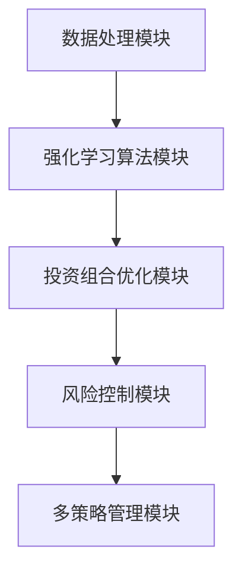
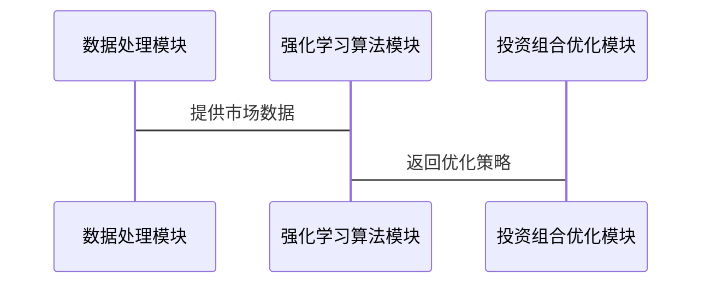

                 


# 强化学习在多策略投资组合中的应用

## 关键词：强化学习, 投资组合优化, 多策略投资, 算法原理, 系统架构, 项目实战

## 摘要：  
本文深入探讨了强化学习在多策略投资组合优化中的应用。首先，介绍了强化学习的基本概念及其在投资组合优化中的重要性。接着，详细分析了多策略投资组合的构建与管理，结合强化学习的数学基础和核心算法，提出了基于强化学习的多策略投资组合优化框架。随后，通过系统架构设计和项目实战，展示了如何将强化学习应用于实际投资组合优化问题中。最后，总结了本文的主要内容，并提出了未来的研究方向和实践建议。

---

## 第一部分: 强化学习与投资组合优化基础

### 第1章: 强化学习与投资组合优化概述

#### 1.1 强化学习的基本概念
强化学习（Reinforcement Learning, RL）是一种机器学习范式，其中智能体通过与环境交互来学习如何做出决策。智能体在环境中执行动作，观察状态变化，并通过奖励机制来优化其策略。强化学习的核心在于通过试错和经验积累，找到最优的决策策略。

在投资组合优化中，强化学习可以用于动态调整投资组合，以最大化收益或最小化风险。与传统的投资组合优化方法（如均值-方差优化）相比，强化学习能够处理复杂动态的市场环境，并适应非线性关系。

#### 1.2 多策略投资组合的背景与挑战
多策略投资组合是指同时采用多种投资策略进行资产配置的投资组合。每种策略可能有不同的目标和风险收益特征，通过结合不同策略的优势，可以实现风险分散和收益增强。然而，多策略投资组合的构建和管理面临以下挑战：
- **策略之间的协调与平衡**：不同策略可能在不同市场环境下表现不一，如何协调这些策略是关键。
- **动态调整的复杂性**：市场环境不断变化，投资组合需要实时调整以适应新情况。
- **风险管理**：多策略可能导致过度分散或风险叠加，需要有效的风险控制机制。

### 第2章: 强化学习的数学基础

#### 2.1 动态规划与马尔可夫决策过程
动态规划（Dynamic Programming, DP）是一种解决最优决策问题的数学方法，其基本思想是将复杂问题分解为子问题，并通过递归求解。在强化学习中，动态规划通常用于状态转移和奖励的建模。

马尔可夫决策过程（Markov Decision Process, MDP）是强化学习的核心数学模型，定义了一个完整的决策环境。MDP由以下五个元组组成：
- 状态空间 \( S \)
- 动作空间 \( A \)
- 转移概率矩阵 \( P(s' | s, a) \)
- 奖励函数 \( R(s, a) \)
- 离策值或策略值函数

#### 2.2 强化学习的核心算法
- **Q-learning算法**：通过学习状态-动作值函数 \( Q(s, a) \) 来优化决策策略。
- **DQN算法**：深度Q网络（DQN）通过神经网络近似Q值函数，解决了传统Q-learning在连续状态和动作空间中的局限性。
- **策略梯度方法**：直接优化策略参数，通过梯度上升或下降调整策略。

### 第3章: 投资组合优化的强化学习方法

#### 3.1 基于强化学习的投资组合优化框架
- **状态空间**：市场状态，包括资产价格、市场趋势、宏观经济指标等。
- **动作空间**：投资组合调整动作，如买入、卖出、持仓等。
- **奖励函数**：基于收益、风险、波动性等指标设计的奖励函数。

#### 3.2 基于策略的强化学习方法
- **策略评估**：通过模拟市场环境，评估当前策略的表现。
- **策略优化**：利用强化学习算法优化策略参数，以提高投资组合的收益或降低风险。
- **策略梯度方法**：通过梯度下降优化策略参数，实现最优投资组合配置。

### 第4章: 多策略投资组合的构建与管理

#### 4.1 多策略投资组合的定义与分类
- **多策略类型**：包括动量策略、价值投资策略、趋势跟踪策略等。
- **策略优缺点对比**：
  | 策略类型 | 优点 | 缺点 |
  |----------|------|------|
  | 动量策略 | 收益显著 | 易受市场波动影响 |
  | 价值投资策略 | 长期稳定 | 短期波动大 |
  | 趋势跟踪策略 | 适应性强 | 易受噪声干扰 |

- **多策略投资组合的风险分散机制**：通过不同策略的组合，降低单一策略的风险。

#### 4.2 基于强化学习的多策略投资组合优化
- **多策略投资组合的强化学习框架**：通过强化学习算法协调不同策略的执行。
- **策略之间的协同与竞争**：在多策略环境中，策略之间可能相互促进或相互抑制，需要动态调整。
- **多策略投资组合的动态调整机制**：根据市场变化实时调整策略权重和资产配置。

### 第5章: 强化学习在投资组合优化中的系统架构设计

#### 5.1 系统架构概述
- **系统功能模块划分**：
  - 强化学习算法模块
  - 投资组合优化模块
  - 风险控制模块
  - 多策略管理模块
  - 数据处理模块

- **系统功能流程图（Mermaid）**


#### 5.2 系统接口设计
- **输入接口设计**：接收市场数据、策略参数等输入。
- **输出接口设计**：输出优化后的投资组合配置。
- **接口交互流程图（Mermaid）**


### 第6章: 项目实战——基于强化学习的多策略投资组合优化

#### 6.1 环境安装与数据准备
- **环境安装**：安装Python、TensorFlow、Keras等工具。
- **数据准备**：获取历史资产价格数据，包括股票、基金等。

#### 6.2 系统核心实现源代码
以下是一个基于强化学习的多策略投资组合优化的Python代码示例：

```python
import numpy as np
import tensorflow as tf

# 定义强化学习模型
class DQNModel(tf.keras.Model):
    def __init__(self, state_space, action_space):
        super(DQNModel, self).__init__()
        self.fc1 = tf.keras.layers.Dense(64, activation='relu')
        self.fc2 = tf.keras.layers.Dense(64, activation='relu')
        self.q_values = tf.keras.layers.Dense(action_space, activation='linear')

    def call(self, state):
        x = self.fc1(state)
        x = self.fc2(x)
        q_values = self.q_values(x)
        return q_values

# 定义强化学习算法
class DQN:
    def __init__(self, state_space, action_space):
        self.model = DQNModel(state_space, action_space)
        self.target_model = DQNModel(state_space, action_space)
        self.optimizer = tf.keras.optimizers.Adam(lr=0.001)

    def remember(self, state, action, reward, next_state):
        # 记忆存储
        pass

    def act(self, state, epsilon=0.1):
        # 根据当前状态选择动作
        pass

    def update(self, batch):
        # 更新模型参数
        pass

# 定义投资组合优化问题
class PortfolioOptimizer:
    def __init__(self, assets, initial_capital):
        self.assets = assets
        self.initial_capital = initial_capital
        self.current_portfolio = np.zeros(len(assets))

    def get_state(self):
        # 获取当前市场状态
        pass

    def apply_action(self, action):
        # 应用动作，调整投资组合
        pass

    def get_reward(self):
        # 计算奖励
        pass

# 主函数
def main():
    # 初始化投资组合优化器
    optimizer = PortfolioOptimizer(assets=['stock1', 'stock2', 'bond'], initial_capital=10000)
    # 初始化强化学习算法
    dqn = DQN(state_space=3, action_space=4)
    # 开始优化过程
    for episode in range(1000):
        state = optimizer.get_state()
        action = dqn.act(state)
        reward = optimizer.get_reward()
        next_state = optimizer.get_state()
        dqn.remember(state, action, reward, next_state)
        dqn.update(batch)
    # 输出最优投资组合
    print(optimizer.current_portfolio)

if __name__ == "__main__":
    main()
```

#### 6.3 代码实现与分析
- **DQNModel**：定义深度Q网络模型，用于近似Q值函数。
- **DQN类**：实现DQN算法，包括记忆库、动作选择和模型更新。
- **PortfolioOptimizer**：定义投资组合优化器，包含状态获取、动作应用和奖励计算功能。
- **主函数**：初始化优化器和DQN算法，进行多个训练周期，最终输出最优投资组合。

#### 6.4 实际案例分析
假设我们有两只股票和一只债券作为投资标的，初始资金为10000元。通过强化学习算法，优化器会根据市场状态调整投资比例。例如，当市场处于上涨趋势时，增加股票持仓；当市场处于下跌趋势时，增加债券持仓。通过不断学习和调整，投资组合能够在不同市场环境下实现收益最大化和风险最小化。

---

## 第七章: 总结与展望

### 7.1 最佳实践 tips
- 在实际应用中，建议结合市场数据和具体投资目标设计奖励函数。
- 定期更新模型参数，以适应市场变化。
- 注意风险控制，避免过度集中投资。

### 7.2 小结
本文详细探讨了强化学习在多策略投资组合优化中的应用，从理论基础到实际案例进行了全面分析。通过强化学习，可以实现动态调整投资组合，适应复杂多变的市场环境。

### 7.3 注意事项
- 确保数据质量和完整性，避免噪声干扰。
- 合理设置超参数，如学习率、折扣因子等。
- 定期监控和评估模型性能，及时调整策略。

### 7.4 拓展阅读
- 《Reinforcement Learning: Theory and Algorithms》
- 《Multi-Strategy Portfolio Optimization Using Machine Learning》

---

## 作者：AI天才研究院（AI Genius Institute） & 禅与计算机程序设计艺术（Zen And The Art of Computer Programming）

---

以上是《强化学习在多策略投资组合中的应用》的完整内容。

