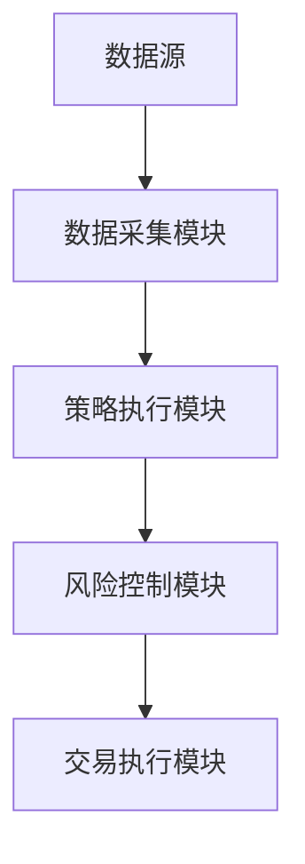
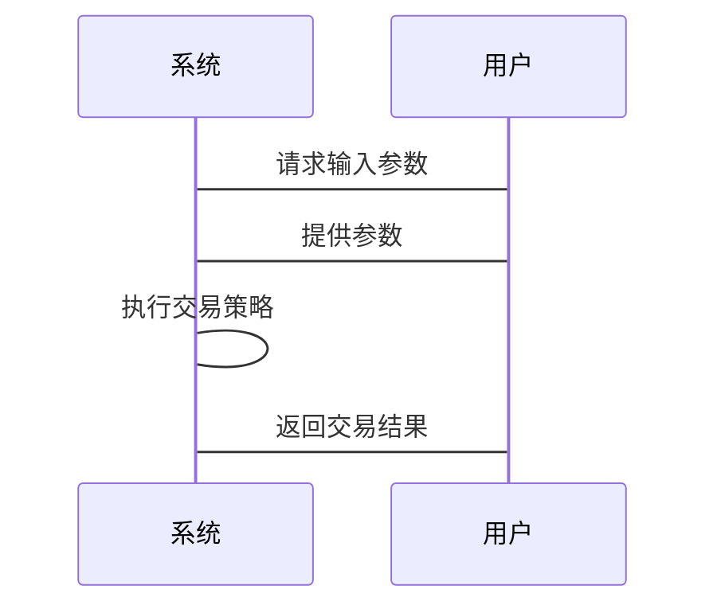

                 


```markdown
# 强化学习在多资产交易策略中的应用

## 关键词：强化学习、多资产交易、交易策略、Q-learning、策略梯度、马尔可夫决策过程

## 摘要：  
本文深入探讨强化学习在多资产交易策略中的应用，从强化学习的基本概念、算法原理，到系统设计、项目实战，全面解析如何利用强化学习优化多资产交易策略。通过详细分析强化学习的核心概念、数学模型和实际案例，本文为读者提供了一套从理论到实践的完整指南，帮助读者理解并掌握强化学习在金融领域的应用。

---

# 第一部分: 强化学习与多资产交易策略基础

## 第1章: 强化学习与多资产交易概述

### 1.1 强化学习的基本概念
#### 1.1.1 强化学习的定义与核心要素
强化学习（Reinforcement Learning, RL）是一种机器学习范式，通过智能体与环境的交互，学习最优策略以最大化累积奖励。其核心要素包括：
- **状态（State）**：智能体所处的环境状态，例如当前的市场价格、资产组合等。
- **动作（Action）**：智能体在特定状态下采取的操作，例如买入、卖出或持有某资产。
- **奖励（Reward）**：智能体采取动作后获得的反馈，用于评估动作的好坏。
- **策略（Policy）**：智能体在不同状态下选择动作的规则，可以是确定性的或概率性的。
- **价值函数（Value Function）**：评估某个状态下采取特定动作后的预期回报。

#### 1.1.2 强化学习与监督学习、无监督学习的区别
- **监督学习**：基于标记的训练数据，学习输入到输出的映射关系。
- **无监督学习**：在无标记数据上，发现数据中的潜在结构。
- **强化学习**：通过与环境交互，基于累积奖励优化策略，具有目标导向性。

#### 1.1.3 强化学习在金融领域的应用前景
强化学习在金融领域的优势在于其擅长处理序列决策问题，适用于高频交易、资产配置和风险管理等场景。

### 1.2 多资产交易策略的基本概念
#### 1.2.1 多资产交易的定义与特点
多资产交易是指同时涉及多种资产的交易策略，旨在通过资产间的相关性优化风险与收益的平衡。

#### 1.2.2 多资产交易中的风险与收益平衡
通过配置不同资产，降低组合的整体风险（如市场风险、流动性风险）的同时，追求更高的收益。

#### 1.2.3 多资产交易策略的分类与选择
多资产交易策略可分为**均值-方差优化**、**风险平价**、**因子投资**等，每种策略有其优缺点，需根据市场环境选择。

### 1.3 强化学习在多资产交易中的结合点
#### 1.3.1 强化学习在交易决策中的优势
强化学习能够处理复杂的非线性关系，适应动态变化的市场环境，提供实时决策支持。

#### 1.3.2 多资产交易策略中的状态、动作与奖励机制
- **状态**：当前市场数据、资产价格、组合持仓等。
- **动作**：买入、卖出或调整持仓比例。
- **奖励**：基于收益、风险等指标的综合评估。

#### 1.3.3 强化学习在实际交易中的应用案例
例如，利用强化学习优化投资组合的配置，动态调整资产权重以应对市场波动。

### 1.4 本章小结
本章介绍了强化学习的基本概念、多资产交易策略的特点，以及两者结合的应用场景。

---

# 第二部分: 强化学习的核心概念与数学模型

## 第2章: 强化学习的核心概念

### 2.1 马尔可夫决策过程（MDP）
#### 2.1.1 状态、动作、奖励的定义
- **状态（State）**：智能体所处的环境状态，例如当前的市场价格。
- **动作（Action）**：智能体在特定状态下采取的操作，例如买入某资产。
- **奖励（Reward）**：智能体采取动作后获得的反馈，例如收益率。

#### 2.1.2 策略与价值函数的定义
- **策略（Policy）**：智能体在不同状态下选择动作的概率分布。
- **价值函数（Value Function）**：评估某个状态下采取特定动作后的预期回报。

#### 2.1.3 MDP的数学表达式
马尔可夫决策过程可以用以下数学表达式描述：
$$ V(s) = \max_a Q(s,a) $$

### 2.2 Q-learning算法
#### 2.2.1 Q-learning的基本原理
Q-learning通过更新Q值表来学习最优策略，Q值表示在某状态下采取某动作的预期回报。

#### 2.2.2 Q-learning的更新公式
$$ Q(s,a) = Q(s,a) + \alpha [r + \max_{a'} Q(s',a') - Q(s,a)] $$

#### 2.2.3 Q-learning在多资产交易中的应用
例如，利用Q-learning算法优化投资组合的配置，动态调整资产权重以应对市场波动。

### 2.3 策略梯度方法
#### 2.3.1 策略梯度的基本原理
策略梯度方法通过优化策略的参数，使得期望的累积奖励最大化。

#### 2.3.2 策略梯度的优化目标
$$ \max_{\theta} \mathbb{E}_{\tau \sim \pi_\theta} \left[ R(\tau) \right] $$

#### 2.3.3 策略梯度在交易策略中的应用
例如，利用策略梯度方法优化投资组合的配置，动态调整资产权重以应对市场波动。

### 2.4 强化学习的核心概念对比表
| 概念       | MDP                     | Q-learning              | 策略梯度               |
|------------|-------------------------|--------------------------|------------------------|
| 状态       | 当前状态                | 当前状态                | 当前状态              |
| 动作       | 可能的动作               | 可能的动作               | 可能的动作             |
| 奖励       | 单个步长的奖励           | 单个步长的奖励           | 单个步长的奖励         |
| 策略       | 随状态变化的策略         | 随状态变化的策略         | 随状态变化的策略       |
| 优化目标   | 最大化价值函数           | 最大化Q值                | 最大化策略的累积奖励    |

### 2.5 本章小结
本章详细介绍了强化学习的核心概念，包括马尔可夫决策过程、Q-learning算法和策略梯度方法，并通过对比分析明确了各自的特点和应用场景。

---

# 第三部分: 强化学习算法的数学模型与公式

## 第3章: 强化学习的数学模型

### 3.1 动态规划方法
#### 3.1.1 Bellman方程的定义
Bellman方程描述了状态值函数与动作值函数之间的关系：
$$ V(s) = \max_a Q(s,a) $$

#### 3.1.2 动态规划的迭代方法
动态规划通过迭代更新值函数，逐步逼近最优策略。

#### 3.1.3 动态规划的收敛性分析
动态规划算法在一定条件下能够收敛到最优值函数。

### 3.2 Q-learning的数学推导
#### 3.2.1 Q-learning的更新公式推导
通过贝尔曼方程和马尔可夫假设，可以推导出Q-learning的更新公式：
$$ Q(s,a) = Q(s,a) + \alpha [r + \max_{a'} Q(s',a') - Q(s,a)] $$

#### 3.2.2 Q-learning的收敛性证明
Q-learning算法在步长衰减的条件下能够收敛到最优值函数。

### 3.3 策略梯度方法的数学推导
#### 3.3.1 策略梯度的目标函数
策略梯度方法通过优化策略参数，使得累积奖励最大化：
$$ \max_{\theta} \mathbb{E}_{\tau \sim \pi_\theta} \left[ R(\tau) \right] $$

#### 3.3.2 策略梯度的优化算法
策略梯度方法通常采用梯度上升算法，逐步优化策略参数。

### 3.4 强化学习的数学公式总结
- **Bellman方程**：
  $$ V(s) = \max_a Q(s,a) $$
- **Q-learning的更新公式**：
  $$ Q(s,a) = Q(s,a) + \alpha [r + \max_{a'} Q(s',a') - Q(s,a)] $$
- **策略梯度的优化目标**：
  $$ \max_{\theta} \mathbb{E}_{\tau \sim \pi_\theta} \left[ R(\tau) \right] $$

### 3.5 本章小结
本章通过数学推导，详细解释了强化学习的核心算法，包括动态规划、Q-learning和策略梯度方法的数学模型。

---

# 第四部分: 强化学习在多资产交易策略中的系统设计与实战

## 第4章: 多资产交易策略的系统设计

### 4.1 多资产交易场景分析
多资产交易涉及多种资产，如股票、债券、期货等，需要考虑资产间的相关性、流动性等因素。

### 4.2 系统架构设计
#### 4.2.1 系统功能设计
- 数据采集模块：获取实时市场数据。
- 策略执行模块：根据强化学习模型生成交易信号。
- 风险控制模块：监控并控制交易风险。

#### 4.2.2 系统架构图


### 4.3 接口设计与交互流程
#### 4.3.1 系统接口设计
- 数据接口：提供实时市场数据和历史数据。
- 策略接口：接收交易信号并执行交易。

#### 4.3.2 交互流程图


## 第5章: 项目实战

### 5.1 环境配置
#### 5.1.1 环境安装
安装必要的Python库，如TensorFlow、Keras、Pandas等。

#### 5.1.2 数据准备
获取多资产的历史价格数据，例如股票、债券、黄金等。

### 5.2 系统核心实现
#### 5.2.1 强化学习模型实现
基于Q-learning或策略梯度方法实现强化学习模型。

#### 5.2.2 交易策略实现
根据模型输出的交易信号，执行具体的交易操作。

### 5.3 代码实现
#### 5.3.1 Q-learning算法实现
```python
class QLearner:
    def __init__(self, state_space, action_space):
        self.state_space = state_space
        self.action_space = action_space
        self.Q = defaultdict(lambda: defaultdict(lambda: 0))
    
    def get_action(self, state):
        return np.argmax([self.Q[state][a] for a in self.action_space])
    
    def update(self, state, action, reward, next_state):
        self.Q[state][action] += self.alpha * (reward + max(self.Q[next_state][a] for a in self.action_space) - self.Q[state][action])
```

#### 5.3.2 策略梯度方法实现
```python
class PolicyGradient:
    def __init__(self, state_dim, action_dim):
        self.state_dim = state_dim
        self.action_dim = action_dim
        self.theta = np.random.randn(state_dim, action_dim)
    
    def get_policy(self, state):
        return softmax(self.theta[state])
    
    def update(self, trajectory):
        for state, action, reward in trajectory:
            gradient = self.get_gradient(state, action)
            self.theta += self.alpha * gradient * reward
    
    def get_gradient(self, state, action):
        prob = self.get_policy(state)
        gradient = np.zeros_like(prob)
        gradient[action] = -prob[action]
        return gradient
```

### 5.4 案例分析
通过具体案例分析强化学习在多资产交易中的实际效果，例如在实际市场数据上的表现。

### 5.5 本章小结
本章通过实际项目实战，展示了如何利用强化学习优化多资产交易策略。

---

# 第五部分: 总结与展望

## 第6章: 总结与展望

### 6.1 本章小结
本文详细探讨了强化学习在多资产交易策略中的应用，从理论基础到系统设计，再到实际应用，提供了全面的指导。

### 6.2 强化学习在金融领域的未来展望
强化学习在金融领域的应用前景广阔，特别是在高频交易和智能投顾方面。

### 6.3 最佳实践 tips
- 合理选择强化学习算法，根据具体场景进行调整。
- 注重风险控制，避免过度优化导致的策略失效。
- 结合市场数据特征，优化模型的泛化能力。

## 作者信息

作者：AI天才研究院/AI Genius Institute & 禅与计算机程序设计艺术 /Zen And The Art of Computer Programming
```

---

**摘要**：  
本文系统地探讨了强化学习在多资产交易策略中的应用，从强化学习的基本概念、算法原理，到系统设计、项目实战，全面解析如何利用强化学习优化多资产交易策略。通过详细分析强化学习的核心概念、数学模型和实际案例，本文为读者提供了一套从理论到实践的完整指南，帮助读者理解并掌握强化学习在金融领域的应用。

