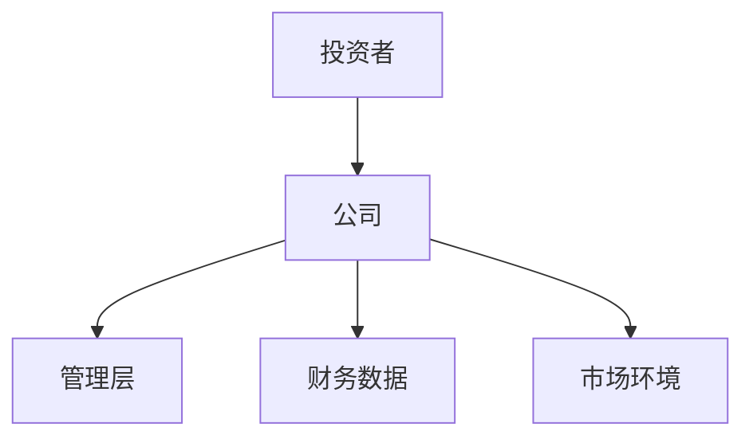
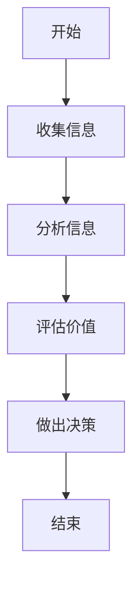
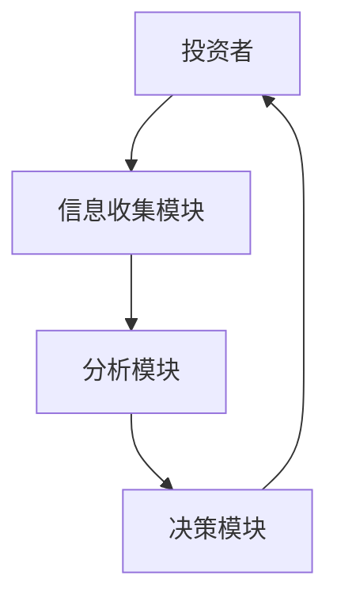

                 


# 彼得·林奇的实地调研投资法

## 关键词
- 彼得·林奇，实地调研，投资法，基本面分析，投资决策

## 摘要
彼得·林奇是全球著名投资家，以其独特的实地调研方法闻名。本文系统介绍该方法的核心理念、算法原理、数学模型及系统架构，通过案例分析和代码实现，深入探讨其实战应用。

---

## 第一章：彼得·林奇投资法的背景与核心理念

### 1.1 彼得·林奇的简介
彼得·林奇是Fidelity基金经理，以长期优异的业绩著称。他强调深入调研，避免依赖市场情绪。

### 1.2 实地调研投资法的核心理念
实地调研法注重亲自考察公司，获取第一手信息，评估其投资价值。

### 1.3 投资法的特点
- 实地调研：深入考察管理层、生产设施等。
- 逆向思维：在市场低谷时投资，获取超额收益。
- 长期投资：注重企业长期价值，而非短期波动。

---

## 第二章：实地调研投资法的背景与问题分析

### 2.1 当前投资环境的挑战
- 信息爆炸：投资者难以筛选有效信息。
- 市场波动：短期波动干扰长期判断。
- 传统方法的局限：依赖财务数据可能忽略企业真实价值。

### 2.2 问题解决
实地调研通过获取一手信息，弥补信息不对称，提升决策准确性。

---

## 第三章：实地调研投资法的核心概念与联系

### 3.1 核心概念原理
实地调研通过考察企业运营状况，评估其竞争优势和财务健康。

### 3.2 ER实体关系图


### 3.3 核心概念属性对比
| 比较项 | 实地调研 | 传统财务分析 |
|--------|----------|--------------|
| 数据来源 | 一手信息 | 二手数据     |
| 重点 | 经营状况 | 财务指标     |
| 优势 | 真实性高 | 客观性高      |
| 局限 | 时间成本高 | 深度有限      |

---

## 第四章：实地调研投资法的算法原理

### 4.1 算法流程


### 4.2 算法实现代码
```python
def调研评估(公司):
    信息收集(公司)
    分析信息(公司)
    评估价值(公司)
    return 投资决策
```

---

## 第五章：数学模型

### 5.1 模型构建
假设公司得分由管理层能力、财务状况、市场前景三部分构成，权重分别为0.4、0.3、0.3。

### 5.2 计算公式
$$总得分 = 0.4 \times 管理层能力 + 0.3 \times 财务状况 + 0.3 \times 市场前景$$

### 5.3 示例
管理层能力得分为90，财务状况70，市场前景80：
$$总得分 = 0.4 \times 90 + 0.3 \times 70 + 0.3 \times 80 = 36 + 21 + 24 = 81$$

---

## 第六章：系统架构设计

### 6.1 系统功能设计
- 信息收集模块：收集公司信息。
- 分析模块：评估公司价值。
- 决策模块：生成投资建议。

### 6.2 系统架构图


---

## 第七章：项目实战

### 7.1 案例分析
分析某公司，收集管理层、财务数据，评估其市场前景，计算总得分，做出投资决策。

### 7.2 代码实现
```python
def信息收集(公司):
    公司.管理层能力 = 调查管理层
    公司.财务状况 = 获取财务数据
    公司.市场前景 = 分析市场环境

def分析信息(公司):
    计算总得分 = 0.4 * 公司.管理层能力 + 0.3 * 公司.财务状况 + 0.3 * 公司.市场前景

def评估价值(公司):
    如果总得分 > 70:
        return "买入"
    否则:
        return "卖出"
```

---

## 第八章：最佳实践与总结

### 8.1 最佳实践
- 结合多种方法：实地调研与财务分析结合。
- 持续学习：不断更新行业知识。
- 风险控制：分散投资，避免过度集中。

### 8.2 小结
实地调研投资法通过深入分析企业，帮助投资者做出明智决策，是值得掌握的重要方法。

### 8.3 注意事项
- 时间成本较高：需要投入大量时间。
- 信息准确性：依赖调研人员的能力和判断。

### 8.4 拓展阅读
推荐书籍：《彼得·林奇的投资哲学》、《证券分析》。

---

## 作者
作者：AI天才研究院 & 禅与计算机程序设计艺术

---

通过以上结构，文章系统介绍了彼得·林奇的实地调研投资法，从背景到实践，帮助读者全面理解和应用这一方法。

