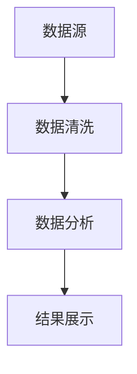

                 

# 彼得·林奇的行业分析方法论

> 关键词：彼得·林奇、行业分析、投资策略、基本面分析、竞争优势、财务指标、投资心态

> 摘要：本文深入探讨了彼得·林奇的行业分析方法论，从行业分析的基本概念到具体的分析框架、实战技巧、选股策略以及系统化方法进行了全面阐述。通过结合背景介绍、核心概念、数学模型、系统架构和项目实战，本文为读者提供了一个全面理解彼得·林奇行业分析方法的框架。

---

## 第一部分: 行业分析的背景与基础

### 第1章: 行业分析的核心概念与背景

#### 1.1 行业分析的基本概念

##### 1.1.1 行业分析的定义
行业分析是指通过对特定行业的市场结构、发展趋势、竞争状况、财务数据等多方面因素的综合研究，以评估该行业的投资价值和风险。彼得·林奇作为投资大师，他的行业分析方法论强调对行业基本面的深入理解。

##### 1.1.2 行业分析的重要性
行业分析是投资决策的基础，它帮助投资者识别行业的发展潜力、竞争优势和风险因素。通过行业分析，投资者可以更好地选择投资标的，制定合理的投资策略。

##### 1.1.3 行业分析的边界与外延
行业分析的边界包括行业范围的确定、分析的时间跨度以及数据来源的限制。外延则涉及宏观经济环境、政策变化、技术进步等外部因素对行业的影响。

#### 1.2 彼得·林奇的投资者心态

##### 1.2.1 投资者的认知误区
许多投资者倾向于关注市场的短期波动，而忽视了行业基本面的长期分析。彼得·林奇提醒投资者要避免这种误区，注重长期价值。

##### 1.2.2 林奇的投资理念
林奇强调基本面分析的重要性，认为只有深入了解行业的基本面，才能做出明智的投资决策。他主张长期投资，避免频繁交易。

##### 1.2.3 林奇的行业分析方法论
林奇的行业分析方法论以基本面分析为核心，结合行业生命周期理论和竞争优势分析，帮助投资者识别具有长期增长潜力的行业和企业。

#### 1.3 行业分析的核心要素

##### 1.3.1 行业生命周期
行业生命周期分为导入期、成长期、成熟期和衰退期。林奇认为，投资者应选择处于成长期或成熟期的行业，这些行业的企业具有稳定的收益和较高的投资价值。

##### 1.3.2 行业竞争结构
行业竞争结构包括市场集中度、进入壁垒、替代品威胁等因素。林奇强调，具有强大竞争优势的行业更可能产生长期稳定的回报。

##### 1.3.3 行业财务指标
行业财务指标包括收入增长率、利润率、资产负债率等。林奇认为，通过分析这些指标，可以评估行业的整体健康状况和企业的盈利能力。

---

### 第2章: 行业分析的基本框架

#### 2.1 行业分析的步骤

##### 2.1.1 确定行业范围
投资者需要明确分析的行业范围，例如是科技行业还是传统制造业。这一步骤是行业分析的基础。

##### 2.1.2 收集行业数据
收集行业数据是行业分析的关键步骤。数据来源包括行业报告、公司财报、宏观经济数据等。

##### 2.1.3 分析行业趋势
通过分析行业数据，投资者可以识别行业的增长趋势、竞争格局和潜在风险。

#### 2.2 行业分析的核心要素

##### 2.2.1 行业生命周期
行业生命周期是行业分析的重要工具。通过分析行业的生命周期阶段，投资者可以判断行业的增长潜力和投资风险。

##### 2.2.2 行业竞争结构
行业竞争结构分析包括市场集中度、进入壁垒、替代品威胁等因素。这些因素决定了行业的竞争格局和企业的盈利能力。

##### 2.2.3 行业财务指标
行业财务指标分析包括收入增长率、利润率、资产负债率等。这些指标可以帮助投资者评估行业的整体健康状况和企业的盈利能力。

---

### 第3章: 彼得·林奇的行业分析框架

#### 3.1 林奇的行业生命周期理论

##### 3.1.1 行业生命周期的阶段划分
行业生命周期分为导入期、成长期、成熟期和衰退期。林奇认为，投资者应选择处于成长期或成熟期的行业，这些行业的企业具有稳定的收益和较高的投资价值。

##### 3.1.2 不同阶段的行业特征
- **导入期**：行业增长迅速，但企业盈利能力较低。
- **成长期**：行业增长稳定，企业盈利能力逐渐提高。
- **成熟期**：行业增长放缓，企业盈利能力稳定。
- **衰退期**：行业增长停滞，企业盈利能力下降。

##### 3.1.3 林奇的行业生命周期见解
林奇认为，行业生命周期是影响投资决策的重要因素。投资者应关注行业所处的生命周期阶段，并据此调整投资策略。

#### 3.2 林奇的竞争优势分析

##### 3.2.1 企业竞争优势的来源
竞争优势的来源包括成本优势、技术优势、品牌优势等。林奇认为，具有强大竞争优势的企业更可能在行业中获得长期成功。

##### 3.2.2 行业内的竞争格局
行业内的竞争格局包括市场集中度、进入壁垒等因素。林奇强调，具有强大竞争优势的行业更可能产生长期稳定的回报。

##### 3.2.3 林奇的竞争优势评估方法
林奇通过分析企业的财务数据、市场份额、技术优势等因素，评估企业的竞争优势。他建议投资者选择具有强大竞争优势的企业进行投资。

---

### 第4章: 行业分析的数学模型与公式

#### 4.1 行业增长模型

##### 4.1.1 行业增长率的计算公式
$$ \text{行业增长率} = \frac{\text{当年行业收入} - \text{上一年行业收入}}{\text{上一年行业收入}} \times 100\% $$

##### 4.1.2 行业规模预测模型
$$ \text{预测行业规模} = \text{当前行业规模} \times (1 + \text{增长率}) $$

##### 4.1.3 行业增长的驱动因素分析
行业增长的驱动因素包括市场需求、技术创新、政策支持等。林奇认为，投资者应关注这些因素对行业增长的影响。

#### 4.2 财务指标分析

##### 4.2.1 市盈率（P/E）的计算公式
$$ \text{市盈率} = \frac{\text{股票价格}}{\text{每股净利润}} $$

##### 4.2.2 市净率（P/B）的计算公式
$$ \text{市净率} = \frac{\text{股票价格}}{\text{每股净资产}} $$

##### 4.2.3 资产回报率（ROA）的计算公式
$$ \text{资产回报率} = \frac{\text{净利润}}{\text{总资产}} \times 100\% $$

---

### 第5章: 行业分析的系统化方法

#### 5.1 行业分析的系统架构

##### 5.1.1 系统功能设计
行业分析系统应具备数据采集、分析处理、结果展示等功能。

##### 5.1.2 系统架构图

##### 5.1.3 系统接口设计
系统接口设计应包括数据输入接口、数据处理接口和结果输出接口。

#### 5.2 行业分析的工具与技术

##### 5.2.1 数据采集工具
常用的数据采集工具包括Excel、SQL、Python等。

##### 5.2.2 数据分析工具
数据分析工具包括Python的Pandas库、R语言等。

##### 5.2.3 数据可视化工具
数据可视化工具包括Matplotlib、Tableau等。

---

### 第6章: 行业分析的实战技巧

#### 6.1 行业趋势研究

##### 6.1.1 市场需求分析
市场需求分析包括消费者需求、市场规模、市场增长潜力等因素。

##### 6.1.2 行业技术发展
行业技术发展是影响行业增长的重要因素。林奇建议投资者关注行业技术进步对企业竞争力的影响。

##### 6.1.3 宏观经济环境
宏观经济环境包括GDP增长率、通货膨胀率、利率等。这些因素对行业增长有重要影响。

#### 6.2 行业管理层评估

##### 6.2.1 管理层能力评估
管理层能力评估包括管理经验、战略规划、执行能力等因素。

##### 6.2.2 管理层决策风格
林奇认为，管理层的决策风格直接影响企业的成长和盈利能力。

##### 6.2.3 管理层激励机制
激励机制是影响管理层积极性的重要因素。林奇建议投资者关注企业的激励机制。

#### 6.3 行业风险应对

##### 6.3.1 行业风险识别
行业风险识别包括市场风险、竞争风险、政策风险等因素。

##### 6.3.2 风险应对策略
林奇建议投资者通过分散投资、选择优质企业等方式应对行业风险。

##### 6.3.3 风险管理工具
风险管理工具包括期权、保险等。

---

## 第二部分: 彼得·林奇的核心分析框架

### 第7章: 行业竞争优势分析

#### 7.1 企业竞争优势的来源

##### 7.1.1 成本优势
成本优势是指企业在生产过程中具有更低的成本，从而提高盈利能力。

##### 7.1.2 技术优势
技术优势是指企业在技术研发方面具有优势，能够推出创新产品。

##### 7.1.3 市场优势
市场优势是指企业在市场占有率、品牌知名度等方面具有优势。

#### 7.2 行业竞争格局分析

##### 7.2.1 市场集中度
市场集中度是指行业内主要企业的市场份额集中程度。

##### 7.2.2 进入壁垒
进入壁垒是指新企业进入行业的障碍，包括资金、技术、政策等。

##### 7.2.3 替代品威胁
替代品威胁是指替代品的出现可能减少对当前产品的需求。

---

### 第8章: 行业财务指标评估

#### 8.1 财务指标的核心作用

##### 8.1.1 收入增长率
收入增长率是衡量企业销售收入增长的重要指标。

##### 8.1.2 净利润增长率
净利润增长率是衡量企业盈利能力增长的重要指标。

##### 8.1.3 资产负债率
资产负债率是衡量企业财务风险的重要指标。

#### 8.2 财务健康度分析

##### 8.2.1 资产回报率
资产回报率是衡量企业资产使用效率的重要指标。

##### 8.2.2 净利润 margin
净利润 margin 是衡量企业盈利能力的重要指标。

##### 8.2.3 现金流状况
现金流状况是衡量企业财务健康的重要指标。

---

## 第三部分: 行业分析的实战技巧

### 第9章: 行业趋势研究

#### 9.1 行业生命周期分析

##### 9.1.1 导入期特征
导入期的行业通常具有高增长潜力，但企业盈利能力较低。

##### 9.1.2 成长期特征
成长期的行业增长稳定，企业盈利能力逐渐提高。

##### 9.1.3 成熟期特征
成熟期的行业增长放缓，企业盈利能力稳定。

##### 9.1.4 衰退期特征
衰退期的行业增长停滞，企业盈利能力下降。

#### 9.2 行业趋势预测

##### 9.2.1 市场需求预测
市场需求预测是行业趋势分析的重要部分，通常基于历史数据和市场调研。

##### 9.2.2 技术发展预测
技术发展预测是行业趋势分析的重要部分，通常基于技术创新和研发进展。

##### 9.2.3 宏观经济预测
宏观经济预测是行业趋势分析的重要部分，通常基于宏观经济指标和政策变化。

---

### 第10章: 行业风险与应对策略

#### 10.1 行业风险识别

##### 10.1.1 市场风险
市场风险包括市场需求下降、价格竞争加剧等因素。

##### 10.1.2 竞争风险
竞争风险包括行业内竞争加剧、替代品威胁增加等因素。

##### 10.1.3 政策风险
政策风险包括政策变化、法规调整等因素。

#### 10.2 风险应对策略

##### 10.2.1 多元化投资
多元化投资是降低行业风险的重要策略，通过投资不同行业或不同企业分散风险。

##### 10.2.2 选择优质企业
选择具有强大竞争优势的企业是降低行业风险的重要策略。

##### 10.2.3 风险管理工具
风险管理工具包括期权、保险等，可以帮助投资者降低行业风险。

---

## 第四部分: 彼得·林奇的选股策略

### 第11章: 选股标准与策略

#### 11.1 选股标准

##### 11.1.1 行业地位
行业地位是指企业在行业中的市场占有率和竞争地位。

##### 11.1.2 财务状况
财务状况包括企业的收入、利润、资产负债率等指标。

##### 11.1.3 管理层能力
管理层能力包括管理经验、战略规划、执行能力等因素。

#### 11.2 选股策略

##### 11.2.1 选择行业龙头
行业龙头通常具有强大的市场地位和竞争优势。

##### 11.2.2 选择成长型企业
成长型企业具有较高的收入增长率和利润增长率。

##### 11.2.3 选择价值型企业
价值型企业通常具有较低的市盈率和市净率，具有投资价值。

---

### 第12章: 行业投资策略

#### 12.1 投资组合构建

##### 12.1.1 分散投资
分散投资是降低行业风险的重要策略，通过投资不同行业或不同企业分散风险。

##### 12.1.2 重点投资
重点投资是集中投资于具有强大竞争优势的行业或企业。

#### 12.2 投资时机选择

##### 12.2.1 市场周期分析
市场周期分析是选择投资时机的重要部分，通常基于市场趋势和宏观经济指标。

##### 12.2.2 估值分析
估值分析是选择投资时机的重要部分，通常基于市盈率、市净率等指标。

##### 12.2.3 财务报告分析
财务报告分析是选择投资时机的重要部分，通常基于企业的财务数据和盈利状况。

---

## 第五部分: 行业分析的系统化方法

### 第13章: 系统化分析框架

#### 13.1 行业分析框架

##### 13.1.1 数据采集
数据采集是行业分析的基础，包括行业报告、公司财报、宏观经济数据等。

##### 13.1.2 数据分析
数据分析是行业分析的核心，包括行业增长率、财务指标、竞争结构等。

##### 13.1.3 结果展示
结果展示是行业分析的重要部分，包括图表、报告、可视化工具等。

#### 13.2 行业分析工具

##### 13.2.1 数据清洗
数据清洗是数据预处理的重要步骤，包括去除异常值、填补缺失值等。

##### 13.2.2 数据分析
数据分析包括统计分析、趋势分析、对比分析等。

##### 13.2.3 数据可视化
数据可视化是展示分析结果的重要工具，包括柱状图、折线图、饼图等。

---

### 第14章: 行业分析的自动化与智能化

#### 14.1 自动化分析工具

##### 14.1.1 数据采集自动化
数据采集自动化是通过自动化工具从多种数据源中获取数据。

##### 14.1.2 数据分析自动化
数据分析自动化是通过自动化算法对数据进行分析和处理。

##### 14.1.3 结果展示自动化
结果展示自动化是通过自动化工具生成分析报告和可视化图表。

#### 14.2 智能化分析方法

##### 14.2.1 机器学习
机器学习是通过算法对数据进行学习和预测，帮助投资者做出更明智的投资决策。

##### 14.2.2 自然语言处理
自然语言处理是通过文本分析技术，帮助投资者分析行业报告和新闻。

##### 14.2.3 数据挖掘
数据挖掘是通过挖掘大数据，发现行业潜在的趋势和规律。

---

## 第六部分: 总结与展望

### 第15章: 总结与展望

#### 15.1 彼得·林奇的贡献
彼得·林奇的行业分析方法论为投资者提供了系统的行业分析框架，帮助投资者识别行业机会和风险。

#### 15.2 核心要点回顾
本文从行业分析的基本概念、核心框架、实战技巧、选股策略以及系统化方法等方面，全面回顾了彼得·林奇的行业分析方法论。

#### 15.3 未来展望
随着技术的进步和市场的变化，行业分析方法论将不断创新和优化。投资者应持续关注行业动态和技术发展，以更好地应用彼得·林奇的行业分析方法论。

---

## 作者信息

作者：AI天才研究院/AI Genius Institute & 禅与计算机程序设计艺术 /Zen And The Art of Computer Programming

---

**温馨提示：**

- 如果需要更详细的内容扩展，可以告诉我具体需要扩展的部分，我会继续为您撰写详细内容。

