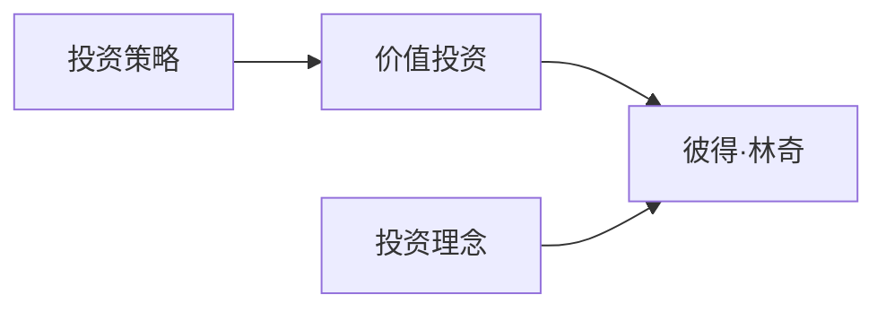
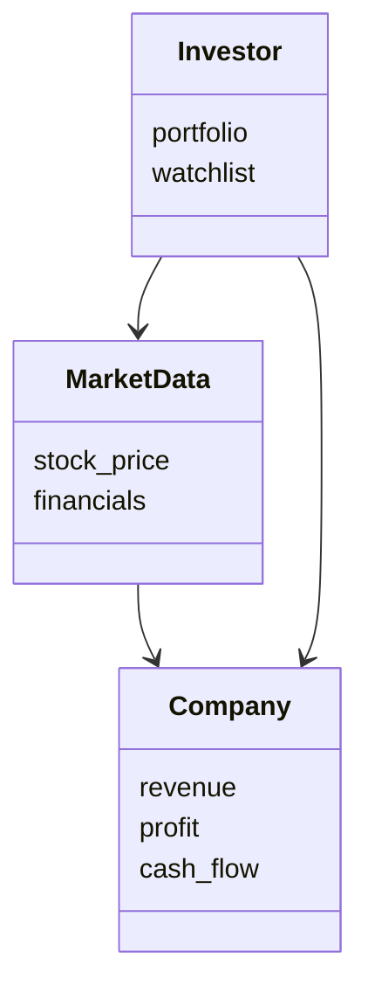
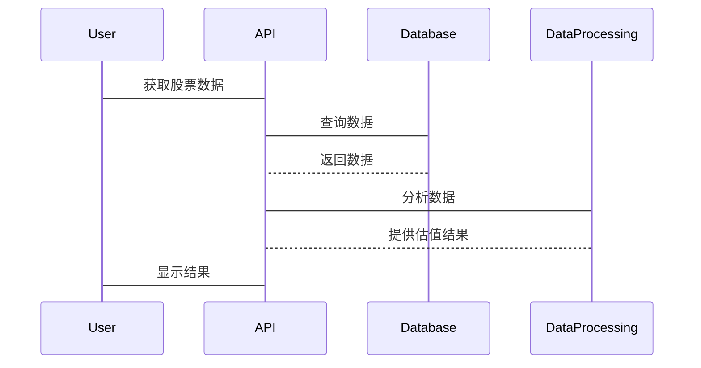

                 


# 彼得林奇与价值投资的关系

> 关键词：价值投资，彼得·林奇，投资策略，价值评估，安全边际

> 摘要：本文探讨了彼得·林奇与价值投资之间的关系，分析了价值投资的核心概念，彼得·林奇的投资策略及其对价值投资的贡献，最后结合实际案例，展示了如何将价值投资理念应用于投资决策中。

---

## 第1章：价值投资的核心概念与背景介绍

### 1.1 价值投资的定义与特点

#### 1.1.1 价值投资的定义
价值投资是一种投资策略，强调以低于其内在价值的价格购买优质资产。其核心在于识别市场中的估值偏差，利用市场的非理性来获利。

#### 1.1.2 价值投资的核心特点
- **安全边际**：购买价格低于内在价值，确保了投资的安全性。
- **长期持有**：价值投资者倾向于长期持有优质资产，等待其价值回归。
- **逆向投资**：在市场恐慌时买入，在市场狂热时卖出。

#### 1.1.3 价值投资与其它投资策略的对比
- **与趋势投资的区别**：趋势投资依赖价格走势，而价值投资关注内在价值。
- **与成长投资的区别**：成长投资侧重于公司未来的增长潜力，而价值投资关注当前的低估状态。

### 1.2 彼得·林奇的背景与投资理念

#### 1.2.1 彼得·林奇的生平简介
彼得·林奇是美国著名投资经理人，曾管理富达麦哲伦基金，创造了卓越的投资业绩。

#### 1.2.2 彼得·林奇的投资哲学
- **基本面分析**：林奇强调对公司基本面的深入研究，包括财务报表、管理层素质等。
- **分散投资**：通过分散投资降低风险，避免过度依赖单一资产。

#### 1.2.3 彼得·林奇的投资风格
林奇以其对公司基本面的深刻理解和耐心研究著称，善于挖掘市场中的低估机会。

### 1.3 价值投资与彼得·林奇的关系

#### 1.3.1 价值投资与彼得·林奇的共同点
- **基本面分析**：两者都强调对公司基本面的深入研究。
- **安全边际**：两者都重视购买价格低于内在价值。

#### 1.3.2 彼得·林奇对价值投资的贡献
林奇将价值投资理念实践化，总结出一套适用于普通投资者的方法论。

#### 1.3.3 彼得·林奇与价值投资的差异
- **操作细节**：林奇更注重于实际操作中的分散投资和风险控制。

### 1.4 价值投资的理论基础与实践应用

#### 1.4.1 价值投资的理论基础
- **格雷厄姆-多德公式**：用于估算股票的内在价值。
- **市场心理理论**：市场先生的情绪波动为价值投资者提供了套利机会。

#### 1.4.2 价值投资在实际中的应用
通过具体案例，展示如何运用价值投资策略选择投资标的。

#### 1.4.3 价值投资的局限性与改进方向
- **局限性**：市场短期波动可能影响投资结果。
- **改进方向**：结合其他策略，如成长投资，进行互补。

## 第2章：价值投资的核心概念与联系

### 2.1 价值投资的核心原理

#### 2.1.1 价值投资的基本原理
通过分析财务数据，估算公司内在价值，寻找低估的投资机会。

#### 2.1.2 价值投资的关键要素
- **内在价值**：公司未来现金流的现值。
- **安全边际**：买入价格与内在价值的差距。

#### 2.1.3 价值投资的数学模型与公式
使用格雷厄姆的估值公式：
$$
\text{内在价值} = \frac{\text{未来现金流}}{\text{折现率}}
$$

### 2.2 彼得·林奇的价值投资策略

#### 2.2.1 彼得·林奇的投资策略
通过深入研究，发现被市场忽视的低估公司。

#### 2.2.2 彼得·林奇的投资组合管理
分散投资，避免过度集中。

#### 2.2.3 彼得·林奇的风险控制方法
定期评估持仓，及时止损。

### 2.3 价值投资与彼得·林奇的关系分析

#### 2.3.1 价值投资与彼得·林奇的关系模型
通过表格对比，展示两者的异同点。

| **方面**       | **价值投资**                | **彼得·林奇**               |
|----------------|-----------------------------|-----------------------------|
| 核心理念       | 买入低于内在价值的股票    | 买入低估且基本面良好的股票  |
| 投资策略       | 基于安全边际              | 基于基本面分析              |
| 投资风格       | 逆向投资                  | 深度研究和分散投资          |

#### 2.3.2 价值投资与彼得·林奇的关系图解
使用mermaid绘制关系图：



## 第3章：价值投资的算法原理与数学模型

### 3.1 价值投资的算法原理

#### 3.1.1 价值投资的算法流程
1. 数据收集：获取目标公司的财务数据。
2. 估值计算：使用数学模型估算内在价值。
3. 价格比较：比较当前股价与内在价值。
4. 投资决策：若股价低于内在价值，考虑买入。

#### 3.1.2 价值投资的算法实现
用Python代码实现：

```python
def calculate_intrinsic_value(company_financials):
    # 计算未来现金流
    future_cash_flows = company_financials['future_cash_flows']
    # 计算折现率
    discount_rate = company_financials['discount_rate']
    # 估算内在价值
    iv = sum(future_cash_flows) / (1 + discount_rate)
    return iv

# 示例
financials = {
    'future_cash_flows': [100, 120, 150],
    'discount_rate': 0.08
}
intrinsic_value = calculate_intrinsic_value(financials)
print(f"内在价值：{intrinsic_value}")
```

### 3.2 价值投资的数学模型与公式

#### 3.2.1 价值投资的核心公式
$$
\text{内在价值} = \sum \frac{\text{未来现金流}}{(1 + r)^t}
$$
其中，r为折现率，t为时间。

#### 3.2.2 价值投资的数学模型
使用现金流折现模型（DCF）评估公司价值。

### 3.3 彼得·林奇投资策略的算法实现

#### 3.3.1 彼得·林奇投资策略的算法流程
1. 数据收集：获取目标公司的财务报表。
2. 基本面分析：评估公司盈利能力和管理层素质。
3. 安全边际评估：计算买入价格与内在价值的差距。
4. 投资决策：若满足条件，执行买入。

## 第4章：系统分析与架构设计方案

### 4.1 问题场景介绍
设计一个基于价值投资的决策支持系统，帮助投资者识别低估股票。

### 4.2 项目介绍
构建一个系统，整合基本面数据，提供估值工具和决策建议。

### 4.3 系统功能设计

#### 4.3.1 领域模型mermaid类图


### 4.4 系统架构设计

#### 4.4.1 系统架构mermaid图


### 4.5 系统接口设计
设计API接口，实现数据获取、分析和决策建议。

### 4.6 系统交互mermaid序列图


## 第5章：项目实战

### 5.1 环境安装
安装Python和相关库，如pandas、numpy。

### 5.2 核心实现

#### 5.2.1 数据收集
从公开数据源获取公司财务数据。

#### 5.2.2 数据分析
计算内在价值，判断是否低估。

### 5.3 案例分析
分析苹果公司是否符合价值投资标准。

### 5.4 代码实现

```python
import pandas as pd
import numpy as np

def calculate_intrinsic_value(financials):
    # 假设financials是一个包含未来现金流和折现率的字典
    future_flows = financials['future_flows']
    discount_rate = financials['discount_rate']
    iv = np.sum(future_flows / (1 + discount_rate)**range(len(future_flows)))
    return iv

# 示例数据
financials = {
    'future_flows': [100, 120, 150],
    'discount_rate': 0.08
}

iv = calculate_intrinsic_value(financials)
print(f"苹果公司的内在价值为：{iv}")
```

## 第6章：最佳实践与小结

### 6.1 最佳实践
- 定期复盘，调整投资组合。
- 保持学习，更新投资理念。

### 6.2 小结
本文探讨了彼得·林奇与价值投资的关系，分析了其核心概念和实际应用，帮助投资者更好地理解和应用价值投资策略。

### 6.3 注意事项
- 风险提示：投资有风险，需谨慎操作。
- 数据准确性：确保数据来源可靠。

### 6.4 拓展阅读
推荐阅读《价值》和《彼得·林奇的投资艺术》。

---

**作者：AI天才研究院 & 禅与计算机程序设计艺术**

