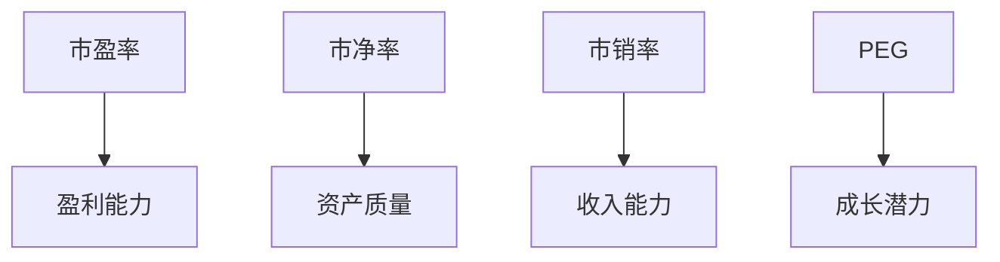

                 

# 彼得林奇四大选股指标详解

## 关键词
彼得·林奇, 选股指标, 市盈率, 市净率, 市销率, PEG, 投资策略

## 摘要
彼得·林奇作为投资界的传奇人物，提出了四大选股指标：市盈率（P/E）、市净率（P/B）、市销率（P/S）和企业盈利增长指标（PEG）。本文将详细分析这些指标的定义、计算方法、优缺点及应用场景，结合实际案例，帮助投资者更好地理解和运用这些指标进行选股。

---

## 第1章：彼得·林奇投资理念与选股方法

### 1.1 彼得·林奇的投资哲学
彼得·林奇是一位传奇的投资经理，他以价值投资为核心理念，主张通过深入研究公司基本面来选择具有长期增长潜力的股票。他认为，投资不仅仅是对市场的理解，更是对公司的理解。

#### 1.1.1 价值投资的核心理念
价值投资的核心在于寻找被市场低估的股票。彼得·林奇强调，投资者应关注公司的财务状况、盈利能力、成长性和行业地位，而不仅仅是市场趋势。

#### 1.1.2 彼得·林奇的选股方法论
林奇的选股方法注重对公司基本面的分析，他提出了四大选股指标：市盈率（P/E）、市净率（P/B）、市销率（P/S）和企业盈利增长指标（PEG）。这些指标帮助投资者评估公司的价值和成长潜力。

#### 1.1.3 投资者心态与市场认知
投资者的心态和市场认知能力是成功投资的关键。林奇强调，投资者应保持理性，避免被市场情绪左右，并坚持长期投资。

---

## 第2章：四大选股指标的核心原理

### 2.1 市盈率（P/E）指标
市盈率是评估公司盈利能力的重要指标。

#### 2.1.1 市盈率的定义与计算公式
$$ \text{市盈率} = \frac{\text{股价}}{\text{每股收益}} $$

#### 2.1.2 市盈率的优缺点分析
- **优点**：反映市场对公司盈利能力的预期，适合比较同类公司。
- **缺点**：受行业周期和市场情绪影响较大，且不适用于亏损公司。

#### 2.1.3 市盈率在选股中的应用场景
市盈率适用于评估公司的盈利能力和市场估值。例如，如果一家公司的市盈率低于行业平均水平，可能意味着它被市场低估。

### 2.2 市净率（P/B）指标
市净率是评估公司资产质量的重要指标。

#### 2.2.1 市净率的定义与计算公式
$$ \text{市净率} = \frac{\text{股价}}{\text{每股净资产}} $$

#### 2.2.2 市净率的优缺点分析
- **优点**：适用于重资产行业，如银行和制造业，能够反映公司的资产价值。
- **缺点**：忽视了公司的盈利能力，且净资产价值可能受会计政策影响。

#### 2.2.3 市净率在选股中的应用场景
市净率适用于评估公司的资产质量，尤其是重资产行业。例如，如果一家银行的市净率低于1，可能意味着它被市场低估。

### 2.3 市销率（P/S）指标
市销率是评估公司收入能力的重要指标。

#### 2.3.1 市销率的定义与计算公式
$$ \text{市销率} = \frac{\text{股价}}{\text{每股收入}} $$

#### 2.3.2 市销率的优缺点分析
- **优点**：适用于成长型企业，能够反映公司的收入能力。
- **缺点**：忽视了公司的利润和资产价值。

#### 2.3.3 市销率在选股中的应用场景
市销率适用于评估公司的收入能力。例如，如果一家科技公司的市销率低于行业平均水平，可能意味着它具有较高的投资价值。

### 2.4 企业盈利增长指标（PEG）
PEG是评估公司成长潜力的重要指标。

#### 2.4.1 PEG的定义与计算公式
$$ \text{PEG} = \frac{\text{市盈率}}{\text{盈利增长率}} $$

#### 2.4.2 PEG的优缺点分析
- **优点**：综合考虑了市盈率和盈利增长率，能够反映公司的成长潜力。
- **缺点**：计算复杂，且盈利增长率可能波动较大。

#### 2.4.3 PEG在选股中的应用场景
PEG适用于评估公司的成长潜力。例如，如果一家公司的PEG低于1，可能意味着它具有较高的投资价值。

---

## 第3章：四大选股指标的综合运用

### 3.1 指标之间的关系与对比
以下是一个指标对比表格，帮助投资者更好地理解每个指标的特点和应用场景。

| 指标名称 | 定义 | 适用场景 | 优缺点 |
|----------|------|----------|--------|
| P/E      | 股价/每股收益 | 评估盈利能力 | 易受行业影响 |
| P/B      | 股价/每股净资产 | 评估资产质量 | 适用于重资产行业 |
| P/S      | 股价/每股收入 | 评估收入能力 | 适用于成长型企业 |
| PEG      | 市盈率/盈利增长率 | 评估成长性 | 适合长期成长股 |

### 3.2 指标关系的Mermaid图
以下是一个指标关系的Mermaid图，展示它们如何相互关联。

### 3.3 案例分析
假设我们有两家公司：A公司和B公司。

- **A公司**：市盈率=15，市净率=2，市销率=1，PEG=1。
- **B公司**：市盈率=20，市净率=3，市销率=2，PEG=0.5。

根据以上指标，我们可以看到B公司的PEG较低，可能具有较高的成长潜力。

---

## 第4章：投资策略与风险管理

### 4.1 投资策略
在实际投资中，投资者应结合多个指标进行选股，避免过度依赖单一指标。例如，可以综合考虑市盈率和市净率，选择具有较低市盈率和较低市净率的公司。

### 4.2 风险管理
投资者应设定止损点，以避免重大损失。此外，应定期评估投资组合的表现，并根据市场变化进行调整。

---

## 第5章：总结与展望

### 5.1 总结
彼得·林奇的四大选股指标为投资者提供了一套科学的选股方法。通过综合运用这些指标，投资者可以更好地评估公司的价值和成长潜力，从而做出更明智的投资决策。

### 5.2 展望
随着市场的变化，投资者需要不断调整和优化自己的选股策略。未来，随着人工智能和大数据技术的发展，选股指标将更加多样化和精准化，为投资者提供更多的工具和方法。

---

## 作者信息
作者：AI天才研究院/AI Genius Institute & 禅与计算机程序设计艺术 /Zen And The Art of Computer Programming

---

感谢您的阅读！希望本文能够帮助您更好地理解和运用彼得·林奇的四大选股指标，祝您投资成功！

