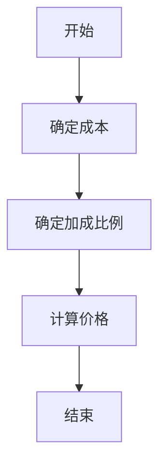
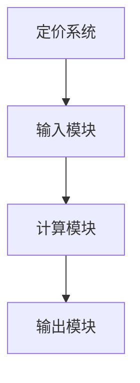

                 


# 彼得·林奇如何分析公司产品定价策略

## 关键词：定价策略、彼得·林奇、成本加成定价法、价值定价法、定价模型

## 摘要：  
彼得·林奇作为世界顶级的投资经理人，他通过分析公司的定价策略来评估公司的市场地位和盈利能力。定价策略是公司经营的核心要素之一，直接关系到企业的利润和市场竞争力。本文从定价策略的基本概念、核心要素、定价模型、系统架构设计、项目实战等多个方面进行深入分析，结合具体案例，详细解读彼得·林奇的定价策略分析方法，并通过Python代码实现定价模型，帮助读者掌握定价策略的分析与实践技巧。

---

## 第1章: 定价策略的基本概念

### 1.1 定价策略的背景与重要性  
#### 1.1.1 产品定价的基本问题背景  
定价策略是企业经营中一个核心问题，直接关系到企业的利润和市场竞争力。定价过高可能导致市场需求不足，定价过低可能无法覆盖成本，从而影响企业的盈利能力。  

#### 1.1.2 定价策略在企业经营中的核心地位  
定价策略不仅是企业营销策略的重要组成部分，还是企业战略管理的关键环节。通过合理的定价策略，企业可以实现市场份额的扩张和利润的最大化。  

#### 1.1.3 彼得·林奇分析定价策略的出发点与目标  
彼得·林奇认为，定价策略是评估公司价值的重要指标之一。他通过分析公司的定价策略，判断公司是否能够持续盈利，并为投资者提供可靠的决策依据。  

---

### 1.2 定价策略的核心要素  
#### 1.2.1 定价的基本原理  
定价策略的核心在于平衡成本、市场需求和竞争环境。合理的定价策略需要考虑企业的成本结构、市场需求弹性以及竞争对手的定价策略。  

#### 1.2.2 影响定价的主要因素  
- **成本因素**：包括生产成本、运营成本和研发投入等。  
- **市场需求**：包括消费者需求弹性、市场规模和购买力等。  
- **竞争因素**：包括竞争对手的定价策略、市场占有率和品牌影响力等。  

#### 1.2.3 定价策略的边界与外延  
定价策略不仅涉及产品本身的定价，还包括服务定价、市场细分定价以及动态定价等多方面内容。  

---

### 1.3 定价策略的概念结构与核心要素  
#### 1.3.1 定价策略的构成要素  
- **定价目标**：包括市场份额最大化、利润最大化和品牌价值提升等。  
- **定价方法**：包括成本加成定价法、价值定价法和竞争定价法等。  
- **定价工具**：包括定价模型、数据分析和市场调研等。  

#### 1.3.2 各种定价策略的特征对比  
| 定价策略 | 基础 | 优点 | 缺点 | 适用场景 |  
|----------|------|------|------|----------|  
| 成本加成定价法 | 成本 | 简单易行 | 可能忽略市场需求 | 小型企业或市场垄断行业 |  
| 价值定价法 | 价值 | 提高利润率 | 需求弹性大 | 高端产品或品牌溢价能力强的企业 |  
| 竞争定价法 | 竞争对手定价 | 适应市场 | 利润空间小 | 竞争激烈的行业 |  

#### 1.3.3 定价策略与企业利润的关系  
定价策略直接影响企业的收入和利润。通过合理的定价策略，企业可以在满足市场需求的同时实现利润最大化。  

---

## 第2章: 定价策略的核心概念与联系  

### 2.1 定价策略的核心原理  
#### 2.1.1 成本导向定价法  
成本导向定价法是以产品成本为基础，通过加成一定比例的利润来确定价格。  

#### 2.1.2 需求导向定价法  
需求导向定价法是以市场需求为基础，通过分析消费者对价格的敏感度来确定价格。  

#### 2.1.3 竞争导向定价法  
竞争导向定价法是以竞争对手的定价为基准，通过比较和调整来确定价格。  

---

### 2.2 定价策略的核心概念对比  

#### 2.2.1 不同定价方法的特征对比  
| 定价方法 | 基础 | 计算公式 | 优缺点 |  
|----------|------|----------|--------|  
| 成本加成定价法 | 成本 | $P = C + C \times M$ | 简单易行，但可能忽略市场需求 |  
| 价值定价法 | 价值 | $P = V \times Q$ | 提高利润率，但需求弹性大 |  
| 竞争定价法 | 竞争对手 | $P = C + D$ | 适应市场，但利润空间小 |  

#### 2.2.2 各种定价策略的优缺点分析  
- 成本加成定价法：简单易行，但可能忽略市场需求。  
- 价值定价法：提高利润率，但需求弹性大。  
- 竞争定价法：适应市场，但利润空间小。  

#### 2.2.3 定价策略与企业利润的关系  
定价策略直接影响企业的收入和利润。通过合理的定价策略，企业可以在满足市场需求的同时实现利润最大化。  

---

## 第3章: 定价策略的算法原理  

### 3.1 定价模型的数学公式  
定价模型的数学公式可以通过以下方式表示：  
$$ P = C + C \times M $$  
其中，$P$ 是价格，$C$ 是成本，$M$ 是加成比例。  

### 3.2 定价模型的流程图  



---

## 第4章: 系统分析与架构设计  

### 4.1 系统功能设计  
- 输入模块：接收产品成本、市场需求和竞争对手定价等输入数据。  
- 计算模块：根据输入数据计算定价。  
- 输出模块：显示计算结果。  

### 4.2 系统架构设计  



---

## 第5章: 项目实战  

### 5.1 环境安装  
- 安装Python和相关库。  

### 5.2 核心代码实现  

```python
def calculate_price(cost, markup):
    return cost * (1 + markup)
```

### 5.3 代码解读与分析  
- 代码实现了一个简单的成本加成定价法，根据成本和加成比例计算价格。  

### 5.4 案例分析  
以某制造企业为例，假设产品成本为100元，加成比例为20%，则价格为120元。  

---

## 第6章: 最佳实践与总结  

### 6.1 最佳实践 tips  
- 定价策略需要结合市场需求和竞争环境。  
- 定价模型需要根据实际情况进行调整。  

### 6.2 小结  
彼得·林奇通过分析定价策略，帮助企业实现利润最大化和市场竞争力的提升。  

### 6.3 注意事项  
- 定价策略需要结合企业的实际情况。  
- 定价模型需要根据市场变化进行调整。  

### 6.4 拓展阅读  
- 《定价策略与企业利润最大化》  
- 《彼得·林奇投资策略解析》  

---

## 作者：AI天才研究院/AI Genius Institute & 禅与计算机程序设计艺术 /Zen And The Art of Computer Programming

