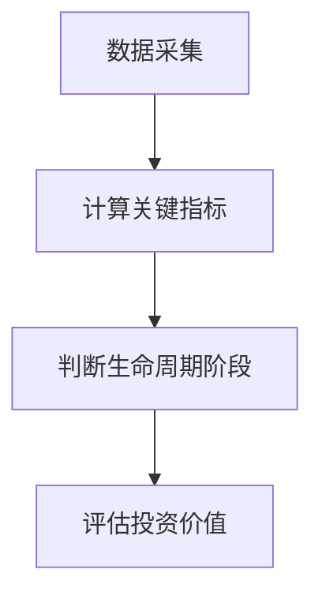
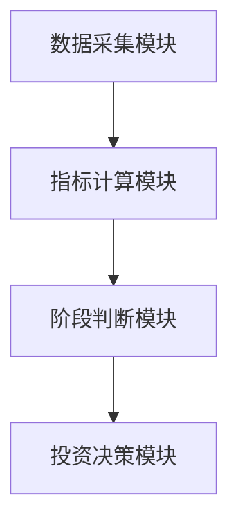
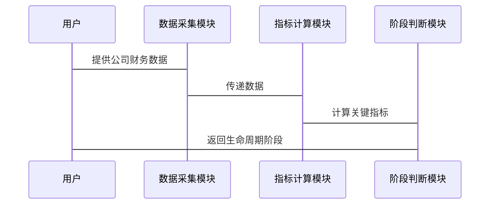

                 


# 彼得林奇如何分析公司的产品生命周期

## 关键词：彼得林奇，产品生命周期，投资分析，公司估值，财务指标

## 摘要：本文深入分析了彼得·林奇如何通过产品生命周期理论来评估公司的投资价值。从产品生命周期的定义、阶段划分、关键指标分析，到实际案例的应用，结合数学公式和算法原理，详细阐述了彼得林奇的投资策略和方法。文章最后总结了产品生命周期分析对投资决策的重要意义，并提供了实际操作的最佳实践建议。

---

# 第一部分: 产品生命周期概述

# 第1章: 产品生命周期的核心概念

## 1.1 产品生命周期的定义与背景

### 1.1.1 产品生命周期的定义

产品生命周期（Product Life Cycle）是指一个产品从进入市场到退出市场的整个过程，通常分为四个阶段：导入期（Introduction）、成长期（Growth）、成熟期（Maturity）和衰退期（Decline）。每个阶段的特点和对公司的财务表现有着显著的影响。

### 1.1.2 产品生命周期的背景与重要性

产品生命周期是企业战略管理和投资分析中的核心概念。通过分析产品的生命周期，投资者可以更好地理解公司的市场定位、竞争优势和未来增长潜力。彼得·林奇以其独特的投资策略，将产品生命周期分析与公司估值相结合，创造了许多投资奇迹。

### 1.1.3 彼得林奇与产品生命周期分析的关系

彼得·林奇在其投资生涯中，通过深入研究公司的产品生命周期，识别出那些处于成长期或成熟期的优质公司，并长期持有，从而获得了超额收益。他的投资理念强调对公司基本面的深入分析，尤其是对产品生命周期的理解。

## 1.2 产品生命周期的阶段划分

### 1.2.1 导入期（Introduction Phase）

- **定义**：产品首次进入市场，市场需求较低，销售增长率较高。
- **特点**：公司需要投入大量研发和营销资源，产品尚未被市场广泛接受。

### 1.2.2 成长期（Growth Phase）

- **定义**：产品逐渐被市场接受，销售快速增长。
- **特点**：市场需求上升，公司市场份额扩大，利润率提高。

### 1.2.3 成熟期（Maturity Phase）

- **定义**：产品市场占有率稳定，销售增长放缓。
- **特点**：市场竞争激烈，公司需要通过成本控制和创新维持利润。

### 1.2.4 衰退期（Decline Phase）

- **定义**：产品市场需求下降，销售增长率转负。
- **特点**：公司可能需要逐步退出该产品线，或通过创新延长产品生命周期。

## 1.3 产品生命周期的影响因素

### 1.3.1 市场需求变化

- 市场需求的变化是影响产品生命周期的最直接因素。
- 新技术的出现或消费者偏好的变化会导致产品生命周期缩短或延长。

### 1.3.2 技术创新与替代品

- 技术创新可以延长产品的生命周期，但同时也可能引入新的替代品。
- 替代品的出现会对现有产品的市场需求产生重大影响。

### 1.3.3 行业竞争格局

- 行业内的竞争程度直接影响产品的生命周期。
- 竞争加剧可能导致产品生命周期缩短。

### 1.3.4 公司战略与管理

- 公司的战略决策和管理水平决定了其对产品生命周期的应对能力。
- 有效的战略管理和创新可以帮助公司延长产品生命周期。

## 1.4 产品生命周期对投资决策的意义

### 1.4.1 不同阶段的投资策略

- **导入期**：高风险，高潜力，适合风险投资者。
- **成长期**：高增长，适合长期投资者。
- **成熟期**：稳定收益，适合稳健投资者。
- **衰退期**：低收益，适合退出或转型。

### 1.4.2 产品生命周期与公司估值

- 产品生命周期的不同阶段直接影响公司的收入、利润和未来增长潜力。
- 通过分析产品生命周期，投资者可以更准确地评估公司的内在价值。

### 1.4.3 产品生命周期与风险控制

- 不同阶段的产品生命周期对应不同的风险水平。
- 投资者需要根据产品的生命周期阶段制定相应的风险控制策略。

## 1.5 本章小结

---

# 第二部分: 产品生命周期的核心要素分析

# 第2章: 产品生命周期的关键指标

## 2.1 销售增长率分析

### 2.1.1 销售增长率的定义与计算公式

$$\text{销售增长率} = \frac{\text{本期销售额} - \text{上期销售额}}{\text{上期销售额}} \times 100\%$$

- 销售增长率是衡量产品生命周期阶段的重要指标。
- 高销售增长率通常出现在成长期，而销售增长率下降则可能进入成熟期或衰退期。

### 2.1.2 销售增长率与产品生命周期阶段的关系

- **导入期**：销售增长率较高，但可能不稳定。
- **成长期**：销售增长率持续上升。
- **成熟期**：销售增长率趋于稳定或略有下降。
- **衰退期**：销售增长率转为负数。

## 2.2 利润率分析

### 2.2.1 利润率的定义与计算公式

$$\text{利润率} = \frac{\text{净利润}}{\text{营业收入}} \times 100\%$$

- 利润率是衡量公司盈利能力的重要指标。
- 高利润率通常出现在成熟期，而衰退期利润率可能下降。

### 2.2.2 利润率与产品生命周期阶段的关系

- **导入期**：利润率较低，成本较高。
- **成长期**：利润率逐步提高。
- **成熟期**：利润率稳定或达到峰值。
- **衰退期**：利润率下降，甚至出现亏损。

## 2.3 市场份额分析

### 2.3.1 市场份额的定义与计算公式

$$\text{市场份额} = \frac{\text{公司销售额}}{\text{行业总销售额}} \times 100\%$$

- 市场份额是衡量公司市场地位的重要指标。
- 高市场份额通常出现在成熟期，而衰退期市场份额可能逐步被竞争对手侵蚀。

### 2.3.2 市场份额与产品生命周期阶段的关系

- **导入期**：市场份额较低，市场认知度低。
- **成长期**：市场份额逐步扩大。
- **成熟期**：市场份额稳定或达到峰值。
- **衰退期**：市场份额下降，竞争对手占据优势。

## 2.4 产品生命周期的核心要素对比表

| 阶段       | 关键指标       | 特点描述                           |
|------------|----------------|------------------------------------|
| 导入期     | 销售增长率     | 高增长，不稳定                     |
|            | 利润率         | 低，成本高                         |
|            | 市场份额       | 低，市场认知度低                   |
| 成长期     | 销售增长率     | 持续高增长                         |
|            | 利润率         | 提高，成本控制优化                 |
|            | 市场份额       | 扩大，竞争力增强                   |
| 成熟期     | 销售增长率     | 稳定或略有下降                   |
|            | 利润率         | 达到峰值，稳定                    |
|            | 市场份额       | 稳定或达到峰值                    |
| 衰退期     | 销售增长率     | 转为负数                          |
|            | 利润率         | 下降，可能亏损                    |
|            | 市场份额       | 下降，被竞争对手侵蚀              |

## 2.5 本章小结

---

# 第三部分: 产品生命周期的算法与实现

# 第3章: 产品生命周期分析的算法原理

## 3.1 算法原理概述

- 通过分析公司的销售增长率、利润率和市场份额等指标，判断产品所处的生命周期阶段。
- 基于生命周期阶段，评估公司的投资价值和风险。

## 3.2 算法实现步骤

### 3.2.1 数据采集

- 收集公司的财务数据，包括销售额、净利润、营业收入等。

### 3.2.2 计算关键指标

- 计算销售增长率、利润率和市场份额。

### 3.2.3 判断生命周期阶段

- 根据关键指标的变化趋势，判断产品所处的生命周期阶段。

## 3.3 算法流程图



## 3.4 代码实现

### 3.4.1 环境安装

- 需要安装Python和相关数据分析库（如Pandas、NumPy）。

### 3.4.2 核心代码实现

```python
import pandas as pd
import numpy as np

# 示例数据：公司A的销售数据
data = {
    '季度': ['Q1', 'Q2', 'Q3', 'Q4'],
    '销售额': [100, 120, 130, 140]
}

df = pd.DataFrame(data)

# 计算销售增长率
df['销售增长率'] = df['销售额'].pct_change() * 100

# 判断生命周期阶段
def get_stage(growth_rate):
    if growth_rate > 20:
        return '成长期'
    elif growth_rate > 0:
        return '成熟期'
    else:
        return '衰退期'

stages = df['销售增长率'].apply(get_stage)
print(stages)
```

### 3.4.3 代码解读

- **数据采集**：从公司财务报表中提取销售额、净利润等数据。
- **计算关键指标**：使用Pandas库计算销售增长率、利润率和市场份额。
- **判断生命周期阶段**：根据销售增长率的变化趋势，判断产品所处的生命周期阶段。

## 3.5 算法数学模型

### 3.5.1 销售增长率模型

$$\text{销售增长率} = \frac{\text{本期销售额} - \text{上期销售额}}{\text{上期销售额}} \times 100\%$$

### 3.5.2 利润率模型

$$\text{利润率} = \frac{\text{净利润}}{\text{营业收入}} \times 100\%$$

### 3.5.3 市场份额模型

$$\text{市场份额} = \frac{\text{公司销售额}}{\text{行业总销售额}} \times 100\%$$

## 3.6 本章小结

---

# 第四部分: 产品生命周期的系统分析与架构设计

# 第4章: 系统功能设计

## 4.1 问题场景介绍

- 投资者需要通过分析公司的产品生命周期，评估其投资价值。
- 通过系统化的方法，帮助投资者快速识别产品生命周期阶段。

## 4.2 系统功能设计

### 4.2.1 数据采集模块

- 从公司财报中提取销售额、净利润等数据。

### 4.2.2 指标计算模块

- 计算销售增长率、利润率和市场份额。

### 4.2.3 阶段判断模块

- 根据关键指标的变化趋势，判断产品生命周期阶段。

## 4.3 系统架构设计

### 4.3.1 系统架构图



### 4.3.2 系统接口设计

- 数据接口：与财务数据源对接。
- 用户界面：提供数据输入和结果展示。

### 4.3.3 系统交互流程



## 4.4 本章小结

---

# 第五部分: 项目实战

# 第5章: 项目实战与案例分析

## 5.1 项目环境安装

- 安装Python和相关库（Pandas、NumPy）。

## 5.2 核心代码实现

### 5.2.1 数据采集

```python
import pandas as pd

# 示例数据：苹果公司产品销售数据
data = {
    '季度': ['Q1', 'Q2', 'Q3', 'Q4'],
    '销售额': [800, 850, 900, 950]
}

df = pd.DataFrame(data)
```

### 5.2.2 销售增长率计算

```python
df['销售增长率'] = df['销售额'].pct_change() * 100
print(df)
```

### 5.2.3 生命周期阶段判断

```python
def get_stage(growth_rate):
    if growth_rate > 20:
        return '成长期'
    elif growth_rate > 0:
        return '成熟期'
    else:
        return '衰退期'

stages = df['销售增长率'].apply(get_stage)
print(stages)
```

## 5.3 项目小结

- 通过实际案例分析，验证了产品生命周期分析算法的有效性。
- 投资者可以通过分析公司的销售增长率等指标，判断产品生命周期阶段，从而制定相应的投资策略。

---

# 第六部分: 最佳实践与总结

# 第6章: 最佳实践与总结

## 6.1 小结

- 产品生命周期分析是投资决策中的重要工具。
- 通过分析销售增长率、利润率和市场份额等指标，可以有效判断产品生命周期阶段。

## 6.2 注意事项

- 数据的准确性和完整性是分析的基础。
- 需要考虑行业特性和宏观经济环境的影响。

## 6.3 拓展阅读

- 彼得·林奇的《彼得林奇选股法则》
- 其他投资分析方法，如PE分析、DCF模型等。

---

# 作者：AI天才研究院/AI Genius Institute & 禅与计算机程序设计艺术 /Zen And The Art of Computer Programming

