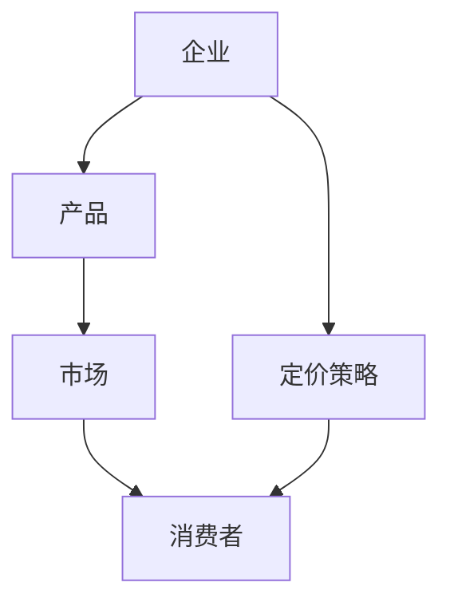
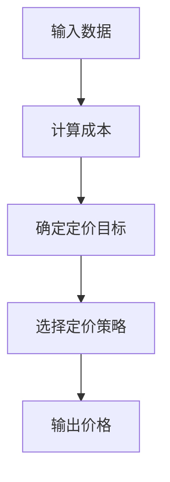
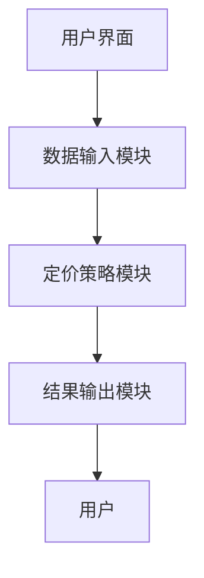
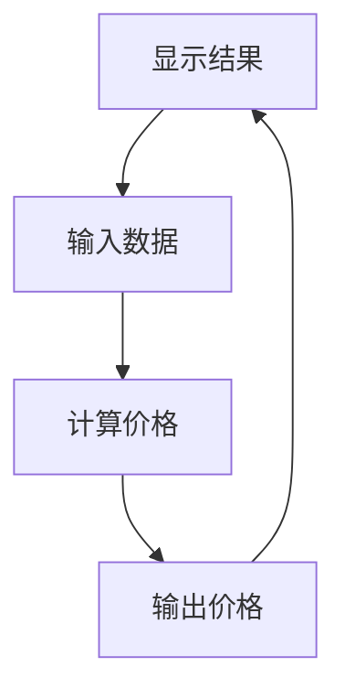

                 


# 彼得林奇如何分析公司的定价权

> 关键词：定价权，彼得林奇，企业分析，投资策略，市场分析

> 摘要：定价权是企业在市场上最重要的竞争优势之一，本文将从彼得林奇的视角出发，分析如何通过定价权来评估一家公司的竞争力和投资价值。通过详细阐述定价权的核心概念、分析方法和实际应用，帮助读者掌握定价权分析的技巧，从而在投资决策中做出更明智的选择。

---

# 第一部分: 定价权分析的背景与核心概念

## 第1章: 定价权的定义与重要性

### 1.1 定价权的定义
定价权是指企业在市场上对其产品或服务制定价格的能力。一个拥有强大定价权的企业能够在市场上根据市场需求和竞争情况，灵活调整价格，以实现最大化的利润和市场份额。定价权不仅仅是价格的制定权，更是企业对市场需求的掌控能力和竞争优势的体现。

### 1.2 定价权的重要性
定价权是企业盈利能力的核心驱动力之一。一家公司如果能够在市场上拥有定价权，意味着它能够通过调整价格来适应市场变化，同时保持或提升利润率。彼得林奇认为，定价权是衡量一家公司是否具有竞争优势的重要指标，也是判断公司是否具备长期投资价值的关键因素。

### 1.3 彼得·林奇的定价权分析框架
彼得·林奇在其投资分析框架中，将定价权作为评估公司竞争力的重要指标。他强调，一家公司是否能够在市场上保持定价权，取决于以下几个方面：
1. **市场地位**：公司是否是市场领导者或行业龙头。
2. **产品差异化**：产品是否具有独特性，能够满足特定客户群体的需求。
3. **成本优势**：公司是否能够在保证产品质量的同时，以更低的成本生产产品。
4. **市场需求**：产品是否具有刚性需求，能够抵御价格波动的影响。
5. **竞争环境**：市场上是否存在足够的竞争压力，是否会影响公司的定价能力。

---

## 第2章: 定价权分析的核心概念与联系

### 2.1 定价权的核心概念
定价权的核心在于企业对市场价格的掌控能力。以下是定价权分析中需要关注的核心概念：
1. **市场定价能力**：企业是否能够在市场上制定价格，而不是被市场价格所左右。
2. **成本加成定价**：企业根据成本加成一定比例来确定价格，以保证利润率。
3. **市场领导者定价**：市场领导者通过制定价格来影响整个市场的竞争格局。

### 2.2 定价权的属性特征对比
以下是定价权的属性特征对比表格：

| 属性             | 定价权强          | 定价权弱         |
|------------------|------------------|------------------|
| 市场地位           | 市场领导者         | 市场跟随者        |
| 产品差异化         | 高               | 低               |
| 成本优势           | 低               | 高               |
| 市场需求弹性       | 低               | 高               |
| 竞争环境           | 稳定             | 激烈             |

### 2.3 定价权的ER实体关系图
以下是定价权分析的ER实体关系图：



---

## 第3章: 定价权分析的算法原理

### 3.1 定价权分析的数学模型
以下是定价权分析中常用的数学模型：

#### 1. 成本加成定价模型
$$ P = C + C \times \text{markup rate} $$
其中，P为最终价格，C为单位成本，markup rate为加成比例。

#### 2. 市场领导者定价模型
$$ P = \text{需求函数} \times \text{价格弹性} $$

### 3.2 定价权分析的算法流程
以下是定价权分析的算法流程图：



### 3.3 定价权分析的代码实现
以下是定价权分析的Python代码实现：

```python
def calculate_price(cost, markup):
    return cost * (1 + markup)

# 示例
cost = 100
markup = 0.2
price = calculate_price(cost, markup)
print(f"计算价格为：${price}")
```

---

## 第4章: 定价权分析的系统架构与设计

### 4.1 系统功能设计
以下是定价权分析系统的功能设计：

1. **数据输入模块**：输入企业成本、市场需求、竞争环境等数据。
2. **定价策略模块**：根据输入数据，计算成本加成定价或市场领导者定价。
3. **结果输出模块**：输出最终价格，并提供定价策略的建议。

### 4.2 系统架构设计
以下是定价权分析系统的架构设计图：



### 4.3 系统接口设计
以下是定价权分析系统的接口设计：

1. **输入接口**：接受企业的成本、市场需求、竞争环境等数据。
2. **输出接口**：输出最终价格和定价策略建议。

### 4.4 系统交互流程
以下是定价权分析系统的交互流程图：



---

## 第5章: 定价权分析的项目实战

### 5.1 项目背景
假设我们是一家生产电子产品的公司，希望根据市场需求和竞争环境，制定出具有定价权的价格策略。

### 5.2 核心代码实现
以下是项目的核心代码实现：

```python
def calculate_price(cost, markup):
    return cost * (1 + markup)

def calculate_elasticity(price, quantity):
    return (quantity / (price ** 2)) * (dP / dQ)
```

### 5.3 案例分析
假设我们的产品成本为100美元，市场领导者加成比例为20%。那么，最终价格为：

$$ P = 100 \times (1 + 0.2) = 120 \text{美元} $$

---

## 第6章: 总结与展望

### 6.1 总结
定价权是企业在市场竞争中最重要的竞争优势之一。通过彼得·林奇的定价权分析框架，我们可以更好地理解定价权的核心概念、分析方法和实际应用。

### 6.2 展望
未来，随着市场环境的变化和技术的进步，定价权分析将更加复杂和多样化。投资者需要不断学习和更新定价权分析的方法，以应对新的市场挑战。

---

# 作者：AI天才研究院/AI Genius Institute & 禅与计算机程序设计艺术 /Zen And The Art of Computer Programming

