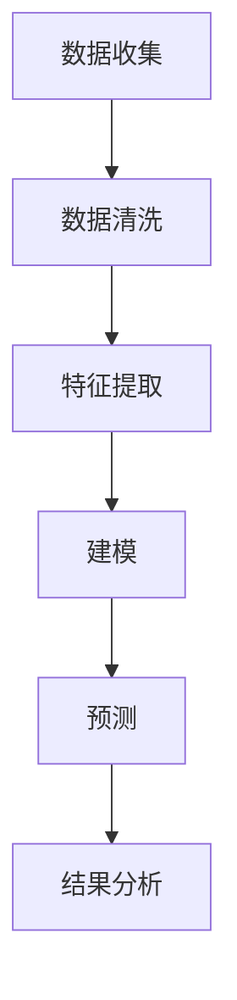
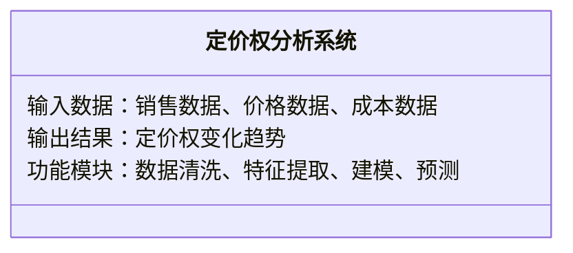
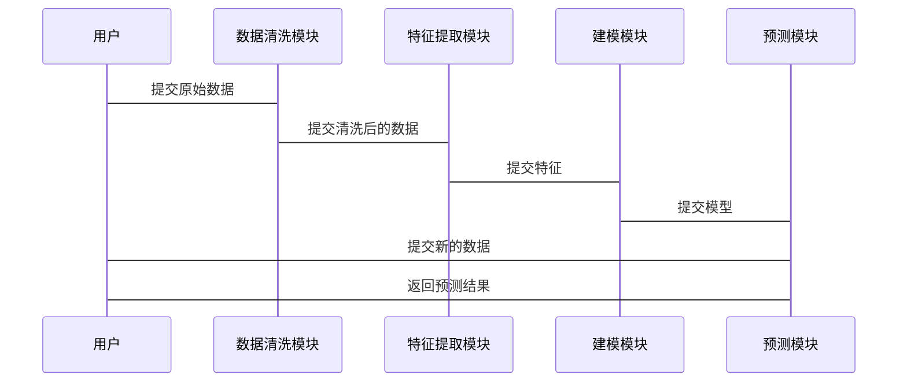

                 


# 彼得林奇如何分析公司的定价权随时间的变化

> 关键词：定价权，彼得·林奇，定价权变化，定价权分析，定价权模型

> 摘要：本文深入探讨了定价权的概念、影响因素及其随时间的变化规律。通过分析彼得·林奇的定价权分析框架，结合数学模型和实际案例，详细阐述了如何系统性地分析定价权的变化。文章内容涵盖定价权的核心概念、影响因素、算法分析、数学模型、系统架构、项目实战等多个方面，帮助读者全面理解定价权的变化及其对企业战略的影响。

---

## 第一部分: 背景介绍

### 第1章: 定价权的核心概念与问题背景

#### 1.1 什么是定价权

##### 1.1.1 定价权的定义
定价权是指企业在市场中对其产品或服务制定价格的能力。这种能力通常取决于企业的市场地位、产品独特性、成本结构以及市场需求等因素。定价权越强，企业对价格的控制能力越强，从而能够在市场竞争中获得更高的利润和市场份额。

##### 1.1.2 定价权的核心要素
定价权的核心要素包括以下几个方面：
1. **市场地位**：企业在市场中的地位，包括是否是市场领导者、是否具有品牌优势等。
2. **产品差异化**：产品是否具有独特的卖点，是否能够满足特定客户的需求。
3. **成本结构**：企业的生产成本、运营成本等，决定了企业是否能够在价格战中生存。
4. **市场需求弹性**：市场对价格变化的敏感程度，需求弹性大的产品定价权较弱。
5. **竞争环境**：行业内竞争的激烈程度，是否存在替代品或竞争对手。

##### 1.1.3 定价权的边界与外延
定价权的边界在于企业对价格的实际控制能力。当市场环境发生变化时，定价权可能会受到限制。例如，在市场需求疲软的情况下，企业可能不得不降低价格以维持销售量。定价权的外延则包括价格调整的灵活性、定价策略的多样性以及价格对利润的影响等。

#### 1.2 定价权的重要性

##### 1.2.1 定价权对企业的战略意义
定价权是企业核心竞争力的重要组成部分。拥有强定价权的企业能够在市场中占据主动地位，通过调整价格来应对市场变化，优化利润结构。例如，苹果公司通过其品牌和技术优势，拥有较强的定价权，能够推出高价产品并获得市场认可。

##### 1.2.2 定价权与市场竞争的关系
在竞争激烈的市场中，定价权是企业差异化竞争的重要手段。通过制定有竞争力的价格策略，企业可以吸引更多的客户，扩大市场份额。然而，过强的定价权可能会导致竞争对手采取价格战或其他策略来抢夺市场份额。

##### 1.2.3 定价权对股东价值的影响
强定价权意味着企业能够稳定地获得高利润，从而为股东创造更高的价值。例如，高端奢侈品品牌通常具有较强的定价权，能够通过高价策略实现高利润。

---

### 第2章: 彼得·林奇的分析方法

#### 2.1 彼得·林奇的背景介绍

##### 2.1.1 彼得·林奇的生平简介
彼得·林奇（Peter Lynch）是美国著名的投资家和基金经理，被誉为“股神”。他在管理麦哲伦基金期间取得了卓越的投资业绩，成为投资领域的传奇人物。

##### 2.1.2 彼得·林奇的投资理念
林奇的投资理念强调长期投资、价值发现和分散投资。他认为，投资成功的关键在于找到具有持续竞争优势的企业，并长期持有。

##### 2.1.3 彼得·林奇的分析框架
林奇的分析框架注重对企业基本面的深入研究，包括企业的财务状况、市场地位、竞争优势等方面。他尤其关注企业的定价权，认为定价权是企业长期竞争优势的重要体现。

#### 2.2 彼得·林奇的定价权分析框架

##### 2.2.1 定价权的四个维度
1. **市场地位**：企业在市场中的地位和影响力。
2. **产品差异化**：产品是否具有独特的卖点。
3. **成本优势**：企业是否具备成本优势。
4. **市场需求弹性**：市场对价格变化的敏感程度。

##### 2.2.2 定价权的动态变化
定价权不是一成不变的，它会随着市场环境的变化而变化。例如，当市场需求增加时，企业可能能够提高价格；而当市场需求减少时，企业可能需要降低价格以维持销售。

##### 2.2.3 定价权的长期趋势分析
林奇强调，定价权的长期趋势分析是评估企业竞争优势的重要手段。通过分析企业过去和未来的定价权变化趋势，投资者可以更好地判断企业的长期盈利能力。

---

## 第二部分: 核心概念与联系

### 第3章: 定价权的核心要素与影响因素

#### 3.1 定价权的核心要素对比

##### 3.1.1 产品生命周期与定价权的关系
产品生命周期的不同阶段对定价权的影响不同。例如，在产品导入期，企业可能需要通过降价来吸引客户；而在成熟期，企业可以通过提高价格来增加利润。

##### 3.1.2 市场需求弹性与定价权的关系
市场需求弹性大的产品定价权较弱，因为价格的变化会直接影响销售量。例如，日常生活用品的需求弹性较小，企业可以拥有较强的定价权。

##### 3.1.3 竞争格局与定价权的关系
在竞争激烈的市场中，定价权可能受到限制。例如，当行业内存在多个竞争对手时，企业可能需要通过降价来争夺市场份额。

#### 3.2 定价权影响因素的鱼骨图

##### 3.2.1 宏观环境因素
1. 经济环境：通货膨胀、经济周期等。
2. 政策环境：政府的定价政策、税收政策等。

##### 3.2.2 行业结构因素
1. 行业集中度：行业内主要企业的市场份额。
2. 替代品威胁：是否存在替代品或替代服务。

##### 3.2.3 企业自身因素
1. 成本结构：生产成本、运营成本等。
2. 品牌影响力：品牌知名度和美誉度。

---

## 第三部分: 定价权变化的算法原理

### 第4章: 定价权变化的算法分析

#### 4.1 定价权变化的分析流程

##### 4.1.1 数据收集与清洗
收集企业的历史销售数据、价格数据、成本数据、市场数据等，清洗数据以确保数据的准确性和完整性。

##### 4.1.2 数据特征提取
从数据中提取定价权相关的特征，例如价格变化率、市场份额变化率、成本变化率等。

##### 4.1.3 数据建模与预测
使用统计模型或机器学习模型对定价权的变化进行建模和预测。例如，可以使用线性回归模型或时间序列模型。

##### 4.1.4 结果分析与验证
分析模型的预测结果，验证模型的准确性和可靠性。如果模型表现不佳，可能需要调整模型参数或更换模型。

#### 4.2 定价权变化的算法流程图



---

### 第5章: 定价权变化的数学模型

#### 5.1 定价权变化的回归分析

##### 5.1.1 线性回归模型
$$
y = \beta_0 + \beta_1x_1 + \beta_2x_2 + \epsilon
$$
其中，$y$ 是定价权的变化率，$x_1$ 和 $x_2$ 是影响定价权的两个因素，$\beta_0$ 是截距，$\beta_1$ 和 $\beta_2$ 是回归系数，$\epsilon$ 是误差项。

##### 5.1.2 逐步回归分析
逐步回归分析是一种通过逐步添加或移除变量来构建回归模型的方法。这种方法可以帮助我们找到对定价权变化影响最大的因素。

##### 5.1.3 回归结果的解释
通过回归分析，我们可以得出每个因素对定价权变化的影响程度。例如，如果回归系数$\beta_1$较大，说明$x_1$对定价权变化的影响较大。

#### 5.2 定价权变化的动态模型

##### 5.2.1 时间序列模型
$$
ARIMA(p, d, q)
$$
其中，$p$ 是自回归阶数，$d$ 是差分阶数，$q$ 是移动平均阶数。

##### 5.2.2 非线性回归模型
非线性回归模型适用于定价权变化与因素之间存在非线性关系的情况。例如，可以使用多项式回归模型或对数回归模型。

---

## 第四部分: 系统分析与架构设计

### 第6章: 定价权变化的系统架构设计

#### 6.1 问题场景介绍
我们假设一个企业希望对其定价权的变化进行分析。为了实现这一目标，我们需要构建一个系统，该系统能够收集和处理相关数据，并使用上述算法进行分析。

#### 6.2 系统功能设计

##### 6.2.1 领域模型


#### 6.3 系统架构设计

##### 6.3.1 系统架构图


#### 6.4 系统接口设计

##### 6.4.1 接口描述
1. 数据清洗接口：接收原始数据，返回清洗后的数据。
2. 特征提取接口：接收清洗后的数据，返回提取的特征。
3. 建模接口：接收特征，返回训练好的模型。
4. 预测接口：接收新的数据，返回预测结果。

#### 6.5 系统交互设计

##### 6.5.1 序列图


---

## 第五部分: 项目实战

### 第7章: 定价权变化的项目实战

#### 7.1 环境安装

##### 7.1.1 安装Python
需要安装Python 3.6或更高版本。

##### 7.1.2 安装必要的库
使用pip安装以下库：
```
pip install numpy pandas scikit-learn matplotlib
```

#### 7.2 系统核心实现源代码

##### 7.2.1 数据清洗代码
```python
import pandas as pd

def clean_data(df):
    # 处理缺失值
    df = df.dropna()
    # 处理异常值
    df = df[~(df['price'].apply(lambda x: x < 0))]
    return df
```

##### 7.2.2 特征提取代码
```python
import pandas as pd

def extract_features(df):
    # 提取价格变化率
    df['price_change_rate'] = df['price'].pct_change()
    # 提取市场份额变化率
    df['market_share_change_rate'] = df['market_share'].pct_change()
    return df
```

##### 7.2.3 建模代码
```python
from sklearn.linear_model import LinearRegression
import numpy as np

def build_model(X, y):
    model = LinearRegression()
    model.fit(X, y)
    return model
```

##### 7.2.4 预测代码
```python
def predict_price(model, new_X):
    return model.predict(new_X)
```

#### 7.3 案例分析与代码解读

##### 7.3.1 数据来源与描述
假设我们有某公司的历史销售数据，包括价格、销售量、成本等。

##### 7.3.2 数据清洗与特征提取
使用上述代码对数据进行清洗和特征提取。

##### 7.3.3 模型训练与预测
使用线性回归模型对定价权变化进行预测。

#### 7.4 项目总结

##### 7.4.1 项目成果
通过项目实战，我们成功构建了一个能够预测定价权变化的系统。

##### 7.4.2 经验总结
在实际项目中，数据清洗和特征提取是关键步骤。同时，选择合适的模型和参数调整也是影响预测结果的重要因素。

---

## 第六部分: 结论与展望

### 第8章: 定价权变化的结论与展望

#### 8.1 定价权变化的影响
定价权的变化直接影响企业的利润和市场份额。强定价权意味着企业能够更好地应对市场变化，实现长期稳定的盈利。

#### 8.2 彼得·林奇的分析方法
通过分析彼得·林奇的定价权分析框架，我们可以得出结论：定价权是企业长期竞争优势的重要体现，也是投资者评估企业价值的重要指标。

#### 8.3 对投资的启示
投资者在选择投资标的时，应重点关注企业的定价权。强定价权的企业通常具有较高的投资价值。

#### 8.4 未来展望
未来，随着人工智能和大数据技术的发展，定价权的分析将更加精准和动态。投资者可以通过实时数据分析和预测模型，更好地把握定价权的变化趋势。

---

## 第七部分: 最佳实践与注意事项

### 第9章: 最佳实践

#### 9.1 投资者
1. **长期关注企业定价权**：定期分析企业的定价权变化，评估企业的长期竞争优势。
2. **结合市场环境**：在分析定价权时，要考虑宏观经济环境和行业趋势。
3. **分散投资**：通过分散投资降低风险，避免过度依赖单一企业或行业。

#### 9.2 企业
1. **提升产品差异化**：通过创新和技术进步提升产品的独特性，增强定价权。
2. **优化成本结构**：通过成本控制和管理优化，提升企业的定价能力。
3. **关注市场需求**：深入了解市场需求，灵活调整定价策略。

### 第10章: 小结与注意事项

#### 10.1 小结
本文通过分析定价权的核心概念、影响因素及其随时间的变化，结合彼得·林奇的分析框架，详细阐述了如何系统性地分析定价权的变化。通过数学模型和实际案例，帮助读者全面理解定价权的变化及其对企业战略的影响。

#### 10.2 注意事项
1. **数据质量**：在分析定价权时，数据的质量至关重要。确保数据的准确性和完整性。
2. **模型选择**：根据具体问题选择合适的模型和方法，避免盲目使用复杂的算法。
3. **动态调整**：定价权的变化是动态的，需要定期更新数据和模型，以适应市场变化。

---

## 结语

通过本文的分析，我们深入理解了定价权的核心概念和影响因素，掌握了定价权变化的分析方法和数学模型。彼得·林奇的定价权分析框架为我们提供了一个有力的工具，帮助我们在投资和企业管理中做出更明智的决策。未来，随着技术的进步，定价权的分析将更加精准和动态，为投资者和企业提供更多的机会和挑战。

---

## 作者信息

作者：AI天才研究院/AI Genius Institute & 禅与计算机程序设计艺术/Zen And The Art of Computer Programming

