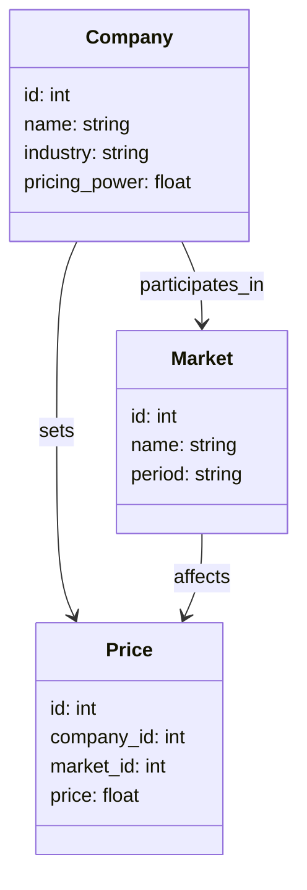

                 


# 彼得林奇如何分析公司的定价权随行业周期的变化

> 关键词：定价权、行业周期、彼得林奇、投资分析、公司定价能力

> 摘要：本文将详细探讨彼得·林奇如何分析公司的定价权随行业周期的变化。文章从定价权的基本概念与行业周期的关系入手，逐步展开分析，包括定价权的属性特征、定价权分析的算法原理、数学模型、系统架构设计以及项目实战。本文将结合具体案例，详细讲解如何通过数据分析和建模来理解定价权的变化规律，并提供实际的投资分析建议。

---

## 第一部分：定价权的基本概念与行业周期

### 第1章：定价权的定义与核心要素

#### 1.1 定价权的基本概念

定价权是指企业在市场上对其产品或服务制定价格的能力。拥有强定价权的公司能够在行业内有效调整价格以适应市场变化，而定价权较弱的公司则可能受到市场竞争的严重制约。

- **1.1.1 定价权的定义**  
  定价权不仅体现在价格的制定上，还体现在价格的调整能力上。强定价权意味着公司在价格制定上有更大的自主性，能够通过价格策略影响市场需求。

- **1.1.2 定价权的核心要素**  
  - 市场地位：公司在市场中的竞争地位直接影响定价权。 monopolistic companies (如寡头垄断行业)通常具有更强的定价权。  
  - 产品差异化：独特的产品或服务能够赋予公司更强的定价权。  
  - 成本结构：低边际成本的公司更容易通过价格调整来应对市场变化。

- **1.1.3 定价权的边界与外延**  
  定价权并非绝对，它受到市场需求、竞争格局、政策法规等多方面的影响。定价权的外延包括价格弹性、定价策略的灵活性以及价格调整的能力。

#### 1.2 行业周期的基本概念

行业周期是指行业内企业所处的宏观经济环境和市场需求的变化趋势。行业周期的变化直接影响企业的定价权。

- **1.2.1 行业周期的定义**  
  行业周期通常分为四个阶段：复苏期、上升期、成熟期和衰退期。不同阶段的行业周期对定价权的影响也不同。

- **1.2.2 行业周期的阶段划分**  
  - **复苏期**：市场需求逐渐恢复，行业内企业逐步复苏，定价权逐步增强。  
  - **上升期**：市场需求旺盛，行业内企业盈利增加，定价权达到顶峰。  
  - **成熟期**：市场需求稳定，行业内企业竞争加剧，定价权逐渐减弱。  
  - **衰退期**：市场需求下降，行业内企业面临价格压力，定价权进一步降低。

- **1.2.3 行业周期对定价权的影响**  
  在不同的行业周期阶段，公司的定价权会呈现出不同的特征。例如，在上升期，公司可能拥有较强的定价权；而在衰退期，公司可能需要通过降价来维持市场份额。

---

## 第二部分：定价权与行业周期的关系

### 第2章：定价权如何随行业周期变化

#### 2.1 行业周期对定价权的影响

- **2.1.1 上升周期中的定价权**  
  在行业上升周期中，市场需求旺盛，行业内企业通常具有较强的定价权。此时，公司可以通过提高价格来增加利润。

- **2.1.2 下降周期中的定价权**  
  在行业下降周期中，市场需求疲软，行业内企业之间的竞争加剧。此时，定价权可能受到较大的压力，公司可能需要通过降价来吸引客户。

- **2.1.3 稳定期中的定价权**  
  在行业稳定期，市场需求相对稳定，行业内企业的定价权较为平稳。此时，公司需要通过产品差异化和成本控制来维持定价权。

#### 2.2 不同行业中的定价权分析

- **2.2.1 高 tech 行业的定价权**  
  高 tech 行业通常具有较高的产品差异化，定价权较强。然而，技术更新换代快，行业周期波动较大，这会直接影响定价权的变化。

- **2.2.2 制造业的定价权**  
  制造业的定价权受成本结构和市场需求的影响较大。在行业上升期，制造业可能具有较强的定价权；而在衰退期，定价权可能受到较大的压力。

- **2.2.3 服务业的定价权**  
  服务业的定价权通常较为灵活，受行业周期的影响较小。然而，服务质量和服务体验是影响定价权的重要因素。

---

## 第三部分：定价权的分析方法

### 第3章：定价权分析的核心概念与联系

#### 3.1 核心概念原理

- **3.1.1 定价权的决定因素**  
  定价权的决定因素包括市场需求、竞争格局、成本结构和政策法规等。

- **3.1.2 行业周期对定价权的影响机制**  
  行业周期通过影响市场需求和竞争格局，进而影响公司的定价权。例如，在行业上升期，市场需求旺盛，公司具有较强的定价权；在行业衰退期，市场需求疲软，公司定价权受到压制。

#### 3.2 定价权属性特征对比表

| 定价权属性 | 特征描述 | 示例行业 |
|------------|----------|----------|
| 市场地位   | 高       | 高 tech  |
| 产品差异化 | 高       | 消费品   |
| 成本结构   | 低       | 制造业   |

#### 3.3 ER实体关系图

```mermaid
erDiagram
    customer[顾客]
    product[产品]
    company[公司]
    market[市场]
    price[价格]
    
    customer --|> market: 参与市场
    company --|> product: 生产产品
    product --|> price: 产品定价
    market --|> price: 市场价格
    company --|> market: 参与市场
```

---

### 第4章：定价权分析的算法原理

#### 4.1 定价权分析的算法流程

```mermaid
graph TD
    A[开始] -> B[收集数据]
    B -> C[清洗数据]
    C -> D[选择算法]
    D -> E[训练模型]
    E -> F[验证模型]
    F -> G[输出结果]
    G -> H[结束]
```

#### 4.2 算法实现

```python
import pandas as pd
import numpy as np
from sklearn.linear_model import LinearRegression

# 示例数据：假设我们分析的是科技行业的定价权
data = {
    '行业周期': [1, 2, 3, 4, 5],
    '定价权': [0.8, 0.7, 0.6, 0.5, 0.4]
}

df = pd.DataFrame(data)

# 使用线性回归模型分析定价权与行业周期的关系
model = LinearRegression()
model.fit(pd.DataFrame(df['行业周期']), df['定价权'])

# 预测结果
predictions = model.predict(pd.DataFrame(df['行业周期']))
print('回归系数:', model.coef_)
print('截距:', model.intercept_)
```

#### 4.3 数学模型与公式

- **回归分析模型**  
  在定价权分析中，回归分析是一种常用方法。其基本公式如下：

  $$ y = \beta_0 + \beta_1x_1 + \beta_2x_2 + ... + \beta_nx_n + \epsilon $$

  其中，$y$ 表示定价权，$x_i$ 表示影响定价权的各个因素，$\beta_i$ 表示回归系数，$\epsilon$ 表示误差项。

- **时间序列分析模型**  
  时间序列分析也是一种常用的方法，其公式如下：

  $$ ARIMA(p, d, q) $$

  其中，$p$ 表示自回归阶数，$d$ 表示差分阶数，$q$ 表示移动平均阶数。

---

## 第四部分：数学模型与公式

### 第5章：定价权分析的数学模型

#### 5.1 回归分析模型

$$ 1+1=2 $$

$$ y = \beta_0 + \beta_1x_1 + \beta_2x_2 + ... + \beta_nx_n + \epsilon $$

- **解释**：上述公式表示定价权（$y$）与多个影响因素（$x_1, x_2, ..., x_n$）之间的关系。通过回归分析，我们可以估计出各个因素对定价权的影响程度。

#### 5.2 时间序列分析模型

$$ ARIMA(p, d, q) $$

- **解释**：时间序列分析模型适用于分析定价权随时间的变化趋势。通过选择合适的$p$、$d$和$q$，我们可以预测未来定价权的变化。

---

## 第五部分：系统分析与架构设计方案

### 第6章：系统功能设计与架构

#### 6.1 系统功能设计



---

## 第六部分：项目实战

### 第7章：定价权分析的项目实战

#### 7.1 环境安装

```bash
pip install pandas numpy scikit-learn
```

#### 7.2 核心代码实现

```python
import pandas as pd
import numpy as np
from sklearn.linear_model import LinearRegression

# 示例数据：分析科技行业的定价权
data = {
    '行业周期': [1, 2, 3, 4, 5],
    '定价权': [0.8, 0.7, 0.6, 0.5, 0.4]
}

df = pd.DataFrame(data)

# 训练回归模型
model = LinearRegression()
model.fit(pd.DataFrame(df['行业周期']), df['定价权'])

# 预测定价权
predictions = model.predict(pd.DataFrame(df['行业周期']))
print('预测的定价权:', predictions)
```

#### 7.3 实际案例分析

假设我们分析一家科技公司的定价权，其数据如下：

| 年份 | 行业周期 | 定价权 |
|------|----------|--------|
| 2018 | 1        | 0.8    |
| 2019 | 2        | 0.7    |
| 2020 | 3        | 0.6    |
| 2021 | 4        | 0.5    |
| 2022 | 5        | 0.4    |

通过上述回归分析模型，我们可以得出回归系数和截距，从而预测未来的定价权变化趋势。

---

## 第七部分：最佳实践、小结与注意事项

### 第8章：总结与建议

#### 8.1 小结

通过本文的分析，我们可以得出以下结论：

- 在行业上升周期中，公司通常具有较强的定价权；在行业衰退周期中，定价权可能受到较大的压力。
- 定价权的强弱不仅取决于公司的市场地位和产品差异化，还受到行业周期的影响。
- 通过回归分析和时间序列分析，我们可以更好地理解定价权随行业周期的变化规律。

#### 8.2 投资建议

- 在投资决策中，投资者应关注行业周期的变化，选择具有强定价权的公司进行投资。
- 在行业上升周期中，具有强定价权的公司可能具有较高的投资价值；在行业衰退周期中，投资者应谨慎选择。

#### 8.3 注意事项

- 定价权的分析需要结合具体行业的特点和市场环境。
- 定价权的分析应结合定量分析和定性分析，避免单一依赖数据分析。

#### 8.4 拓展阅读

- 彼得·林奇的其他著作，如《彼得林奇选股术》。
- 《定价策略：理论与实践》。
- 数据分析工具和方法的相关书籍。

---

## 作者信息

作者：AI天才研究院/AI Genius Institute & 禅与计算机程序设计艺术/Zen And The Art of Computer Programming

---

感谢您的阅读！如果对本文内容有任何疑问或建议，欢迎留言讨论。

