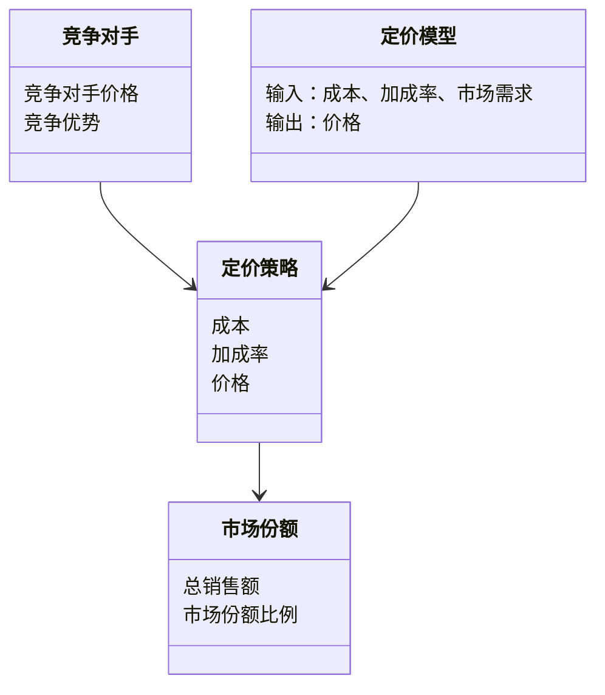

                 


# 彼得林奇如何分析公司的定价策略对市场份额的影响

## 关键词：定价策略、市场份额、彼得·林奇、定价模型、竞争分析、成本加成

## 摘要：本文详细探讨了彼得·林奇分析定价策略对市场份额影响的方法，通过背景介绍、定价策略分类、对市场份额的影响分析、彼得·林奇的具体分析方法、案例分析、系统分析与架构设计方案、项目实战、以及最佳实践等部分，深入阐述了定价策略在商业竞争中的重要作用，帮助读者掌握如何通过定价策略提升市场份额。

---

## 第一部分：定价策略与市场份额的背景介绍

### 第1章：定价策略的基本概念

#### 1.1 定价策略的定义与重要性

- **定价策略的定义**：定价策略是指企业在确定产品或服务价格时所采用的方法和原则，旨在实现利润最大化、市场占有率目标或品牌形象提升。
- **定价策略在商业中的重要性**：定价直接影响企业的收入和利润，影响消费者购买决策，进而影响市场份额。正确制定定价策略有助于企业在竞争中占据优势。
- **彼得·林奇对定价策略的关注点**：林奇在其投资分析中，特别关注定价策略是否合理、是否有竞争优势，以及定价策略如何影响企业的市场份额和长期盈利能力。

#### 1.2 市场份额的核心概念

- **市场份额的定义**：市场份额指一家企业在特定市场中销售的产品或服务占总销售额的比例。
- **影响市场份额的主要因素**：产品价格、质量、品牌知名度、竞争对手策略、消费者偏好等。
- **定价策略与市场份额的关系**：定价策略直接影响消费者购买决策，进而影响企业的市场份额。合理的价格策略可以扩大市场份额，而定价过高或过低可能导致市场份额流失或利润减少。

---

### 第2章：定价策略的分类

#### 2.1 成本加成定价法

- **成本加成定价法的定义**：基于产品成本加上一定比例的加成来确定价格。公式为：$$ 成本加成定价 = 成本 + 成本 × 加成率 $$
- **优点**：简单易行，确保企业获得合理的利润。
- **缺点**：忽视市场需求和竞争状况，可能导致价格过高或过低。

#### 2.2 价值定价法

- **价值定价法的定义**：基于产品的实际价值或消费者对产品的需求和愿意支付的价格来确定价格。
- **确定顾客价值的方法**：通过市场调研、顾客调查等手段，确定顾客对产品或服务的感知价值。
- **优点**：能够更好地满足顾客需求，提升顾客满意度和忠诚度。
- **缺点**：实施难度较高，需要准确掌握市场需求和顾客偏好。

#### 2.3 竞争导向定价法

- **竞争导向定价法的定义**：根据市场竞争状况和竞争对手的定价策略来制定价格。
- **价格战对市场份额的影响**：短期可能扩大市场份额，但可能导致价格下降，影响利润和品牌形象。
- **优点**：能够迅速响应市场竞争，灵活调整价格策略。
- **缺点**：可能导致价格恶性竞争，影响企业长期发展。

---

## 第三部分：定价策略对市场份额的影响分析

### 第3章：定价策略与市场份额的关系

#### 3.1 定价策略对需求弹性的影响

- **需求弹性的定义**：需求弹性是指价格变动对需求量的影响程度。需求弹性高的产品，价格变动会显著影响需求量。
- **定价对需求弹性的影响**：价格下降会增加需求量，价格上升会减少需求量。需求弹性高的产品适合降价促销，扩大市场份额。
- **弹性系数与市场份额变化的关系**：需求弹性系数越大，价格变动对市场份额的影响越大。

#### 3.2 定价策略对竞争格局的影响

- **定价策略对市场份额的影响**：合理的价格策略能够提升市场份额，而过高或过低的价格可能导致市场份额流失。
- **价格战对市场份额的短期和长期影响**：短期可能迅速扩大市场份额，但长期可能导致利润下降、品牌形象受损。

---

## 第四部分：彼得·林奇的定价策略分析

### 第4章：彼得·林奇的定价策略分析方法

#### 4.1 彼得·林奇的估值方法

- **企业内在价值的计算**：林奇通过分析企业的财务状况、盈利能力、成长潜力等因素，估算企业的内在价值。
- **定价策略对内在价值的影响**：合理的定价策略能够提升企业内在价值，反之则会降低内在价值。

#### 4.2 竞争优势分析

- **竞争优势的定义**：企业在市场上相对于竞争对手的显著优势，包括成本优势、技术优势、品牌优势等。
- **定价策略与竞争优势的关系**：通过合理的定价策略，企业可以巩固竞争优势，提升市场份额。

#### 4.3 市场份额变化预测

- **市场份额变化的预测方法**：通过分析定价策略、市场需求、竞争状况等因素，预测市场份额的变化趋势。
- **彼得·林奇的市场份额预测模型**：林奇通过分析定价策略的合理性和竞争优势，预测企业市场份额的变化。

---

## 第五部分：实际案例分析

### 第5章：案例分析

#### 5.1 案例一：某高科技公司的定价策略调整

- **背景介绍**：某高科技公司通过调整定价策略，成功扩大了市场份额。
- **定价策略分析**：从成本加成定价法调整为价值定价法，根据市场需求和竞争状况制定价格。
- **市场份额变化**：调整后市场份额显著提升，企业利润增加。

#### 5.2 案例二：某快消品公司的价格战

- **背景介绍**：某快消品公司通过价格战迅速扩大市场份额。
- **定价策略分析**：采用竞争导向定价法，低于竞争对手的价格迅速占领市场。
- **市场份额变化**：短期内市场份额大幅提升，但长期来看，价格战导致利润率下降。

---

## 第六部分：系统分析与架构设计方案

### 第6章：系统分析与架构设计方案

#### 6.1 领域模型设计

- **领域模型的定义**：领域模型是对业务领域的核心概念及其关系的抽象表示。
- **领域模型的mermaid类图**：



#### 6.2 系统架构设计

- **系统架构图**：


#### 6.3 接口设计

- **定价模型接口**：
  - 输入：成本、加成率、市场需求
  - 输出：价格
- **市场份额预测接口**：
  - 输入：价格、竞争状况
  - 输出：市场份额预测值

---

## 第七部分：项目实战

### 第7章：项目实战

#### 7.1 环境安装

- **工具安装**：
  - 安装Python
  - 安装数据分析库（如Pandas、NumPy）
  - 安装可视化库（如Matplotlib、Seaborn）

#### 7.2 核心实现源代码

```python
import pandas as pd
import matplotlib.pyplot as plt

# 示例数据：成本、加成率、市场需求
cost = 50
markup = 0.3
market_demand = 1000

# 定价模型：成本加成定价法
price = cost * (1 + markup)

# 计算市场份额
market_share = (price / (price + 10)) * market_demand

print(f"定价：{price}")
print(f"市场份额：{market_share}")
```

#### 7.3 代码应用解读与分析

- **代码解读**：上述代码展示了如何使用Python进行定价策略分析。通过成本加成定价法计算价格，并预测市场份额。
- **分析结果**：根据市场需求和竞争状况，调整定价策略，优化市场份额。

---

## 第八部分：最佳实践、小结、注意事项、拓展阅读

### 第8章：最佳实践

- **定价策略的选择**：根据企业自身情况和市场环境选择合适的定价策略。
- **动态调整定价策略**：定期评估定价策略的有效性，根据市场变化进行调整。
- **关注竞争对手策略**：了解竞争对手的定价策略，制定差异化定价策略。

### 小结

通过本文的分析，读者可以了解定价策略对市场份额的重要影响，掌握彼得·林奇的定价策略分析方法，并能够实际操作定价策略的分析与优化。

### 注意事项

- 定价策略的制定需要结合企业的实际情况和市场环境。
- 定价策略的调整需要谨慎，避免引起市场波动和品牌形象受损。
- 定价策略的实施需要综合考虑成本、市场需求、竞争状况等因素。

### 拓展阅读

- 彼得·林奇的其他投资分析方法。
- 市场份额预测模型的其他应用。
- 定价策略在不同行业中的具体应用案例。

---

## 作者：AI天才研究院/AI Genius Institute & 禅与计算机程序设计艺术 /Zen And The Art of Computer Programming

---

通过以上内容，本文详细探讨了定价策略对市场份额的影响，结合彼得·林奇的分析方法，帮助读者掌握定价策略的制定与优化技巧。

