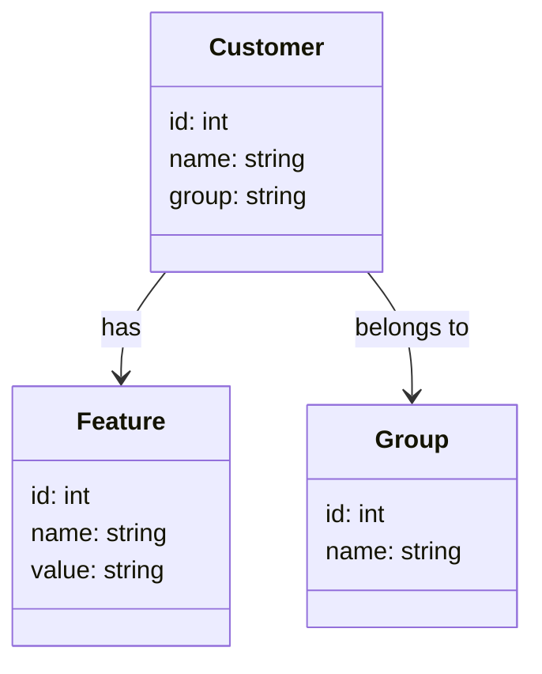
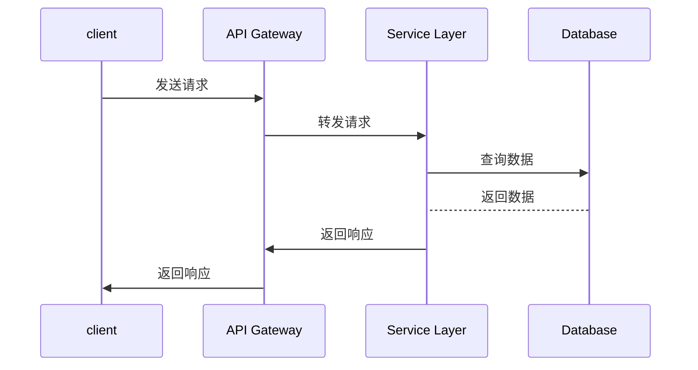

                 


# 彼得·林奇如何分析公司的客户分层策略

## 关键词：彼得·林奇，客户分层策略，投资分析，企业价值，聚类分析，决策树

## 摘要：  
本文深入探讨了彼得·林奇如何通过客户分层策略来分析公司的投资价值。文章首先介绍了客户分层策略的核心概念和其在投资分析中的重要性，然后详细讲解了客户分层的算法原理、数学模型以及系统架构设计。最后，通过实际案例分析，展示了如何将客户分层策略应用于投资决策中，以帮助企业更好地评估公司价值和制定投资策略。

---

# 第1章: 客户分层策略的核心概念与背景

## 1.1 客户分层策略的核心概念

### 1.1.1 什么是客户分层策略
客户分层策略是一种将客户按照特定特征（如收入水平、消费习惯、地理位置等）进行分类的方法。通过这种分类，企业可以更好地理解不同客户群体的需求，从而制定更有针对性的营销策略。

### 1.1.2 客户分层策略的背景与问题背景
在现代商业环境中，客户群体的多样性使得企业需要更精细的管理方法。传统的“一刀切”营销策略已经无法满足不同客户群体的需求。因此，客户分层策略应运而生，成为企业提高客户满意度和忠诚度的重要工具。

### 1.1.3 客户分层策略的核心要素与组成
客户分层策略的核心要素包括：
1. **客户特征**：如收入水平、地理位置、消费习惯等。
2. **分层标准**：如收入、消费频率、购买力等。
3. **分层方法**：如聚类分析、决策树分类等。

## 1.2 彼得·林奇的投资理念与客户分析

### 1.2.1 彼得·林奇的选股策略概述
彼得·林奇以其独特的选股策略闻名，他注重分析公司的基本面，包括财务状况、行业地位和管理团队等。客户分层策略在他的分析中扮演了重要角色，帮助他识别公司的核心客户群体和市场潜力。

### 1.2.2 客户分层策略在彼得·林奇投资分析中的地位
林奇认为，客户分层策略是评估公司市场地位的重要工具。通过分析客户的分层情况，他能够更好地判断公司的盈利能力和发展潜力。

### 1.2.3 客户分层策略与企业价值评估的关系
客户分层策略直接影响企业的客户基础和市场覆盖能力。通过分析不同客户群体的贡献度，林奇能够更准确地评估企业的长期价值。

## 1.3 客户分层策略的边界与外延

### 1.3.1 客户分层策略的适用范围
客户分层策略适用于所有行业，但其具体应用方法可能因行业特点而异。

### 1.3.2 界定客户分层策略的边界条件
客户分层的边界条件包括数据的充分性、分类的合理性以及企业的资源投入等。

### 1.3.3 客户分层策略与其他投资分析方法的区别与联系
客户分层策略是投资分析中的一个环节，与其他方法（如财务分析、行业分析）相辅相成，共同构成全面的投资决策体系。

---

# 第2章: 客户分层策略的核心概念与联系

## 2.1 核心概念原理

### 2.1.1 客户分层的定义与属性特征
客户分层是根据客户特征将客户划分为不同群体的过程。属性特征包括年龄、性别、收入、地理位置等。

### 2.1.2 客户分层与企业价值的关系
客户分层直接影响企业的市场覆盖能力和客户满意度，进而影响企业的长期价值。

### 2.1.3 彼得·林奇客户分层分析的逻辑框架
林奇的客户分层分析逻辑框架包括客户识别、客户分类、客户评估和客户价值评估四个步骤。

## 2.2 客户分层策略的核心要素对比分析

### 2.2.1 不同客户群体的特征对比表格

| 客户群体 | 收入水平 | 消费习惯 | 地理位置 |
|----------|----------|----------|----------|
| 高端客户 | 高       | 高       | 一线城市 |
| 中端客户 | 中       | 中       | 二线城市 |
| 低端客户 | 低       | 低       | 三四线城市 |

### 2.2.2 客户分层的实体关系图（ER图）
```mermaid
er
    customer_group (客户群体)
        + id: int
        + name: string
    customer_feature (客户特征)
        + id: int
        + feature_name: string
        + feature_value: string
    customer (客户)
        + id: int
        + name: string
        + group_id: int
```

## 2.3 彼得·林奇客户分层分析的逻辑流程

### 2.3.1 客户分层的初步识别
通过数据收集和初步分析，识别出客户的主要特征。

### 2.3.2 客户分层的深入分析
利用聚类分析等方法，对客户进行分类，并评估每个客户群体的贡献度。

### 2.3.3 客户分层对企业价值的影响
通过分析客户分层结果，评估公司的市场地位和长期发展潜力。

---

# 第3章: 客户分层策略的算法原理与数学模型

## 3.1 客户分层的算法原理

### 3.1.1 客户分层的基本算法思路
客户分层的算法思路包括数据预处理、特征选择、模型训练和结果分析。

### 3.1.2 基于聚类分析的客户分层方法
聚类分析是一种常用的客户分层方法，通过将客户按照相似性自动分组。

### 3.1.3 基于决策树的客户分层模型
决策树是一种基于特征的客户分类方法，能够处理复杂的客户特征关系。

## 3.2 数学模型与公式

### 3.2.1 客户分层的数学模型
$$客户分层指数 = \sum_{i=1}^{n} (权重_i \times 属性_i)$$

### 3.2.2 基于聚类分析的公式
$$距离 = \sqrt{\sum_{i=1}^{k} (x_i - y_i)^2}$$

### 3.2.3 基于决策树的分类公式
$$决策树模型 = \text{ID3/C4.5/ CART 算法}$$

## 3.3 算法实现与代码示例

### 3.3.1 客户分层的Python代码实现
```python
import pandas as pd
from sklearn.cluster import KMeans

# 数据预处理
data = pd.read_csv('customer_data.csv')
X = data[['属性1', '属性2', '属性3']]
model = KMeans(n_clusters=3).fit(X)
```

### 3.3.2 算法原理的通俗举例
通过一个简单的例子，说明聚类分析如何将客户分为不同的群体。

### 3.3.3 算法实现的详细步骤与注意事项
详细描述算法实现的步骤，并提醒读者注意数据预处理和模型调优的重要性。

---

# 第4章: 客户分层策略的系统分析与架构设计

## 4.1 问题场景介绍

### 4.1.1 客户分层策略的应用场景
在零售、金融、教育等多个行业，客户分层策略都有广泛的应用。

### 4.1.2 彼得·林奇客户分层分析的逻辑框架
包括数据收集、特征选择、模型训练和结果分析四个步骤。

## 4.2 系统功能设计

### 4.2.1 领域模型（Mermaid 类图）


### 4.2.2 系统架构设计（Mermaid 架构图）


## 4.3 系统接口设计与交互

### 4.3.1 系统接口设计
定义系统的输入输出接口，如API接口的设计。

### 4.3.2 系统交互（Mermaid 序列图）


---

# 第5章: 项目实战

## 5.1 环境安装与配置

### 5.1.1 安装Python和相关库
安装Python和Pandas、Scikit-learn等库。

### 5.1.2 数据集准备
准备客户数据集，包括客户特征和标签。

## 5.2 系统核心实现

### 5.2.1 客户分层的代码实现
编写Python代码，实现客户分层的算法。

### 5.2.2 代码应用解读与分析
详细解读代码的每一部分，说明其功能和作用。

## 5.3 实际案例分析

### 5.3.1 案例背景介绍
选择一个具体行业，如零售行业，进行案例分析。

### 5.3.2 数据预处理与特征选择
对数据进行清洗和特征选择，为后续分析做好准备。

### 5.3.3 模型训练与结果分析
训练客户分层模型，并分析结果，评估模型的准确性。

## 5.4 项目小结

### 5.4.1 项目总结
总结项目的完成情况和取得的成果。

### 5.4.2 项目经验与教训
分享项目中的经验教训，为未来的工作提供参考。

---

# 第6章: 总结与展望

## 6.1 核心内容总结
回顾全文，总结客户分层策略的核心内容和其在投资分析中的重要性。

## 6.2 投资分析中的最佳实践 tips
给出一些实际操作中的建议和注意事项。

## 6.3 未来研究方向
探讨客户分层策略的未来发展方向，如与其他分析方法的结合。

---

# 作者信息

作者：AI天才研究院/AI Genius Institute  
联系邮箱：contact@ait genius.com  

---

**作者：AI天才研究院**

