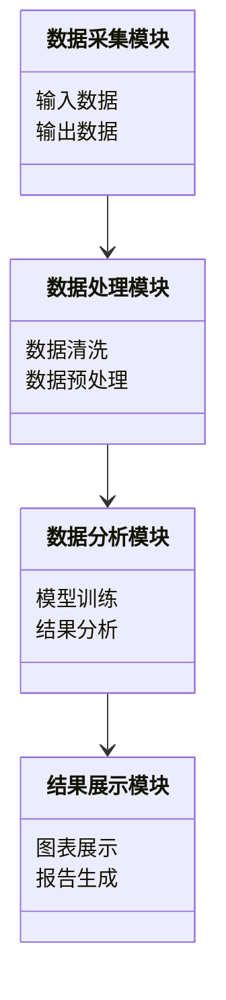

                 


# 彼得林奇如何分析公司的客户忠诚度程序

> 关键词：彼得林奇，客户忠诚度，程序分析，投资分析，数据分析

> 摘要：本文将详细探讨彼得·林奇如何分析公司的客户忠诚度程序，从核心概念、分析框架、数学模型、系统架构到项目实战，全面解读这一分析过程。

---

# 第一部分：客户忠诚度程序概述

## 第1章：客户忠诚度的基本概念

### 1.1 客户忠诚度的定义与重要性

#### 1.1.1 客户忠诚度的定义
客户忠诚度是指客户对某一品牌或公司产品的长期支持和重复购买行为。它不仅是客户满意度的延伸，更是一种客户行为的长期表现。

#### 1.1.2 客户忠诚度的重要性
客户忠诚度是企业长期发展的关键因素，直接影响企业的收入、利润和市场占有率。忠诚的客户通常具有更高的生命周期价值（Customer Lifetime Value, CLV）。

#### 1.1.3 彼得林奇对客户忠诚度的关注
彼得·林奇在其投资分析中，非常注重客户忠诚度，认为它是企业竞争优势的重要组成部分。他通过分析客户忠诚度程序，评估企业的市场地位和未来发展前景。

---

## 第2章：客户忠诚度的核心指标

### 2.1 客户保留率

#### 2.1.1 客户保留率的计算公式
客户保留率 = (期初客户数 - 期末流失客户数) / 期初客户数 × 100%

#### 2.1.2 客户保留率的影响因素
- 产品满意度
- 服务质量
- 竞争对手的吸引力
- 客户获取成本

#### 2.1.3 客户保留率与客户忠诚度的关系
客户保留率是客户忠诚度的重要体现，高保留率通常意味着客户对品牌有较高的忠诚度。

---

### 2.2 客户满意度

#### 2.2.1 客户满意度的定义
客户满意度是指客户对企业产品或服务的整体满意程度。

#### 2.2.2 客户满意度的测量方法
- 问卷调查
- 网络评价
- 第三方数据分析

#### 2.2.3 客户满意度与客户忠诚度的关系
客户满意度是客户忠诚度的基础，但高满意度并不一定意味着高忠诚度，因为客户可能因为其他因素选择竞争品牌。

---

### 2.3 客户净推荐值（NPS）

#### 2.3.1 NPS的定义
客户净推荐值（Net Promoter Score）是指客户愿意推荐企业产品或服务给他人的好友比例减去不推荐的比例。

#### 2.3.2 NPS的计算公式
NPS = 推荐者比例 - 批评者比例

#### 2.3.3 NPS与客户忠诚度的关系
NPS是客户忠诚度的重要指标，高NPS值通常意味着客户更有可能长期支持企业。

---

## 第3章：客户忠诚度程序的分析框架

### 3.1 数据收集与整理

#### 3.1.1 数据来源
- 客户购买记录
- 客户反馈数据
- 市场调研数据
- 竞争对手分析数据

#### 3.1.2 数据清洗
- 删除重复数据
- 处理缺失值
- 标准化数据格式

#### 3.1.3 数据预处理
- 数据分组
- 数据特征提取
- 数据归一化

---

### 3.2 数据分析与建模

#### 3.2.1 数据分析方法
- 描述性分析
- 回归分析
- 聚类分析
- 分类分析

#### 3.2.2 数据建模方法
- RFM模型（Recency, Frequency, Monetary）
- K-means聚类
- 时间序列分析

#### 3.2.3 数据模型的选择
根据具体业务需求选择合适的模型，例如：
- 使用RFM模型分析客户的购买频率和金额。
- 使用聚类分析识别高价值客户群体。

---

## 第4章：客户忠诚度程序的数学模型

### 4.1 客户忠诚度的数学公式

#### 4.1.1 客户忠诚度的计算公式
$$ \text{客户忠诚度} = \text{客户保留率} \times \text{客户满意度} \times \text{客户净推荐值} $$

#### 4.1.2 客户忠诚度的影响因素
- 产品性价比
- 售后服务
- 品牌影响力

#### 4.1.3 客户忠诚度的预测模型
$$ \text{忠诚度预测} = \beta_0 + \beta_1 x_1 + \beta_2 x_2 + \epsilon $$

其中：
- $x_1$：客户保留率
- $x_2$：客户满意度
- $\beta_0$：截距
- $\beta_1, \beta_2$：回归系数
- $\epsilon$：误差项

---

## 第5章：客户忠诚度程序的系统架构设计

### 5.1 系统功能设计

#### 5.1.1 系统功能模块划分
- 数据采集模块
- 数据处理模块
- 数据分析模块
- 结果展示模块

#### 5.1.2 系统功能流程图
```mermaid
graph TD
A[开始] -> B[数据采集]
B -> C[数据处理]
C -> D[数据分析]
D -> E[结果展示]
E -> F[结束]
```

---

### 5.2 系统架构设计

#### 5.2.1 系统架构图


---

## 第6章：客户忠诚度程序的项目实战

### 6.1 项目背景介绍

#### 6.1.1 项目目标
分析某零售公司的客户忠诚度，优化客户保留策略。

#### 6.1.2 项目数据来源
- 客户购买记录
- 客户满意度调查
- 竞争对手分析

---

### 6.2 项目核心实现

#### 6.2.1 数据处理代码
```python
import pandas as pd
import numpy as np

# 数据加载
data = pd.read_csv('customer.csv')

# 数据清洗
data.drop_duplicates(inplace=True)
data.dropna(inplace=True)

# 数据预处理
data['购买频率'] = data['购买频率'].astype('int')
```

#### 6.2.2 模型训练代码
```python
from sklearn.cluster import KMeans

# 特征提取
X = data[['购买频率', '满意度']]

# 模型训练
model = KMeans(n_clusters=3, random_state=0)
model.fit(X)

# 预测结果
labels = model.labels_
```

---

## 第7章：最佳实践与小结

### 7.1 最佳实践

#### 7.1.1 数据质量的重要性
确保数据的准确性和完整性，是客户忠诚度分析的基础。

#### 7.1.2 模型选择的策略
根据业务需求选择合适的模型，避免过度复杂的分析。

#### 7.1.3 结果应用的建议
将分析结果应用于实际业务，优化客户体验和企业策略。

---

### 7.2 小结

本文通过分析彼得·林奇的客户忠诚度程序分析方法，从核心概念、分析框架、数学模型到系统架构，全面解读了这一过程。通过项目实战，展示了如何将理论应用于实际业务，为企业的客户忠诚度管理提供了实用的参考。

---

### 7.3 注意事项

- 数据分析结果仅供参考，需结合实际业务场景进行调整。
- 模型的选择和优化需要结合企业的具体需求。
- 客户忠诚度分析是一个动态过程，需持续监测和优化。

---

### 7.4 拓展阅读

- 《彼得·林奇的投资智慧》
- 《客户忠诚度管理实战手册》
- 《数据驱动的商业决策》

---

作者：AI天才研究院/AI Genius Institute & 禅与计算机程序设计艺术/Zen And The Art of Computer Programming

