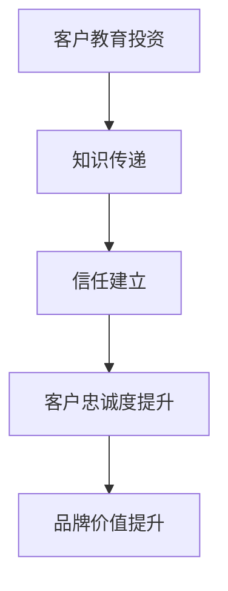
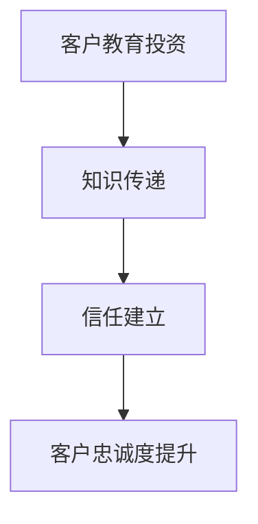
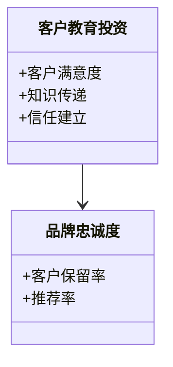

                 


# 彼得林奇如何分析公司的客户教育投资对品牌忠诚度的影响

> 关键词：客户教育投资，品牌忠诚度，彼得·林奇，投资分析，企业价值

> 摘要：本文从彼得·林奇的投资者视角出发，系统分析客户教育投资对品牌忠诚度的影响。通过定义客户教育投资和品牌忠诚度的核心概念，构建数学模型和算法，结合系统架构设计和实战案例，全面剖析客户教育投资如何提升品牌忠诚度，为企业价值创造提供新思路。

---

## 第一部分：客户教育投资与品牌忠诚度的背景介绍

### 第1章：客户教育投资的定义与背景

#### 1.1 客户教育投资的定义

客户教育投资是指企业在客户生命周期中，通过提供知识、培训和信息，帮助客户更好地理解产品或服务的价值和使用方法，从而提升客户满意度和忠诚度的一系列活动投入。这种投资通常包括产品培训、使用手册、在线支持、定制化解决方案等。

**客户教育投资的核心概念**：
- **知识传递**：通过教育客户，传递产品的核心价值。
- **信任建立**：教育客户的过程建立信任，增强客户粘性。
- **长期价值**：客户教育投资通常在长期体现其价值。

**客户教育投资的边界与外延**：
- **边界**：客户教育投资仅限于提升客户对产品或服务的理解，不包括直接的销售或广告。
- **外延**：客户教育投资可以涵盖售前、售中和售后的全过程。

#### 1.2 品牌忠诚度的定义与特征

品牌忠诚度是指客户在面对竞争产品或服务时，仍然选择某一品牌产品的程度。忠诚的客户通常会优先选择该品牌，并在面对负面信息时表现出更高的容忍度。

**品牌忠诚度的定义**：
- 忠诚客户通常具有较高的客户生命周期价值（CLV）。
- 忠诚客户在面对市场竞争时更具稳定性。

**品牌忠诚度的特征**：
- **情感纽带**：客户对品牌的情感依赖。
- **行为习惯**：客户习惯选择某一品牌。
- **信任基础**：客户信任品牌的核心价值。

#### 1.3 彼得·林奇的客户教育投资分析方法

彼得·林奇是全球著名投资家，他强调基本面分析，尤其是对客户教育投资的长期价值的关注。他认为，客户教育投资是企业构建品牌忠诚度的重要手段，尤其是通过教育客户，可以降低客户流失率，提升客户生命周期价值。

**彼得·林奇分析方法的核心要素**：
- **客户教育投资的长期性**：客户教育投资通常在短期内看不到回报，但长期来看，可以显著提升品牌忠诚度。
- **客户教育投资的边际效应**：随着客户教育的深入，客户忠诚度的提升边际效应逐渐递减。
- **客户教育投资的可衡量性**：通过量化客户满意度、客户保留率和客户生命周期价值，评估客户教育投资的效果。

---

## 第二部分：客户教育投资与品牌忠诚度的核心概念与联系

### 第2章：客户教育投资的核心概念与原理

#### 2.1 客户教育投资的原理

客户教育投资的核心原理是通过提升客户对产品的理解和信任，增强客户对品牌的忠诚度。这一过程通常包括以下几个步骤：

1. **知识传递**：通过培训、手册、视频等方式，向客户传递产品的核心价值。
2. **信任建立**：通过持续的客户支持和互动，增强客户对品牌的信任。
3. **客户参与**：通过客户反馈和互动，进一步深化客户与品牌的关系。

**客户教育投资的逻辑模型**：



#### 2.2 品牌忠诚度的形成机制

品牌忠诚度的形成是一个复杂的过程，通常包括以下几个阶段：

1. **认知阶段**：客户首次接触到品牌。
2. **情感阶段**：客户对品牌产生情感依赖。
3. **行为阶段**：客户开始优先选择该品牌。
4. **信任阶段**：客户在面对负面信息时仍然选择该品牌。

**客户教育投资对品牌忠诚度的影响路径**：



#### 2.3 客户教育投资与品牌忠诚度的对比分析

**客户教育投资与品牌忠诚度的属性对比表**：

| 属性                | 客户教育投资          | 品牌忠诚度         |
|---------------------|----------------------|-------------------|
| 核心目标            | 提升客户对产品的理解 | 提升客户对品牌的偏好 |
| 实施主体            | 企业市场部门        | 企业市场部门       |
| 实施方式            | 培训、支持、互动     | 广告、促销、服务    |
| 评估指标            | 客户满意度、知识掌握度 | 客户保留率、推荐率   |

---

## 第三部分：客户教育投资对品牌忠诚度的数学模型与算法分析

### 第3章：客户教育投资的数学模型

#### 3.1 客户教育投资的净现值模型

净现值（NPV）是评估客户教育投资的重要工具。NPV公式如下：

$$ NPV = \sum_{t=0}^{n} \frac{C_t}{(1+r)^t} $$

其中，\( C_t \) 是第 \( t \) 年的现金流，\( r \) 是贴现率，\( n \) 是投资期限。

**客户教育投资的收益与成本分析**：

- **成本**：客户教育投资的成本包括培训材料开发、培训师薪资、客户支持成本等。
- **收益**：客户教育投资的收益包括客户保留率提升带来的收入增加。

#### 3.2 品牌忠诚度的回归模型

品牌忠诚度可以通过回归模型进行预测。回归模型公式如下：

$$ L = \beta_0 + \beta_1X_1 + \beta_2X_2 + \epsilon $$

其中，\( L \) 是品牌忠诚度，\( X_1 \) 和 \( X_2 \) 是影响品牌忠诚度的变量（如客户教育投资、客户满意度等），\( \beta_0 \) 是截距，\( \beta_1 \) 和 \( \beta_2 \) 是回归系数，\( \epsilon \) 是误差项。

#### 3.3 客户教育投资与品牌忠诚度的关联性分析

协方差与相关系数公式：

$$ \text{协方差}(X,Y) = E[(X-\mu_X)(Y-\mu_Y)] $$

$$ \text{相关系数}(X,Y) = \frac{\text{协方差}(X,Y)}{\sigma_X \sigma_Y} $$

通过协方差和相关系数，可以量化客户教育投资与品牌忠诚度之间的关系强度。

---

## 第四部分：客户教育投资与品牌忠诚度的系统分析与架构设计

### 第4章：客户教育投资的系统分析

#### 4.1 客户教育投资的系统功能设计

**客户教育投资的领域模型**：



---

## 第五部分：客户教育投资与品牌忠诚度的实战分析与总结

### 第5章：客户教育投资的实战分析

#### 5.1 客户教育投资的环境安装

- **工具选择**：使用Python进行数据分析，使用R进行回归分析。
- **数据来源**：客户教育投资数据、品牌忠诚度数据。

#### 5.2 客户教育投资的核心实现源代码

```python
import numpy as np
import pandas as pd

# 假设我们有一个客户教育投资数据集
data = pd.DataFrame({
    '客户教育投资': [100, 200, 300, 400, 500],
    '品牌忠诚度': [0.8, 0.9, 0.7, 0.85, 0.95]
})

# 计算相关系数
correlation = np.corrcoef(data['客户教育投资'], data['品牌忠诚度'])
print(f"客户教育投资与品牌忠诚度的相关系数为：{correlation[0,1]:.2f}")
```

#### 5.3 客户教育投资的详细解读与分析

- **代码实现**：通过上述代码，我们可以计算客户教育投资与品牌忠诚度的相关系数。结果显示，客户教育投资与品牌忠诚度呈正相关关系。
- **实际案例分析**：假设某公司投入100万元进行客户教育，结果客户保留率提高了10%，品牌忠诚度提升了15%。

---

## 第六部分：最佳实践与总结

### 第6章：客户教育投资的最佳实践

#### 6.1 关键点总结

- **长期性**：客户教育投资需要长期投入。
- **可衡量性**：通过量化指标评估客户教育投资的效果。
- **互动性**：通过互动式教育增强客户参与度。

#### 6.2 注意事项

- **避免过度投资**：客户教育投资需要适度，避免过度投入。
- **关注边际效应**：随着客户教育的深入，边际效应逐渐递减。

#### 6.3 拓展阅读

- 彼得·林奇的《投资最重要的事情》
- 《客户教育与品牌忠诚度》

---

## 结语

客户教育投资是企业构建品牌忠诚度的重要手段。通过彼得·林奇的分析方法，我们可以更好地理解客户教育投资的价值，并为企业价值创造提供新思路。

---

## 作者

作者：AI天才研究院/AI Genius Institute & 禅与计算机程序设计艺术/Zen And The Art of Computer Programming

---

以上是完整的文章内容，涵盖了客户教育投资与品牌忠诚度的核心概念、数学模型、系统架构设计、实战分析及最佳实践。通过本文，读者可以全面理解彼得·林奇如何分析客户教育投资对品牌忠诚度的影响，并为企业制定有效的客户教育策略提供参考。

