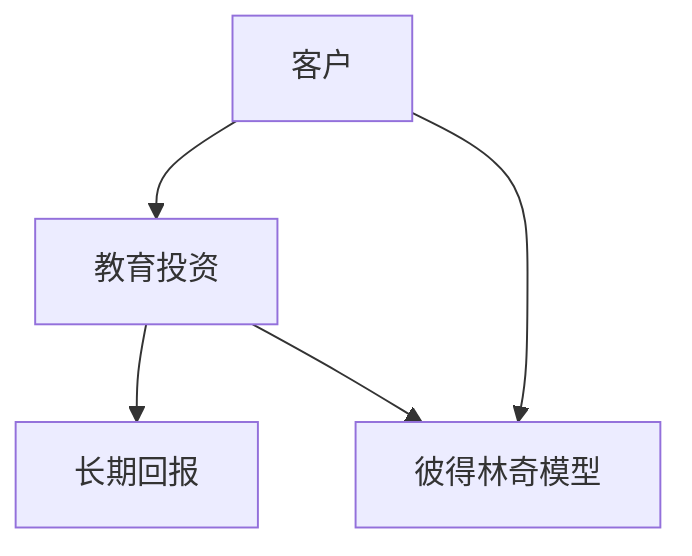
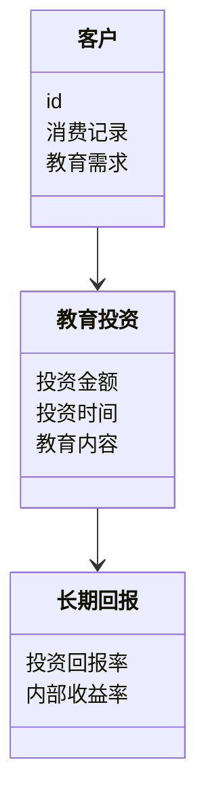
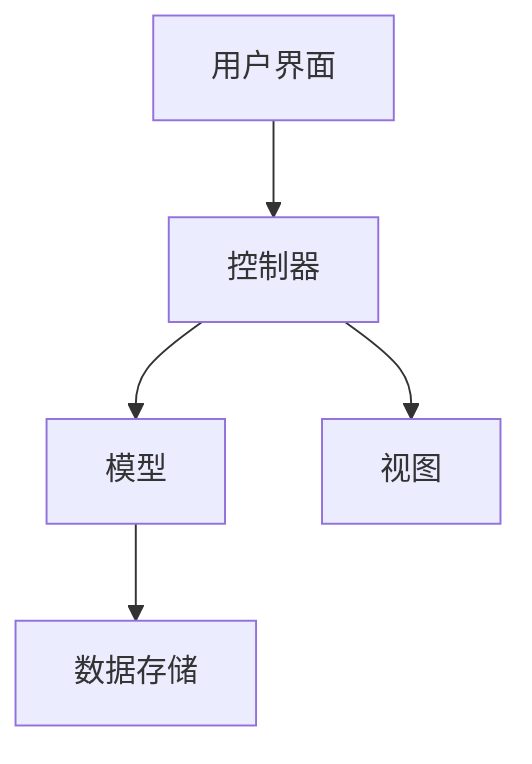

                 


# 彼得林奇如何分析公司的客户教育投资长期回报

> 关键词：客户教育投资，长期回报，彼得林奇，投资分析，企业战略，ROI，财务模型

> 摘要：本文探讨了彼得林奇如何分析公司的客户教育投资的长期回报。通过背景介绍、核心概念、算法原理、系统架构、项目实战和最佳实践等部分，详细分析了客户教育投资的重要性、长期回报的评估方法以及如何通过系统化的方法进行投资分析。

---

# 目录

## 第一章: 客户教育投资的基本概念

### 1.1 客户教育投资的定义与背景

#### 1.1.1 客户教育投资的定义

客户教育投资是指企业为提升客户知识、技能和认知而进行的资金投入。这种投资不仅包括培训、课程开发，还包括技术支持和客户辅导等。

#### 1.1.2 客户教育投资的重要性

在现代商业环境中，客户教育投资是企业增强客户忠诚度、提升产品使用效率和扩大市场份额的关键策略。通过教育客户，企业能够提高客户满意度，进而增强客户粘性。

#### 1.1.3 客户教育投资的长期回报评估

长期回报通常通过客户生命周期价值（CLV）和客户保留率来衡量。彼得林奇的分析框架强调通过客户教育提升客户价值，从而实现投资回报的最大化。

### 1.2 彼得林奇的分析框架

#### 1.2.1 彼得林奇的分析方法

彼得林奇通过分析客户教育投资如何影响客户行为和企业绩效，评估其长期回报。他的方法包括数据收集、模型建立和结果验证。

#### 1.2.2 客户教育投资的核心要素

核心要素包括目标客户群体、教育内容、实施方式和评估指标。这些要素共同决定了投资的效率和效果。

#### 1.2.3 长期回报的评估步骤

评估步骤包括数据收集、分析模型建立、结果验证和优化调整。彼得林奇强调持续优化和调整策略，以最大化回报。

## 第二章: 客户教育投资的原理与联系

### 2.1 客户教育投资的原理

#### 2.1.1 教育投资的经济学原理

教育投资通过提升客户能力，间接增加企业的收入和利润。这种投资属于人力资本投资，具有长期性和间接性的特点。

#### 2.1.2 客户教育投资与企业发展的关系

客户教育投资不仅提升客户满意度，还促进产品创新和市场扩展。通过教育客户，企业能够更好地理解市场需求，推动产品和服务的改进。

### 2.2 核心概念对比分析

#### 2.2.1 不同投资策略的对比

| 投资策略       | 优点                           | 缺点                           |
|----------------|--------------------------------|--------------------------------|
| 短期促销       | 投资见效快                     | 影响客户忠诚度较低             |
| 长期教育投资   | 提升客户忠诚度和满意度         | 投资见效周期长                 |

#### 2.2.2 客户教育投资与其他类型投资的对比

客户教育投资与传统的广告和销售推广不同，它注重长期关系的建立，而非短期销售提升。这种投资更注重客户的长期价值，而非短期收益。

### 2.3 客户教育投资的ER实体关系图



## 第三章: 客户教育投资的长期回报评估

### 3.1 彼得林奇的长期回报模型

#### 3.1.1 模型的数学公式

长期回报（L）可以表示为：

$$ L = \frac{I \times (1 + r)^t}{C} $$

其中，I为初始投资，r为年回报率，t为投资时间，C为客户生命周期成本。

#### 3.1.2 模型的实现步骤

1. **数据收集**：收集客户教育投资的相关数据，包括投资金额、时间跨度、客户保留率等。
2. **模型建立**：应用上述公式，建立长期回报模型。
3. **结果验证**：通过历史数据验证模型的准确性。
4. **优化调整**：根据验证结果调整模型参数，提高预测精度。

### 3.2 评估指标

#### 3.2.1 投资回报率（ROI）

ROI = （净收益 / 投资成本）× 100%

#### 3.2.2 内部收益率（IRR）

IRR 是使得净现值为零的折现率。

## 第四章: 系统分析与架构设计方案

### 4.1 系统功能设计

#### 4.1.1 领域模型



#### 4.1.2 系统架构



## 第五章: 项目实战

### 5.1 环境安装

安装Python和相关库（如numpy、pandas）。

### 5.2 核心代码实现

```python
import numpy as np
import pandas as pd

def calculate ROI(initial Investment, returns, years):
    ROI = (returns / initial Investment) * 100
    return ROI

initial_Investment = 100000
returns = 150000
years = 5

ROI = calculate ROI(initial_Investment, returns, years)
print(f"ROI: {ROI}%")
```

### 5.3 案例分析

假设一家公司投资100万元进行客户教育，5年后实现回报150万元，计算ROI为50%。

### 5.4 项目小结

通过案例分析，展示了客户教育投资的长期回报潜力。实践证明，合理的教育投资能够带来显著的回报。

## 第六章: 最佳实践

### 6.1 小结

本文详细分析了彼得林奇的客户教育投资分析方法，强调长期回报的重要性。

### 6.2 注意事项

1. **数据准确性**：确保数据的准确性和完整性。
2. **模型选择**：根据具体情况选择合适的评估模型。
3. **持续优化**：定期评估和优化投资策略。

### 6.3 拓展阅读

推荐阅读《彼得林奇的投资哲学》和《客户教育投资的策略与实践》。

---

作者：AI天才研究院/AI Genius Institute & 禅与计算机程序设计艺术 /Zen And The Art of Computer Programming

