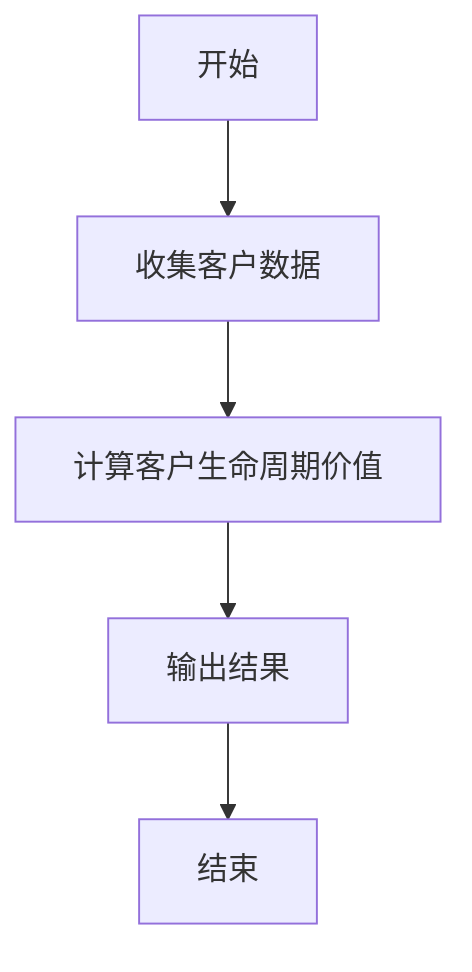

                 


# 彼得林奇如何分析公司的客户生命周期价值

> 关键词：客户生命周期价值、彼得林奇、投资分析、企业价值、客户管理

> 摘要：客户生命周期价值（Customer Lifetime Value，简称CLV）是衡量客户为企业带来的长期价值的重要指标。本文将从彼得·林奇的投资理念出发，详细分析他在评估公司客户生命周期价值时的方法和策略，包括CLV的核心概念、计算模型、系统架构设计以及实际案例分析，帮助读者更好地理解如何通过CLV优化企业客户管理。

---

## 第一部分: 客户生命周期价值（CLV）概述

### 第1章: 客户生命周期价值（CLV）的核心概念

#### 1.1 客户生命周期价值（CLV）的定义与重要性

##### 1.1.1 客户生命周期价值的基本定义
客户生命周期价值（CLV）是指客户在其生命周期内为企业带来的总收入减去获取和维护该客户所产生的成本。简单来说，CLV衡量了客户对企业长期价值的贡献。对于企业而言，CLV不仅能够帮助企业评估客户的长期价值，还能为制定客户管理策略提供数据支持。

##### 1.1.2 CLV在企业经营中的重要性
- **客户价值评估**：CLV帮助企业识别高价值客户，优化资源分配。
- **客户保留策略**：通过分析CLV，企业可以制定更有针对性的客户保留策略，降低客户流失率。
- **投资回报分析**：CLV帮助企业评估客户获取和维护的成本是否合理，确保投资回报最大化。

##### 1.1.3 彼得·林奇对CLV的重视
彼得·林奇是全球著名投资家，他非常注重对企业基本面的分析，尤其是客户生命周期价值。他认为，企业的长期价值不仅取决于财务数据，还取决于客户的忠诚度和长期价值贡献。通过分析CLV，林奇能够更准确地评估企业的投资价值。

#### 1.2 CLV的核心要素与计算模型

##### 1.2.1 CLV的核心要素分析
CLV的核心要素包括：
- **客户获取成本（CAC）**：获取新客户的成本，包括营销和销售成本。
- **客户收入贡献（Revenue per Customer）**：客户为企业带来的收入。
- **客户生命周期长度**：客户在企业中的购买周期或活跃时间。
- **客户保留率**：客户在某一时间段内继续使用企业产品或服务的概率。

##### 1.2.2 CLV的主要计算模型
CLV的计算模型主要有以下几种：
- **简单模型**：基于历史数据，计算客户的平均收入和平均成本。
- **贴现现金流模型**：考虑时间价值，对未来的现金流进行贴现。
- **动态调整模型**：根据市场变化和客户行为调整CLV的计算。

##### 1.2.3 CLV与企业价值的关系
CLV是企业价值的重要组成部分。通过分析CLV，企业可以更好地优化客户管理策略，提升客户满意度和忠诚度，从而提高整体企业价值。

#### 1.3 彼得·林奇的CLV分析方法

##### 1.3.1 彼得·林奇的投资理念
彼得·林奇强调基本面分析，他认为企业的长期价值取决于客户、产品和管理团队。他特别关注客户的生命周期价值，认为这是评估企业投资价值的重要指标。

##### 1.3.2 彼得·林奇分析CLV的独特视角
- **客户忠诚度**：林奇认为，客户的忠诚度是CLV的重要组成部分。高忠诚度客户通常会为企业带来更高的长期价值。
- **客户细分**：林奇强调对客户进行细分，不同客户群体的CLV可能差异很大。
- **动态调整**：林奇认为，CLV不是一成不变的，需要根据市场变化和客户行为进行动态调整。

##### 1.3.3 彼得·林奇对CLV的实践应用
林奇在实际投资中，会通过分析企业的客户生命周期价值来评估其投资价值。他会重点关注那些客户忠诚度高、客户获取成本低且客户收入贡献高的企业。

#### 1.4 本章小结
本章介绍了客户生命周期价值（CLV）的核心概念及其在企业经营中的重要性。通过分析彼得·林奇的投资理念，我们了解到CLV是评估企业投资价值的重要指标。接下来的章节将详细讲解CLV的核心要素、计算模型以及系统架构设计。

---

## 第二部分: CLV的核心概念与联系

### 第2章: CLV的核心概念原理

#### 2.1 CLV的组成部分

##### 2.1.1 客户获取成本（CAC）
客户获取成本（CAC）是企业在获取新客户过程中所产生的所有成本，包括广告费用、销售佣金、客户服务成本等。CAC的计算公式为：
$$CAC = \frac{营销费用 + 销售费用}{新客户数量}$$

##### 2.1.2 客户生命周期价值（CLV）
客户生命周期价值（CLV）是客户在其生命周期内为企业带来的净收益，计算公式为：
$$CLV = \frac{客户收入贡献 - 客户获取成本}{客户流失率}$$

##### 2.1.3 客户生命周期阶段
客户生命周期通常分为以下几个阶段：
1. **获取阶段**：客户首次接触企业并完成购买。
2. **活跃阶段**：客户频繁购买并为企业带来收入。
3. **衰退阶段**：客户购买频率降低，最终可能流失。

#### 2.2 CLV的核心属性特征对比

##### 2.2.1 不同行业CLV的特征对比
| 行业       | 高CLV特征       | 低CLV特征       |
|------------|-----------------|-----------------|
| 软件订阅    | 高客户忠诚度     | 客户获取成本高   |
| 零售        | 高客户购买频率     | 客户忠诚度低     |
| 金融服务     | 高客户保留率      | 客户获取成本高   |

##### 2.2.2 不同客户群体的CLV差异
不同客户群体的CLV可能差异很大。例如，高端客户通常具有较高的CLV，而低端客户CLV较低。

##### 2.2.3 CLV与客户满意度的关系
客户满意度与CLV密切相关。高满意度客户通常具有更高的CLV，而低满意度客户则可能流失，导致CLV下降。

#### 2.3 CLV的ER实体关系图

```mermaid
erd
    Customer
    ----> has
    Order
    Order
    ----> belongs_to
    Product
```

---

## 第三部分: CLV的算法原理讲解

### 第3章: CLV的计算模型与算法实现

#### 3.1 CLV的数学模型与公式

##### 3.1.1 贴现现金流模型
贴现现金流模型是计算CLV的一种常用方法，公式如下：
$$CLV = \frac{R}{d}$$
其中，$R$ 是客户在生命周期内为企业带来的总收益，$d$ 是贴现率。

##### 3.1.2 CLV的计算公式
CLV的计算公式可以表示为：
$$CLV = \frac{ARPU \times (1 - 客户流失率)}{CAC比率}$$
其中，$ARPU$ 是每用户平均收入，CAC比率是客户获取成本与收入的比例。

##### 3.1.3 CLV的动态调整模型
动态调整模型考虑了市场变化和客户行为的变化，公式如下：
$$CLV_{新} = CLV_{旧} \times (1 + 调整因子)$$

#### 3.2 CLV算法的mermaid流程图



#### 3.3 CLV算法的Python实现

##### 3.3.1 示例代码
```python
def calculate_clv(customers, revenue, discount_rate):
    clv = sum(revenue) / (1 + discount_rate)
    return clv
```

##### 3.3.2 代码解读
- `customers`：客户数据，包括客户ID、收入、流失率等。
- `revenue`：客户为企业带来的收入。
- `discount_rate`：贴现率，用于计算现金流的现值。

#### 3.4 通俗易懂的CLV计算举例

##### 3.4.1 示例1：简单CLV计算
假设某企业客户收入为$100，客户获取成本为$50，客户流失率为10%。则：
$$CLV = \frac{100 - 50}{0.10} = 500$$

##### 3.4.2 示例2：动态调整CLV
假设CLV初始值为$500，调整因子为5%，则：
$$CLV_{新} = 500 \times 1.05 = 525$$

---

## 第四部分: 系统分析与架构设计

### 第4章: 系统架构与接口设计

#### 4.1 系统功能设计
- **数据采集**：收集客户数据，包括收入、成本、流失率等。
- **CLV计算**：基于算法模型计算客户生命周期价值。
- **结果展示**：将计算结果可视化，便于企业决策。

#### 4.2 系统架构设计


#### 4.3 系统接口设计
- **输入接口**：客户数据、收入数据、参数设置。
- **输出接口**：CLV计算结果、可视化报告。

#### 4.4 系统交互设计

```mermaid
sequenceDiagram
    客户输入请求 --> Web服务器
    Web服务器 --> 数据库：查询客户数据
    数据库 --> Web服务器：返回客户数据
    Web服务器 --> 计算引擎：计算CLV
    计算引擎 --> Web服务器：返回CLV结果
    Web服务器 --> 客户：展示结果
```

---

## 第五部分: 项目实战

### 第5章: 项目实战与案例分析

#### 5.1 项目背景介绍
以一家在线零售企业为例，分析其客户生命周期价值。

#### 5.2 数据收集与处理
- **客户数据**：包括客户ID、注册时间、购买记录、收入等。
- **数据清洗**：处理缺失值和异常值。

#### 5.3 系统实现

##### 5.3.1 数据分析与计算
```python
customers = [...]  # 客户数据
revenue = [...]     # 收入数据
discount_rate = 0.1 # 贴现率
clv = calculate_clv(customers, revenue, discount_rate)
```

##### 5.3.2 结果展示
```python
print("客户生命周期价值：", clv)
```

#### 5.4 案例分析与解读
通过具体案例分析，展示如何通过CLV优化客户管理策略。

#### 5.5 项目小结
总结项目实施过程中的关键点，提出改进建议。

---

## 第六部分: 结论与展望

### 第6章: 结论与展望

#### 6.1 本章总结
通过本文的分析，我们了解到客户生命周期价值（CLV）是评估企业投资价值的重要指标。彼得·林奇的投资理念为我们提供了独特的视角，帮助我们更好地理解CLV的计算和应用。

#### 6.2 未来展望
未来，随着大数据和人工智能技术的发展，CLV的计算和应用将更加精准和高效。企业可以通过数据分析和预测模型，进一步优化客户管理策略，提升CLV。

---

## 附录: 参考文献与工具

### 附录1: 参考文献
1. 彼得·林奇：《彼得·林奇的成功投资策略》
2. 客户生命周期价值相关学术论文

### 附录2: 工具推荐
- **数据分析工具**：Python、R
- **可视化工具**：Matplotlib、Tableau
- **流程图工具**：Mermaid、Lucidchart

---

## 作者：AI天才研究院/AI Genius Institute & 禅与计算机程序设计艺术 /Zen And The Art of Computer Programming

---

通过本文的详细分析，我们不仅了解了客户生命周期价值的核心概念，还通过彼得·林奇的视角，掌握了如何在实际投资和企业管理中应用CLV。希望本文能够为读者在客户管理、投资分析等领域提供有价值的参考和启示。

