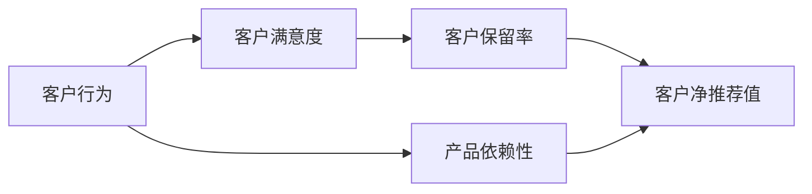
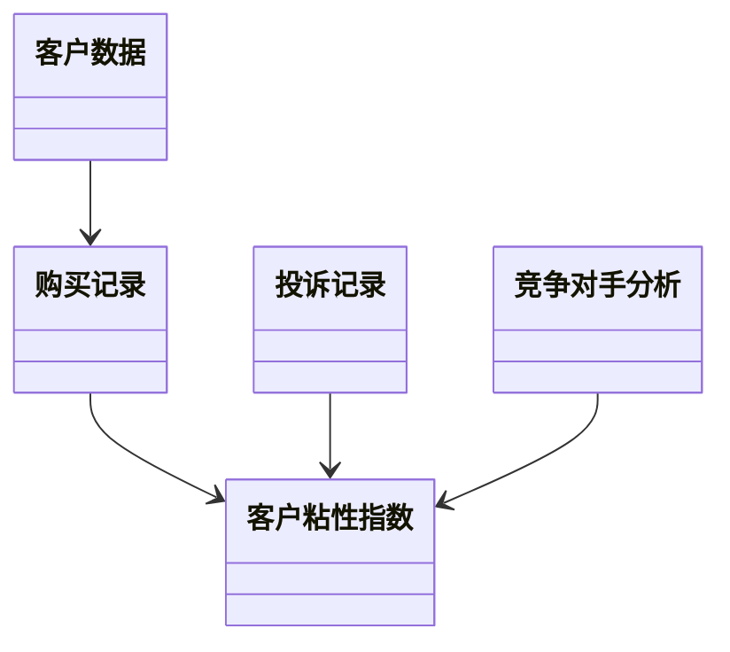

                 


# 彼得林奇如何分析公司的客户粘性

> 关键词：客户粘性，彼得·林奇，投资分析，客户生命周期，客户保留率

> 摘要：本文将详细探讨彼得·林奇如何通过客户粘性分析来评估公司的投资价值。通过分析客户粘性的构成要素、关键指标、数学模型、系统架构以及实际案例，本文将揭示客户粘性在投资决策中的重要性，并提供实用的分析方法和工具。

---

# 第一部分：客户粘性概述

## 第1章：客户粘性的概念与重要性

### 1.1 客户粘性的定义与内涵

客户粘性（Customer Stickiness）是指客户对某一产品或服务的依赖程度，通常表现为客户在面对替代品时，表现出较低的转换意愿或较高的保留率。客户粘性的强弱直接影响企业的收入稳定性、市场地位和投资价值。

**表1-1：客户粘性与客户行为的关系**

| 客户行为 | 高粘性 | 中等粘性 | 低粘性 |
|----------|--------|----------|--------|
| 转换率    | 低     | 中       | 高     |
| 重复购买率 | 高     | 中       | 低     |
| 投诉率    | 低     | 中       | 高     |

### 1.2 客户粘性的重要性

客户粘性是企业长期发展的关键指标。对于投资者而言，高客户粘性的公司通常具有更强的定价权和市场竞争力，能够在经济波动中保持稳定的收入来源。

---

## 第2章：彼得·林奇的客户粘性分析方法

### 2.1 彼得·林奇的投资理念

彼得·林奇（Peter Lynch）是全球著名投资专家，他强调通过深入分析公司的基本面和市场地位来评估其投资价值。他认为，客户粘性是衡量公司竞争优势的重要指标。

**图1-1：彼得·林奇的客户粘性分析框架**



### 2.2 林奇分析客户粘性的独特视角

林奇从客户行为和产品特性两个维度入手，通过分析客户的重复购买率、投诉率和转换成本，来评估客户粘性。

---

# 第二部分：客户粘性分析的核心概念

## 第3章：客户粘性分析的核心要素

### 3.1 客户粘性的构成要素

客户粘性由多个因素共同决定，包括产品依赖性、客户满意度和转换成本等。

**表3-1：客户粘性构成要素的对比**

| 要素         | 高粘性特征 | 低粘性特征 |
|--------------|------------|------------|
| 产品依赖性   | 高         | 低         |
| 客户满意度   | 高         | 低         |
| 转换成本     | 高         | 低         |

### 3.2 客户粘性与客户生命周期的关系

客户生命周期模型（Customer Life Cycle）帮助企业更好地理解客户在不同阶段的行为特征，从而制定针对性的粘性提升策略。

---

## 第4章：客户粘性分析的关键指标

### 4.1 客户保留率

客户保留率是衡量客户粘性的重要指标，计算公式为：

$$ 客户保留率 = \frac{期初客户数 - 期末流失客户数}{期初客户数} $$

### 4.2 客户净推荐值（NPS）

NPS是通过客户对产品的推荐意愿来衡量客户粘性，计算公式为：

$$ NPS = 推荐者比例 - 抱怨者比例 $$

### 4.3 客户流失率

客户流失率是客户粘性的反向指标，计算公式为：

$$ 客户流失率 = \frac{流失客户数}{总客户数} $$

---

# 第三部分：客户粘性分析的数学模型与算法

## 第5章：客户粘性分析的数学模型

### 5.1 客户粘性指数模型

客户粘性指数模型（Customer Stickiness Index Model，CSIM）通过综合多个指标来评估客户粘性，计算公式为：

$$ CSIM = (客户保留率 \times 0.5) + (NPS \times 0.3) + (客户满意度 \times 0.2) $$

### 5.2 客户粘性预测模型

客户粘性预测模型基于客户行为数据，使用逻辑回归算法进行预测。以下是Python实现代码：

```python
import pandas as pd
from sklearn.linear_model import LogisticRegression

# 数据加载
data = pd.read_csv('customer_stickiness.csv')

# 特征工程
X = data[['购买频率', '投诉次数', '转换成本']]
y = data['是否流失']

# 模型训练
model = LogisticRegression()
model.fit(X, y)

# 预测客户粘性
predicted_stickiness = model.predict(X)
```

---

## 第6章：客户粘性分析的系统架构设计

### 6.1 系统功能设计

**图6-1：客户粘性分析系统的领域模型**



### 6.2 系统架构设计

**图6-2：客户粘性分析系统的架构图**


---

## 第7章：项目实战

### 7.1 环境安装

需要安装以下工具和库：

- Python 3.8+
- Pandas
- Scikit-learn
- Mermaid

### 7.2 核心实现代码

```python
import numpy as np
import pandas as pd
from sklearn.metrics import accuracy_score

# 示例数据集
data = {
    '客户ID': [1, 2, 3, 4, 5],
    '购买频率': [3, 2, 4, 1, 2],
    '投诉次数': [0, 1, 0, 2, 1],
    '是否流失': [0, 0, 0, 1, 1]
}

df = pd.DataFrame(data)

# 特征工程
X = df[['购买频率', '投诉次数']]
y = df['是否流失']

# 模型训练
model = LogisticRegression()
model.fit(X, y)

# 预测与评估
predicted = model.predict(X)
print("模型准确率:", accuracy_score(y, predicted))
```

---

## 第8章：最佳实践与小结

### 8.1 小结

本文详细介绍了彼得·林奇分析客户粘性的方法，并结合数学模型和系统架构设计，展示了如何在实际中应用这些方法。

### 8.2 注意事项

在实际应用中，需注意数据质量和模型的可解释性，避免因数据偏差导致的分析误差。

### 8.3 拓展阅读

推荐阅读彼得·林奇的《彼得·林奇的选股标准》和《客户粘性管理》。

---

# 作者：AI天才研究院 & 禅与计算机程序设计艺术

