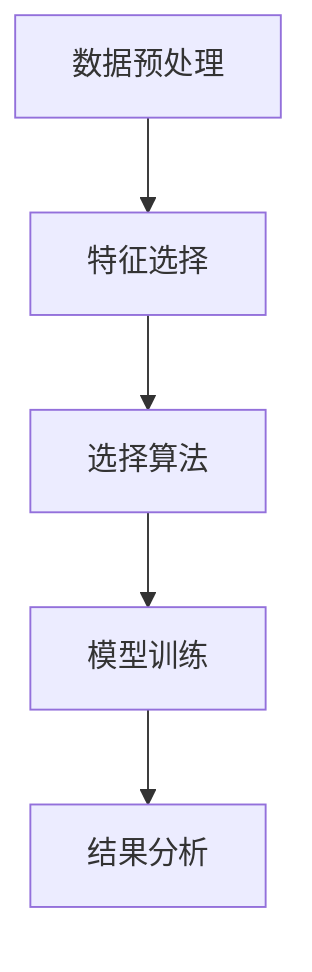
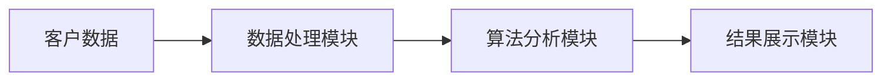

                 


# 彼得林奇如何分析公司的客户细分策略演变

## 关键词：彼得林奇，客户细分，投资分析，数据驱动，策略演变，企业价值评估

## 摘要：  
本文深入探讨了彼得·林奇如何通过分析公司的客户细分策略演变来评估企业价值。从客户细分的定义和演变历程，到数据驱动的客户细分方法，再到具体的算法实现和系统架构设计，文章详细阐述了客户细分策略在投资分析中的应用。通过实际案例分析，展示了如何利用客户细分策略的演变来优化企业价值评估。

---

# 第一部分: 客户细分策略演变的背景与重要性

## 第1章: 客户细分策略的定义与演变

### 1.1 客户细分的定义与核心概念

#### 1.1.1 客户细分的定义
客户细分是指根据客户的特征、行为或需求，将客户群体划分为多个子群体的过程。每个子群体（即细分市场）具有相似的特征或需求，从而帮助企业更精准地制定营销策略和产品开发计划。

#### 1.1.2 客户细分的核心要素
客户细分的核心要素包括：
1. **客户特征**：如年龄、性别、收入水平、地理位置等。
2. **客户行为**：如购买频率、购买金额、购买渠道等。
3. **客户需求**：如产品偏好、价格敏感度、品牌忠诚度等。

#### 1.1.3 客户细分与企业价值的关系
客户细分直接影响企业的市场定位、产品定价和营销策略。通过精准的客户细分，企业可以更好地满足客户需求，提高客户满意度和忠诚度，从而提升企业价值。

### 1.2 客户细分策略的演变历程

#### 1.2.1 传统客户细分方法
传统的客户细分方法主要依赖市场调研和专家经验，例如通过问卷调查、访谈等方式收集客户信息，然后根据经验将客户划分为不同的群体。

#### 1.2.2 数据驱动的客户细分
随着大数据技术的发展，企业开始利用数据分析工具和算法对客户数据进行挖掘，从而更精确地划分客户群体。

#### 1.2.3 智能化客户细分的兴起
近年来，人工智能和机器学习技术的快速发展，使得客户细分更加智能化。企业可以利用聚类分析、分类算法等技术，自动识别客户群体的特征和需求。

### 1.3 彼得·林奇与客户细分策略

#### 1.3.1 彼得·林奇的投资理念
彼得·林奇是美国著名投资经理人，他强调通过对公司基本面的深入分析来选择投资标的。他认为，企业的客户细分策略是评估公司价值的重要因素之一。

#### 1.3.2 客户细分策略在投资分析中的应用
彼得·林奇认为，通过分析公司的客户细分策略，可以评估企业的市场定位、客户忠诚度和未来的增长潜力。

#### 1.3.3 彼得·林奇的客户细分方法论
彼得·林奇提出的客户细分方法论主要包括：
1. **客户画像分析**：通过分析客户的特征和行为，构建客户画像。
2. **客户生命周期分析**：通过分析客户的购买行为和需求变化，评估客户生命周期。
3. **竞争对手分析**：通过分析竞争对手的客户细分策略，评估企业的市场地位。

---

## 第2章: 客户细分策略的核心概念与联系

### 2.1 核心概念原理

#### 2.1.1 客户细分的核心模型
客户细分的核心模型包括：
1. **RFM模型**：基于客户的最近购买时间（Recency）、购买频率（Frequency）和购买金额（Monetary）进行客户细分。
2. **K-means聚类模型**：基于客户的特征数据，通过聚类分析将客户划分为不同的群体。

#### 2.1.2 数据驱动的客户细分方法
数据驱动的客户细分方法主要包括：
1. **基于聚类的客户细分**：利用K-means、DBSCAN等聚类算法对客户数据进行分组。
2. **基于分类的客户细分**：利用决策树、随机森林等分类算法对客户进行分类。

#### 2.1.3 人工智能在客户细分中的应用
人工智能技术（如深度学习、自然语言处理）可以进一步提高客户细分的精准度和效率。

### 2.2 核心概念属性特征对比

| 特性       | 传统客户细分 | 数据驱动客户细分 |
|------------|--------------|------------------|
| 数据来源   | 调研问卷     | 结构化数据       |
| 分析方法   | 经验判断     | 算法驱动         |
| 精度       | 较低         | 较高             |
| 效率       | 低           | 高               |

### 2.3 ER实体关系图架构

```mermaid
er
  actor: 客户
  actor: 公司
  actor: 产品
  actor: 服务
  actor: 市场
  actor: 竞争对手
  relation: 购买行为
  relation: 偏好分析
  relation: 市场趋势
  relation: 竞争分析
```

---

## 第3章: 客户细分策略的算法原理

### 3.1 算法原理概述

#### 3.1.1 客户细分的基本算法
客户细分的基本算法包括：
1. **K-means聚类算法**：通过将客户数据划分为K个簇，找到每个簇的中心点。
2. **DBSCAN聚类算法**：基于密度的聚类算法，能够发现任意形状的簇。

#### 3.1.2 基于聚类的客户细分算法
基于聚类的客户细分算法主要包括：
1. **K-means算法**：适用于数值型数据。
2. **DBSCAN算法**：适用于密度较高的数据集。

#### 3.1.3 基于分类的客户细分算法
基于分类的客户细分算法主要包括：
1. **决策树分类算法**：适用于结构化数据。
2. **随机森林分类算法**：适用于高维数据。

### 3.2 算法流程图



### 3.3 算法实现代码

```python
from sklearn.cluster import KMeans
import pandas as pd

# 数据预处理
data = pd.read_csv('customer_data.csv')
data = data.dropna()

# 特征选择
features = data[['年龄', '收入', '购买频率', '购买金额']]
features = features.values

# 选择算法
model = KMeans(n_clusters=3, random_state=0)

# 模型训练
model.fit(features)

# 结果分析
labels = model.labels_
print("聚类结果：", labels)
```

### 3.4 算法数学模型

K-means聚类算法的目标是最小化所有样本到其簇中心的距离之和：

$$ \text{目标函数} = \sum_{i=1}^{n} \sum_{j=1}^{k} (x_{i,j} - c_{j})^2 $$

其中：
- \( x_{i,j} \) 表示第i个样本的第j个特征值。
- \( c_{j} \) 表示第j个簇的中心点。

---

## 第4章: 系统分析与架构设计方案

### 4.1 系统功能设计

#### 4.1.1 系统模块划分
1. **数据收集模块**：负责收集客户数据。
2. **数据处理模块**：负责对数据进行清洗和预处理。
3. **算法分析模块**：负责对数据进行聚类或分类分析。
4. **结果展示模块**：负责将分析结果以可视化形式展示。

#### 4.1.2 系统功能流程
1. 数据收集模块收集客户数据。
2. 数据处理模块对数据进行清洗和预处理。
3. 算法分析模块选择合适的算法进行客户细分。
4. 结果展示模块将分析结果以图表形式展示。

### 4.2 系统架构设计



### 4.3 系统接口设计
1. 数据接口：用于与数据库或其他数据源进行交互。
2. 算法接口：用于调用不同的客户细分算法。
3. 展示接口：用于将分析结果展示给用户。

### 4.4 系统交互设计

```mermaid
sequenceDiagram
    客户输入数据
    -> 数据处理模块: 数据清洗和预处理
    -> 算法分析模块: 调用K-means算法进行聚类
    -> 结果展示模块: 将聚类结果以图表形式展示
```

---

## 第5章: 项目实战

### 5.1 环境安装

```bash
pip install pandas scikit-learn mermaid
```

### 5.2 系统核心实现源代码

```python
from sklearn.cluster import KMeans
import pandas as pd
import matplotlib.pyplot as plt

# 数据预处理
data = pd.read_csv('customer_data.csv')
data = data.dropna()

# 特征选择
features = data[['年龄', '收入', '购买频率', '购买金额']]
features = features.values

# 选择算法
model = KMeans(n_clusters=3, random_state=0)

# 模型训练
model.fit(features)

# 结果分析
labels = model.labels_
print("聚类结果：", labels)

# 可视化展示
plt.scatter(features[:,0], features[:,1], c=labels, cmap='viridis')
plt.xlabel('年龄')
plt.ylabel('收入')
plt.title('客户细分结果')
plt.show()
```

### 5.3 代码应用解读与分析
上述代码实现了基于K-means算法的客户细分，通过将客户数据划分为三个簇，展示客户的分布情况。通过可视化图表，可以直观地看到客户群体的分布特征。

### 5.4 案例分析

假设我们有一个客户数据集，包含客户的年龄、收入、购买频率和购买金额。通过上述代码，我们可以将客户划分为三个群体：高收入且高购买频率的客户、中等收入且中等购买频率的客户，以及低收入且低购买频率的客户。通过分析这三个群体的特征，企业可以制定更有针对性的营销策略。

### 5.5 项目小结
通过本项目，我们利用K-means算法实现了客户细分，展示了如何通过数据驱动的方法优化企业的客户管理策略。

---

## 第6章: 总结与展望

### 6.1 总结
本文详细探讨了彼得·林奇如何通过分析客户的细分策略演变来评估企业价值。通过介绍客户细分的核心概念、算法原理和系统架构设计，我们展示了如何利用数据驱动的方法优化企业的客户管理策略。

### 6.2 注意事项
在实际应用中，需要注意以下几点：
1. 数据质量：确保数据的准确性和完整性。
2. 算法选择：根据实际需求选择合适的算法。
3. 结果解读：需要结合业务背景进行结果解读。

### 6.3 拓展阅读
1. 《Data Mining: Concepts and Techniques》
2. 《Pattern Recognition and Machine Learning》

---

## 作者：AI天才研究院/AI Genius Institute & 禅与计算机程序设计艺术 /Zen And The Art of Computer Programming

---

通过本文的分析，我们深入理解了彼得·林奇如何通过客户细分策略的演变来评估企业价值，并展示了如何利用数据驱动的方法优化企业的客户管理策略。希望本文能为读者在投资分析和客户管理领域提供有价值的参考和启发。

