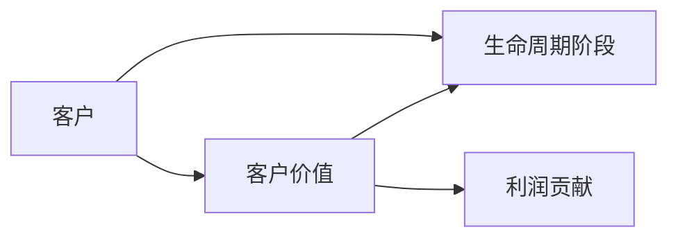

                 


# 彼得林奇如何分析公司的客户终身价值

> 关键词：彼得·林奇，客户终身价值，投资分析，企业价值评估，客户生命周期

> 摘要：本文将深入探讨彼得·林奇如何分析公司的客户终身价值。客户终身价值是衡量客户对公司长期贡献的重要指标，本文从背景、核心概念、算法原理、系统架构、项目实战等多个维度进行详细分析，结合实际案例和代码实现，帮助读者全面理解并应用这一重要概念。

---

## 第一章：客户终身价值的背景与重要性

### 1.1 客户终身价值的核心概念

#### 1.1.1 客户终身价值的定义
客户终身价值（Customer Lifetime Value，简称 CLV）是指客户在其生命周期内为企业带来的总收入减去相关成本后的净现值。它是企业评估客户价值的重要指标，能够帮助企业制定更有效的客户管理策略。

#### 1.1.2 彼得·林奇的分析方法
彼得·林奇作为一名传奇的基金经理，他擅长通过分析公司的基本面，尤其是客户价值，来评估公司的投资价值。他认为，客户终身价值是衡量公司长期盈利能力的关键因素之一。

#### 1.1.3 客户终身价值的重要性
客户终身价值不仅能够帮助企业识别高价值客户，还能优化客户管理策略，提高客户忠诚度和满意度，从而提升企业的整体竞争力。

### 1.2 客户终身价值的背景介绍

#### 1.2.1 问题背景
在当今竞争激烈的市场环境中，企业需要通过精准的客户分析来优化资源配置，提高客户满意度和忠诚度。

#### 1.2.2 问题描述
企业如何通过客户终身价值的分析，识别高价值客户，优化客户管理策略，提高客户满意度和忠诚度。

#### 1.2.3 问题解决
通过分析客户终身价值，企业能够制定更有效的客户管理策略，提高客户满意度和忠诚度，从而提升企业的整体竞争力。

#### 1.2.4 边界与外延
客户终身价值的分析需要结合客户生命周期、客户满意度、客户行为等多方面因素，但不涉及客户的短期行为分析。

#### 1.2.5 核心要素组成
客户终身价值的计算需要考虑客户生命周期、客户贡献度、客户保留率等多个因素。

---

## 第二章：客户终身价值的核心概念与联系

### 2.1 核心概念原理

#### 2.1.1 客户终身价值的构成要素
客户终身价值由客户生命周期、客户贡献度和客户保留率三部分组成。

#### 2.1.2 客户生命周期的阶段划分
客户生命周期通常分为获取阶段、成长阶段、成熟阶段和衰退阶段。

#### 2.1.3 客户价值与企业利润的关系
客户价值直接影响企业的利润，高价值客户能够为企业带来更高的收入和利润。

### 2.2 核心概念属性特征对比

#### 2.2.1 表格对比：客户终身价值与客户生命周期
| 比较维度 | 客户终身价值 | 客户生命周期 |
|----------|--------------|--------------|
| 定义     | 客户一生为公司带来的总利润 | 客户与企业互动的时间段 |
| 重点     | 评估客户价值 | 管理客户关系 |

#### 2.2.2 表格对比：客户价值与客户满意度
| 比较维度 | 客户价值 | 客户满意度 |
|----------|----------|------------|
| 重点     | 经济贡献 | 服务质量感知 |

### 2.3 实体关系图



---

## 第三章：客户终身价值的算法原理

### 3.1 算法原理

#### 3.1.1 贴现现金流模型
贴现现金流模型（Discounted Cash Flow，简称 DCF）是一种常用的企业估值方法，用于计算客户终身价值。

#### 3.1.2 客户生命周期价值的计算公式
客户生命周期价值的计算公式如下：

$$ CLV = \frac{R}{(1 + d)^n} $$

其中：
- \( R \) 是客户生命周期内的总收入
- \( d \) 是贴现率
- \( n \) 是周期数

### 3.2 算法流程图


### 3.3 数学模型与公式

客户生命周期价值的计算公式：

$$ CLV = \frac{R}{(1 + d)^n} $$

例如，假设客户生命周期内的总收入为 $100，贴现率为 5%，周期数为 5 年，那么：

$$ CLV = \frac{100}{(1 + 0.05)^5} = \frac{100}{1.2763} \approx 78.35 $$

---

## 第四章：客户终身价值的系统架构

### 4.1 系统分析与架构设计

#### 4.1.1 问题场景介绍
企业需要通过客户终身价值的分析，优化客户管理策略，提高客户满意度和忠诚度。

#### 4.1.2 项目介绍
本项目旨在通过分析客户数据，计算客户终身价值，帮助企业制定更有效的客户管理策略。

#### 4.1.3 系统功能设计
- 数据收集模块：收集客户数据
- 数据分析模块：计算客户终身价值
- 数据评估模块：评估客户价值

#### 4.1.4 系统架构设计


#### 4.1.5 系统接口设计
- 数据收集接口：用于收集客户数据
- 数据分析接口：用于计算客户终身价值
- 数据评估接口：用于评估客户价值

#### 4.1.6 系统交互设计


---

## 第五章：客户终身价值的项目实战

### 5.1 项目实战

#### 5.1.1 环境配置
需要安装 Python 和相关库（如 NumPy、Pandas、Matplotlib）。

#### 5.1.2 数据收集
收集客户数据，包括客户ID、收入、成本、生命周期阶段等。

#### 5.1.3 数据分析
使用 Python 编写代码，计算客户终身价值。

```python
import numpy as np
import pandas as pd

# 示例数据
data = {
    '客户ID': [1, 2, 3, 4, 5],
    '收入': [100, 200, 150, 80, 120],
    '成本': [50, 70, 60, 30, 40],
    '生命周期阶段': ['获取', '成长', '成熟', '衰退', '衰退']
}

df = pd.DataFrame(data)

# 计算客户终身价值
df['利润'] = df['收入'] - df['成本']
df['CLV'] = df['利润'] / (1 + 0.05)**5

print(df)
```

#### 5.1.4 数据可视化
使用 Matplotlib 绘制客户终身价值的分布图。

```python
import matplotlib.pyplot as plt

plt.bar(df['客户ID'], df['CLV'])
plt.title('客户终身价值分布图')
plt.xlabel('客户ID')
plt.ylabel('CLV')
plt.show()
```

#### 5.1.5 项目小结
通过实际案例分析，展示了如何计算客户终身价值，并帮助企业优化客户管理策略。

---

## 第六章：客户终身价值的最佳实践

### 6.1 最佳实践

#### 6.1.1 总结与回顾
客户终身价值是衡量客户价值的重要指标，能够帮助企业优化客户管理策略。

#### 6.1.2 注意事项
- 数据质量：确保数据准确性和完整性
- 模型选择：根据企业需求选择合适的模型
- 实际应用：结合企业实际情况进行调整

#### 6.1.3 未来趋势
随着人工智能和大数据技术的发展，客户终身价值的分析将更加精准和智能化。

---

## 作者：AI天才研究院/AI Genius Institute & 禅与计算机程序设计艺术/Zen And The Art of Computer Programming

---

通过本文的详细分析，读者可以全面理解彼得·林奇如何分析公司的客户终身价值，并能够实际应用相关的方法和工具。希望本文能够为企业的客户管理策略提供有价值的参考和指导。

