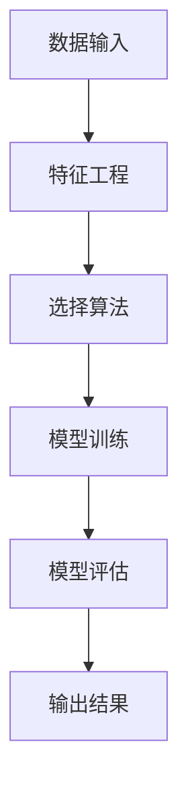
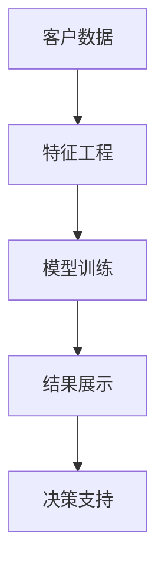

                 


# 彼得林奇如何分析公司的客户终身价值预测模型准确性

**关键词：** 客户终身价值、模型准确性、预测模型、客户分析、彼得林奇方法

**摘要：**  
客户终身价值（CLV）是企业衡量客户长期价值的重要指标，而预测模型的准确性是确保CLV计算可靠性的关键。本文从彼得林奇的投资哲学出发，系统分析其客户分析方法，并结合数学模型与算法，详细探讨CLV预测模型的准确性评估与优化。文章内容涵盖模型的核心算法、准确性评估指标、系统架构设计以及项目实战，帮助读者全面理解如何构建和优化CLV预测模型。

---

## 第一部分: 客户终身价值预测模型的背景与核心概念

### 第1章: 客户终身价值预测模型的定义与重要性

#### 1.1 客户终身价值（CLV）的定义
客户终身价值（Customer Lifetime Value, CLV）是企业在客户生命周期内从该客户获得的总收入减去相关成本的净现值。它是企业制定客户管理策略的重要依据，能够帮助企业识别高价值客户并优化资源分配。

**核心要素：**
- **客户生命周期**：客户从初次接触、购买、复购到最终流失的时间段。
- **收入贡献**：客户在生命周期内为企业带来的总收入。
- **成本**：获取、维护和流失客户所产生的成本。
- **贴现率**：用于计算未来现金流现值的折现率，反映时间价值。

**CLV与企业决策的关系：**
CLV不仅帮助企业评估客户的经济价值，还能指导市场推广、客户维护和产品定价策略。例如，企业可以根据CLV将客户分为不同群体，优先投资高价值客户。

#### 1.2 客户终身价值预测模型的准确性
模型的准确性直接关系到企业对客户价值的评估和决策。如果模型不准确，可能导致资源浪费或客户流失。例如，低估高价值客户的CLV可能导致企业错失维护这些客户的机会，而高估低价值客户的CLV可能导致资源浪费。

**模型准确性的影响因素：**
- 数据质量：数据的完整性和准确性直接影响模型的预测结果。
- 模型选择：不同的算法对数据的敏感性和假设条件不同。
- 参数设置：模型参数的选择会影响预测的准确性。
- 数据分布：数据的分布特征（如偏态、峰态）会影响模型的适用性。

---

### 第2章: 彼得林奇的客户分析方法

#### 2.1 彼得林奇的客户分析理念
彼得林奇是美国著名的投资专家，以其独特的投资哲学闻名。他的客户分析方法强调基本面分析和长期价值评估，注重客户行为的稳定性和可持续性。

**投资哲学与客户分析的结合：**
- **长期视角**：彼得林奇注重客户关系的长期价值，而非短期收益。
- **基本面分析**：通过分析客户的收入、支出和行为模式，评估其未来的价值贡献。
- **边际成本**：关注获取和维护客户的边际成本，以优化资源配置。

#### 2.2 彼得林奇模型的数学推导
彼得林奇模型基于贴现现金流法，通过计算客户未来现金流的现值来预测CLV。

**数学公式：**
$$ CLV = \frac{R}{d(1 + d)^n} $$
其中：
- \( R \) 是客户在生命周期内带来的总收入。
- \( d \) 是贴现率。
- \( n \) 是客户生命周期的长度。

**案例分析：**
假设某客户每年为企业带来100元收入，贴现率为5%，生命周期为5年。计算其CLV：
$$ CLV = \frac{100}{0.05 \times (1 + 0.05)^5} \approx 1809.5 \text{元} $$

---

## 第二部分: 客户终身价值预测模型的准确性分析

### 第3章: 客户终身价值预测模型的核心算法

#### 3.1 常见的CLV预测算法
CLV预测模型的准确性依赖于算法的选择和优化。以下是常见的几种算法及其特点：

**算法对比表：**

| 算法名称          | 优点                          | 缺点                          |
|-------------------|-------------------------------|-------------------------------|
| 简单平均法        | 计算简单，适用于小样本数据    | 忽略时间价值和客户流失率      |
| 贴现现金流法      | 考虑时间价值，结果直观        | 需准确估计贴现率和生命周期     |
| Markov链模型      | 考虑客户状态转移，动态预测    | 计算复杂，需要大量历史数据     |
| 神经网络模型      | 高度灵活，适合复杂场景        | 需大量数据，计算资源消耗大     |

**算法流程图：**


#### 3.2 彼得林奇模型的优化方法
彼得林奇模型的优化需要结合数据清洗、特征工程和参数调优。

**优化步骤：**
1. 数据清洗：处理缺失值、异常值和重复数据。
2. 特征工程：提取关键特征（如客户生命周期阶段、收入增长率）。
3. 模型调优：调整贴现率、生命周期长度等参数，优化预测结果。

---

### 第4章: 模型准确性的评估与优化

#### 4.1 模型准确性评估指标
模型的准确性可以通过以下指标进行评估：

**指标对比表：**

| 指标名称          | 定义                          | 适用场景                     |
|-------------------|-------------------------------|------------------------------|
| 均方误差（MSE）    | 预测值与实际值的平方差的平均值  | 适用于回归模型评估           |
| R平方值（R²）      | 模型解释力的度量              | 适用于线性回归模型评估         |
| 回归模型的拟合优度 | 模型对数据的拟合程度            | 适用于线性回归模型评估         |
| 交叉验证法        | 通过多次训练和验证评估模型性能  | 适用于小样本数据的模型评估     |

#### 4.2 彼得林奇模型的验证方法
彼得林奇模型的验证需要结合历史数据和实际业务场景。

**验证流程：**
1. 数据分割：将数据分为训练集和验证集。
2. 模型预测：使用训练集训练模型，验证集评估准确性。
3. 结果分析：比较预测值与实际值，调整模型参数。

---

## 第三部分: 系统架构与实现

### 第5章: 系统架构设计

#### 5.1 系统功能设计
CLV预测系统的功能模块包括：
- 数据采集：从CRM系统获取客户数据。
- 特征工程：提取客户特征，如收入、购买频率。
- 模型训练：基于特征数据训练CLV预测模型。
- 结果展示：可视化预测结果，提供决策支持。

**系统架构图：**


#### 5.2 系统接口设计
系统接口包括数据接口（与CRM系统对接）和用户接口（供业务人员查看结果）。

---

### 第6章: 项目实战

#### 6.1 环境安装
安装必要的Python库，如pandas、numpy、scikit-learn。

#### 6.2 核心代码实现
```python
import pandas as pd
import numpy as np
from sklearn.metrics import mean_squared_error, r2_score

# 数据预处理
data = pd.read_csv('customer_data.csv')
data = data.dropna()

# 特征工程
features = data[['revenue', 'cost', 'lifetime']]
target = data['clv']

# 模型训练
from sklearn.linear_model import LinearRegression
model = LinearRegression()
model.fit(features, target)

# 模型评估
predictions = model.predict(features)
mse = mean_squared_error(target, predictions)
r2 = r2_score(target, predictions)

print(f"MSE: {mse}")
print(f"R²: {r2}")
```

#### 6.3 案例分析
以某零售企业为例，使用上述代码计算客户CLV，并分析模型的准确性。

---

## 第四部分: 最佳实践与总结

### 第7章: 最佳实践与小结

#### 7.1 关键点总结
- 数据质量是模型准确性的基础。
- 模型选择应结合业务场景和数据特征。
- 模型的持续优化需要结合实际业务反馈。

#### 7.2 应用建议
- 对于小企业，推荐使用简单平均法或贴现现金流法。
- 对于大数据场景，建议采用神经网络模型。
- 持续监控模型性能，定期更新数据和参数。

#### 7.3 未来展望
随着AI技术的发展，CLV预测模型将更加智能化和个性化。未来的优化方向包括引入机器学习算法和实时数据处理技术。

---

**作者：AI天才研究院 & 禅与计算机程序设计艺术**  
**版权声明：本文为原创内容，转载请注明出处。**

