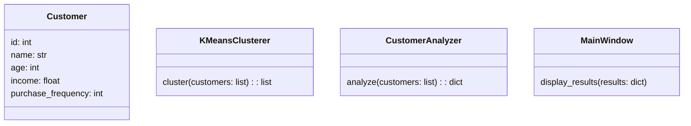
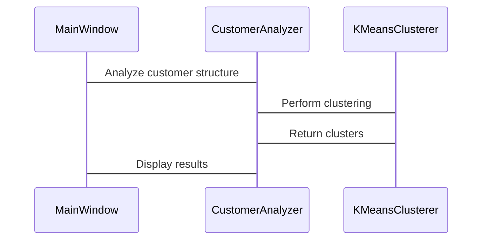

                 


# 彼得林奇如何分析公司的客户结构

**关键词**：客户结构分析，彼得·林奇，投资分析，客户生命周期，企业价值

**摘要**：本文深入探讨了彼得·林奇如何分析公司的客户结构，从客户类型、市场分布、生命周期等多个维度进行详细分析。通过数学模型和算法实现，结合实际案例，展示了如何利用客户结构分析来评估企业价值和制定投资策略。文章还提供了详细的Python代码和系统架构设计，帮助读者更好地理解和应用这些方法。

---

## 第1章：客户结构分析的核心概念

### 1.1 客户结构分析的定义与背景

#### 1.1.1 客户结构分析的定义
客户结构分析是指通过对公司客户群体的分类、分布和行为特征的分析，揭示客户之间的关系、趋势和潜在价值。这种方法能够帮助企业更好地理解客户，优化资源配置，提升盈利能力。

#### 1.1.2 客户结构分析的背景与重要性
在现代商业环境中，客户结构分析是企业制定战略的重要工具。通过分析客户结构，企业可以识别高价值客户，优化客户服务策略，降低客户流失率，并预测市场趋势。

#### 1.1.3 彼得·林奇客户结构分析方法的独特性
彼得·林奇以其独特的客户结构分析方法闻名，他注重从客户行为和需求出发，结合企业财务数据，评估企业的潜在价值和成长性。

---

### 1.2 客户结构分析的核心要素

#### 1.2.1 客户类型与分类标准
客户类型通常包括个人客户和机构客户。个人客户可能更关注价格和便利性，而机构客户则更关注服务质量和长期合作。

#### 1.2.2 客户市场分布与生命周期
客户市场分布分析包括地域分布和行业分布。生命周期分析则将客户分为新客户、成熟客户和流失客户。

#### 1.2.3 客户行为与需求分析
客户行为分析包括购买频率、购买金额和客户满意度等指标。需求分析则关注客户对产品或服务的具体要求。

---

### 1.3 彼得·林奇客户结构分析的基本原则

#### 1.3.1 以客户为中心的投资理念
彼得·林奇认为，客户是企业的核心资源，客户结构分析是评估企业价值的重要手段。

#### 1.3.2 客户结构与企业价值的关系
客户结构的优化可以提升企业的市场占有率和盈利能力，从而提高企业价值。

#### 1.3.3 分析客户结构的逻辑框架
彼得·林奇的客户结构分析框架包括客户分类、客户分布和客户行为预测三个部分。

---

## 第2章：客户结构分析的维度与指标

### 2.1 客户类型分析

#### 2.1.1 个人客户与机构客户的分类
个人客户通常以个体需求为主，而机构客户则更注重长期合作和稳定性。

#### 2.1.2 不同客户类型的特点与风险
个人客户可能更敏感于价格变化，而机构客户则更关注企业的长期发展潜力。

#### 2.1.3 客户类型与企业盈利的关系
高价值客户通常为企业带来更高的利润，因此客户类型的分布直接影响企业的盈利能力。

---

### 2.2 客户市场分布分析

#### 2.2.1 地域分布与市场潜力
通过分析客户分布的地域，企业可以识别高潜力市场并制定针对性的营销策略。

#### 2.2.2 行业分布与竞争格局
行业分布可以帮助企业了解主要客户所在行业，从而优化资源配置。

#### 2.2.3 客户规模与企业成长性
客户规模的扩大通常意味着企业的成长性增强，但同时也需要关注客户质量。

---

### 2.3 客户生命周期分析

#### 2.3.1 客户生命周期的四个阶段
客户生命周期包括新客户、成长期客户、成熟期客户和衰退期客户。

#### 2.3.2 各阶段客户的特征与行为
新客户可能需要更多引导，而成熟客户则更稳定，衰退期客户可能需要重新激活。

#### 2.3.3 生命周期与企业战略的关系
通过分析客户生命周期，企业可以制定针对性的客户 retention 策略。

---

## 第3章：彼得·林奇客户结构分析的步骤与技巧

### 3.1 客户结构分析的基本步骤

#### 3.1.1 确定分析目标与范围
明确分析的目标，例如识别高价值客户或优化客户分布。

#### 3.1.2 收集客户数据与信息
收集客户的基本信息、交易记录和行为数据。

#### 3.1.3 建立客户分析模型
根据收集的数据，建立客户分类和生命周期价值模型。

---

### 3.2 客户结构分析的关键技巧

#### 3.2.1 数据分析与可视化技巧
使用数据分析工具（如Python）和可视化工具（如Matplotlib）进行数据处理和展示。

#### 3.2.2 客户画像的构建与解读
通过数据挖掘技术构建客户画像，识别不同类型客户的特征。

#### 3.2.3 客户行为预测与趋势分析
利用机器学习算法预测客户行为，识别市场趋势。

---

### 3.3 彼得·林奇的客户结构分析框架

#### 3.3.1 客户结构的层次化分析
从宏观到微观，逐步细化客户结构，识别关键客户群体。

#### 3.3.2 客户价值的评估方法
通过客户生命周期价值模型评估客户价值，制定差异化策略。

#### 3.3.3 客户结构优化的策略制定
根据分析结果，优化客户结构，提升企业整体价值。

---

## 第4章：客户结构分析的数学模型与算法

### 4.1 客户生命周期价值模型

#### 4.1.1 模型的定义与公式
客户生命周期价值（CLV）模型公式如下：
$$ CLV = \frac{R \times (1 + w \times (1 - \delta))}{\delta} $$
其中，$R$ 表示客户的年收入，$w$ 表示客户的生命周期长度，$\delta$ 表示客户流失率。

#### 4.1.2 模型的实现步骤
1. 收集客户数据，计算客户收入和生命周期。
2. 确定客户流失率。
3. 代入公式计算客户生命周期价值。

---

### 4.2 客户分类的聚类分析

#### 4.2.1 聚类分析的基本原理
聚类分析是一种无监督学习方法，用于将客户分为不同的类别。

#### 4.2.2 K-means算法的实现
以下是K-means算法的Python代码示例：
```python
from sklearn.cluster import KMeans
import pandas as pd

# 假设我们有一个客户数据集 df，包含客户特征
df = pd.read_csv('customer_data.csv')
features = df[['feature1', 'feature2']]  # 特征列

# 初始化K-means模型
kmeans = KMeans(n_clusters=3, random_state=0)
# 训练模型
kmeans.fit(features)
# 预测簇标签
clusters = kmeans.predict(features)
print(clusters)
```

#### 4.2.3 客户分类的步骤与应用
1. 数据预处理：标准化或归一化特征。
2. 确定簇的数量：通过 elbow 方法选择最佳簇数。
3. 模型训练与预测。
4. 可视化结果：使用二维散点图展示簇分布。

---

## 第5章：客户结构分析的算法实现

### 5.1 客户分类的Python实现

#### 5.1.1 数据预处理与特征提取
```python
import pandas as pd
from sklearn.preprocessing import StandardScaler

# 读取数据
df = pd.read_csv('customer_data.csv')

# 提取特征
features = df[['age', 'income', 'purchase_frequency']]
```

#### 5.1.2 K-means算法的代码实现
```python
from sklearn.cluster import KMeans

# 初始化模型
kmeans = KMeans(n_clusters=3, random_state=0)

# 训练模型
kmeans.fit(features)

# 预测簇标签
clusters = kmeans.predict(features)
```

#### 5.1.3 客户分类结果的可视化
```python
import matplotlib.pyplot as plt

# 可视化
plt.scatter(features['age'], features['income'], c=clusters, cmap='viridis')
plt.xlabel('Age')
plt.ylabel('Income')
plt.title('Customer Clustering')
plt.show()
```

---

## 第6章：系统架构与项目实战

### 6.1 系统功能设计

#### 6.1.1 领域模型（mermaid类图）


#### 6.1.2 系统架构设计（mermaid架构图）


#### 6.1.3 系统交互设计（mermaid序列图）


---

## 第7章：项目实战与案例分析

### 7.1 实际案例分析

#### 7.1.1 案例背景
以某零售企业为例，分析其客户结构，识别高价值客户群体。

#### 7.1.2 数据收集与处理
收集过去三年的客户交易数据，提取年龄、收入和购买频率等特征。

#### 7.1.3 模型训练与预测
使用K-means算法将客户分为三类：高价值客户、中等价值客户和低价值客户。

#### 7.1.4 结果解读与优化建议
根据分类结果，制定针对性的营销策略，优化客户结构。

---

## 第8章：总结与展望

### 8.1 本章小结
本文详细介绍了彼得·林奇如何分析公司的客户结构，从理论到实践，结合数学模型和算法实现，展示了客户结构分析的重要性和应用价值。

### 8.2 未来展望
未来，随着大数据和人工智能技术的发展，客户结构分析将更加精准和智能化，为企业创造更大的价值。

---

**作者：AI天才研究院 & 禅与计算机程序设计艺术**

---

这篇文章详细讲解了彼得·林奇的客户结构分析方法，结合理论、数学模型和实际案例，帮助读者全面理解和应用这些方法。

