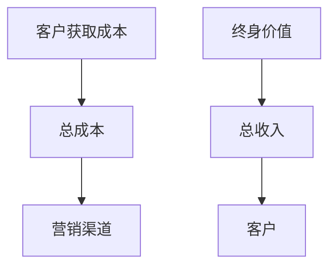
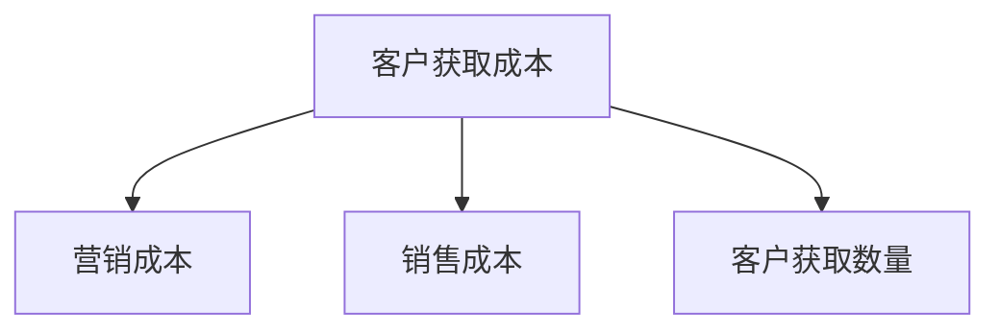
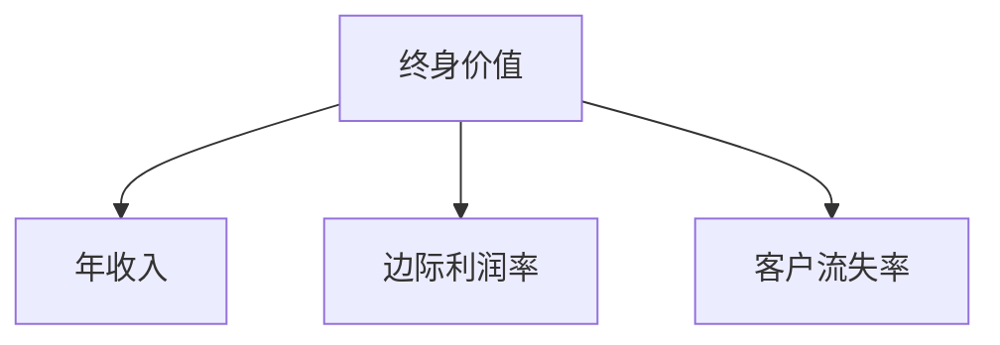
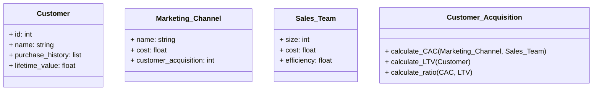
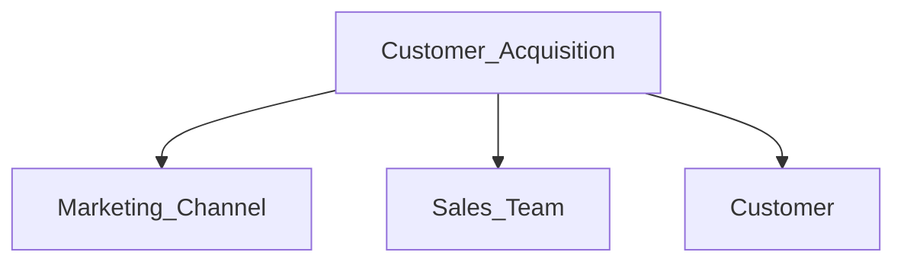

                 


# 彼得林奇如何分析公司的客户获取成本与终身价值比率

## 关键词：客户获取成本（CAC）、终身价值（LTV）、投资回报率（ROI）、彼得·林奇、企业价值评估

## 摘要：本文将探讨彼得·林奇如何通过分析客户获取成本（CAC）和终身价值（LTV）的比率来评估公司的投资价值。通过详细分析CAC和LTV的定义、计算方法及其比率，我们将展示如何利用这些指标来优化企业的客户获取策略和价值评估。

---

# 第一部分: 背景介绍

## # 第1章: 客户获取成本（CAC）与终身价值（LTV）概述

### 1.1 问题背景与描述

#### 1.1.1 什么是客户获取成本（CAC）
客户获取成本（Customer Acquisition Cost，CAC）是指企业为获取一个新客户所支付的所有成本，包括营销成本、销售成本、渠道费用以及其他相关费用。CAC的计算公式为：

$$CAC = \frac{\text{营销成本} + \text{销售成本}}{\text{客户获取数量}}$$

CAC的高低直接反映了客户获取的难易程度和成本效率。如果一个公司的CAC过高，可能意味着其客户获取策略不够高效，或者市场推广成本过高。

#### 1.1.2 什么是终身价值（LTV）
终身价值（Lifetime Value，LTV）是指一个客户在其生命周期内为企业带来的总收入。LTV的计算公式为：

$$LTV = \frac{\text{年收入} \times \text{边际利润率}}{\text{客户流失率}}$$

LTV反映了客户对企业长期价值的贡献。一个高LTV的客户意味着其生命周期内为企业带来的收入远大于获取成本。

#### 1.1.3 CAC与LTV的定义与外延
CAC和LTV是客户价值评估中的两个关键指标。CAC关注的是获取客户所需的成本，而LTV关注的是客户为企业带来的长期价值。两者的比率（CAC/LTV）是衡量客户获取策略是否经济的重要指标。

---

## # 第2章: CAC与LTV的核心概念与联系

### 2.1 核心概念原理

#### 2.1.1 CAC的计算公式与影响因素
CAC的计算公式为：

$$CAC = \frac{\text{营销成本} + \text{销售成本}}{\text{客户获取数量}}$$

影响CAC的主要因素包括：
- **营销成本**：包括广告、推广、SEO等费用。
- **销售成本**：包括销售团队的工资、培训费用等。
- **客户获取数量**：获取客户的数量直接影响CAC。

#### 2.1.2 LTV的计算公式与影响因素
LTV的计算公式为：

$$LTV = \frac{\text{年收入} \times \text{边际利润率}}{\text{客户流失率}}$$

影响LTV的主要因素包括：
- **年收入**：客户在生命周期内为企业带来的总收入。
- **边际利润率**：每次交易的利润贡献。
- **客户流失率**：客户离开企业的概率。

#### 2.1.3 CAC与LTV的比率分析
CAC与LTV的比率（CAC/LTV）是衡量客户获取策略经济性的重要指标。一般来说，如果CAC/LTV小于1，则意味着客户获取是盈利的；如果大于1，则意味着客户获取成本过高，可能需要重新评估策略。

---

### 2.2 核心概念属性特征对比表格

| 概念   | 定义                                                                 | 计算公式                                                                 | 影响因素                              | 应用场景                              |
|--------|----------------------------------------------------------------------|--------------------------------------------------------------------------|---------------------------------------|---------------------------------------|
| CAC    | 获取一个新客户的总成本                                             | $$CAC = \frac{\text{营销成本} + \text{销售成本}}{\text{客户获取数量}}$$ | 营销渠道效率、客户获取难度、销售团队效率 | 评估客户获取的经济性                 |
| LTV    | 客户在生命周期内为企业带来的总收入                               | $$LTV = \frac{\text{年收入} \times \text{边际利润率}}{\text{客户流失率}}$$ | 客户生命周期、客户购买频率、客户价值   | 评估客户的长期价值                   |

---

### 2.3 ER实体关系图



---

## # 第3章: CAC与LTV的算法原理

### 3.1 CAC的计算算法



### 3.2 LTV的计算算法



---

## # 第4章: CAC与LTV的比率分析

### 4.1 CAC/LTV比率的计算公式

$$\text{CAC/LTV比率} = \frac{CAC}{LTV}$$

### 4.2 CAC/LTV比率的行业应用

- **理想情况**：CAC/LTV < 1，意味着获取客户的成本低于其带来的长期价值，投资回报率高。
- **警示情况**：CAC/LTV > 1，意味着获取客户的成本高于其带来的长期价值，需要重新评估客户获取策略。

---

# 第二部分: 系统分析与架构设计方案

## # 第5章: 系统功能设计

### 5.1 领域模型



---

## # 第6章: 系统架构设计

### 6.1 系统架构图



---

## # 第7章: 系统接口设计

### 7.1 API接口设计

- **输入接口**：
  - Marketing_Channel: {name, cost, customer_acquisition}
  - Sales_Team: {size, cost, efficiency}
  - Customer: {id, name, purchase_history}

- **输出接口**：
  - CAC
  - LTV
  - CAC/LTV比率

---

## # 第8章: 系统交互设计

### 8.1 交互流程图

```mermaid
graph TD
    User --> Customer_Acquisition: 提供客户数据
    Customer_Acquisition --> Marketing_Channel: 获取营销渠道数据
    Customer_Acquisition --> Sales_Team: 获取销售团队数据
    Customer_Acquisition --> calculate_CAC
    Customer_Acquisition --> calculate_LTV
    Customer_Acquisition --> calculate_ratio
    Customer_Acquisition --> User: 返回CAC/LTV比率
```

---

# 第三部分: 项目实战

## # 第9章: 项目环境与核心实现

### 9.1 环境安装

- **工具**：Python、Mermaid、Latex
- **库**：Pandas、Matplotlib、Seaborn

### 9.2 核心实现代码

```python
def calculate_CAC(marketing_cost, sales_cost, customers_acquired):
    return (marketing_cost + sales_cost) / customers_acquired

def calculate_LTV(yearly_revenue, margin, churn_rate):
    return (yearly_revenue * margin) / churn_rate

def calculate_ratio(CAC, LTV):
    return CAC / LTV
```

### 9.3 代码应用解读

- **calculate_CAC**：计算客户获取成本。
- **calculate_LTV**：计算客户终身价值。
- **calculate_ratio**：计算CAC/LTV比率。

---

## # 第10章: 实际案例分析

### 10.1 案例介绍

假设一家SaaS公司，年收入为100万美元，边际利润率为20%，客户流失率为5%。营销成本为50万美元，销售成本为30万美元，客户获取数量为1000人。

### 10.2 计算过程

1. **CAC计算**：
   $$CAC = \frac{500,000 + 300,000}{1,000} = 800$$

2. **LTV计算**：
   $$LTV = \frac{1,000,000 \times 0.2}{0.05} = 4,000,000$$

3. **CAC/LTV比率**：
   $$\text{比率} = \frac{800}{4,000,000} = 0.2$$

### 10.3 结果分析

由于比率小于1，说明客户获取策略是经济的，投资回报率高。

---

## # 第11章: 项目小结

通过实际案例分析，我们展示了如何利用CAC和LTV的比率来评估客户获取策略的经济性。比率小于1表明客户获取是盈利的，反之则需要优化策略。

---

# 第四部分: 最佳实践与小结

## # 第12章: 最佳实践

### 12.1 小结

- 定期评估CAC和LTV的比率。
- 关注客户获取成本和客户流失率。
- 优化营销和销售策略以降低CAC。

### 12.2 注意事项

- 确保数据的准确性和完整性。
- 结合行业基准进行分析。
- 定期更新模型以反映市场变化。

### 12.3 拓展阅读

- 《The Lean Startup》
- 《Metrics That Matter》
- 彼得·林奇的投资著作

---

# 作者：AI天才研究院/AI Genius Institute & 禅与计算机程序设计艺术 /Zen And The Art of Computer Programming

---

希望这篇文章能够为您提供清晰的思路和详细的分析。如果您有任何问题或需要进一步探讨，请随时联系！

