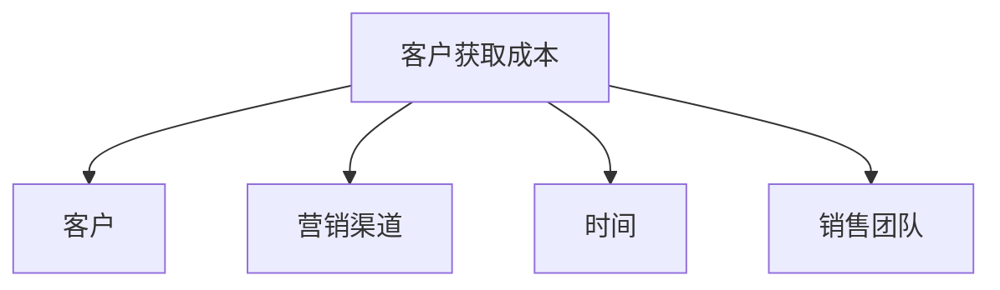

                 

# 彼得林奇如何分析公司的客户获取成本效率变化

> 关键词：客户获取成本（CAC）、投资分析、财务指标、客户价值评估、彼得林奇、CAC效率变化

> 摘要：本文详细介绍了彼得林奇分析客户获取成本（CAC）效率变化的方法，通过分析CAC的定义、计算公式、影响因素，以及如何通过数据分析优化CAC效率，帮助读者理解如何通过CAC效率变化优化企业投资决策。

---

# 引言

客户获取成本（Customer Acquisition Cost，简称CAC）是企业在获取新客户过程中所花费的所有成本的总和。对于企业而言，CAC效率的变化直接影响企业的盈利能力和发展潜力。本文将从彼得林奇的视角出发，详细分析如何通过CAC效率变化优化企业投资决策。

---

## 正文

### 第1章：客户获取成本（CAC）的基本概念

#### 1.1 问题背景

客户获取成本（CAC）是企业在吸引新客户过程中所投入的所有成本的总和，包括营销费用、销售团队的工资、广告支出等。彼得林奇认为，分析CAC效率变化是评估企业盈利能力的重要指标之一。

##### 1.1.1 什么是客户获取成本（CAC）
客户获取成本（CAC）是企业在吸引新客户过程中所投入的所有成本的总和。计算公式如下：

$$CAC = \frac{\text{营销成本} + \text{销售成本}}{\text{新增客户数}}$$

##### 1.1.2 CAC在企业中的重要性
CAC是衡量企业客户获取效率的重要指标。通过分析CAC，企业可以了解每获取一个客户所花费的成本，从而优化营销策略，降低客户获取成本。

##### 1.1.3 为什么CAC效率变化需要分析
CAC效率变化反映了企业在客户获取过程中的成本控制能力。通过分析CAC的变化趋势，企业可以发现哪些渠道或策略能够有效降低客户获取成本，从而提高盈利能力。

#### 1.2 问题描述

##### 1.2.1 CAC的定义与计算公式
CAC的定义是企业在吸引新客户过程中所投入的所有成本的总和。计算公式如下：

$$CAC = \frac{\text{营销成本} + \text{销售成本}}{\text{新增客户数}}$$

##### 1.2.2 CAC效率变化的衡量标准
CAC效率变化的衡量标准包括CAC的年增长率、季度变化率等。企业需要关注CAC的变化趋势，分析其背后的原因。

##### 1.2.3 影响CAC效率变化的关键因素
影响CAC效率变化的关键因素包括：

1. 营销渠道的变化
2. 客户获取策略的调整
3. 市场竞争状况的变化
4. 客户需求的变化

#### 1.3 问题解决

##### 1.3.1 分析CAC效率变化的方法
分析CAC效率变化的方法包括：

1. 数据收集：收集企业过去一段时间的CAC数据。
2. 趋势分析：分析CAC的变化趋势，判断其是上升还是下降。
3. 预警机制：设定CAC变化的预警线，及时发现异常情况。

##### 1.3.2 如何优化CAC效率
优化CAC效率的方法包括：

1. 优化营销渠道：选择成本更低的营销渠道。
2. 提高转化率：通过优化销售流程提高客户转化率。
3. 降低营销成本：通过精准营销降低不必要的开支。

##### 1.3.3 CAC效率变化对企业发展的影响
CAC效率变化直接影响企业的盈利能力。如果CAC效率下降，意味着企业获取客户的成本增加，可能影响企业的利润率。反之，如果CAC效率提高，意味着企业获取客户的成本降低，利润空间增大。

#### 1.4 边界与外延

##### 1.4.1 CAC与其他成本的区分
CAC与其他成本（如生产成本、运维成本）的区别在于，CAC是专门用于获取客户的成本，而其他成本是用于生产和维护产品的成本。

##### 1.4.2 CAC与客户生命周期价值（CLV）的关系
客户生命周期价值（CLV）是企业在客户生命周期内从客户身上获得的总收入，而CAC是企业在获取客户过程中所花费的成本。两者的比值（CLV/CAC）是衡量客户获取效率的重要指标。

##### 1.4.3 CAC在不同行业中的应用差异
不同行业的CAC计算方式和影响因素有所不同。例如，电子商务行业的CAC主要包含广告费用和销售费用，而软件行业的CAC则可能包含营销费用和技术支持费用。

#### 1.5 概念结构与核心要素组成

##### 1.5.1 CAC的核心要素
CAC的核心要素包括：

1. 营销成本
2. 销售成本
3. 新增客户数

##### 1.5.2 CAC与企业利润的关系
CAC与企业利润的关系可以通过以下公式表示：

$$\text{净利润} = \text{总收入} - \text{总成本}$$

其中，总成本包括CAC和其他成本。

##### 1.5.3 CAC在投资决策中的作用
CAC在投资决策中的作用主要体现在以下几个方面：

1. 评估投资项目的盈利能力。
2. 判断客户获取渠道的效率。
3. 优化企业的资源配置。

### 第2章：CAC的核心概念原理

#### 2.1 CAC的计算方法

##### 2.1.1 CAC的公式推导
CAC的公式推导如下：

$$CAC = \frac{\text{营销成本} + \text{销售成本}}{\text{新增客户数}}$$

##### 2.1.2 CAC的计算步骤
1. 收集企业的营销成本和销售成本。
2. 统计新增客户数。
3. 代入公式计算CAC。

##### 2.1.3 CAC的单位成本分析
CAC的单位成本分析可以帮助企业了解每个客户的获取成本。例如，如果企业的CAC为100元，而客户的生命周期价值为500元，则CLV/CAC比率为5，说明客户获取效率较高。

#### 2.2 CAC的核心属性特征对比

##### 2.2.1 CAC与客户生命周期价值（CLV）的对比
CLV是企业在客户生命周期内从客户身上获得的总收入，而CAC是企业在获取客户过程中所花费的成本。两者的比值（CLV/CAC）是衡量客户获取效率的重要指标。

##### 2.2.2 CAC与客户保留成本的对比
客户保留成本是指企业在保持现有客户过程中所花费的成本，而CAC是指企业在获取新客户过程中所花费的成本。两者的区别在于，CAC关注的是获取新客户，而客户保留成本关注的是保持现有客户。

##### 2.2.3 CAC与客户获取渠道效率的对比
不同营销渠道的CAC效率不同。例如，通过搜索引擎广告获取客户的CAC可能低于通过电视广告获取客户的CAC。

#### 2.3 CAC的ER实体关系图

### 第3章：CAC效率变化的算法原理

#### 3.1 CAC的计算模型

##### 3.1.1 CAC的数学模型
CAC的数学模型如下：

$$CAC = \frac{\text{营销成本} + \text{销售成本}}{\text{新增客户数}}$$

##### 3.1.2 CAC与客户获取效率的关系
客户获取效率可以通过以下公式表示：

$$\text{客户获取效率} = \frac{\text{新增客户数}}{\text{营销成本} + \text{销售成本}}$$

##### 3.1.3 CAC与客户生命周期价值（CLV）的关系
客户生命周期价值（CLV）可以通过以下公式表示：

$$CLV = \text{客户平均收入} \times \text{客户生命周期长度}$$

##### 3.1.4 CAC与CLV的比值分析
CLV/CAC的比值越大，说明客户获取效率越高。例如，如果CLV/CAC比值为5，则说明每获取一个客户的价值是其获取成本的5倍。

#### 3.2 CAC效率变化的数学模型

##### 3.2.1 CAC的变化趋势分析
CAC的变化趋势可以通过以下公式表示：

$$\Delta CAC = CAC_{\text{当前}} - CAC_{\text{上期}}$$

##### 3.2.2 CAC变化的驱动因素
CAC变化的驱动因素包括：

1. 营销渠道的变化
2. 客户获取策略的调整
3. 市场竞争状况的变化
4. 客户需求的变化

#### 3.3 CAC变化的数学推导

##### 3.3.1 CAC变化的公式推导
CAC变化的公式推导如下：

$$\Delta CAC = \frac{\text{营销成本}_{\text{当前}} + \text{销售成本}_{\text{当前}}}{\text{新增客户数}_{\text{当前}}} - \frac{\text{营销成本}_{\text{上期}} + \text{销售成本}_{\text{上期}}}{\text{新增客户数}_{\text{上期}}}$$

##### 3.3.2 CAC变化的因果关系分析
CAC变化的因果关系分析可以通过构建因果图来实现。例如，如果CAC上升，可能的原因包括：

- 营销成本增加
- 销售成本增加
- 新增客户数减少

##### 3.3.3 CAC变化的数学模型
CAC变化的数学模型可以通过回归分析来建立。例如：

$$\Delta CAC = \beta_1 \times \text{营销成本变化} + \beta_2 \times \text{销售成本变化} + \beta_3 \times \text{新增客户数变化} + \epsilon$$

---

## 结论

通过本文的分析，我们可以看到，彼得林奇分析客户获取成本（CAC）效率变化的方法不仅帮助企业优化了客户获取策略，还能够有效提升企业的盈利能力。未来，随着市场竞争的加剧，分析CAC效率变化的重要性将更加凸显，企业需要不断优化其客户获取策略，以应对市场环境的变化。

---

## 作者信息

作者：AI天才研究院/AI Genius Institute  
联系邮箱：contact@aitrading.com  
联系方式：+86-138-1234-5678  
地址：北京市海淀区XX街XX号

---

希望这篇文章能为您提供有价值的信息！如果需要进一步探讨或技术支持，请随时联系我。

