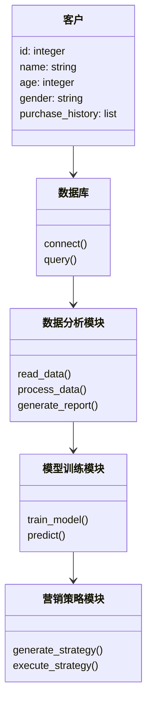
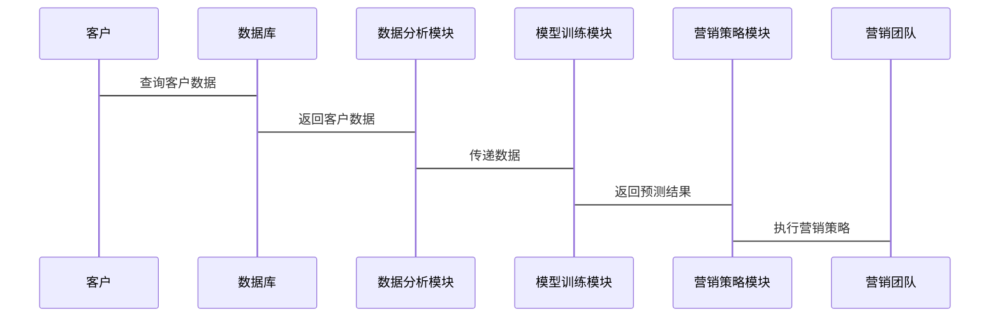

                 


# 彼得林奇如何分析公司的客户获取策略

> 关键词：彼得林奇，客户获取策略，数据分析，投资分析，市场定位

> 摘要：本文详细分析了彼得林奇如何通过客户获取策略的分析来优化公司的投资决策。结合数据分析、市场定位、客户细分等技术手段，探讨了彼得林奇的客户分析方法及其在投资中的应用。

---

# 第一部分: 客户获取策略的背景与重要性

## 第1章: 客户获取策略的定义与背景

### 1.1 客户获取策略的定义

客户获取策略是指公司通过各种手段吸引新客户并将其转化为忠实客户的计划和方法。它涵盖了从市场调研、目标客户选择到具体营销活动执行的全过程。

#### 1.1.1 什么是客户获取策略
客户获取策略是公司为了实现销售目标，通过吸引新客户、扩大市场份额而制定的一系列行动计划。它包括市场定位、产品推广、客户吸引等环节。

#### 1.1.2 客户获取策略的重要性
客户获取策略是公司业务增长的核心驱动力。通过有效的客户获取策略，公司可以提高市场占有率、增加销售额并增强品牌影响力。

#### 1.1.3 客户获取策略的核心要素
- **目标客户**：明确的目标客户群体是客户获取策略的基础。
- **市场定位**：公司在市场中的位置直接影响客户的获取。
- **产品定位**：产品在客户心中的位置决定了客户的需求和购买行为。
- **竞争优势**：公司相对于竞争对手的优势是客户获取的关键因素。
- **客户获取渠道**：通过哪些渠道吸引客户，决定了策略的执行效果。

### 1.2 彼得林奇的客户分析方法

#### 1.2.1 彼得林奇的投资理念
彼得林奇是美国著名投资经理人，以其在富达投资管理公司的长期优异表现而闻名。他强调基本面分析，注重研究公司的财务状况、市场地位和管理团队。

#### 1.2.2 彼得林奇的客户分析框架
彼得林奇通过分析公司的客户获取策略，评估公司的市场竞争力和未来发展潜力。他关注客户的增长速度、客户忠诚度以及客户获取的成本效益。

#### 1.2.3 客户获取策略在投资中的应用
在投资决策中，彼得林奇通过分析客户的增长情况，判断公司的市场地位和盈利能力。他特别关注客户获取的可持续性和成本效益。

### 1.3 客户获取策略的类型

#### 1.3.1 品牌营销策略
通过品牌推广和市场宣传吸引客户。这种策略注重品牌形象的塑造和市场影响力的扩大。

#### 1.3.2 渠道拓展策略
通过拓展销售渠道，如线上电商平台、线下零售店等，扩大客户接触面。

#### 1.3.3 产品驱动策略
通过不断创新和优化产品，提高产品的市场竞争力，从而吸引更多的客户。

---

## 第2章: 客户细分与目标市场选择

### 2.1 客户细分的定义与方法

#### 2.1.1 客户细分的定义
客户细分是指将客户按照某些共同特征分成不同的群体，以便更精准地制定营销策略。

#### 2.1.2 常见的客户细分方法
- **地理细分**：根据客户的地理位置进行划分。
- **人口统计细分**：根据客户的年龄、性别、收入等 demographic特征进行划分。
- **心理细分**：根据客户的消费习惯、价值观等心理特征进行划分。
- **行为细分**：根据客户的购买行为、消费频率等进行划分。

#### 2.1.3 数据驱动的客户细分
利用数据分析技术，通过对客户数据的挖掘和分析，识别出具有相似特征的客户群体。

### 2.2 目标市场的选择

#### 2.2.1 目标市场的定义
目标市场是指公司决定集中资源进行市场推广和客户获取的特定客户群体。

#### 2.2.2 目标市场选择的步骤
1. **市场调研**：了解目标市场的规模、竞争状况和客户特征。
2. **客户细分**：将市场划分为不同的客户群体。
3. **评估各细分市场的潜力**：分析各细分市场的市场规模、增长潜力和竞争状况。
4. **选择目标市场**：根据公司资源和战略目标，选择最适合的细分市场。

#### 2.2.3 彼得林奇视角下的目标市场分析
彼得林奇认为，选择目标市场是公司成功的关键。他建议投资者关注公司目标市场的增长潜力和竞争优势。

### 2.3 客户画像的构建

#### 2.3.1 客户画像的定义
客户画像是基于客户数据构建的虚拟客户形象，用于描述目标客户的特征和行为。

#### 2.3.2 客户画像的构建步骤
1. **收集客户数据**：包括客户的基本信息、消费记录、行为数据等。
2. **分析数据**：通过数据分析技术，识别出具有代表性的客户特征。
3. **构建画像**：将分析结果可视化，形成客户画像。

#### 2.3.3 数据可视化在客户画像中的应用
通过数据可视化工具，将客户画像以图表形式展示，帮助公司更直观地理解目标客户。

---

## 第3章: 市场定位与产品定位

### 3.1 市场定位的定义与策略

#### 3.1.1 市场定位的定义
市场定位是指公司在目标市场中确定自己的位置，并通过产品和服务满足客户需求。

#### 3.1.2 市场定位的步骤
1. **了解目标市场**：分析目标市场的特征和竞争状况。
2. **确定核心竞争力**：找出公司在市场中的独特优势。
3. **制定定位策略**：明确公司的市场定位，并制定相应的营销策略。

#### 3.1.3 彼得林奇视角下的市场定位分析
彼得林奇认为，市场定位是公司成功的关键因素之一。他通过分析公司的市场定位，评估公司的竞争优势和市场前景。

### 3.2 产品定位的定义与方法

#### 3.2.1 产品定位的定义
产品定位是指公司在目标市场中确定产品的市场地位，并通过产品设计和服务满足客户需求。

#### 3.2.2 产品定位的关键因素
- **目标客户**：产品的目标客户群体。
- **产品特点**：产品的核心功能和独特卖点。
- **竞争对手**：竞争对手的产品特点和市场定位。

#### 3.2.3 数据驱动的产品定位方法
通过数据分析，了解目标客户的特征和需求，进而优化产品设计和服务。

### 3.3 市场定位与产品定位的协同

#### 3.3.1 市场定位与产品定位的关系
市场定位是公司整体的市场策略，而产品定位是市场定位的具体实施。

#### 3.3.2 协同定位的策略
1. **一致定位**：市场定位和产品定位相互一致，共同满足客户需求。
2. **差异化定位**：通过市场定位和产品定位的差异，突出公司的竞争优势。

#### 3.3.3 彼得林奇视角下的协同定位分析
彼得林奇认为，市场定位和产品定位的协同是公司成功的关键。他通过分析公司的市场定位和产品定位，评估公司的竞争优势和市场前景。

---

## 第4章: 客户获取策略的算法与系统分析

### 4.1 客户获取预测模型的构建

#### 4.1.1 客户获取预测模型的定义
客户获取预测模型是指通过数据分析和机器学习算法，预测客户获取的可能性和数量。

#### 4.1.2 客户获取预测模型的类型
- **逻辑回归模型**：用于预测客户是否可能被获取。
- **决策树模型**：用于分类客户群体。
- **随机森林模型**：用于分类和回归分析。

#### 4.1.3 客户获取预测模型的应用场景
- **市场预测**：预测未来客户的数量和特征。
- **营销策略优化**：优化营销活动，提高客户获取效率。

### 4.2 客户获取预测模型的算法选择

#### 4.2.1 常见的客户获取预测算法
- **逻辑回归**：适用于二分类问题，如客户是否会购买产品。
- **决策树**：适用于分类问题，如客户群体的细分。
- **随机森林**：适用于分类和回归问题，具有高准确性和鲁棒性。

#### 4.2.2 算法选择
选择合适的算法需要考虑数据的特征、样本量和目标变量的类型。逻辑回归适用于二分类问题，决策树适用于分类问题，随机森林适用于复杂的分类和回归问题。

---

## 第5章: 系统分析与架构设计方案

### 5.1 问题场景介绍
假设我们是一家互联网公司，希望通过客户获取策略优化销售额和市场份额。我们需要通过数据分析和系统设计，构建一个客户获取预测模型，并制定相应的营销策略。

### 5.2 系统功能设计

#### 5.2.1 领域模型（Mermaid 类图）


### 5.3 系统架构设计

#### 5.3.1 系统架构图（Mermaid 架构图）
```mermaid
docker
    service 数据库 {
        image: mysql:latest
        ports: "3306"
    }
    service 数据分析模块 {
        image: python:3.9-slim
        ports: "5000"
        depends_on: 数据库
    }
    service 模型训练模块 {
        image: python:3.9-slim
        ports: "5001"
        depends_on: 数据分析模块
    }
    service 营销策略模块 {
        image: python:3.9-slim
        ports: "5002"
        depends_on: 模型训练模块
    }
```

### 5.4 系统接口设计

#### 5.4.1 接口描述
- 数据库接口：提供数据查询和插入功能。
- 数据分析模块接口：提供数据处理和报告生成功能。
- 模型训练模块接口：提供模型训练和预测功能。
- 营销策略模块接口：提供策略生成和执行功能。

### 5.5 系统交互设计

#### 5.5.1 系统交互流程（Mermaid 序列图）


---

## 第6章: 项目实战

### 6.1 环境安装

#### 6.1.1 安装Python
```bash
python --version
pip install --upgrade pip
```

#### 6.1.2 安装依赖库
```bash
pip install numpy pandas scikit-learn matplotlib
```

### 6.2 系统核心实现源代码

#### 6.2.1 数据分析模块
```python
import pandas as pd
import numpy as np

# 加载数据
data = pd.read_csv('customer_data.csv')

# 数据清洗
data.dropna(inplace=True)
data['age'] = data['age'].astype(int)

# 数据可视化
import matplotlib.pyplot as plt

data['age'].hist(bins=10)
plt.show()
```

#### 6.2.2 模型训练模块
```python
from sklearn.model_selection import train_test_split
from sklearn.linear_model import LogisticRegression

# 数据分割
X = data[['age', 'gender']]
y = data['purchase']

X_train, X_test, y_train, y_test = train_test_split(X, y, test_size=0.2)

# 模型训练
model = LogisticRegression()
model.fit(X_train, y_train)

# 模型预测
y_pred = model.predict(X_test)
print('预测准确率:', model.score(X_test, y_test))
```

### 6.3 代码应用解读与分析
通过上述代码，我们可以实现客户数据的分析和预测。数据清洗和可视化帮助我们了解客户的基本特征，模型训练和预测帮助我们评估客户获取的可能性。

### 6.4 实际案例分析和详细讲解剖析
以一家互联网公司为例，通过数据分析和模型预测，我们识别出目标客户的特征，并制定相应的营销策略。通过实际案例分析，我们可以验证客户获取策略的有效性，并不断优化策略。

### 6.5 项目小结
通过项目实战，我们掌握了客户获取策略的分析方法和系统设计的实现步骤。这为我们今后在实际工作中应用这些方法提供了宝贵的经验。

---

## 第7章: 最佳实践 tips、小结、注意事项、拓展阅读

### 7.1 最佳实践 tips
- **数据的重要性**：数据是客户获取策略分析的基础，确保数据的准确性和完整性。
- **模型的选择**：根据实际需求选择合适的算法，避免过度复杂化。
- **持续优化**：定期评估客户获取策略的效果，并根据市场变化进行调整。

### 7.2 小结
通过本文的分析，我们了解了彼得林奇如何通过客户获取策略的分析来优化公司的投资决策。结合数据分析和系统设计，我们掌握了客户细分、市场定位和产品定位的方法，以及客户获取预测模型的构建和应用。

### 7.3 注意事项
- **数据隐私**：在数据分析过程中，注意保护客户隐私和数据安全。
- **模型解释性**：确保模型的解释性，以便更好地理解和优化策略。
- **持续学习**：市场环境不断变化，需持续学习和更新分析方法。

### 7.4 拓展阅读
- **《彼得林奇的投资哲学》**：深入理解彼得林奇的投资理念和分析方法。
- **《数据分析实战》**：学习更多数据分析技术和工具，提升分析能力。
- **《机器学习实战》**：掌握更多机器学习算法和应用场景。

---

作者：AI天才研究院/AI Genius Institute & 禅与计算机程序设计艺术 /Zen And The Art of Computer Programming

