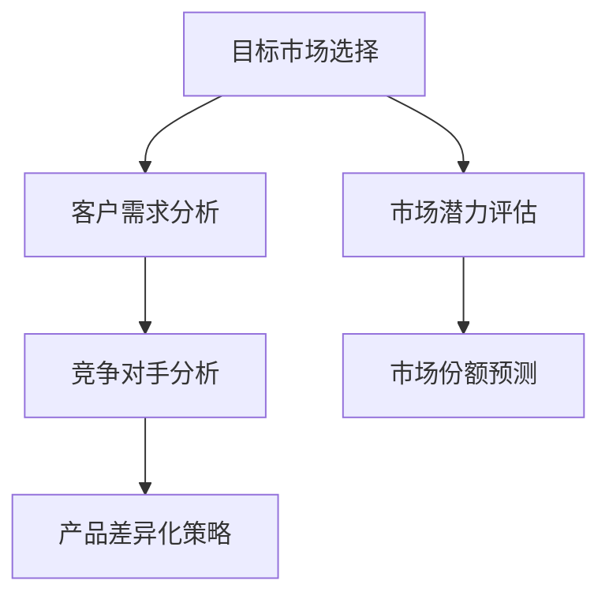
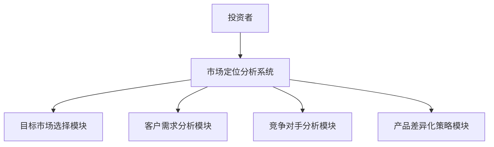

                 


# 彼得·林奇如何分析公司的市场定位策略

> 关键词：彼得·林奇，市场定位，投资策略，竞争分析，企业战略

> 摘要：本文深入探讨了彼得·林奇如何分析公司的市场定位策略。通过分析市场定位的核心要素、影响因素以及具体的分析方法，本文揭示了林奇如何通过市场定位策略来评估企业的竞争优势和投资价值。文章结合实际案例，详细解读了林奇的分析框架，并提供了具体的数学模型和系统设计，帮助读者更好地理解和应用这些策略。

---

## 第一部分: 市场定位策略的背景与核心概念

### 第1章: 市场定位策略的定义与重要性

#### 1.1 市场定位的定义
市场定位是指企业通过其产品或服务在目标市场中所占据的位置，旨在满足特定客户群体的需求，并与竞争对手区分开来。市场定位的核心在于明确企业的独特价值主张（Unique Value Proposition, UVP）。

#### 1.2 市场定位的重要性
- 帮助企业在激烈的市场竞争中找到差异化优势。
- 为投资者提供评估企业投资价值的重要依据。
- 通过明确的目标市场定位，企业可以更有效地配置资源，提高市场竞争力。

#### 1.3 彼得·林奇对市场定位的重视
彼得·林奇在投资生涯中非常重视企业的市场定位。他认为，一个清晰的市场定位不仅能够帮助企业吸引目标客户，还能够为企业创造持续的竞争优势。林奇的市场定位分析方法主要基于以下几个方面：

1. **目标市场选择**：明确企业的目标客户群体，包括他们的需求、偏好和行为特征。
2. **竞争对手分析**：研究竞争对手的市场定位，找出企业的差异化竞争优势。
3. **客户需求分析**：深入了解目标客户的需求，确保企业的产品或服务能够满足这些需求。
4. **产品差异化策略**：通过产品或服务的差异化，提升企业在市场中的独特地位。

---

### 第2章: 彼得·林奇分析市场定位的核心要素

#### 2.1 目标市场选择
目标市场选择是市场定位的第一步。彼得·林奇认为，企业需要根据自身的资源和能力，选择一个适合自己的目标市场。目标市场的选择需要考虑以下几个因素：

1. **市场规模**：目标市场的容量是否足够大，能够支持企业的增长。
2. **市场增长潜力**：目标市场的增长率是否能够为企业带来持续的收益。
3. **竞争强度**：目标市场的竞争情况，包括主要竞争对手的数量和实力。

#### 2.2 客户需求分析
客户需求是市场定位的核心。彼得·林奇强调，企业必须深入了解目标客户的需求，包括显性需求和隐性需求。以下是林奇常用的需求分析方法：

1. **客户调研**：通过问卷调查、访谈等方式，收集客户对产品或服务的需求反馈。
2. **竞争对手分析**：通过分析竞争对手的产品和服务，找出客户未被满足的需求。
3. **市场趋势分析**：研究行业趋势，预测未来客户的需求变化。

#### 2.3 竞争对手分析
竞争对手分析是市场定位的重要组成部分。彼得·林奇认为，企业需要通过分析竞争对手的市场定位，找到自身的差异化竞争优势。以下是林奇常用的竞争对手分析方法：

1. **市场份额分析**：通过分析竞争对手的市场份额，评估其市场影响力。
2. **产品差异化分析**：比较竞争对手的产品或服务，找出自身的差异化优势。
3. **品牌影响力分析**：评估竞争对手的品牌影响力，制定相应的品牌策略。

#### 2.4 产品差异化策略
产品差异化是市场定位的关键。彼得·林奇认为，企业需要通过产品或服务的差异化，提升自身的市场竞争力。以下是林奇常用的产品差异化策略：

1. **功能创新**：通过技术创新，提升产品的功能和性能。
2. **品牌形象塑造**：通过品牌营销，提升品牌知名度和美誉度。
3. **服务创新**：通过优化客户服务，提升客户的满意度和忠诚度。

---

### 第3章: 彼得·林奇市场定位分析的数学模型与方法

#### 3.1 市场定位的核心数学模型

##### 3.1.1 市场份额计算公式
市场份额是衡量企业市场定位成功与否的重要指标。彼得·林奇常用以下公式计算市场份额：

$$ \text{市场份额} = \frac{\text{企业销售额}}{\text{市场总销售额}} $$

通过计算市场份额，企业可以评估自身的市场地位，并与竞争对手进行比较。

##### 3.1.2 市场定位指数模型
市场定位指数是衡量企业市场定位优劣的综合指标。林奇常用以下公式计算市场定位指数：

$$ \text{市场定位指数} = \frac{\text{企业市场份额}}{\text{企业市场潜力}} $$

其中，市场潜力可以通过市场规模和市场增长率来评估。

##### 3.1.3 竞争对手市场份额预测
彼得·林奇认为，预测竞争对手的市场份额变化可以帮助企业制定更有效的市场定位策略。以下是竞争对手市场份额预测的公式：

$$ \text{预测市场份额} = \text{当前市场份额} \times (1 + \text{增长率}) $$

通过预测竞争对手的市场份额变化，企业可以更好地调整自身的市场定位策略。

---

### 第4章: 系统分析与架构设计方案

#### 4.1 问题场景介绍
在实际投资分析中，彼得·林奇通常会面对复杂的市场环境和多变的竞争格局。为了更好地分析企业的市场定位，林奇会构建一个系统的分析框架，包括以下几个部分：

1. **目标市场选择**：明确企业的目标客户群体。
2. **客户需求分析**：深入了解目标客户的需求。
3. **竞争对手分析**：分析竞争对手的市场定位和竞争优势。
4. **产品差异化策略**：制定企业的差异化竞争策略。

#### 4.2 系统功能设计
以下是市场定位分析系统的功能设计图：



通过上述功能设计，系统可以帮助投资者全面分析企业的市场定位，并制定相应的投资策略。

#### 4.3 系统架构设计
以下是市场定位分析系统的架构设计图：



通过上述架构设计，投资者可以通过系统快速了解企业的市场定位，并制定相应的投资策略。

---

### 第5章: 项目实战——彼得·林奇市场定位分析方法的应用

#### 5.1 案例分析：苹果公司的市场定位
以苹果公司为例，分析其市场定位策略。

1. **目标市场选择**：苹果的目标市场主要是高端消费者和科技爱好者。
2. **客户需求分析**：苹果通过创新的产品设计和卓越的用户体验，满足了消费者对高质量、高性价比产品的需求。
3. **竞争对手分析**：苹果的主要竞争对手包括三星和谷歌等科技公司。通过对比分析，苹果在品牌影响力和产品创新方面具有显著优势。
4. **产品差异化策略**：苹果通过不断推出创新产品（如iPhone、iPad、Mac等）和生态系统整合，进一步巩固了其市场领先地位。

#### 5.2 数据分析与代码实现
以下是苹果公司市场定位分析的代码实现：

```python
import pandas as pd
import numpy as np

# 数据导入
data = pd.read_csv('apple_market.csv')

# 市场份额计算
market_share = data['apple_sales'] / data['total_market_sales']
print('苹果的市场份额:', market_share.mean())

# 市场定位指数计算
market_potential = data['market_size'] * data['growth_rate']
market定位指数 = data['apple_market_share'] / market_potential
print('苹果的市场定位指数:', 市场定位指数.mean())

# 竞争对手市场份额预测
competitor_share = data['competitor_sales'] / data['total_market_sales']
predicted_share = competitor_share * (1 + data['competitor_growth_rate'])
print('预测竞争对手的市场份额:', predicted_share.mean())
```

通过上述代码，我们可以计算苹果的市场份额、市场定位指数以及竞争对手的市场份额变化，从而更好地评估苹果的市场定位策略。

---

## 第六部分: 总结与展望

### 第6章: 总结

彼得·林奇的市场定位分析方法为投资者提供了一个系统化的分析框架，帮助他们更好地评估企业的市场定位和投资价值。通过本文的分析，我们可以得出以下结论：

1. 市场定位是企业竞争的核心，直接影响企业的市场份额和投资价值。
2. 彼得·林奇通过目标市场选择、客户需求分析、竞争对手分析和产品差异化策略，构建了一个完整的市场定位分析框架。
3. 通过数学模型和系统设计，投资者可以更高效地分析企业的市场定位，并制定相应的投资策略。

### 第7章: 展望

未来，随着市场竞争的加剧和技术的进步，市场定位分析将变得更加复杂和多样化。彼得·林奇的市场定位分析方法为投资者提供了一个重要的参考，但随着市场的变化，投资者需要不断优化和创新市场定位分析的方法。

---

## 结语

彼得·林奇的市场定位分析方法不仅帮助投资者评估企业的市场定位，还为企业的战略制定提供了重要的指导。通过本文的分析，我们可以更好地理解市场定位的核心要素和影响因素，并能够实际应用这些方法来评估企业的市场定位和投资价值。希望本文能够为投资者和企业提供有价值的参考和启发。

---

**作者：AI天才研究院/AI Genius Institute & 禅与计算机程序设计艺术 /Zen And The Art of Computer Programming**

