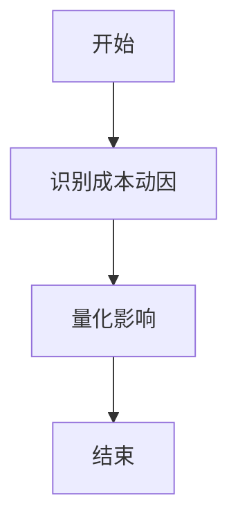
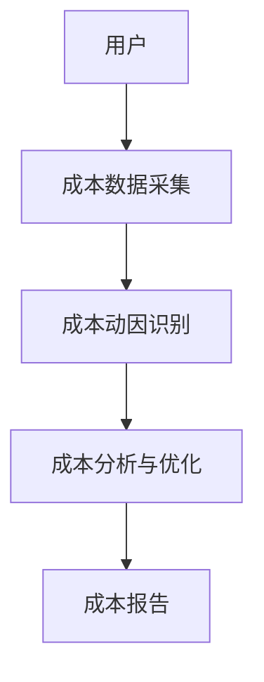

                 


# 彼得林奇如何分析公司的成本结构

## 关键词
- 成本结构分析
- 彼得·林奇
- 投资分析
- 成本动因
- 数学模型

## 摘要
彼得·林奇以其独特的投资策略和对成本结构的深入分析闻名。本文将详细介绍如何运用他的方法来分析公司的成本结构，涵盖核心概念、算法原理、系统架构及实际案例，帮助读者掌握成本结构分析的关键要素和应用方法。

## 第1章: 成本结构分析的背景与重要性

### 1.1 成本结构的基本概念
#### 1.1.1 什么是成本结构
成本结构是公司运营中各项成本的构成方式，包括固定成本和变动成本。固定成本如租金、工资，变动成本如原材料采购。理解成本结构有助于优化资源配置，降低成本。

#### 1.1.2 成本结构的构成要素
- 固定成本：不受产量影响的成本。
- 变动成本：随产量变化的成本。
- 混合成本：部分固定、部分变动的成本。

#### 1.1.3 成本结构分析的意义
成本结构分析帮助企业识别成本驱动因素，优化成本管理，提高利润率。

### 1.2 彼得·林奇的分析方法
#### 1.2.1 彼得·林奇的分析框架
- 确定成本动因：识别影响成本的关键因素。
- 趋势分析：观察成本变化趋势。
- 竞争力评估：比较公司成本与行业基准。

#### 1.2.2 成本结构分析的核心目标
识别成本驱动因素，评估成本效率，优化成本结构。

## 第2章: 成本结构的核心概念与联系

### 2.1 成本结构的核心要素
#### 2.1.1 固定成本与变动成本
- 固定成本：如租金、 salaries。
- 变动成本：如原材料、运输费。

#### 2.1.2 直接成本与间接成本
- 直接成本：可直接追溯到产品或服务。
- 间接成本：无法直接追溯，如行政费用。

#### 2.1.3 可变成本与不可变成本
- 可变成本：随产量变化。
- 不可变成本：固定不变，如设备折旧。

### 2.2 成本结构的属性特征对比
#### 2.2.1 成本类型对比表格
| 成本类型 | 特性 | 示例 |
|----------|------|------|
| 固定成本 | 不变 | 租金 |
| 变动成本 | 变化 | 原材料 |

#### 2.2.2 成本动因与成本对象的ER实体关系图
```mermaid
entity 成本动因
entity 成本对象
cost因果关系 成本动因 --> 成本对象
```

## 第3章: 成本结构分析的算法原理

### 3.1 成本结构分析的算法流程
#### 3.1.1 成本动因识别算法
- 确定成本动因：识别影响成本的关键因素。
- 量化影响：计算各动因对成本的影响程度。



#### 3.1.2 成本分摊算法
- 按照一定比例将间接成本分摊到直接成本。

#### 3.1.3 成本优化算法
- 确定优化目标：如最小化总成本。
- 制定优化策略：如降低材料浪费。

### 3.2 成本结构分析的数学模型
#### 3.2.1 成本函数模型
$$C(x) = a + bx$$

#### 3.2.2 边际成本计算公式
$$MC = \frac{dC}{dx}$$

#### 3.2.3 成本竞争力评估模型
$$CE = \frac{C}{Q}$$

## 第4章: 成本结构分析的系统架构设计

### 4.1 系统功能设计
#### 4.1.1 成本数据采集模块
- 采集公司各项成本数据。

#### 4.1.2 成本动因识别模块
- 识别影响成本的关键因素。

#### 4.1.3 成本分析与优化模块
- 分析成本结构，提出优化建议。

### 4.2 系统架构图


## 第5章: 项目实战——XYZ公司的成本分析

### 5.1 环境安装与数据准备
- 安装Python和相关库。
- 准备XYZ公司的成本数据。

### 5.2 系统实现
#### 5.2.1 成本动因识别
```python
import pandas as pd

data = pd.read_csv('cost_data.csv')
correlations = data.corr()
print(correlations)
```

#### 5.2.2 成本优化
```python
import numpy as np

x = np.array([i for i in range(100)])
y = 2*x + 50
plt.plot(x, y)
plt.show()
```

### 5.3 案例分析与优化建议
- 分析XYZ公司的成本结构，识别关键动因。
- 提出优化策略，如减少材料浪费，降低运输成本。

## 第6章: 最佳实践与总结

### 6.1 关键点总结
- 识别关键成本动因。
- 构建数学模型评估成本竞争力。
- 持续监控成本变化趋势。

### 6.2 小结
彼得·林奇的方法提供了有效的工具，帮助企业优化成本结构，提升竞争力。

### 6.3 注意事项
- 确保数据准确性和完整性。
- 定期更新分析模型。

### 6.4 拓展阅读
建议进一步阅读相关书籍，深入学习成本结构分析的方法。

## 作者
作者：AI天才研究院 & 禅与计算机程序设计艺术

---

通过以上章节的详细分析，读者可以系统地掌握彼得·林奇的成本结构分析方法，并将其应用于实际投资分析中，提升分析的深度和准确性。

