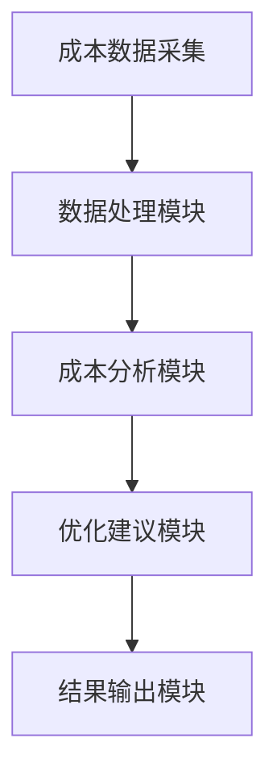

                 


# 彼得林奇如何分析公司的成本结构优化对长期竞争力的影响

## 关键词：彼得林奇、成本结构优化、长期竞争力、投资策略、企业利润

## 摘要：  
彼得林奇作为世界著名的价值投资者，其投资策略的核心之一是分析公司的成本结构优化对长期竞争力的影响。本文从成本结构的定义、分类及其对企业的核心影响入手，结合实际案例，详细阐述了如何通过优化成本结构来提升企业的长期竞争力。通过分析成本结构的优化策略和数学模型，本文为读者提供了全面的理解和实践指导。

---

# 第1章: 背景介绍：彼得林奇与成本结构优化

## 1.1 彼得林奇的生平与投资理念  
### 1.1.1 彼得林奇的生平简介  
- 彼得·林奇是美国著名的职业基金经理人，曾管理富达麦哲伦基金，创造了卓越的投资业绩。  
- 他强调“价值投资”，注重分析企业的基本面，尤其是企业的成本结构和盈利模式。  

### 1.1.2 彼得林奇的成本结构优化理念  
- 成本结构优化是企业实现长期竞争力的关键因素。  
- 通过降低不必要的开支、提高资源利用效率，企业可以在竞争中占据优势。  

## 1.2 成本结构的定义与分类  
### 1.2.1 成本结构的定义  
- 成本结构是指企业在生产和运营过程中所涉及的各种成本的构成比例和相互关系。  
- 成本结构优化是指通过调整和重新分配成本，以达到最小化总成本或最大化成本效益的过程。  

### 1.2.2 成本结构的分类  
- **固定成本**：如租金、工资等，不受产量影响。  
- **变动成本**：如原材料、销售佣金等，随产量变化。  
- **混合成本**：部分固定、部分变动的成本。  

### 1.2.3 成本结构与企业竞争力的关系  
- 成本结构优化直接影响企业的盈利能力、市场定价能力和抗风险能力。  

## 1.3 成本结构优化的背景与意义  
### 1.3.1 当前商业环境的变化  
- 全球化竞争加剧，企业需要通过成本优化提升竞争力。  
- 数字化转型对企业成本结构提出了新的要求。  

### 1.3.2 成本结构优化对企业竞争力的影响  
- 优化成本结构可以降低企业运营成本，提高利润率。  
- 通过成本优化，企业可以更好地应对市场波动和经济周期变化。  

### 1.3.3 优化成本结构的挑战与机遇  
- 挑战：传统成本结构可能与现代商业模式冲突，优化需要时间和资源投入。  
- 机遇：技术创新和管理方法的进步为企业提供了新的成本优化路径。  

## 1.4 本章小结  
本章通过介绍彼得林奇的成本结构优化理念，分析了成本结构的定义、分类及其对企业竞争力的影响，为后续的详细分析奠定了基础。

---

# 第2章: 成本结构优化的核心概念与工具

## 2.1 成本结构分析的核心概念  
### 2.1.1 成本动因分析  
- 成本动因是指导致成本发生的根本原因。  
- 通过分析成本动因，可以找到成本控制的关键点。  

### 2.1.2 成本效益分析  
- 成本效益分析是评估成本结构优化方案的重要工具。  
- 通过比较不同方案的成本与收益，选择最优解。  

### 2.1.3 成本分摊与资源分配  
- 成本分摊是指将总成本合理分配到各个部门或产品。  
- 资源分配的优化可以提高成本利用效率。  

## 2.2 成本结构优化的工具与方法  
### 2.2.1 SWOT分析法  
- **SWOT分析法**用于评估企业内部优势和劣势，以及外部机会和威胁。  
- 通过SWOT分析，可以识别成本结构中的潜在优化点。  

### 2.2.2 价值链分析  
- 价值链分析是一种战略工具，用于识别企业内部价值创造过程中的成本和效率问题。  
- 通过优化价值链中的关键环节，可以实现成本结构的优化。  

### 2.2.3 数理模型的应用  
- 使用数学模型，如线性规划，优化成本结构。  
- 通过建立数学模型，可以量化不同成本结构优化方案的效果。  

## 2.3 本章小结  
本章介绍了成本结构优化的核心概念和常用工具，为后续的具体策略分析提供了理论支持。

---

# 第3章: 成本结构优化的策略与实施

## 3.1 成本结构优化的基本原则  
### 3.1.1 降低固定成本  
- 通过精简人员、优化办公空间等方式降低固定成本。  
- 固定成本的降低可以显著提升企业的利润率。  

### 3.1.2 提高边际成本效率  
- 通过技术创新和流程优化，降低单位产品的边际成本。  
- 边际成本的优化可以提升企业的市场竞争力。  

### 3.1.3 优化资源分配  
- 合理分配资源，避免资源浪费。  
- 资源优化分配可以提高企业的整体运营效率。  

## 3.2 成本结构优化的具体策略  
### 3.2.1 技术创新降低成本  
- 通过引入自动化技术、数字化工具等，降低企业的运营成本。  
- 技术创新是实现长期成本优化的重要手段。  

### 3.2.2 优化供应链管理  
- 通过优化供应商选择和供应链流程，降低采购成本。  
- 供应链优化可以提高企业的议价能力和成本控制能力。  

### 3.2.3 重新设计业务流程  
- 通过流程再造，简化不必要的环节，提高效率。  
- 业务流程的优化可以显著降低企业的运营成本。  

## 3.3 成本结构优化的实施步骤  
### 3.3.1 确定优化目标  
- 明确成本结构优化的具体目标，如降低总成本、提高利润率等。  

### 3.3.2 制定优化方案  
- 根据目标制定详细的优化方案，包括时间表、资源分配等。  

### 3.3.3 实施与监控  
- 逐步实施优化方案，定期监控效果，及时调整策略。  

## 3.4 本章小结  
本章详细阐述了成本结构优化的基本原则和具体策略，并给出了实施步骤，为企业的成本优化提供了实践指导。

---

# 第4章: 成本结构优化的数学模型与案例分析

## 4.1 数学模型的应用  
### 4.1.1 成本结构优化的线性规划模型  
- 通过线性规划模型，可以量化不同成本结构优化方案的效果。  
- 线性规划模型是优化成本结构的重要工具。  

### 4.1.2 成本竞争力指数公式  
$$ C = \frac{C_{total}}{Q} $$  
其中，$C$为单位成本，$C_{total}$为总成本，$Q$为产量。  
- 通过计算成本竞争力指数，可以评估不同成本结构的优劣。  

## 4.2 案例分析：彼得林奇的经典投资案例  
### 4.2.1 案例一：可口可乐的成本结构优化  
- 可口可乐通过优化供应链和生产流程，显著降低了成本。  
- 成本结构优化使得公司利润率显著提升。  

### 4.2.2 案例二：沃尔玛的成本管理策略  
- 沃尔玛通过规模化采购和优化库存管理，实现了成本结构的优化。  
- 成本优化使得沃尔玛在全球零售业中占据了领先地位。  

## 4.3 本章小结  
本章通过数学模型和实际案例，深入分析了成本结构优化的具体应用和效果，为读者提供了直观的参考。

---

# 第5章: 系统架构与项目实战

## 5.1 系统架构设计  
### 5.1.1 系统功能设计  
- 企业成本管理系统包括成本数据采集、分析、优化建议等功能。  

### 5.1.2 系统架构设计  


## 5.2 项目实战  
### 5.2.1 环境安装  
- 安装Python、Pandas、Matplotlib等工具。  

### 5.2.2 核心代码实现  
```python
import pandas as pd

# 数据导入
cost_data = pd.read_csv('cost.csv')

# 成本结构分析
total_cost = cost_data['total_cost'].sum()
variable_cost = cost_data['variable_cost'].sum()
fixed_cost = total_cost - variable_cost

# 成本竞争力指数计算
cost_competitiveness = variable_cost / total_cost
print(f"总成本：{total_cost}\n变动成本：{variable_cost}\n固定成本：{fixed_cost}\n成本竞争力指数：{cost_competitiveness}")
```

### 5.2.3 实际案例分析  
- 通过代码分析某企业的成本数据，提出优化建议。  

## 5.3 本章小结  
本章通过系统架构设计和项目实战，展示了如何将成本结构优化的理论应用于实际，帮助读者更好地理解和实践。

---

# 第6章: 总结与最佳实践

## 6.1 本章总结  
- 成本结构优化是企业提升长期竞争力的关键因素。  
- 通过技术创新、供应链优化和流程再造，可以实现成本结构的优化。  

## 6.2 最佳实践 tips  
1. 定期进行成本结构分析，及时发现问题。  
2. 引入技术工具和数学模型，提高优化效率。  
3. 优化成本结构需要长期坚持，逐步推进。  

## 6.3 未来展望  
- 随着技术的进步，成本结构优化将更加智能化和数据驱动。  
- 企业应积极探索新技术，实现成本结构的持续优化。  

## 6.4 本章小结  
本章总结了全文的核心内容，并提出了未来的优化方向和最佳实践建议。

---

# 作者：AI天才研究院/AI Genius Institute & 禅与计算机程序设计艺术 /Zen And The Art of Computer Programming

---

以上是完整的文章大纲，涵盖了从理论到实践的各个方面，结合了彼得林奇的成本结构优化理念和实际案例分析，同时融入了技术工具和数学模型，为读者提供了全面的指导。

