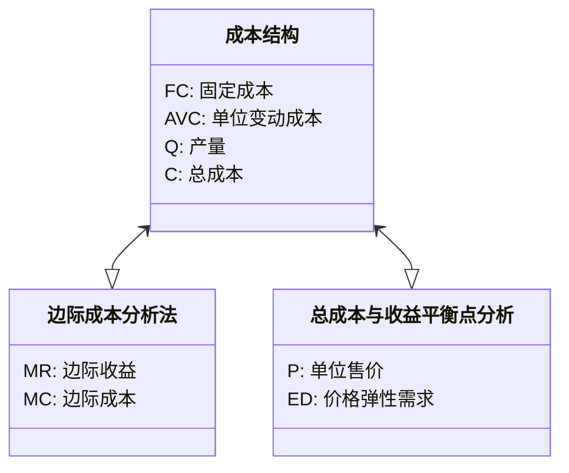
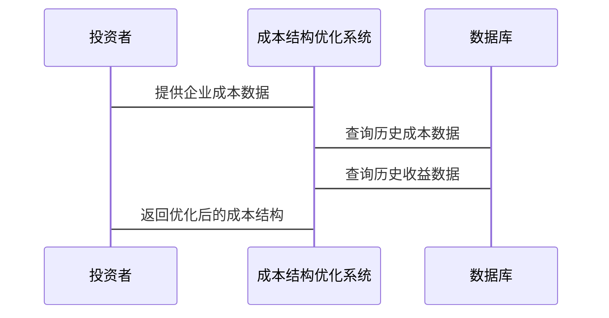

                 


# 彼得林奇如何分析公司的成本结构优化能力

> 关键词：成本结构优化，彼得·林奇，边际成本分析，企业成本管理，投资分析

> 摘要：本文从彼得·林奇的成本结构优化分析方法出发，详细阐述了成本结构优化的核心概念、数学模型、系统架构设计、项目实战及最佳实践。通过理论分析与实际案例相结合的方式，帮助读者深入理解彼得·林奇的成本结构优化策略，并掌握如何将其应用于实际投资分析中。

---

## 第一部分: 成本结构优化的背景与概念

### 第1章: 成本结构优化的定义与重要性

#### 1.1 成本结构优化的定义
- 1.1.1 成本结构的构成要素
  - 固定成本与变动成本的对比
  - 直接成本与间接成本的对比
  - 短期成本与长期成本的对比

- 1.1.2 成本结构优化的核心目标
  - 降低单位产品成本
  - 提高边际利润率
  - 优化资源分配

- 1.1.3 成本结构优化与企业竞争力的关系
  - 成本结构优化如何影响企业的市场竞争力
  - 成本结构优化如何影响企业的盈利能力

#### 1.2 彼得·林奇的分析方法
- 1.2.1 彼得·林奇的分析框架
  - 成本结构优化的核心思路
  - 边际成本分析法
  - 总成本与收益平衡点分析

- 1.2.2 彼得·林奇的成本结构优化策略
  - 优化固定成本与变动成本的比例
  - 降低单位产品的变动成本
  - 提高生产效率以摊薄固定成本

- 1.2.3 彼得·林奇分析方法的实际应用
  - 通过边际成本分析法优化企业成本结构
  - 通过总成本与收益平衡点分析确定最优产量

### 第2章: 成本结构优化的核心概念与联系

#### 2.1 成本结构的核心要素
- 2.1.1 固定成本与变动成本的对比
  - 固定成本的特性：不随产量变化而变化
  - 变动成本的特性：随产量变化而变化
  - 固定成本与变动成本对企业利润的影响

- 2.1.2 直接成本与间接成本的对比
  - 直接成本的特性：可以直接追溯到具体产品或服务
  - 间接成本的特性：无法直接追溯到具体产品或服务
  - 直接成本与间接成本对企业成本结构的影响

- 2.1.3 短期成本与长期成本的对比
  - 短期成本的特性：短期内无法调整的固定成本
  - 长期成本的特性：可以通过长期规划进行优化的固定成本
  - 短期成本与长期成本对企业成本管理的启示

#### 2.2 成本结构优化的ER实体关系图
```mermaid
er
  actor: 投资者
  class: 成本结构
  subclass: 固定成本
  subclass: 变动成本
  subclass: 直接成本
  subclass: 间接成本
  subclass: 短期成本
  subclass: 长期成本
  relation: 投资者 -> 成本结构: 分析
  relation: 成本结构 -> 固定成本: 包含
  relation: 成本结构 -> 变动成本: 包含
  relation: 成本结构 -> 直接成本: 包含
  relation: 成本结构 -> 间接成本: 包含
  relation: 成本结构 -> 短期成本: 包含
  relation: 成本结构 -> 长期成本: 包含
```

### 第3章: 成本结构优化的数学模型与公式

#### 3.1 边际成本分析法
- 3.1.1 边际成本公式
$$ C = FC + ( AVC \times Q) $$
其中，C为总成本，FC为固定成本，AVC为单位变动成本，Q为产量。

- 3.1.2 边际成本分析法的应用
  - 通过边际成本分析法确定最优产量
  - 通过边际成本分析法优化企业成本结构

#### 3.2 总成本与收益平衡点分析
- 3.2.1 收益与成本的平衡点公式
$$ Q = \frac{FC}{P - AVC} $$
其中，Q为平衡点产量，FC为固定成本，P为单位售价，AVC为单位变动成本。

- 3.2.2 总成本与收益平衡点分析的应用
  - 确定企业盈利与亏损的临界点
  - 优化企业的定价策略

#### 3.3 边际收益与边际成本的对比
- 3.3.1 边际收益公式
$$ MR = P \times (1 - \frac{1}{ED}) $$
其中，ED为价格弹性需求。

- 3.3.2 边际收益与边际成本的对比
  - 当边际收益大于边际成本时，企业应该增加产量
  - 当边际收益小于边际成本时，企业应该减少产量

### 第4章: 成本结构优化的系统分析与架构设计

#### 4.1 系统分析
- 4.1.1 成本结构优化的系统目标
  - 优化企业的成本结构
  - 提高企业的盈利能力
  - 提升企业的市场竞争力

- 4.1.2 成本结构优化的系统功能设计
  - 领域模型设计
  - 系统架构设计
  - 系统接口设计

#### 4.2 系统架构设计
- 4.2.1 领域模型设计


- 4.2.2 系统架构设计


#### 4.3 系统接口设计
- 4.3.1 系统接口设计
  - 边际成本分析法接口
  - 总成本与收益平衡点分析接口

- 4.3.2 系统交互设计


### 第5章: 成本结构优化的项目实战

#### 5.1 环境安装
- 5.1.1 安装Python
- 5.1.2 安装相关库（如numpy、pandas、matplotlib等）

#### 5.2 核心代码实现
- 5.2.1 边际成本分析法实现
```python
import numpy as np
import matplotlib.pyplot as plt

# 定义边际成本函数
def marginal_cost(FC, AVC, Q):
    return FC + AVC * Q

# 定义边际收益函数
def marginal_revenue(P, ED):
    return P * (1 - 1 / ED)

# 示例数据
FC = 100
AVC = 50
Q = 1000
P = 100
ED = 2

# 计算边际成本
MC = marginal_cost(FC, AVC, Q)

# 计算边际收益
MR = marginal_revenue(P, ED)

# 绘制边际成本和边际收益曲线
Q_values = np.arange(0, 1000, 10)
MC_values = marginal_cost(FC, AVC, Q_values)
MR_values = marginal_revenue(P, ED) * np.ones(len(Q_values))

plt.plot(Q_values, MC_values, label='Marginal Cost')
plt.plot(Q_values, MR_values, label='Marginal Revenue')
plt.xlabel('Quantity')
plt.ylabel('Cost/Revenue')
plt.legend()
plt.show()
```

- 5.2.2 总成本与收益平衡点分析实现
```python
import numpy as np
import matplotlib.pyplot as plt

# 定义总成本函数
def total_cost(FC, AVC, Q):
    return FC + AVC * Q

# 定义收益函数
def revenue(P, Q):
    return P * Q

# 示例数据
FC = 100
AVC = 50
P = 100
Q_break_even = FC / (P - AVC)

# 计算平衡点产量
Q_break_even = FC / (P - AVC)

# 绘制总成本和收益曲线
Q_values = np.arange(0, 1000, 10)
TC_values = total_cost(FC, AVC, Q_values)
R_values = revenue(P, Q_values)

plt.plot(Q_values, TC_values, label='Total Cost')
plt.plot(Q_values, R_values, label='Revenue')
plt.xlabel('Quantity')
plt.ylabel('Total Cost/Revenue')
plt.legend()
plt.show()
```

#### 5.3 案例分析与详细解读
- 5.3.1 案例分析
  - 通过边际成本分析法优化企业成本结构
  - 通过总成本与收益平衡点分析确定最优产量

- 5.3.2 实际案例分析
  - 某制造企业的成本结构优化案例
  - 某零售企业的成本结构优化案例

### 第6章: 成本结构优化的最佳实践

#### 6.1 彼得·林奇的优化策略总结
- 6.1.1 优化固定成本与变动成本的比例
- 6.1.2 降低单位产品的变动成本
- 6.1.3 提高生产效率以摊薄固定成本

#### 6.2 小结
- 成本结构优化的核心思路
- 边际成本分析法的应用
- 总成本与收益平衡点分析的应用

#### 6.3 注意事项
- 成本结构优化的局限性
- 成本结构优化的实施风险
- 成本结构优化的长期性

#### 6.4 拓展阅读
- 成本结构优化的其他方法
- 成本结构优化与企业战略的关系
- 成本结构优化的未来发展趋势

---

## 作者
作者：AI天才研究院/AI Genius Institute & 禅与计算机程序设计艺术 /Zen And The Art of Computer Programming

