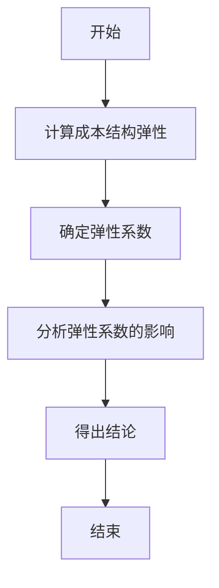
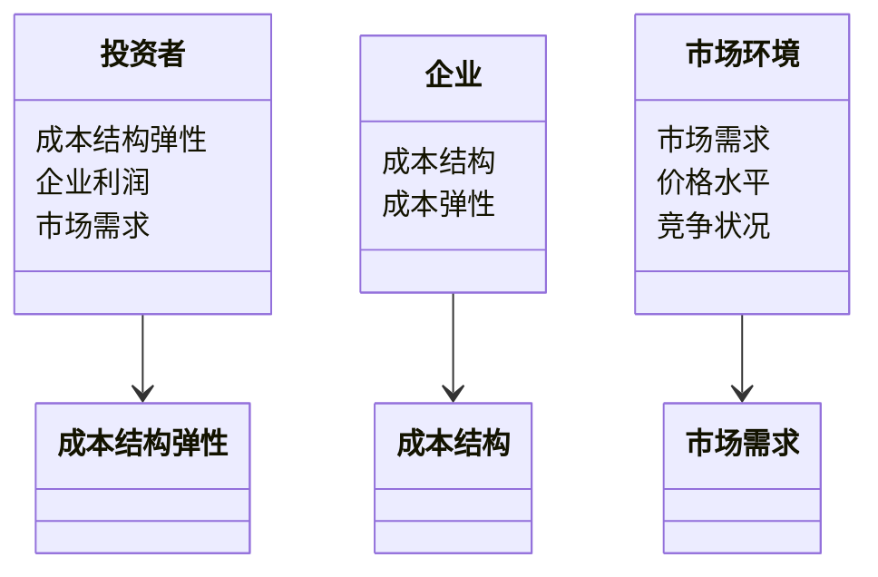

                 


# 彼得·林奇如何分析公司的成本结构弹性

## 关键词：成本结构弹性，彼得·林奇，投资分析，企业成本，弹性系数

## 摘要：本文深入探讨了彼得·林奇如何通过成本结构弹性分析来评估公司的成本管理能力及其对投资决策的影响。通过详细分析成本结构弹性的定义、计算方法、数学模型以及实际应用案例，本文揭示了这一分析方法在投资决策中的重要性，并提供了系统的分析框架和实际操作步骤。

---

## 第1章: 成本结构弹性的基本概念

### 1.1 成本结构弹性的定义与内涵

#### 1.1.1 成本结构弹性的定义
成本结构弹性是指公司在不同生产水平或市场条件下，成本随产量或需求变化的敏感程度。它是衡量企业成本管理灵活性和效率的重要指标。

#### 1.1.2 成本结构弹性的核心要素
- 成本类型：固定成本、可变成本和混合成本。
- 成本弹性系数：衡量成本随产量变化的比率。
- 成本结构弹性对利润的影响：弹性系数越高，成本变化对利润的影响越大。

#### 1.1.3 成本结构弹性与企业竞争力的关系
成本结构弹性高的公司能够更好地适应市场需求变化，优化成本结构，从而在竞争中占据优势。

### 1.2 彼得·林奇的成本结构弹性分析方法

#### 1.2.1 彼得·林奇的分析框架
- **成本结构弹性**：分析公司在不同产量或需求水平下的成本变化。
- **弹性系数计算**：通过弹性系数衡量成本变化的敏感性。
- **弹性系数与投资决策**：弹性系数低的公司成本结构更稳定，适合长期投资。

#### 1.2.2 成本结构弹性在投资决策中的作用
- **投资风险评估**：弹性系数高的公司成本变化大，投资风险较高。
- **成本控制能力评估**：弹性系数低的公司成本控制能力强，投资回报稳定。

#### 1.2.3 成本结构弹性分析的步骤与流程
1. 收集公司成本和收入数据。
2. 计算弹性系数：弹性系数 = (Δ成本 / Δ收入) * 100。
3. 分析弹性系数对利润的影响。
4. 得出投资决策建议。

## 第2章: 成本结构弹性的核心概念与联系

### 2.1 成本结构弹性的核心原理

#### 2.1.1 成本结构弹性的数学模型
$$ \text{弹性系数} = \left( \frac{\Delta \text{成本}}{\Delta \text{收入}} \right) \times 100 $$

#### 2.1.2 成本结构弹性与企业利润的关系
- 弹性系数高的公司利润波动大，弹性系数低的公司利润波动小。

#### 2.1.3 成本结构弹性与市场环境的互动
- 市场需求变化影响成本结构弹性。
- 竞争状况影响成本结构弹性。

### 2.2 成本结构弹性与其他相关概念的对比

#### 2.2.1 成本结构弹性与边际成本的关系
- 边际成本是单位产品增加的成本，而成本结构弹性是整体成本变化的敏感性。

#### 2.2.2 成本结构弹性与规模经济的对比
- 规模经济关注成本随产量增加的下降趋势，而成本结构弹性关注成本变化的敏感性。

#### 2.2.3 成本结构弹性与价格弹性的区别
- 价格弹性衡量需求对价格变化的反应，而成本结构弹性衡量成本对产量或需求变化的反应。

### 2.3 成本结构弹性分析的ER实体关系图

```mermaid
erDiagram
    actor 投资者 {
        <属性> 成本结构弹性
        <属性> 企业利润
        <属性> 市场需求
    }
    actor 企业 {
        <属性> 成本结构
        <属性> 成本弹性
        <属性> 生产能力
    }
    actor 市场环境 {
        <属性> 市场需求
        <属性> 价格水平
        <属性> 竞争状况
    }
    投资者 --> 成本结构弹性
    企业 --> 成本结构
    市场环境 --> 市场需求
```

## 第3章: 成本结构弹性分析的算法原理

### 3.1 成本结构弹性分析的数学模型



### 3.2 成本结构弹性分析的Python实现

```python
def calculate_cost_elasticity(revenue, cost):
    elasticity = (cost / revenue) * 100
    return elasticity

revenue = 1000000
cost = 800000
elasticity = calculate_cost_elasticity(revenue, cost)
print(f"成本结构弹性系数为: {elasticity}%")
```

### 3.3 成本结构弹性分析的数学公式

$$ \text{成本结构弹性} = \left( \frac{\text{成本}}{\text{收入}} \right) \times 100 $$

## 第4章: 成本结构弹性分析的系统架构设计

### 4.1 系统功能设计



## 第5章: 成本结构弹性分析的项目实战

### 5.1 项目背景与目标

#### 5.1.1 项目背景
分析一家制造企业的成本结构弹性，评估其成本管理能力。

#### 5.1.2 项目目标
计算成本结构弹性系数，评估投资风险。

### 5.2 项目环境与工具

#### 5.2.1 环境安装
- Python 3.8+
- Jupyter Notebook
- Mermaid工具

### 5.3 核心代码实现

```python
def calculate_cost_elasticity(revenue, cost):
    return (cost / revenue) * 100

revenue = 1000000
cost = 800000
elasticity = calculate_cost_elasticity(revenue, cost)
print(f"成本结构弹性系数为: {elasticity}%")
```

### 5.4 实际案例分析

#### 5.4.1 案例背景
某制造企业收入为100万元，成本为80万元。

#### 5.4.2 分析过程
1. 计算弹性系数：弹性系数 = (80 / 100) * 100 = 80%。
2. 评估投资风险：弹性系数为80%，属于中等偏高，投资风险较大。

## 第6章: 成本结构弹性分析的总结与展望

### 6.1 最佳实践 tips

- 选择弹性系数低的公司进行投资。
- 定期更新成本结构弹性分析，适应市场变化。

### 6.2 小结
本文详细介绍了彼得·林奇的成本结构弹性分析方法，包括定义、计算、数学模型和实际应用。

### 6.3 注意事项
- 数据准确性影响分析结果。
- 结合其他因素综合评估投资风险。

### 6.4 拓展阅读
- 彼得·林奇的投资策略。
- 成本结构弹性在其他领域的应用。

---

# 作者：AI天才研究院/AI Genius Institute & 禅与计算机程序设计艺术 /Zen And The Art of Computer Programming

