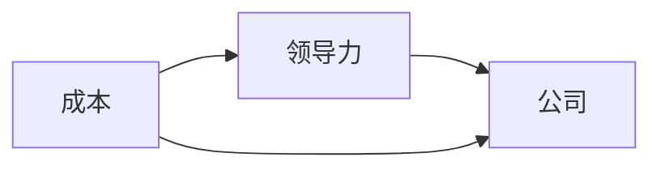
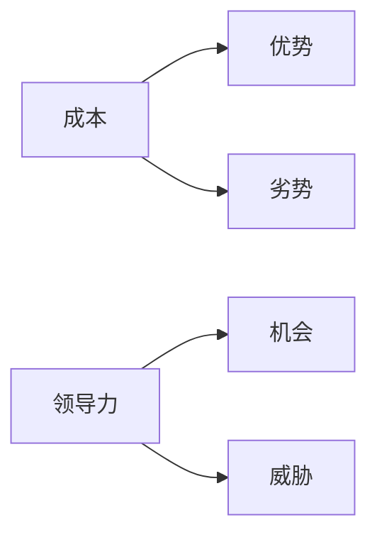
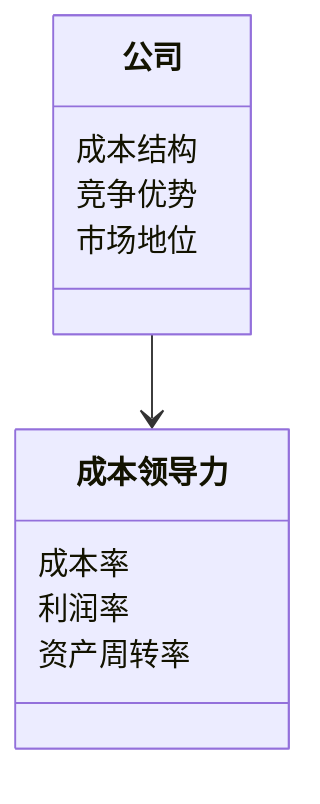

                 


# 彼得林奇如何分析公司的成本领导力

## 关键词：彼得林奇, 成本领导力, 投资分析, 竞争优势, 企业成本管理

## 摘要：  
本文详细介绍了彼得·林奇如何通过成本领导力来分析公司的竞争优势。通过分析公司的成本结构、市场地位和财务指标，彼得·林奇提出了独特的投资策略，帮助投资者识别具备成本领导力的公司。本文从核心概念、分析方法、系统架构到实战案例，全面解读彼得·林奇的成本领导力分析框架，帮助读者掌握这一投资分析方法。

---

## 第一部分: 成本领导力的核心概念与联系

### 第1章: 成本领导力的背景介绍

#### 1.1 彼得林奇与投资分析  
彼得·林奇是美国著名的投资专家，以其独特的投资策略闻名。他强调通过分析公司的成本结构和竞争优势来识别具备长期增长潜力的企业。  

- **彼得·林奇的生平简介**  
  彼得·林奇是富达投资的前主席，他以深入分析公司基本面和市场环境而著称。他的投资理念强调长期价值和竞争优势。  

- **彼得·林奇的投资理念**  
  彼得·林奇认为，具备成本领导力的企业能够在市场竞争中占据优势地位，并为股东创造长期价值。  

- **成本领导力的核心概念**  
  成本领导力是指企业在行业内以最低成本提供高质量产品或服务的能力，这种能力使得企业能够在价格竞争中占据优势。

#### 1.2 成本领导力的定义与背景  
成本领导力是企业在行业内以最低成本提供高质量产品或服务的能力。它不仅涉及生产成本，还包括研发、管理、营销等多方面的成本控制。  

- **成本领导力的背景与重要性**  
  在现代竞争激烈的市场环境中，成本控制是企业生存和发展的关键因素之一。具备成本领导力的企业能够以更低的价格提供更好的产品或服务，从而吸引更多的客户并扩大市场份额。  

- **成本领导力的边界与外延**  
  成本领导力的边界在于企业的成本结构和市场定位。外延则涉及企业的价值链管理、供应链优化和技术创新。

---

### 第2章: 成本领导力的核心概念与联系

#### 2.1 成本领导力的核心要素  
成本领导力的核心要素包括成本结构、竞争优势和市场地位。  

- **成本结构的分析**  
  成本结构是指企业各项成本的构成比例。分析成本结构可以帮助识别成本的主要来源和优化方向。  

- **竞争优势的来源**  
  成本领导力是竞争优势的重要来源之一。具备成本领导力的企业能够以更低的价格提供更高价值的产品或服务。  

- **市场地位的评估**  
  市场地位是成本领导力的外部表现。具备成本领导力的企业通常能够在市场中占据领先地位并获得更高的市场份额。

#### 2.2 成本领导力与财务指标的关系  
成本领导力与企业的财务指标密切相关，尤其是成本率和利润率。  

- **成本率的计算公式**  
  成本率 = (总成本 / 收入) × 100%  
  成本率低的企业通常具备更强的成本控制能力。  

- **利润率的分析**  
  利润率 = (净利润 / 收入) × 100%  
  利润率高且成本率低的企业通常具备较强的盈利能力。  

- **资产周转率的关联性**  
  资产周转率高表示企业能够高效利用资产创造收入，这与成本控制能力密切相关。

#### 2.3 成本领导力的ER实体关系图  
以下是一个简单的ER实体关系图，展示了成本领导力的核心要素：  


---

## 第二部分: 成本领导力的分析方法

### 第3章: 成本领导力的分析框架

#### 3.1 分析步骤与流程  
分析公司的成本领导力需要遵循以下步骤：  

- **确定公司的成本结构**  
  分析企业的各项成本，包括原材料、人工、制造费用等。  

- **评估成本控制能力**  
  通过比较行业平均成本率，评估企业的成本控制能力。  

- **分析市场竞争环境**  
  研究行业竞争格局，识别具备成本优势的企业。

#### 3.2 成本领导力的SWOT分析  
SWOT分析是一种常用的战略工具，可以帮助评估企业的优势、劣势、机会和威胁。  

- **优势（Strengths）**  
  成本率低，具备竞争优势。  

- **劣势（Weaknesses）**  
  成本率高，缺乏成本控制能力。  

- **机会（Opportunities）**  
  行业成本上升，具备成本领导力的企业能够获得更多利润。  

- **威胁（Threats）**  
  行业竞争加剧，成本控制能力不足的企业可能面临被淘汰的风险。  

以下是一个SWOT分析的示意图：  


---

## 第三部分: 成本领导力的系统分析与架构设计

### 第4章: 成本领导力的系统分析

#### 4.1 系统功能设计  
分析公司的成本领导力需要构建一个完整的系统架构，包括领域模型设计和系统架构设计。  

- **领域模型设计**  
  领域模型设计是系统分析的基础，需要明确企业的核心业务流程和关键数据。以下是一个领域模型设计的示意图：  


- **系统架构设计**  
  系统架构设计需要考虑数据流、功能模块和系统接口。以下是一个简单的系统架构设计示意图：  


---

## 第四部分: 成本领导力的项目实战

### 第5章: 成本领导力的项目实战

#### 5.1 环境安装  
为了进行成本领导力分析，需要安装以下环境：  

- Python编程环境  
- 数据分析工具（如Excel、Tableau）  
- 数据库管理系统（如MySQL、PostgreSQL）  

#### 5.2 核心代码实现  
以下是实现成本领导力分析的核心代码示例：  

```python
# 计算成本率
def calculate_cost_rate(revenue, cost):
    return (cost / revenue) * 100

# 计算利润率
def calculate_profit_margin(profit, revenue):
    return (profit / revenue) * 100

# 示例数据
revenue = 1000000
cost = 600000
profit = 200000

# 调用函数
cost_rate = calculate_cost_rate(revenue, cost)
profit_margin = calculate_profit_margin(profit, revenue)

print(f"成本率: {cost_rate}%")
print(f"利润率: {profit_margin}%")
```

#### 5.3 案例分析  
以下是一个实际案例的分析：  

假设我们分析一家制造企业的成本领导力，以下是分析过程：  

1. **确定成本结构**  
   该企业的成本主要包括原材料、人工和制造费用。  

2. **评估成本控制能力**  
   计算成本率为60%，低于行业平均成本率70%。  

3. **分析市场竞争环境**  
   该企业在行业内具有较高的市场地位，并且成本控制能力较强。  

---

## 第五部分: 总结与展望

### 第6章: 总结与展望  

#### 6.1 小结  
本文详细介绍了彼得·林奇如何分析公司的成本领导力，并从核心概念、分析方法、系统架构到实战案例进行了全面解读。通过本文的学习，读者可以掌握如何通过成本领导力分析来识别具备长期增长潜力的企业。  

#### 6.2 注意事项  
在实际分析中，需要注意以下几点：  

- 数据的准确性  
- 分析方法的适用性  
- 市场环境的变化  

#### 6.3 拓展阅读  
推荐以下书籍和资源：  

- 《彼得·林奇的成功投资法则》  
- 《成本管理：理论与实践》  

#### 6.4 参考文献  
1. 彼得·林奇. 《彼得·林奇的成功投资法则》  
2. 史蒂芬·柯维. 《高效能人士的七个习惯》  

---

## 作者：AI天才研究院/AI Genius Institute & 禅与计算机程序设计艺术 /Zen And The Art of Computer Programming

