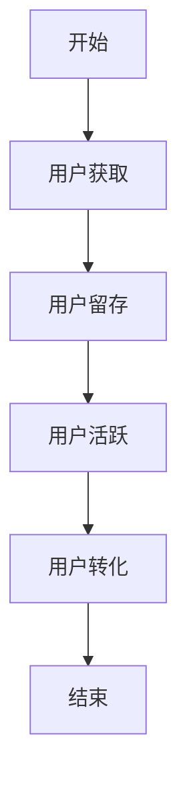

                 


# 彼得林奇如何分析公司的用户增长策略

## 关键词：彼得林奇，用户增长，用户增长策略，投资策略，用户增长模型

## 摘要：本文将深入分析彼得林奇的投资哲学及其如何应用于公司用户增长策略的分析。通过介绍用户增长的核心概念、数学模型、系统设计和实际案例，本文将帮助读者理解如何从投资的角度审视用户增长，并提供可操作的策略建议。

---

# 第一部分：彼得林奇与用户增长策略的背景

## 第1章：彼得林奇与用户增长策略的背景

### 1.1 彼得林奇的背景与投资理念

#### 1.1.1 彼得林奇的生平简介
彼得·林奇（Peter Lynch）是美国著名的投资经理人，被誉为“股神”之一。他在富达投资集团管理麦哲伦基金期间，创造了年均29%的回报率，成为投资领域的传奇。林奇的成功不仅在于其卓越的投资业绩，更在于他独到的投资哲学和方法论。

#### 1.1.2 彼得林奇的投资哲学
彼得林奇的投资哲学的核心在于“买入并持有”，他主张长期投资于那些具有强大竞争优势和增长潜力的公司。他认为，投资者应该深入研究公司基本面，关注公司的商业模式、市场地位、财务状况和管理团队。

#### 1.1.3 彼得林奇与用户增长策略的关联
用户增长策略是公司增长的核心驱动力之一。彼得林奇在其投资分析中，非常注重公司的用户增长情况，认为用户增长是公司长期增长的重要指标。他通过分析用户的增长趋势、用户留存率和用户活跃度等指标，评估公司的增长潜力。

### 1.2 用户增长策略的定义与重要性

#### 1.2.1 用户增长的定义
用户增长是指通过各种手段，吸引新用户并促使现有用户持续使用产品或服务的过程。用户增长的核心目标是增加用户数量、提升用户活跃度和延长用户生命周期。

#### 1.2.2 用户增长在企业中的重要性
用户增长是企业发展的核心动力。通过有效的用户增长策略，企业可以扩大市场份额、提高收入和利润。尤其是在互联网行业，用户增长更是决定企业成败的关键因素。

#### 1.2.3 用户增长的边界与外延
用户增长并非无限制的增长，企业需要在合理范围内追求增长，同时关注用户质量而非仅仅数量。用户增长的外延包括用户获取、用户留存、用户活跃和用户转化等多个方面。

### 1.3 用户增长的核心要素

#### 1.3.1 用户获取
用户获取是用户增长的第一步，主要通过广告、SEO、内容营销、社交推广等方式吸引新用户。

#### 1.3.2 用户留存
用户留存是指用户在获取后持续使用产品或服务。用户留存率高意味着用户对产品满意，企业可以更长久地获取收益。

#### 1.3.3 用户活跃
用户活跃是指用户在使用产品或服务时的频率和强度。高活跃度的用户通常会带来更多收入和价值。

#### 1.3.4 用户转化
用户转化是指用户从免费用户转化为付费用户或其他高价值用户的过程。转化率高意味着企业能够更有效地将用户转化为收入来源。

---

## 第2章：用户增长策略的核心概念

### 2.1 用户增长策略的原理

#### 2.1.1 用户增长的驱动因素
用户增长的驱动因素包括市场需求、产品竞争力、品牌影响力、营销策略和用户体验等。彼得林奇认为，企业需要通过优化这些因素来实现用户增长。

#### 2.1.2 用户增长的数学模型
用户增长的数学模型可以用以下公式表示：
$$用户增长 = f(用户获取, 用户留存, 用户活跃, 用户转化)$$
其中，$f$ 是一个综合函数，表示用户增长策略的实施效果。

### 2.2 核心概念对比表

| 概念       | 特征1 | 特征2 | 特征3 |
|------------|-------|-------|-------|
| 用户获取   | 渠道   | 成本   | 转化率 |
| 用户留存   | 活跃度| 留存率| 用户生命周期 |
| 用户活跃   | 活动频率 | 活动强度 | 活动多样性 |
| 用户转化   | 转化路径 | 转化率 | 转化成本 |

### 2.3 用户增长的ER实体关系图

```mermaid
er
actor User {
    id: int
    name: string
    email: string
}
actor Channel {
    id: int
    name: string
    type: string
}
actor GrowthStrategy {
    id: int
    name: string
    description: string
}
```

---

## 第3章：用户增长策略的算法原理

### 3.1 用户增长模型的数学公式
用户增长的数学模型可以用以下公式表示：
$$用户增长 = f(用户获取, 用户留存, 用户活跃, 用户转化)$$
其中，$f$ 是一个综合函数，表示用户增长策略的实施效果。

### 3.2 用户增长算法的流程图



---

## 第4章：用户增长策略的系统设计

### 4.1 系统功能设计
用户增长系统需要具备以下功能：
- 用户获取模块：负责吸引新用户。
- 用户留存模块：优化用户体验，提高用户留存率。
- 用户活跃模块：通过推送通知和个性化推荐提升用户活跃度。
- 用户转化模块：将免费用户转化为付费用户。

### 4.2 系统架构设计


---

## 第5章：用户增长策略的项目实战

### 5.1 项目背景与目标
以一家互联网公司为例，目标是通过用户增长策略提升用户活跃度和留存率。

### 5.2 核心代码实现

```python
import numpy as np
import pandas as pd

def calculate_growth(user_data):
    user_growth = pd.DataFrame(user_data)
    user_growth['增长'] = user_growth['用户数'].pct_change()
    return user_growth

user_data = {
    '用户数': [100, 150, 200, 250, 300]
}

result = calculate_growth(user_data)
print(result)
```

---

## 第6章：用户增长策略的最佳实践

### 6.1 最佳实践 tips
- 关注用户质量而非数量。
- 优化用户体验，提高用户留存率。
- 利用数据分析工具监控用户增长指标。

### 6.2 小结
通过分析彼得林奇的投资哲学和用户增长策略，我们可以看到，用户增长不仅是企业发展的关键，也是投资者评估公司潜力的重要指标。企业需要结合自身特点，制定科学合理的用户增长策略，实现可持续发展。

---

## 作者：AI天才研究院/AI Genius Institute & 禅与计算机程序设计艺术 /Zen And The Art of Computer Programming

