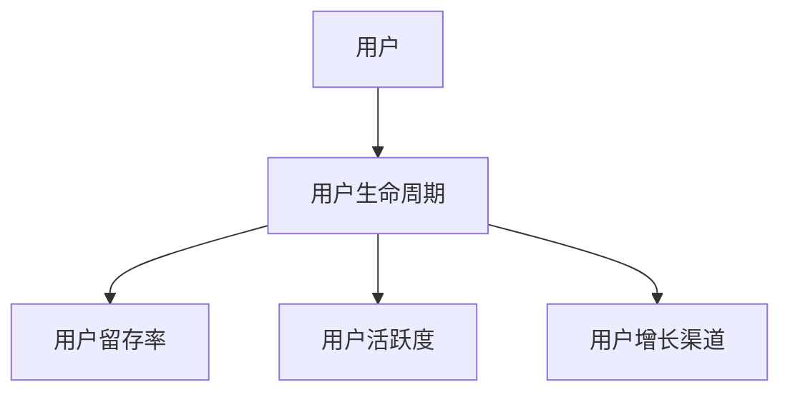

                 


# 彼得林奇如何分析公司的用户增长质量

> 关键词：彼得·林奇，用户增长，质量分析，用户留存率，增长渠道，用户生命周期，用户活跃度

> 摘要：彼得·林奇作为投资界的传奇人物，他的用户增长质量分析方法为企业提供了深刻的洞察。本文将详细探讨林奇的分析框架，包括用户生命周期、留存率、活跃度和增长渠道等核心概念，并通过实际案例和系统设计展示如何应用这些方法。通过数学模型、算法流程图和系统架构图，本文将帮助读者掌握用户增长质量分析的精髓，从而在实际项目中提升用户增长的质量和可持续性。

---

# 目录

## 第一部分: 用户增长质量分析的背景与重要性

### 第1章: 用户增长质量分析的背景与重要性

#### 1.1 用户增长质量分析的背景

- **1.1.1 用户增长的定义与内涵**
  - 用户增长是指通过各种渠道吸引新用户使用产品或服务的过程。
  - 用户增长质量关注用户增长的效果和可持续性，而不仅仅是数量。

- **1.1.2 用户增长质量的定义**
  - 用户增长质量是指新增用户中高价值、高留存、高活跃的比例。
  - 质量高的用户增长能够为公司带来长期的收益和竞争优势。

- **1.1.3 用户增长质量分析的重要性**
  - 通过分析用户增长质量，企业可以识别优质增长渠道，优化营销策略。
  - 高质量的增长能够降低用户获取成本，提高用户生命周期价值。

#### 1.2 彼得·林奇分析方法的核心理念

- **1.2.1 彼得·林奇的投资者背景**
  - 彼得·林奇是富达投资集团的传奇经理人，以其精准的公司分析和投资策略闻名。
  - 他注重从用户增长中发现公司的长期价值，而非短期增长。

- **1.2.2 用户增长质量分析的核心要素**
  - 用户生命周期：从获取到流失的全过程。
  - 用户留存率：用户在一定时间内持续使用产品的能力。
  - 用户活跃度：用户对产品或服务的使用频率。
  - 增长渠道：用户增长的主要来源。

- **1.2.3 林奇分析方法的独特性**
  - 强调长期价值，而非短期增长。
  - 通过用户行为数据和市场趋势分析，发现潜在投资机会。

#### 1.3 本章小结

---

## 第二部分: 用户增长质量分析的核心概念与联系

### 第2章: 用户增长质量分析的核心概念与联系

#### 2.1 用户增长质量分析的核心概念

- **2.1.1 用户生命周期模型**
  - 用户生命周期包括获取、激活、留存、流失四个阶段。
  - 每个阶段的行为数据可以帮助企业优化用户体验和增长策略。

- **2.1.2 用户留存率**
  - 用户留存率是衡量用户粘性的重要指标。
  - 高留存率意味着用户对产品或服务的高度满意和依赖。

- **2.1.3 用户活跃度**
  - 用户活跃度反映了用户对产品或服务的使用频率。
  - 高活跃度的用户通常是高质量的增长结果。

- **2.1.4 用户增长渠道**
  - 用户增长渠道包括自然增长、广告推广、口碑传播等。
  - 不同渠道的增长质量可以通过数据对比进行评估。

#### 2.2 核心概念的属性对比表

| 概念         | 属性             | 描述                                   |
|--------------|------------------|--------------------------------------|
| 用户生命周期 | 阶段、时间、行为  | 用户从获取到流失的全过程               |
| 用户留存率   | 计算方法、指标    | 用户在一定时间内持续使用产品的能力     |
| 用户活跃度   | 指标、行为频率    | 用户对产品或服务的使用频率             |
| 增长渠道     | 渠道类型、效果    | 用户增长的主要来源                   |

#### 2.3 实体关系图（ER图）



#### 2.4 本章小结

---

## 第三部分: 用户增长质量分析的算法原理

### 第3章: 用户增长质量分析的算法原理

#### 3.1 用户留存率分析算法

- **3.1.1 算法原理**

  用户留存率分析算法通过计算用户在一定时间内是否继续使用产品或服务，来评估用户增长的质量。

  $$ 留存率 = \frac{初始用户数}{留存用户数} $$

- **3.1.2 算法实现**

  ```python
  def calculate_retention_rate(initial_users, retained_users):
      return retained_users / initial_users
  ```

- **3.1.3 示例分析**

  假设某产品在某月获取了1000新用户，一个月后仍有800用户继续使用，那么留存率为80%。

  $$ 留存率 = \frac{1000}{800} = 0.8 \text{ 或 } 80\% $$

#### 3.2 增长渠道评估算法

- **3.2.1 算法原理**

  增长渠道评估算法通过分析不同渠道的用户获取成本、转化率和留存率，来判断哪个渠道的增长质量更高。

  $$ 渠道质量 = \frac{渠道用户留存率 \times 渠道用户活跃度}{渠道成本} $$

- **3.2.2 算法实现**

  ```python
  def calculate_channel_quality(retention_rate, engagement_rate, cost):
      return retention_rate * engagement_rate / cost
  ```

- **3.2.3 示例分析**

  假设渠道A的留存率为70%，活跃度为80%，成本为$1。渠道B的留存率为60%，活跃度为90%，成本为$0.8。那么：

  $$ 渠道A质量 = \frac{0.7 \times 0.8}{1} = 0.56 $$
  $$ 渠道B质量 = \frac{0.6 \times 0.9}{0.8} = 0.675 $$

  由此可见，渠道B的增长质量更高。

#### 3.3 本章小结

---

## 第四部分: 用户增长质量分析的系统设计

### 第4章: 用户增长质量分析的系统设计

#### 4.1 系统功能设计

- **4.1.1 领域模型**

  ```mermaid
  classDiagram
      class 用户 {
          用户ID
          用户生命周期阶段
          用户留存率
          用户活跃度
      }
      class 增长渠道 {
          渠道ID
          渠道类型
          渠道成本
          渠道转化率
      }
      用户 --> 用户生命周期阶段
      用户 --> 用户留存率
      用户 --> 用户活跃度
      增长渠道 --> 用户
  ```

- **4.1.2 系统架构**

  ```mermaid
  architecture
      frontend --> backend
      backend --> database
      frontend --> api
      backend --> analytics
  ```

- **4.1.3 系统接口设计**

  ```mermaid
  sequenceDiagram
      User sends request to API
      API --> Backend: Process request
      Backend --> Database: Query data
      Database --> Backend: Return data
      Backend --> User: Send response
  ```

#### 4.2 本章小结

---

## 第五部分: 用户增长质量分析的项目实战

### 第5章: 用户增长质量分析的项目实战

#### 5.1 项目环境安装

- **安装Python环境**
  - 使用Anaconda或PyCharm安装Python 3.8及以上版本。
- **安装依赖库**
  - 使用pip安装numpy、pandas、matplotlib、mermaid等库。

#### 5.2 核心代码实现

- **用户留存率分析代码**

  ```python
  import pandas as pd
  import matplotlib.pyplot as plt

  # 读取数据
  data = pd.read_csv('user_growth.csv')
  
  # 计算留存率
  initial_users = data[data['event_time'] == 0].shape[0]
  retained_users = data[data['event_time'] == 7].shape[0]
  retention_rate = retained_users / initial_users
  
  print(f"留存率为: {retention_rate:.2f}")
  ```

- **增长渠道评估代码**

  ```python
  def calculate_channel_quality(retention_rate, engagement_rate, cost):
      return retention_rate * engagement_rate / cost
  
  # 示例数据
  channels = [
      {'name': '渠道A', 'retention': 0.7, 'engagement': 0.8, 'cost': 1},
      {'name': '渠道B', 'retention': 0.6, 'engagement': 0.9, 'cost': 0.8}
  ]
  
  # 计算渠道质量
  for channel in channels:
      quality = calculate_channel_quality(channel['retention'], channel['engagement'], channel['cost'])
      print(f"{channel['name']}的质量为: {quality:.2f}")
  ```

#### 5.3 代码解读与分析

- **用户留存率分析**
  - 数据读取：使用pandas读取CSV文件中的用户行为数据。
  - 留存率计算：通过筛选特定事件时间点的用户数量，计算留存率。
  - 可视化：使用matplotlib绘制留存率趋势图。

- **增长渠道评估**
  - 定义渠道质量计算函数。
  - 示例数据输入：包括不同渠道的留存率、活跃度和成本。
  - 质量计算与输出：计算每个渠道的质量，并输出结果。

#### 5.4 实际案例分析

- **案例背景**
  - 某公司通过渠道A和渠道B获取新用户。
  - 渠道A的留存率为70%，活跃度为80%，成本为$1。
  - 渠道B的留存率为60%，活跃度为90%，成本为$0.8。
- **分析结果**
  - 渠道A的质量：$$ 0.7 \times 0.8 / 1 = 0.56 $$
  - 渠道B的质量：$$ 0.6 \times 0.9 / 0.8 = 0.675 $$
  - 结论：渠道B的增长质量更高，值得投入更多资源。

#### 5.5 本章小结

---

## 第六部分: 用户增长质量分析的最佳实践与注意事项

### 第6章: 用户增长质量分析的最佳实践

#### 6.1 小结

- 彼得·林奇的用户增长质量分析方法为企业提供了深刻的洞察。
- 关键在于通过数据驱动的方法，识别高质量的增长渠道，并优化用户生命周期。

#### 6.2 注意事项

- **数据准确性**：确保数据来源可靠，避免分析偏差。
- **长期视角**：关注用户生命周期价值，而非短期增长。
- **持续优化**：根据分析结果，不断调整增长策略。

#### 6.3 拓展阅读

- 《The Peter Lynch Method for Growth Analysis》
- 《Data-Driven Growth: Using Analytics to Optimize User Acquisition》

---

## 作者：AI天才研究院/AI Genius Institute & 禅与计算机程序设计艺术 /Zen And The Art of Computer Programming

---

# 结语

通过本文的详细分析，读者可以掌握彼得·林奇的用户增长质量分析方法，并将其应用于实际项目中。从核心概念到算法实现，再到系统设计和项目实战，本文为读者提供了全面的指导。希望本文能够帮助企业在用户增长的质量和可持续性方面取得更大的突破。

