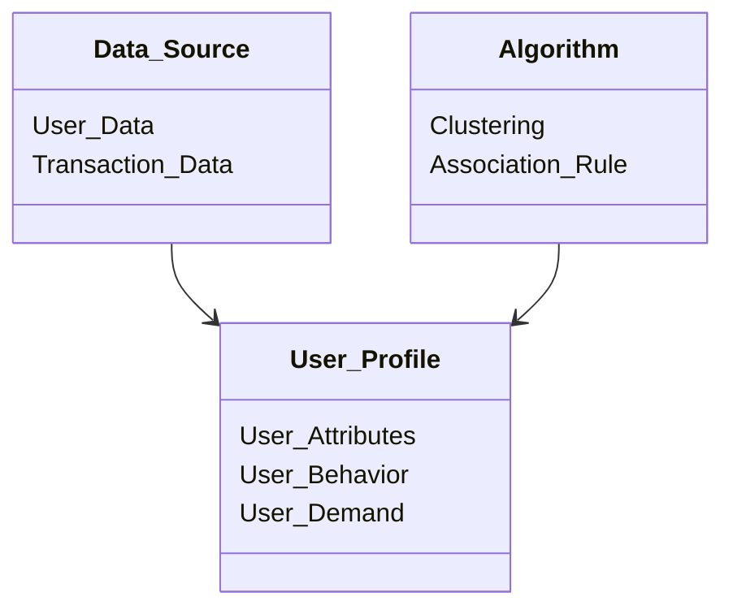
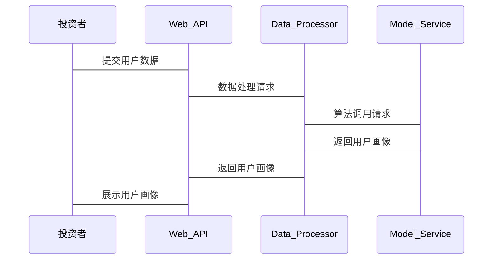

                 


# 彼得·林奇如何分析公司的用户画像演变

---

## 关键词：  
用户画像演变、彼得·林奇、投资分析、用户行为分析、数据驱动决策

---

## 摘要：  
本文将深入探讨彼得·林奇如何通过分析公司的用户画像演变来评估公司价值和投资决策。通过结合用户画像的核心概念、算法原理、系统架构设计以及实际案例，本文详细解析了用户画像在投资分析中的应用，帮助读者理解用户行为变化如何影响公司的长期发展和投资价值。

---

## 第一部分: 用户画像演变与投资分析背景

### 第1章: 用户画像演变的背景与重要性

#### 1.1 用户画像的基本概念

##### 1.1.1 用户画像的定义  
用户画像是基于用户数据构建的用户特征描述，通过整合用户的基本属性、行为特征、需求偏好和场景标签，形成一个全面的用户描述模型。

##### 1.1.2 用户画像的演变背景  
随着互联网和大数据技术的快速发展，用户行为变得越来越复杂和多样化。用户画像是分析用户行为和需求的重要工具，能够帮助企业更好地理解用户，优化产品和服务。

##### 1.1.3 用户画像在投资分析中的重要性  
用户画像是评估公司价值的重要维度。通过分析用户的特征和行为变化，投资者可以更好地理解公司的用户基础、市场定位和未来发展潜力。

#### 1.2 用户画像与公司价值的关系

##### 1.2.1 用户画像如何影响公司价值  
用户画像是公司用户群体的“画像”，能够反映公司的用户构成、用户活跃度和用户留存率等关键指标。这些指标直接关系到公司的收入、利润和增长潜力。

##### 1.2.2 用户画像演变的周期性分析  
用户画像是动态变化的，随着市场环境、产品迭代和用户需求的变化，用户画会发生演变。这种演变反映了公司与用户之间的互动关系，也是评估公司长期价值的重要依据。

##### 1.2.3 用户画像在投资决策中的应用  
彼得·林奇等投资者通过分析用户画像的演变，能够发现公司的市场定位、用户满意度和未来增长潜力。用户画像的演变趋势可以帮助投资者识别投资机会和风险。

#### 1.3 彼得·林奇的投资方法与用户画像

##### 1.3.1 彼得·林奇的投资理念  
彼得·林奇是一位价值投资者，注重分析公司的基本面和长期发展潜力。他认为，公司价值的核心在于其用户基础、产品竞争力和市场地位。

##### 1.3.2 用户画像在彼得·林奇分析方法中的作用  
用户画像是彼得·林奇分析公司基本面的重要工具。通过分析用户画像，他可以了解公司的用户构成、用户需求和市场定位，从而评估公司的长期发展潜力。

##### 1.3.3 用户画像演变对投资策略的影响  
用户画像的演变反映了公司的用户需求变化和市场定位调整。通过分析用户画像的演变趋势，彼得·林奇能够识别公司的创新能力和应对市场变化的能力。

#### 1.4 本章小结  
本章从用户画像的基本概念、演变背景和重要性入手，详细分析了用户画像在投资分析中的作用。通过彼得·林奇的投资方法，我们了解了用户画像在公司价值评估中的重要性。

---

## 第二部分: 用户画像的核心概念与联系

### 第2章: 用户画像的构成与分析方法

#### 2.1 用户画像的构成要素

##### 2.1.1 用户的基本属性  
用户的基本属性包括年龄、性别、地理位置、职业和教育背景等。这些属性能够帮助投资者了解用户的 demographic 特征，从而更好地分析用户的消费能力和需求。

##### 2.1.2 用户的行为特征  
用户的行为特征包括用户的活跃度、使用频率、购买行为和留存率等。这些指标能够反映用户的 engagement 水平，帮助投资者评估公司的用户粘性和市场潜力。

##### 2.1.3 用户的需求偏好  
用户的需求偏好包括用户的兴趣爱好、消费习惯和偏好等。这些信息能够帮助投资者了解用户的深层次需求，从而评估公司的产品竞争力和市场定位。

##### 2.1.4 用户的场景标签  
用户的场景标签包括用户的使用场景、时间分布和设备偏好等。这些标签能够帮助投资者更好地理解用户的使用习惯，从而评估公司的产品适应性和市场覆盖能力。

#### 2.2 用户画像的分析方法

##### 2.2.1 基于传统统计的用户画像构建  
传统的用户画像是通过统计分析方法构建的。这种方法基于简单的数据汇总和分类，适用于初步的用户分析。

##### 2.2.2 基于AI驱动的用户画像构建  
基于AI的用户画像是通过机器学习算法构建的。这种方法能够捕捉用户行为中的复杂模式和隐含关系，提供更精准的用户描述。

##### 2.2.3 用户画像的动态更新机制  
用户画像是动态变化的，需要定期更新以反映用户行为的变化。动态更新机制能够帮助投资者更好地捕捉用户的最新需求和市场趋势。

#### 2.3 用户画像的对比分析

##### 2.3.1 不同画像方法的优缺点对比  
| 方法          | 优点                          | 缺点                          |
|---------------|-------------------------------|-------------------------------|
| 传统统计       | 实现简单，易于理解            | 分析能力有限，难以捕捉复杂模式 |
| AI驱动         | 分析能力强，能够捕捉复杂模式    | 实现复杂，需要大量数据支持    |

##### 2.3.2 用户画像与传统画像的对比  
传统的用户画像主要基于简单的数据汇总，而基于AI的用户画像是通过机器学习算法构建的，能够捕捉更多的用户行为特征和需求偏好。

##### 2.3.3 用户画像的属性特征对比表格  
| 属性          | 传统画像                   | AI驱动画像                  |
|---------------|-----------------------------|-----------------------------|
| 数据来源      | 简单数据汇总                | 复杂数据挖掘和机器学习       |
| 分析深度      | 浅层分析                    | 深度分析                    |
| 精准度        | 较低                       | 较高                       |

#### 2.4 用户画像的ER实体关系图  
以下是用户画像的实体关系图：

```mermaid
er
actor: 投资者
actor --> User_Profile: 分析用户画像
User_Profile --> User_Attributes: 用户属性
User_Profile --> User_Behavior: 用户行为
User_Profile --> User_Demand: 用户需求
```

#### 2.5 本章小结  
本章详细分析了用户画像的构成要素和分析方法，对比了不同画像方法的优缺点，并通过实体关系图展示了用户画像的核心结构。

---

## 第三部分: 用户画像演变的算法原理

### 第3章: 用户画像构建的算法原理

#### 3.1 用户画像构建的算法概述

##### 3.1.1 聚类分析在用户画像中的应用  
聚类分析是一种常用的用户画像构建方法。通过聚类分析，可以将用户分为不同的群体，每个群体代表一类用户特征。

##### 3.1.2 关联规则挖掘在用户画像中的应用  
关联规则挖掘用于发现用户行为中的关联性，帮助投资者理解用户的消费习惯和需求偏好。

##### 3.1.3 用户画像的分类与回归分析  
分类和回归分析是常用的用户画像构建方法。这些方法可以帮助投资者预测用户的行为和需求，从而评估公司的市场潜力。

#### 3.2 聚类分析的详细讲解

##### 3.2.1 聚类分析的数学模型  
距离度量：  
$$d(x,y) = \sqrt{\sum_{i=1}^{n}(x_i - y_i)^2}$$  

##### 3.2.2 聚类算法实现步骤  
1. 数据预处理：标准化和去噪  
2. 确定聚类数：通过肘部法则或轮廓系数  
3. 选择聚类算法：如K-means  
4. 聚类结果分析：评估聚类效果  

##### 3.2.3 聚类分析的Python代码示例  
```python
from sklearn.cluster import KMeans
from sklearn.preprocessing import StandardScaler

# 数据预处理
data_scaled = StandardScaler().fit_transform(data)

# 聚类模型构建
kmeans = KMeans(n_clusters=3, random_state=42)
labels = kmeans.fit_predict(data_scaled)

# 可视化结果
import matplotlib.pyplot as plt
plt.scatter(data_scaled[:, 0], data_scaled[:, 1], c=labels)
plt.title('User Clustering')
plt.show()
```

#### 3.3 关联规则挖掘的详细讲解

##### 3.3.1 关联规则挖掘的数学模型  
关联规则挖掘的目标是发现用户行为中的频繁项集和关联规则。常见的算法包括Apriori和FP-Growth。

##### 3.3.2 关联规则挖掘的Python代码示例  
```python
from mlxtend.frequent_patterns import apriori

# 数据预处理
data_encoded = pd.get_dummies(data)

# 关联规则挖掘
frequent_itemsets = apriori(data_encoded, min_support=0.1, use_colnames=True)

print(frequent_itemsets)
```

#### 3.4 本章小结  
本章详细讲解了用户画像构建的算法原理，包括聚类分析和关联规则挖掘的方法和实现步骤，并通过Python代码示例帮助读者理解这些算法的应用。

---

## 第四部分: 用户画像演变的系统分析与架构设计

### 第4章: 用户画像演变的系统分析与架构设计

#### 4.1 问题场景介绍  
用户画像的演变需要一个动态更新的系统，能够实时捕捉用户行为变化，分析用户的最新需求和市场趋势。

#### 4.2 系统功能设计

##### 4.2.1 领域模型  
以下是用户画像系统的领域模型：



##### 4.2.2 系统架构设计  
以下是用户画像系统的架构设计：


#### 4.3 系统接口设计  
用户画像系统的接口设计包括数据输入接口、算法调用接口和结果展示接口。

#### 4.4 系统交互设计  



#### 4.5 本章小结  
本章通过系统分析和架构设计，展示了用户画像演变的实现过程，包括数据采集、特征提取、画像生成和动态更新。

---

## 第五部分: 用户画像演变的项目实战

### 第5章: 用户画像演变的项目实战

#### 5.1 项目介绍  
本项目旨在通过分析某互联网公司的用户画像演变，评估其市场定位和用户需求变化。

#### 5.2 项目环境安装

##### 5.2.1 Python环境安装  
```bash
pip install numpy pandas scikit-learn mlxtend
```

#### 5.3 系统核心实现源代码

##### 5.3.1 数据收集与预处理  
```python
import pandas as pd
import numpy as np

# 数据收集
data = pd.read_csv('user_data.csv')

# 数据预处理
data_processed = data.dropna()
```

##### 5.3.2 特征提取与模型训练  
```python
from sklearn.cluster import KMeans
from sklearn.preprocessing import StandardScaler

# 特征提取
features = data_processed[['age', 'gender', 'location', 'purchase_frequency']]

# 数据标准化
data_scaled = StandardScaler().fit_transform(features)

# 模型训练
kmeans = KMeans(n_clusters=3, random_state=42)
labels = kmeans.fit_predict(data_scaled)
```

##### 5.3.3 用户画像生成与展示  
```python
import matplotlib.pyplot as plt

# 可视化结果
plt.scatter(data_scaled[:, 0], data_scaled[:, 1], c=labels)
plt.title('User Clustering')
plt.show()
```

#### 5.4 项目小结  
本章通过实际案例展示了用户画像演变的实现过程，包括数据收集、预处理、特征提取和模型训练，并通过可视化工具展示了用户画像的结果。

---

## 第六部分: 用户画像演变的最佳实践

### 第6章: 用户画像演变的最佳实践

#### 6.1 核心要点总结

##### 6.1.1 数据质量的重要性  
数据质量直接影响用户画像的准确性。投资者需要确保数据的完整性和准确性。

##### 6.1.2 用户画像的动态更新  
用户画像是动态变化的，需要定期更新以反映用户行为的变化。

##### 6.1.3 跨團隊協作的重要性  
用户画像的构建需要数据科学家、产品经理和投资分析师的共同参与，实现跨团队协作。

#### 6.2 小结与注意事项

##### 6.2.1 小结  
用户画像是评估公司价值的重要工具。通过分析用户画像的演变，投资者可以更好地理解用户的 demand 和 market trends，从而做出更明智的投资决策。

##### 6.2.2 注意事项  
- 数据隐私和合规性  
- 模型的可解释性  
- 数据的实时性  

#### 6.3 拓展阅读  
推荐阅读《彼得·林奇的投资哲学》和《数据驱动的商业决策》。

---

## 作者：AI天才研究院/AI Genius Institute & 禅与计算机程序设计艺术 /Zen And The Art of Computer Programming

---

### 总结  
本文从用户画像的基本概念到算法原理，再到系统设计和实际案例，全面解析了用户画像演变在投资分析中的应用。通过彼得·林奇的投资方法，我们展示了如何通过用户画像的演变趋势来评估公司价值和投资潜力。希望本文能够为投资者提供新的视角和方法，帮助他们在复杂多变的市场环境中做出更明智的投资决策。

